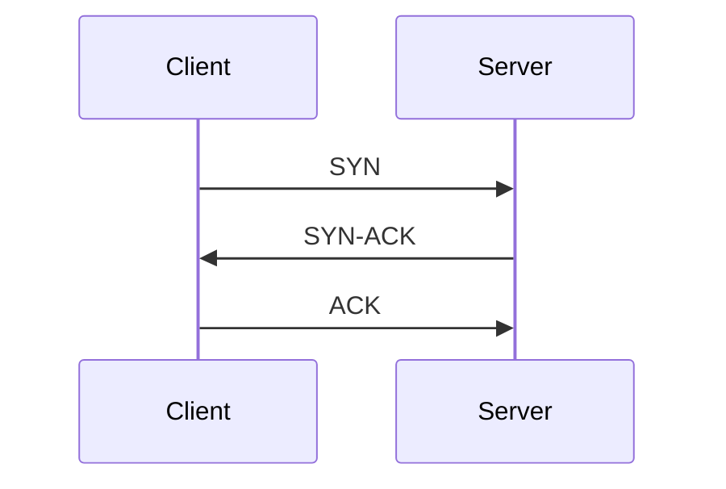
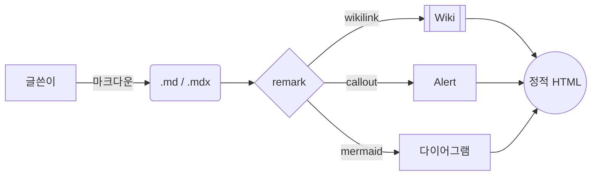

# Embed 컴포넌트 가이드

post/wiki/note 본문에 삽입 가능한 모든 임베드 컴포넌트.

## 임베드 종류 빠른 참조

| 컴포넌트 | 문법 | `.md` | `.mdx` | Lazy load |
|:---|:---|:---:|:---:|:---:|
| `<UrlPreview />` | JSX/Markdown | ✅ | ✅ | ❌ |
| `<CodeWithOutput />` | JSX | ❌ | ✅ | ❌ |
| ` ```mermaid ` | Markdown | ✅ | ✅ | ✅ |
| ` ```anim:id ` | Markdown | ✅ | ✅ | ✅ |
| `<YouTube />` | JSX | ❌ | ✅ | ✅ |
| `<Tweet />` | JSX | ❌ | ✅ | ✅ |
| `<Gist />` | JSX | ❌ | ✅ | ✅ |
| `<CodePen />` | JSX | ❌ | ✅ | ✅ |
| `<Figma />` | JSX | ❌ | ✅ | ❌ |
| `<Vimeo />` | JSX | ❌ | ✅ | ✅ |
| `<ChartJs />` | JSX | ❌ | ✅ | ❌ |

> **URL preview와 mermaid, animation, wikilink는 remark 플러그인이라서 `.md`에서도 사용 가능합니다.** 나머지 JSX 컴포넌트는 `.mdx`만 가능.

`<CodeWithOutput />`, `<ChartJs />` 는 `astro-auto-import` 로 모든 MDX에서 자동 import. 나머지 임베드 컴포넌트는 명시적 import 필요할 수 있음 (실제로는 `src/features/embed/ui/`에 있어서 글로벌 MDX 컨텍스트에서 사용 가능한지 확인 필요).

---

## 1. URL Preview Card

OG 메타데이터 자동 페칭. 페이지 미리보기 카드.

### 문법

```markdown
<UrlPreview url="https://example.com" />
<UrlPreview url="https://example.com" hideImage={true} />
```

### Props

| prop | 타입 | 기본 | 설명 |
|:---|:---|:---|:---|
| `url` | string | 필수 | 전체 URL |
| `hideImage` | boolean | `false` | OG 이미지 숨김 |

### 동작

1. 빌드 시 `src/data/url-previews.json`에서 메타데이터 로드
2. 없으면 `open-graph-scraper`로 페칭 (캐시 TTL: 성공 30일, 에러 6시간)
3. 카드 HTML 생성: 제목, 설명, 이미지, 파비콘, 사이트명

### 강제 갱신

```bash
bun run previews:refresh
```

### 예시

```markdown
<UrlPreview url="https://docs.astro.build" />
<UrlPreview url="https://redis.io/docs/" hideImage={true} />
```

---

## 2. Code + Output Panel

좌측에 코드, 우측에 실행 결과를 나란히 보여주는 컴포넌트.

### 기본 사용

```mdx
<CodeWithOutput
  language="bash"
  label="$ bash"
  code={`echo "hello"`}
  output={`hello`}
/>
```

### 모든 Props

```typescript
{
  // 기본 (단일 코드 + 출력)
  code: string,                          // 코드
  language: string,                      // 신택스 언어
  label?: string,                        // 코드 패널 라벨 (기본: language)
  output: string,                        // 출력
  outputLanguage?: string,               // 출력 신택스 (기본: 'text')
  outputLabel?: string,                  // 출력 라벨 (기본: '결과')
  title?: string,                        // 캡션 제목
  codeWidth?: number | string,           // 코드 패널 너비 % (기본 50)
  
  // 멀티 케이스 (여러 테스트 케이스)
  cases?: Array<{
    label?: string,
    input?: string,
    output: string,
    inputLanguage?: string,
    inputLabel?: string,
    outputLanguage?: string,
    outputLabel?: string,
  }>,
  
  // 멀티 언어 (같은 문제, 여러 언어)
  variants?: Array<{
    language: string,
    label?: string,
    code: string,
  }>,
}
```

### 패턴 A: 단일 코드 + 출력

```mdx
<CodeWithOutput
  language="python"
  label="python"
  outputLanguage="text"
  outputLabel=">>>"
  title="dataclass 한 입"
  code={`from dataclasses import dataclass

@dataclass
class Note:
    id: str
    body: str

n = Note(id="2026-05-23", body="hello")
print(n)`}
  output={`Note(id='2026-05-23', body='hello')`}
/>
```

### 패턴 B: 멀티 언어 탭 (variants)

```mdx
<CodeWithOutput
  outputLanguage="text"
  outputLabel="stdout"
  title="피보나치 첫 10개"
  variants={[
    {
      label: 'python',
      language: 'python',
      code: `def fib(n):
    a, b = 0, 1
    out = []
    for _ in range(n):
        out.append(a)
        a, b = b, a + b
    return out

print(fib(10))`,
    },
    {
      label: 'typescript',
      language: 'ts',
      code: `function fib(n: number): number[] {
  const out: number[] = [];
  let [a, b] = [0, 1];
  for (let i = 0; i < n; i++) {
    out.push(a);
    [a, b] = [b, a + b];
  }
  return out;
}

console.log(fib(10));`,
    },
  ]}
  output={`[0, 1, 1, 2, 3, 5, 8, 13, 21, 34]`}
/>
```

### 패턴 C: 너비 조절

```mdx
<CodeWithOutput
  language="bash"
  label="$ bash"
  codeWidth={30}                         // 좌측 30%, 우측 70% (출력 넓게)
  code={`tree -L 2`}
  output={`...`}
/>
```

사용자가 가운데 핸들 드래그로도 조정 가능. 100%가 되면 자동 상하 배치.

### 키보드 인터랙션

- 더블클릭 / Enter: 50% 리셋
- 화살표 키: 2%씩
- Shift+화살표: 10%씩
- End 키: 100% (상하 배치)

### 다양한 환경 지원

실제 실행하지 않고 글쓴이가 결과를 직접 적음. 그래서 사용 가능:
- 셸, REPL, DB CLI (redis-cli, psql, mysql)
- HTTP API (curl + JSON 응답)
- 컴파일 결과, 에러 메시지
- 어떤 환경의 입출력이든 가능

---

## 3. Mermaid 다이어그램

### 문법

````markdown

````

### 지원 다이어그램

- `flowchart` (LR, TD, BT, RL)
- `sequenceDiagram`
- `stateDiagram-v2`
- `erDiagram`
- `classDiagram`
- `gitGraph`
- `pie`
- `gantt`

### 동작

- CDN ESM lazy import (이 페이지에서만 ~수백KB 로드)
- 다크/라이트 모드 자동 재렌더링
- `<pre class="mermaid not-prose">` 로 변환

### 예시

````markdown



````

---

## 4. Animation

자체 SVG 애니메이션 엔진. 자세히는 [animations.md](animations.md).

### 본문 삽입 문법

````markdown
```anim:animation-id
{}
```
````

빈 `{}` 는 향후 override 용 (현재 사용 안 함).

### 예시

````markdown
```anim:redis-cache-hit
{}
```

```anim:tcp-handshake
{}
```
````

---

## 5. YouTube

### 문법

```mdx
<YouTube id="dQw4w9WgXcQ" />
<YouTube id="dQw4w9WgXcQ" start="1m30s" title="My Video" />
```

### Props

| prop | 타입 | 기본 | 설명 |
|:---|:---|:---|:---|
| `id` | string | 필수 | YouTube 비디오 ID |
| `title` | string | 'YouTube video' | iframe title |
| `start` | string \| number | - | 시작 시간 (초, "1m30s", "1:30") |
| `cookieless` | boolean | `true` | youtube-nocookie.com 사용 |

### 특징

- Cookieless 기본 (youtube-nocookie.com)
- 16:9 반응형
- 시작 시간 다양한 형식 지원

---

## 6. Tweet

### 문법

```mdx
<Tweet id="1234567890" user="twitter" />
<Tweet id="1234567890" align="left" theme="dark" />
```

### Props

| prop | 타입 | 기본 | 설명 |
|:---|:---|:---|:---|
| `id` | string | 필수 | 트윗 ID |
| `user` | string | 'twitter' | Twitter handle |
| `align` | 'left' \| 'center' | 'center' | 정렬 |
| `theme` | 'light' \| 'dark' \| 'auto' | 'auto' | 테마 |

### 특징

- Twitter widgets.js 동적 로드
- 다크 모드 자동 감지

---

## 7. GitHub Gist

### 문법

```mdx
<Gist id="abc123def456" user="username" />
<Gist id="abc123def456" user="username" file="script.js" />
```

### Props

| prop | 타입 | 설명 |
|:---|:---|:---|
| `id` | string | gist ID (필수) |
| `user` | string | GitHub username |
| `file` | string | 특정 파일만 표시 (선택) |

---

## 8. CodePen

### 문법

```mdx
<CodePen id="pen-id" user="username" />
<CodePen id="pen-id" user="username" tab="css" height={500} theme="dark" />
```

### Props

| prop | 타입 | 기본 | 설명 |
|:---|:---|:---|:---|
| `id` | string | 필수 | CodePen ID |
| `user` | string | 필수 | CodePen username |
| `title` | string | - | iframe title |
| `tab` | 'html' \| 'css' \| 'js' \| 'result' | 'result' | 기본 탭 |
| `height` | number | 360 | iframe height (px) |
| `theme` | 'dark' \| 'light' | - | 테마 |

---

## 9. Figma

### 문법

```mdx
<Figma fileUrl="https://www.figma.com/file/..." />
<Figma embedUrl="https://www.figma.com/embed?..." height={600} />
```

### Props

| prop | 타입 | 기본 | 설명 |
|:---|:---|:---|:---|
| `fileUrl` | string | - | Figma file URL |
| `embedUrl` | string | - | Figma embed URL |
| `title` | string | - | iframe title |
| `height` | number | 450 | iframe height (px) |

### 특징

- 두 가지 임베드 방식: file URL 또는 embed URL
- 둘 중 하나는 반드시 제공

---

## 10. Vimeo

### 문법

```mdx
<Vimeo id="123456789" />
<Vimeo id="123456789" title="My Video" />
```

### Props

| prop | 타입 | 기본 | 설명 |
|:---|:---|:---|:---|
| `id` | string | 필수 | Vimeo 비디오 ID |
| `title` | string | 'Vimeo video' | iframe title |

### 특징

- 16:9 반응형
- autoplay, fullscreen, picture-in-picture 지원

---

## 작성 시 주의사항

### 1. `client:visible` 적용 대상

`<ChartJs />` 같이 클라이언트 hydration 이 필요한 컴포넌트는 `client:visible` 등 directive 필수. URL preview, embed 컴포넌트는 빌드 시점에 처리되므로 directive 불필요.

### 2. MDX vs MD

기본적으로 JSX 컴포넌트는 `.mdx` 만 가능. 단, `<UrlPreview />` 는 remark 플러그인이 처리하므로 `.md` 에서도 동작.

### 3. URL preview 캐시

URL을 변경한 후 미리보기 갱신이 안 보이면 `bun run previews:refresh`.

### 4. Embed 컴포넌트 import 확인

`<YouTube />`, `<Tweet />` 등은 `src/features/embed/ui/` 에 있음. 만약 auto-import 미설정이면 명시적 import 필요할 수 있음. `astro.config.mjs` 의 `AutoImport` 설정 확인.

## 실제 예시 파일

- 마크다운 종합 (모든 임베드): [src/content/posts/markdown-kitchen-sink.mdx](file:///Users/koa/004-Projects/0001-Resume/100-github-io/src/content/posts/markdown-kitchen-sink.mdx)
- CodeWithOutput 데모: [src/content/posts/code-with-output-showcase.mdx](file:///Users/koa/004-Projects/0001-Resume/100-github-io/src/content/posts/code-with-output-showcase.mdx)

## 참고 파일

- URL Preview: [src/features/url-preview/ui/UrlPreview.astro](file:///Users/koa/004-Projects/0001-Resume/100-github-io/src/features/url-preview/ui/UrlPreview.astro)
- CodeWithOutput: [src/features/code-with-output/ui/CodeWithOutput.astro](file:///Users/koa/004-Projects/0001-Resume/100-github-io/src/features/code-with-output/ui/CodeWithOutput.astro)
- Mermaid: [src/features/mermaid/lib/mermaid-render.ts](file:///Users/koa/004-Projects/0001-Resume/100-github-io/src/features/mermaid/lib/mermaid-render.ts)
- Embed 컴포넌트: [src/features/embed/ui/](file:///Users/koa/004-Projects/0001-Resume/100-github-io/src/features/embed/ui/)
- Astro 설정: [astro.config.mjs](file:///Users/koa/004-Projects/0001-Resume/100-github-io/astro.config.mjs)
