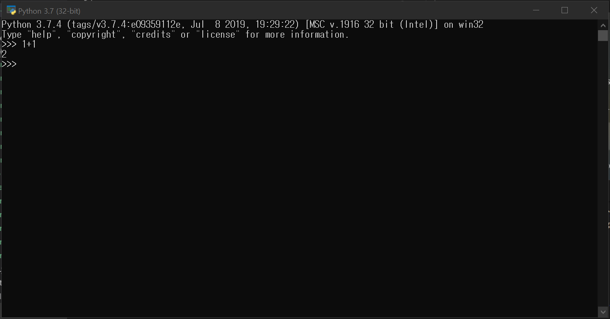

# 2019-08-22 Tutorial

## 프로그래밍

## 파이썬(Python)

위의 로고는 현재 여러 분야에 사용되는 프로그래밍 언어, 파이썬의 로고입니다.

파이썬은 1991년, 귀도 반 로썸(위의 인물 사진) 발표한 언어입니다.

### 파이썬을 사용하는 이유

단순함
> 문법이 단순합니다.

효율성
> 코드가 단순해 파이썬 코드를 작성하는 코드의 속도가 빨라 효율적입니다.

배우기 쉬움
> 프로그래밍을 처음 접하는 사람도 쉽게 배울 수 있는 언어입니다.

가독성
> 다른 언어와 비교할 때, 코드를 이해하는게 더 수월합니다.

확장성
> 여러 분야에 사용됩니다. 게임, 인공지능, 통계, 수학, 자연과학

### 파이썬 설치

<a href ="https://www.python.org/downloads/"> 파이썬 설치 링크</a>

설치순서는 다음과 같습니다.
1. 아래 체크박스 2개를 다 체크해주시고 Install Now를 눌러주시면됩니다.

2. 설치 진행하시면 됩니다.

### 아나콘다 설치
<a href = "https://www.anaconda.com/distribution/" >아나콘다 설치 링크 </a>
컴퓨터의 OS에 맞추어 설치해주시면 됩니다.

설치 순서는 다음과 같습니다.
1. Next

2. Agree

3. Just Me 선택

4. 기본으로 뜨는 경로로 해주시면 됩니다. Next

5. 아래의 체크박스만 체크하고 넘겨주세요.

6. 설치중 화면

7. 설치 완료

아래 사진과 같이 뜨면 설치된 것입니다.

### 간단한 python 실습

간단하게 python 실습을 해보겠습니다.
아래의 사진과 같이 있을떄, python 3.7을 실행시켜봅시다.

아래와 같이 한 검은 창이 뜹니다.
s

한번 1+1을 python으로 계산해봅시다.

답이 2라고 나옵니다.

이번엔 11111111111111111 x 1231231231261231321가 뭔지 계산해봅시다.

답이 13680347014013681207640974304307631라고 나옵니다.

이번엔 Hello World를 python으로 출력해봅시다.

다음 시간부터 python에 대해 더 자세히 다루어보겠습니다.