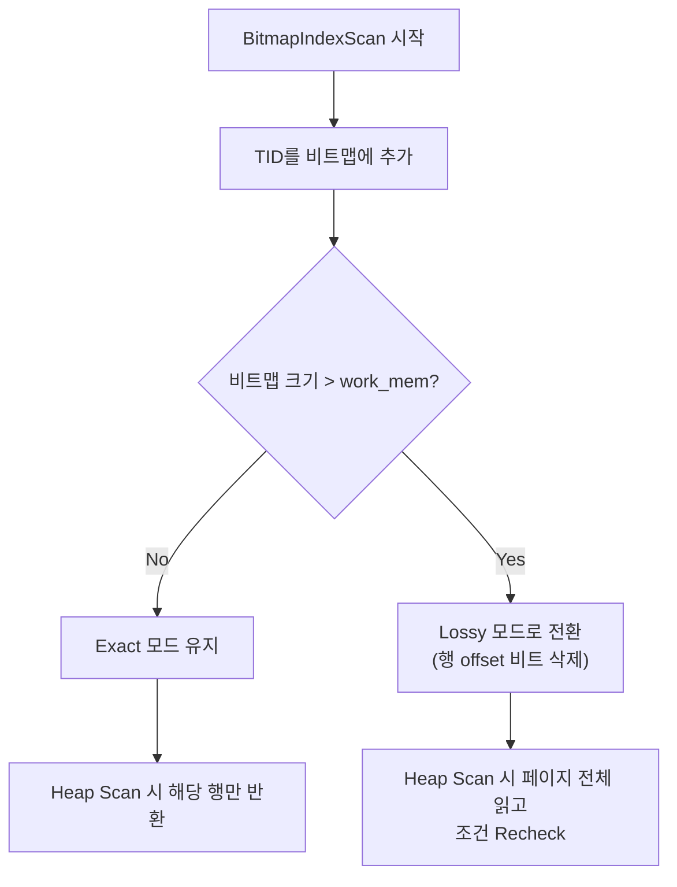

## 왜 "전통적 Index Scan"으로는 부족한가

일반적인 Index Scan의 동작을 먼저 이해하자.

```
인덱스 리프 노드에서 TID를 하나 꺼냄
  → 해당 TID가 가리키는 테이블 페이지로 이동
  → 행을 읽음
  → 다음 TID를 꺼냄
  → 또 다른 테이블 페이지로 이동
  → ...
```

여기서 TID란 **Tuple ID** = `(페이지 번호, 페이지 내 오프셋)`으로, 행의 물리적 위치를 가리키는 주소다.

이 방식에는 두 가지 한계가 있다:

1. **Random I/O**: 결과가 여러 페이지에 흩어져 있으면, 매번 다른 페이지로 점프해야 함
2. **단일 인덱스 제약**: 하나의 인덱스에서만 TID를 가져올 수 있음. 서로 다른 인덱스의 결과를 "합칠" 방법이 없음

우리 벤치마크의 상황을 생각해보자:

```sql
WHERE (date_1 = 'X' AND bool_1 = TRUE)    -- idx_pair_1 사용
   OR (date_5 = 'Y' AND bool_5 = TRUE)    -- idx_pair_5 사용
   OR (date_12 = 'Z' AND bool_12 = TRUE)  -- idx_pair_12 사용
```

세 조건은 각각 다른 인덱스를 타야 한다. Index Scan은 **하나의 인덱스만** 선택할 수 있으므로, 나머지 두 조건은 필터로 처리하거나 포기해야 한다. 이것이 MySQL이 Full Table Scan을 선택하는 이유이기도 하다.

---

## Bitmap Scan: 중간 추상 계층의 도입

PostgreSQL은 이 문제를 **Bitmap**이라는 중간 자료구조를 도입하여 해결한다.

핵심 아이디어: **인덱스 결과를 즉시 행으로 가져오지 않고, "어떤 페이지를 방문해야 하는지"를 먼저 메모리에 기록한 뒤, 나중에 한 번에 읽는다.**

이 아이디어 덕분에:
- 여러 인덱스의 결과를 비트 연산으로 합칠 수 있고 (BitmapOr / BitmapAnd)
- 페이지를 물리적 순서대로 방문하여 I/O를 최적화할 수 있다

```anim:bitmap-or-scan
{}
```

---

## 3단계로 이해하는 Bitmap Scan

### 1단계: BitmapIndexScan, 비트맵 생성

각 인덱스를 B-tree로 탐색하여 조건에 맞는 행들의 **위치(TID)**를 비트맵으로 수집한다.

이 비트맵은 행 자체가 아니라, "테이블의 몇 번 페이지에 결과가 있다"는 위치 정보를 담는다.

```
idx_pair_1에서 date_1='2024-03-15' AND bool_1=TRUE 스캔 결과:
  → Bitmap A: 페이지 42에 행 3개, 페이지 156에 행 1개

idx_pair_5에서 date_5='2024-07-01' AND bool_5=TRUE 스캔 결과:
  → Bitmap B: 페이지 12에 행 1개, 페이지 42에 행 2개

idx_pair_12에서 date_12='2024-11-20' AND bool_12=TRUE 스캔 결과:
  → Bitmap C: 페이지 200에 행 1개, 페이지 891에 행 1개
```

이 단계에서는 **테이블 데이터를 전혀 읽지 않는다.** 인덱스만 탐색한다.

### 2단계: BitmapOr, 비트맵 합치기

여러 비트맵을 **메모리 내 비트 OR 연산**으로 합친다.

```
Bitmap A:  {42, 156}
Bitmap B:  {12, 42}
Bitmap C:  {200, 891}

OR 결과:   {12, 42, 156, 200, 891}
```

이 연산은:
- 순수 메모리 내 비트 연산이므로 **디스크 I/O가 0**
- 시간 복잡도는 비트맵 크기에 비례 (보통 수십~수백 KB)
- 페이지 42가 A와 B 모두에 있지만, 결과에는 **한 번만** 등장 → 중복 제거 자동

### 3단계: BitmapHeapScan, 페이지 순서대로 읽기

합쳐진 비트맵의 페이지를 **물리적 번호 순서**대로 방문한다.

```
페이지 12  → 읽고 → 조건 Recheck → 매칭 행 반환
페이지 42  → 읽고 → 조건 Recheck → 매칭 행 반환
페이지 156 → 읽고 → 조건 Recheck → 매칭 행 반환
페이지 200 → 읽고 → 조건 Recheck → 매칭 행 반환
페이지 891 → 읽고 → 조건 Recheck → 매칭 행 반환
```

물리적 순서대로 방문하므로:
- HDD에서는 디스크 헤드 이동 최소화
- SSD에서도 OS read-ahead(선읽기) 효과 활용 가능
- 결과적으로 **Sequential I/O에 가까운 효율**

---

## 실제 EXPLAIN으로 확인

<CodeWithOutput
  language="sql"
  label="쿼리 (OR 조건 5쌍)"
  outputLanguage="text"
  outputLabel="EXPLAIN ANALYZE"
  title="PostgreSQL 17, BitmapOr 실행 계획"
  codeWidth={35}
  code={`SELECT id, payload
FROM bench_target
WHERE (date_26 = '2023-01-03'
       AND bool_26 = TRUE)
   OR (date_24 = '2020-09-12'
       AND bool_24 = TRUE)
   OR (date_20 = '2022-02-14'
       AND bool_20 = TRUE)
   OR (date_12 = '2020-06-10'
       AND bool_12 = TRUE)
   OR (date_5 = '2023-02-04'
       AND bool_5 = TRUE);`}
  output={`Bitmap Heap Scan on bench_target
  (cost=7.01..8.14 rows=1)
  (actual time=0.003..0.004 rows=3)
  Heap Blocks: exact=3
  Buffers: shared hit=13
  →  BitmapOr
       (actual time=0.003..0.003)
       Buffers: shared hit=10
       →  Bitmap Index Scan on idx_pair_26
            Index Cond: (date_26='2023-01-03'
                         AND bool_26=true)
            Buffers: shared hit=2
       →  Bitmap Index Scan on idx_pair_24
            Index Cond: (date_24='2020-09-12'
                         AND bool_24=true)
            Buffers: shared hit=2
       →  Bitmap Index Scan on idx_pair_20
            Index Cond: (date_20='2022-02-14'
                         AND bool_20=true)
            Buffers: shared hit=2
       →  Bitmap Index Scan on idx_pair_12
            Index Cond: (date_12='2020-06-10'
                         AND bool_12=true)
            Buffers: shared hit=2
       →  Bitmap Index Scan on idx_pair_5
            Index Cond: (date_5='2023-02-04'
                         AND bool_5=true)
            Buffers: shared hit=2
Planning Time: 0.042 ms
Execution Time: 0.007 ms`}
/>

해석:
- **Bitmap Index Scan × 5**: 5개의 서로 다른 인덱스를 각각 스캔. 인덱스 2블록씩 = 10블록
- **BitmapOr**: 5개의 비트맵을 OR로 합침 (I/O 0, 시간 0.003ms 미만)
- **Bitmap Heap Scan**: 합쳐진 비트맵 기준 3개 페이지만 방문 = 3블록
- **총 I/O**: 13블록. 10만 행 테이블에서 13블록만 읽고 완료.

---

## UNION ALL vs BitmapOr: 같은 비용, 다른 경로

<CodeWithOutput
  language="text"
  label="UNION ALL → Append + IndexScan"
  outputLanguage="text"
  outputLabel="OR → BitmapOr"
  title="두 실행 계획 비교"
  codeWidth={50}
  code={`Append  (actual time=0.002..0.004 rows=3)
  Buffers: shared hit=13
  →  Index Scan using idx_pair_26
       Buffers: shared hit=2
  →  Index Scan using idx_pair_24
       Buffers: shared hit=2
  →  Index Scan using idx_pair_20
       Buffers: shared hit=2
  →  Index Scan using idx_pair_12
       Buffers: shared hit=3
  →  Index Scan using idx_pair_5
       Buffers: shared hit=4
Planning Time: 0.134 ms
Execution Time: 0.008 ms`}
  output={`Bitmap Heap Scan  (actual time=0.003..0.004)
  Buffers: shared hit=13
  →  BitmapOr
       →  Bitmap Index Scan on idx_pair_26
            Buffers: shared hit=2
       →  Bitmap Index Scan on idx_pair_24
            Buffers: shared hit=2
       →  Bitmap Index Scan on idx_pair_20
            Buffers: shared hit=2
       →  Bitmap Index Scan on idx_pair_12
            Buffers: shared hit=2
       →  Bitmap Index Scan on idx_pair_5
            Buffers: shared hit=2
Planning Time: 0.042 ms
Execution Time: 0.007 ms`}
/>

| | UNION ALL (Append) | OR (BitmapOr) |
|--|:--:|:--:|
| 총 I/O 블록 | 13 | 13 |
| Planning Time | 0.134 ms | 0.042 ms |
| Execution Time | 0.008 ms | 0.007 ms |
| 페이지 방문 순서 | 보장 없음 | 물리적 순서 |
| 중복 페이지 제거 | 불가능 | 자동 |

실행 시간 차이는 무시할 수준. Planning Time은 UNION ALL이 약간 더 높은데, 각 SELECT를 개별 최적화해야 하기 때문이다.

---

## TID Bitmap의 내부 구조

여기서부터가 핵심이다. PostgreSQL의 비트맵(`src/backend/nodes/tidbitmap.c`)은 단순한 bit 배열이 아니라, 메모리 효율을 위한 정교한 구조를 가지고 있다.

### "비트맵"이란 정확히 무엇인가

PostgreSQL에서 테이블은 **8KB 페이지**의 연속이다. 각 페이지에는 여러 행(tuple)이 담긴다. TID Bitmap은 이 구조를 이용한다.

비유하자면:
- 테이블 = 거대한 책
- 페이지 = 책의 쪽
- 행 = 쪽 안의 특정 줄
- **TID Bitmap** = "몇 쪽의 몇 번째 줄을 읽어야 하는지" 표시한 메모

### 두 가지 해상도: Exact vs Lossy

비트맵은 **메모리 사정에 따라** 두 가지 모드로 동작한다.

#### Exact 모드 (기본)

페이지 번호 + **해당 페이지 내 행의 정확한 위치(offset)**를 비트로 기록한다.

```
페이지 42: [bit 3 = ON, bit 7 = ON, bit 9 = ON]  → 3번, 7번, 9번 행만 해당
페이지 156: [bit 1 = ON]                          → 1번 행만 해당
```

8KB 페이지에는 보통 수십~수백 행이 들어가므로, 한 페이지당 약 226행(MaxHeapTuplesPerPage) = 226비트 ≈ 29바이트의 비트맵이 필요하다.

**장점**: 페이지를 읽을 때 정확히 어떤 행이 필요한지 알므로, 불필요한 행을 건너뛸 수 있다.

#### Lossy 모드 (메모리 부족 시)

페이지 번호**만** 기록한다. "이 페이지 어딘가에 결과가 있다"만 아는 상태.

```
페이지 42: [전체 페이지 표시]  → 어딘가에 결과가 있음 (정확히 어디인지는 모름)
페이지 156: [전체 페이지 표시]
```

**장점**: 한 페이지당 1비트만 필요. 메모리 극적으로 절약.
**단점**: 페이지를 읽을 때 **모든 행**에 대해 조건을 다시 확인(Recheck)해야 함.

#### 전환 메커니즘

비트맵 크기가 `work_mem`을 초과하면, 가장 행이 많은 페이지부터 Lossy로 전환한다.



EXPLAIN 결과에서 이를 확인할 수 있다:

```
Heap Blocks: exact=1234 lossy=56
```

- `exact=1234`: 1,234개 페이지는 행 단위 정밀도 → Recheck 불필요 (정확한 행만 반환)
- `lossy=56`: 56개 페이지는 페이지 단위만 알고 있음 → 해당 페이지의 모든 행을 조건으로 다시 필터

#### 메모리 효율 계산

- **Exact 모드**: 1페이지 당 ~29바이트 → 1GB 테이블(131,072 페이지) ≈ 3.6MB 비트맵
- **Lossy 모드**: 1페이지 당 1비트 → 1GB 테이블 ≈ 16KB 비트맵
- **64GB 테이블 전체를 Lossy에서 약 1MB**로 표현 가능

대부분의 실무 쿼리에서는 결과가 테이블의 극히 일부이므로, 비트맵은 수십~수백 KB 수준이다. `work_mem`의 기본값(4MB)으로도 충분한 경우가 대부분.

### 왜 "Recheck Cond"가 항상 출력되는가

EXPLAIN에서 Bitmap Heap Scan의 `Recheck Cond` 표시를 본 적 있을 것이다:

```
Bitmap Heap Scan on bench_target
  Recheck Cond: ((date_1 = '2024-03-15') AND (bool_1 = true)) OR ...
```

이것은 "이 조건으로 Recheck합니다"라는 의미인데, **항상 표시**된다. Exact 모드에서도 표시되지만, 실제로는 Exact 페이지에서는 Recheck를 건너뛸 수 있다. PostgreSQL은 "혹시 Lossy 페이지가 있을 수 있으니" 항상 준비해두는 것이다.

실제로 Lossy가 발생했는지는 `Heap Blocks: exact=... lossy=...`에서 확인한다.

---

## BitmapAnd, 교집합도 가능하다

BitmapOr가 합집합(OR)이라면, **BitmapAnd**는 교집합(AND)이다.

```sql
-- 복합 조건이 각각 다른 단일 컬럼 인덱스에 걸릴 때
WHERE col_a = 'x' AND col_b = 'y'
-- idx_a의 비트맵 AND idx_b의 비트맵 → 교집합 페이지만 방문
```

비트맵이라는 중간 계층 덕분에 OR/AND 어떤 조합이든 여러 인덱스를 자유롭게 결합할 수 있다.

---

## 플래너는 언제 Bitmap Scan을 선택하는가

PostgreSQL 플래너는 비용 모델을 기반으로 세 가지 스캔 방식 중 하나를 선택한다:

| 상황 | Index Scan | Bitmap Scan | Seq Scan |
|------|:---:|:---:|:---:|
| 결과 행 수 | 소수 (수십 이하) | 중간 (수십~수만) | 대량 (>10-20%) |
| 결과 분포 | 한 곳에 집중 | 여러 페이지에 분산 | - |
| OR 조건 | 같은 인덱스 내 | **다른 인덱스에 걸침** | - |
| I/O 특성 | Random (허용) | Sequential-like | Sequential |

우리 벤치마크에서도 확인된다:
- **n=1**: 결과가 극소수 + 단일 인덱스 → Index Scan 선택
- **n≥3**: 여러 인덱스 필요 + 결과가 분산 → BitmapOr 선택

비용 계산:
```
Bitmap Scan 비용 = Σ(인덱스 스캔) + 비트맵 OR 비용(거의 0) + 방문 페이지 × seq_page_cost
Index Scan 비용 = 인덱스 탐색 + 결과 행 × random_page_cost
```

페이지를 순서대로 읽으므로 `seq_page_cost`(기본 1.0)가 적용되는 반면, Index Scan은 `random_page_cost`(기본 4.0)가 적용된다. 결과가 많을수록 Bitmap Scan이 유리해진다.

---

## 왜 MySQL은 이것을 할 수 없는가

MySQL에도 **Index Merge Union**이라는 유사한 기능이 존재한다. 하지만 근본적인 차이가 있다.

### MySQL Index Merge의 동작 방식

```sql
-- MySQL에서 Index Merge가 작동하는 경우
WHERE col_a = 1 OR col_b = 2
-- idx_a 스캔 → rowid 목록A
-- idx_b 스캔 → rowid 목록B
-- 목록A ∪ 목록B → 행 fetch
```

### 핵심 제약: "각 OR 브랜치가 단일 인덱스로 완전히 해결 가능해야"

```sql
-- ❌ MySQL에서 Index Merge 불가
WHERE (date_1 = 'X' AND bool_1 = TRUE)
   OR (date_5 = 'Y' AND bool_5 = TRUE)
```

MySQL 옵티마이저는 이 구조를 만나면:
1. "WHERE 전체를 커버하는 단일 인덱스가 있는가?" → 없음
2. "Index Merge로 처리할 수 있는가?" → 복합 조건(AND)이 포함된 OR은 인식 못함
3. **포기 → Full Table Scan**

### 구조적 차이 정리

| | PostgreSQL | MySQL |
|--|-----------|-------|
| 중간 자료구조 | TID Bitmap (범용) | 없음 |
| 여러 인덱스 합치기 | BitmapOr/BitmapAnd | Index Merge (제한적) |
| 복합 조건 OR | 각 인덱스 → 비트맵 합치기 ✓ | **인식 불가 → Full Scan** ✗ |
| 메모리 관리 | work_mem 기반, Lossy 전환 | N/A |
| 페이지 방문 순서 | 물리적 순서 (sequential-like) | 보장 없음 |

PostgreSQL의 핵심 설계: B-tree 결과를 **즉시 행으로 가져오지 않고**, 비트맵이라는 중간 계층을 두어 여러 인덱스 결과를 합친 뒤 한 번에 읽는다.

MySQL은 이 중간 계층이 없으므로, 인덱스에서 결과를 가져오면 바로 행을 fetch해야 한다. "여러 인덱스 결과를 먼저 모아놓고 합치기"가 구조적으로 제한된다.

---

## 정리

| 개념 | 역할 |
|------|------|
| **TID** | Tuple ID = (페이지 번호, 오프셋). 행의 물리적 주소. |
| **TID Bitmap** | "방문할 페이지 목록"을 비트로 표현한 메모리 내 구조 |
| **BitmapIndexScan** | 인덱스를 스캔하여 TID Bitmap 생성 |
| **BitmapOr** | 여러 비트맵의 합집합 (비트 OR 연산) |
| **BitmapAnd** | 여러 비트맵의 교집합 (비트 AND 연산) |
| **BitmapHeapScan** | 합쳐진 비트맵의 페이지를 순서대로 방문 |
| **Exact 모드** | 페이지+행 위치 기록. Recheck 불필요. |
| **Lossy 모드** | 페이지만 기록. 읽을 때 조건 Recheck 필요. |
| **work_mem** | 비트맵 최대 크기 결정. 초과 시 Lossy 전환. |

---

## 참고 자료

- [PostgreSQL Docs, Combining Multiple Indexes](https://www.postgresql.org/docs/current/indexes-bitmap-scans.html)
- [PostgreSQL Source, tidbitmap.c](https://doxygen.postgresql.org/tidbitmap_8c_source.html)
- [PostgreSQL Source, nodeBitmapOr.c](https://doxygen.postgresql.org/nodeBitmapOr_8c_source.html)
- [MySQL Docs, Index Merge Optimization](https://dev.mysql.com/doc/refman/8.0/en/index-merge-optimization.html)
