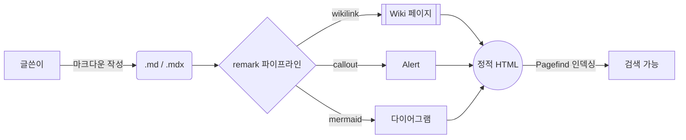
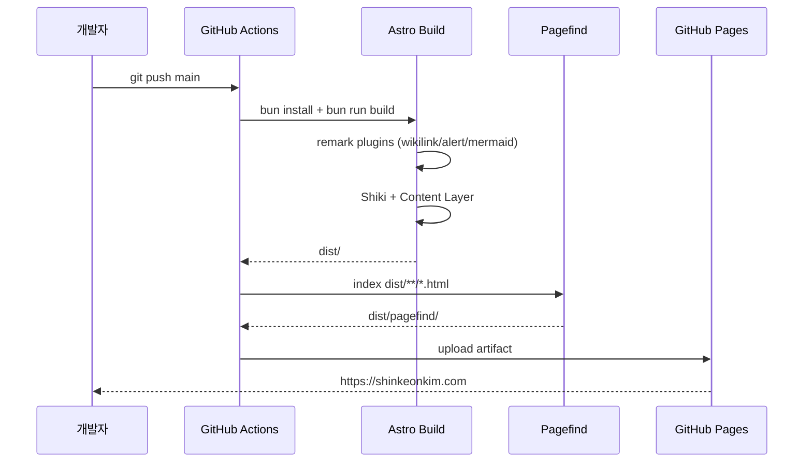
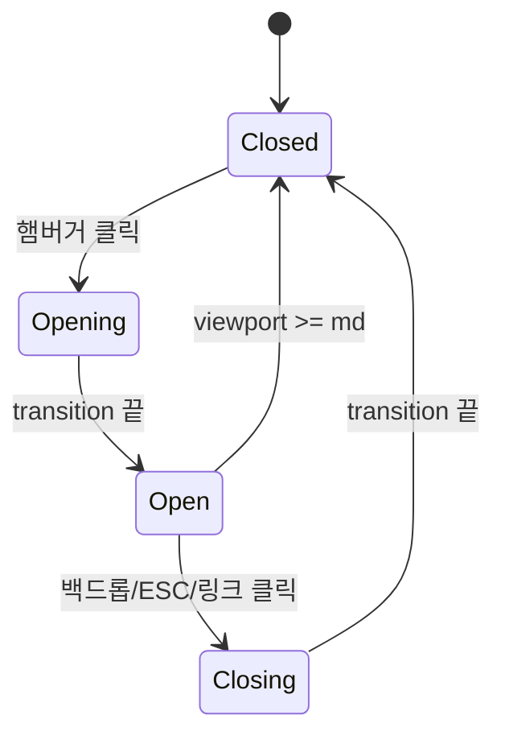
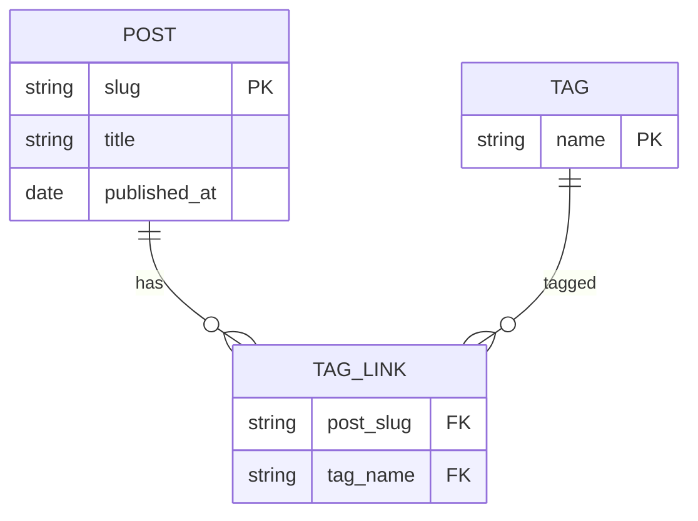

이 글은 새 블로그에서 지원하는 마크다운 문법을 한눈에 확인하기 위한 페이지입니다.

## 1. 기본 텍스트 강조

**굵게** · *기울임* · ***굵게+기울임*** · ~~취소선~~ · `인라인 코드` · <u>밑줄(HTML)</u>

자동 링크: [https://astro.build](https://astro.build)
일반 링크: [Astro 공식 문서](https://docs.astro.build)
위키 링크: [[Astro]] · 별칭 [[Astro|Astro JS]] · 깨진 링크 [[존재하지않는위키]]

## 2. 헤딩 계층

### 3단계 헤딩

#### 4단계 헤딩

##### 5단계 헤딩

###### 6단계 헤딩

## 3. 인용과 콜아웃

평범한 블록 인용:

> "단순함이 궁극의 정교함이다.", 레오나르도 다 빈치

GitHub 스타일 콜아웃 (5종):

> [!NOTE]
> 정보, 가볍게 알아두면 좋은 부가 설명을 적습니다.

> [!TIP]
> 팁, 더 쉽게 일을 처리하기 위한 조언입니다.

> [!IMPORTANT]
> 중요, 목표 달성에 꼭 필요한 핵심 정보입니다.

> [!WARNING]
> 경고, 문제를 피하기 위해 즉시 주의해야 할 내용입니다.

> [!CAUTION]
> 주의, 특정 행동으로 인한 위험이나 부정적 결과를 알립니다.

## 4. 리스트

순서 없는 리스트:

- 첫 번째 항목
- 두 번째 항목
  - 중첩 항목
  - 다른 중첩
    - 더 깊은 중첩
- 세 번째 항목

순서 있는 리스트:

1. 패키지 설치
2. 설정 추가
3. 빌드 확인

체크리스트 (GFM):

- [x] Astro 프로젝트 셋업
- [x] BrainDB 대체 remark 플러그인 작성
- [x] 다크/라이트 모드 구현
- [ ] 1만 글 마이그레이션

## 5. 코드 블록

인라인 코드: `const greeting = "안녕"`

TypeScript:

```ts
interface User {
  id: string;
  name: string;
  email?: string;
}

export async function getUser(id: string): Promise<User | null> {
  const response = await fetch(`/api/users/${id}`);
  if (!response.ok) return null;
  return response.json() as Promise<User>;
}
```

Python:

```python
from dataclasses import dataclass
from typing import Optional

@dataclass
class User:
    id: str
    name: str
    email: Optional[str] = None

async def get_user(id: str) -> Optional[User]:
    async with httpx.AsyncClient() as client:
        r = await client.get(f"/api/users/{id}")
        if r.status_code != 200:
            return None
        data = r.json()
        return User(**data)
```

Bash:

```bash
#!/usr/bin/env bash
set -euo pipefail

for file in src/content/posts/*.md; do
  echo "Processing $file"
  pnpm exec markdownlint "$file"
done
```

JSON + diff + plain text:

```json
{
  "name": "shinkeonkim-log",
  "version": "0.1.0"
}
```

```diff
- 안녕하세요
+ 안녕하세요, 김신건입니다.
```

```
순수 텍스트 블록은 하이라이팅이 없습니다.
어떤 언어인지 명시하지 않으면 이렇게 보입니다.
```

## 6. 표

| 항목 | 설명 | 상태 |
|------|------|:---:|
| 다크/라이트 모드 | localStorage + prefers-color-scheme | ✅ |
| 위키링크 | 자체 remark 플러그인 | ✅ |
| 그래프 뷰 | D3 force simulation | ✅ |
| 통합 검색 | Pagefind 빌드 후 인덱싱 | ✅ |
| 페이지네이션 | Astro `paginate()` | ✅ |

정렬 옵션:

| 왼쪽 정렬 | 가운데 정렬 | 오른쪽 정렬 |
|:----------|:-----------:|------------:|
| left      | center      | right       |
| 짧은 텍스트 | 중간 길이 텍스트 | 더 긴 텍스트 |

## 7. 이미지

`public/` 디렉토리에 둔 이미지 (절대 경로):


리모트 이미지:


## 8. 푸트노트

푸트노트도 지원합니다[^astro-note]. 본문이 길어질 때 출처를 정리할 때 유용합니다[^korean].

[^astro-note]: Astro 5의 기본 remark 설정은 `remark-gfm` 과 `remark-smartypants` 를 포함합니다.
[^korean]: 한국어 콘텐츠에서도 푸트노트 마커가 정상 동작합니다.

## 9. 구분선과 줄바꿈

---

위는 구분선입니다. 줄바꿈 두 칸으로  
강제 줄바꿈도 됩니다.

## 10. HTML 직접 삽입

마크다운 안에서 필요할 때 HTML 을 직접 쓸 수 있습니다:

<details>
<summary>접었다 펼치는 영역</summary>

이 안에 마크다운은 동작하지 않습니다 (raw HTML). 그래도 텍스트와 일반 HTML 은 잘 들어갑니다.

</details>

<kbd>⌘</kbd> + <kbd>K</kbd> 같은 단축키 표기도 가능합니다.

## 11. 코드 + 실행 결과 패널 (`<CodeWithOutput>`)

좌측에 입력 코드, 우측에 그 결과를 나란히 보여주는 컴포넌트. 화면이 좁아지면 자동으로 위아래로 쌓입니다 (lg breakpoint 기준). 실제로 실행하는 게 아니라 글쓴이가 결과를 직접 적어 둡니다, 그래서 셸, REPL, DB CLI, HTTP API 등 **어떤 환경의 입출력이든** 그대로 옮길 수 있습니다.

### 11.1 Bash

<CodeWithOutput
  language="bash"
  label="$ bash"
  outputLanguage="text"
  outputLabel="stdout"
  title="현재 디렉토리 살펴보기"
  code={`pwd
ls -la src/components | head -8`}
  output={`/Users/koa/100-github-io
total 56
drwxr-xr-x@ 11 koa  staff  352  5월 23 19:30 .
drwxr-xr-x@  9 koa  staff  288  5월 23 19:30 ..
-rw-r--r--@  1 koa  staff 1.2K  5월 23 19:30 Backlinks.astro
-rw-r--r--@  1 koa  staff 3.6K  5월 23 19:30 CodeWithOutput.astro
-rw-r--r--@  1 koa  staff 1.0K  5월 23 19:30 Footer.astro
-rw-r--r--@  1 koa  staff 2.4K  5월 23 19:30 Graph.tsx`}
/>

### 11.2 Redis CLI

<CodeWithOutput
  language="bash"
  label="redis-cli"
  outputLanguage="text"
  outputLabel="응답"
  title="간단한 캐시 시나리오"
  code={`SET user:42 '{"name":"koa","tier":"pro"}' EX 3600
GET user:42
TTL user:42
INCR pageviews:home
KEYS user:*`}
  output={`OK
"{\\"name\\":\\"koa\\",\\"tier\\":\\"pro\\"}"
(integer) 3599
(integer) 1
1) "user:42"`}
/>

### 11.3 PostgreSQL (psql)

<CodeWithOutput
  language="sql"
  label="psql"
  outputLanguage="text"
  outputLabel="결과"
  title="태그 사용 통계"
  code={`SELECT tag, COUNT(*) AS posts
FROM post_tags
GROUP BY tag
ORDER BY posts DESC
LIMIT 5;`}
  output={` tag         | posts
-------------+-------
 astro       |    42
 perf        |    18
 typescript  |    15
 retrospect  |    11
 markdown    |     9
(5 rows)`}
/>

### 11.4 HTTP, curl + JSON 응답

<CodeWithOutput
  language="bash"
  label="curl"
  outputLanguage="json"
  outputLabel="HTTP 200"
  title="GitHub user API"
  code={`curl -s https://api.github.com/users/shinkeonkim \\
  | jq '{login, name, public_repos, followers}'`}
  output={`{
  "login": "shinkeonkim",
  "name": "Shinkeon Kim",
  "public_repos": 73,
  "followers": 24
}`}
/>

### 11.5 Python REPL

<CodeWithOutput
  language="python"
  label="python"
  outputLanguage="text"
  outputLabel=">>>"
  title="dataclass 한 입"
  code={`from dataclasses import dataclass

@dataclass
class Note:
    id: str
    body: str

n = Note(id="2026-05-23", body="hello")
print(n)
print(n.body.upper())`}
  output={`Note(id='2026-05-23', body='hello')
HELLO`}
/>

### 11.6 멀티 언어 탭, 같은 출력, 여러 구현

`variants` prop 에 언어별 구현을 나열하면 좌측에 탭으로 묶이고, 우측 결과는 공유됩니다. "같은 문제를 어떤 언어로도 풀 수 있다" 를 보여줄 때 유용합니다.

<CodeWithOutput
  outputLanguage="text"
  outputLabel="stdout"
  title="피보나치 첫 10개"
  variants={[
    {
      label: 'python',
      language: 'python',
      code: `def fib(n):
    a, b = 0, 1
    out = []
    for _ in range(n):
        out.append(a)
        a, b = b, a + b
    return out

print(fib(10))`,
    },
    {
      label: 'typescript',
      language: 'ts',
      code: `function fib(n: number): number[] {
  const out: number[] = [];
  let [a, b] = [0, 1];
  for (let i = 0; i < n; i++) {
    out.push(a);
    [a, b] = [b, a + b];
  }
  return out;
}

console.log(fib(10));`,
    },
    {
      label: 'rust',
      language: 'rust',
      code: `fn fib(n: usize) -> Vec<u64> {
    let mut out = Vec::with_capacity(n);
    let (mut a, mut b) = (0u64, 1u64);
    for _ in 0..n {
        out.push(a);
        let next = a + b;
        a = b;
        b = next;
    }
    out
}

fn main() {
    println!("{:?}", fib(10));
}`,
    },
    {
      label: 'go',
      language: 'go',
      code: `package main

import "fmt"

func fib(n int) []int {
    out := make([]int, 0, n)
    a, b := 0, 1
    for i := 0; i < n; i++ {
        out = append(out, a)
        a, b = b, a+b
    }
    return out
}

func main() {
    fmt.Println(fib(10))
}`,
    },
  ]}
  output={`[0, 1, 1, 2, 3, 5, 8, 13, 21, 34]`}
/>

### 11.7 너비 조절

`codeWidth` prop 으로 좌측 코드 패널 너비(%)를 정합니다. 사용자는 가운데 핸들을 **드래그** (또는 화살표 키) 로 임의 조정할 수 있고, 너비가 100% 가 되면 자동으로 상하 배치로 전환됩니다. 조정값은 컴포넌트 단위로 localStorage 에 저장됩니다.

- 더블클릭 / Enter: 50% 로 리셋
- 화살표 키: 2% 씩 (Shift+화살표: 10%)
- End 키: 100% (상하 배치)

<CodeWithOutput
  language="bash"
  label="$ bash"
  outputLanguage="text"
  outputLabel="긴 디렉토리 트리"
  title="출력이 길 때, 출력 영역 넓게 (codeWidth=30)"
  codeWidth={30}
  code={`tree -L 2 src/`}
  output={`src/
├── assets
│   └── avatar.png
├── components
│   ├── Backlinks.astro
│   ├── CodeWithOutput.astro
│   ├── Footer.astro
│   ├── Graph.tsx
│   ├── Graph3D.tsx
│   ├── GraphView.tsx
│   ├── Header.astro
│   ├── MermaidLoader.astro
│   ├── MobileNav.astro
│   ├── Pagination.astro
│   └── ThemeToggle.astro
├── consts.ts
├── content
│   ├── notes
│   ├── posts
│   └── wiki
├── content.config.ts
├── layouts
│   ├── BaseLayout.astro
│   └── PostLayout.astro
├── lib
│   └── content-graph.ts
├── pages
│   ├── about.astro
│   ├── graph.astro
│   ├── index.astro
│   ├── notes
│   ├── posts
│   ├── robots.txt.ts
│   ├── rss.xml.ts
│   ├── search.astro
│   ├── tags
│   └── wiki
├── plugins
│   ├── remark-mermaid.mjs
│   └── remark-wikilink.mjs
└── styles
    └── global.css`}
/>

<CodeWithOutput
  language="bash"
  label="$ bash"
  outputLanguage="text"
  outputLabel="stdout"
  title="긴 코드, 코드 영역 넓게 (codeWidth=75)"
  codeWidth={75}
  code={`# 디스크 사용량 큰 디렉토리 상위 5개
du -h --max-depth=1 . 2>/dev/null \\
  | sort -hr \\
  | head -6 \\
  | awk 'NR>1 {printf "%-8s %s\\n", $1, $2}'`}
  output={`189M    ./dist
42M     ./node_modules/.bin
12M     ./node_modules/three
8.4M    ./src
2.1M    ./public
1.2M    ./_posts`}
/>

## 12. Mermaid 다이어그램

\`\`\`mermaid 코드 블록은 자동으로 [Mermaid](https://mermaid.js.org) 다이어그램으로 렌더링됩니다. CDN ESM 으로 lazy import 되므로 이 페이지에서만 ~수백KB 로드되고, 다른 글에는 부담이 없습니다. 다크/라이트 모드 토글 시 자동으로 다시 그려집니다.

### 12.1 Flowchart



### 12.2 Sequence, 빌드 파이프라인



### 12.3 State diagram, 사이드 드로어 상태



### 12.4 ER diagram



## 18. 인터랙티브 애니메이션

본문 중간에 dev-only 스튜디오 (`/_studio/`) 에서 만든 애니메이션을 삽입할 수 있습니다.
전체 카탈로그: [/animations/](/animations/) · 만들기 가이드: `manual-docs/animation-studio-guide.md`

### 18.1 HTTP 요청 / 응답

가장 기본적인 패턴, Client 가 Server 에 요청, Server 가 응답.

```anim:http-request
{}
```

### 18.2 Redis 캐시 적중 (HIT)

캐시에 데이터가 있어 빠르게 응답하는 경우. DB 조회가 없어서 ~6ms.

```anim:redis-cache-hit
{}
```

### 18.3 Redis 캐시 미스 (MISS)

캐시에 없어서 DB 까지 다녀와야 하고, 이후 캐시도 갱신해야 함. ~72ms.

```anim:redis-cache-miss
{}
```

### 18.4 DB Primary-Replica 복제

쓰기는 Primary 에만, Read replica 들에는 WAL 스트림으로 비동기 복제.

```anim:db-replication
{}
```

### 18.5 Load Balancer Round-Robin

요청들을 서버 풀에 순회하며 분산.

```anim:load-balancer
{}
```

### 18.6 TCP 3-way Handshake

SYN → SYN+ACK → ACK 로 연결 수립 (각 노드의 상태 전이 함께 표시).

```anim:tcp-handshake
{}
```

### 18.7 OAuth 2.0 Authorization Code Flow

User → App → Auth Server → token → API. 표준 OAuth 시퀀스.

```anim:oauth-flow
{}
```
