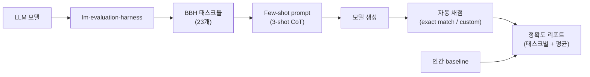
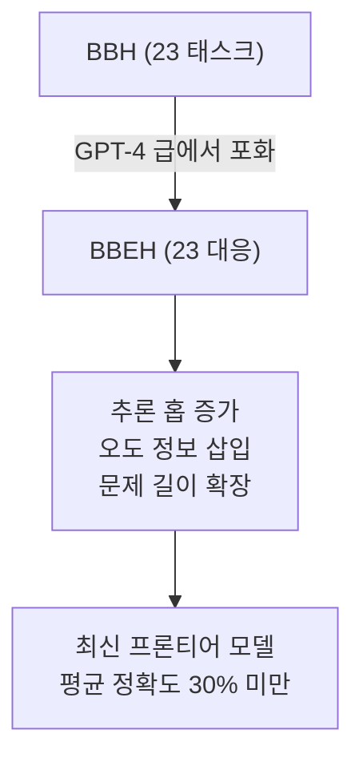

## 정의

**BIG-Bench (Beyond the Imitation Game Benchmark)** 는 2022년 Google + 132개 기관 442명의 공저로 발표된 **대형 언어 모델 종합 평가 벤치마크** 입니다. **204 개의 다양한 태스크** 를 담고 있어, 하나의 스킬이 아닌 언어 모델의 **광폭 능력 지도** 를 그리는 것이 목표입니다.

이름은 튜링 테스트 (Imitation Game) 를 넘어서겠다는 뜻으로, 단일 태스크 벤치마크가 놓치는 능력들을 포괄합니다.

## 구성

### 태스크 유형

BIG-Bench 태스크는 크게 두 형태로 정의됩니다.

- **JSON tasks**: 입력, 정답 (multiple-choice 또는 free-form generation) 이 JSON 으로 명시된 태스크. 자동 채점 가능.
- **Programmatic tasks**: 파이썬 함수가 상호작용 (다중 턴, 조건부 프롬프트 생성) 을 정의. 훨씬 유연하지만 상대적으로 소수.

### 태스크 카테고리

204 개는 다음과 같은 keyword tag 로 분류됩니다 (한 태스크에 여러 태그).

| 태그 | 대표 태스크 |
|:---|:---|
| **논리 (logic)** | logical deduction, formal fallacies, sports understanding |
| **수학 (mathematics)** | arithmetic, tracking shuffled objects, multi-step arithmetic |
| **상식 (commonsense)** | causal judgment, hyperbaton, disambiguation QA |
| **다국어 (multilingual)** | international phonetic alphabet transliterate, 다국어 QA |
| **사회 편향 (bias)** | BBQ (Bias Benchmark for QA), gender inclusive sentences |
| **자기인식 (self-awareness)** | self-evaluation tutoring, know unknowns |
| **거짓 정보 (misinformation)** | TruthfulQA (별도 벤치이지만 통합) |
| **coding** | date understanding, formal logic |
| **소설 태스크** | novel concepts, ruin names, understanding fables |
| **긴 컨텍스트** | disambiguation, tracking shuffled objects |

### 채점

- **Multiple-choice**: brier score, log-likelihood 정답 확률
- **Generation**: exact match, BLEU, ROUGE, 태스크별 custom scorer

각 태스크는 **인간 baseline (평균/최고)** 도 함께 포함하여, 모델이 사람 수준에 도달했는지 판단합니다.

## 평가 파이프라인





## BIG-Bench Hard (BBH)

Suzgun et al. (2022) 은 204 개 태스크 중 **당시 (GPT-3 급) 최선 모델이 사람 평균에도 못 미친 23 개 태스크** 를 골라 **BIG-Bench Hard (BBH)** 를 만들었습니다.

대표 BBH 태스크 (일부):

- **Boolean Expressions**: 논리식 truth value 계산
- **Causal Judgment**: 인과관계 판단 (도덕적 시나리오 포함)
- **Date Understanding**: 상대 날짜 계산 ("last Friday" 등)
- **Disambiguation QA**: 대명사 지칭 애매성
- **Formal Fallacies**: 형식논리 오류 식별
- **Geometric Shapes**: SVG path -> 도형 이름
- **Hyperbaton**: 형용사 순서 문법
- **Logical Deduction (three/five/seven objects)**: 순서 추론
- **Movie Recommendation**: 최근접 유사 영화 찾기
- **Multi-Step Arithmetic**: 다단계 계산
- **Navigate**: 이동 후 시작점 여부
- **Object Counting**: 물체 개수 세기
- **Penguins in a Table**: 표에서 조건 필터링
- **Reasoning about Colored Objects**: 색깔 물체 추론
- **Ruin Names**: 이름의 한 글자 바꾸기
- **Salient Translation Error Detection**: 번역 오류 탐지
- **Snarks**: 풍자 이해
- **Sports Understanding**: 스포츠 상식
- **Temporal Sequences**: 일정 짜기
- **Tracking Shuffled Objects (three/five/seven)**: 물체 위치 추적
- **Web of Lies**: 진실/거짓 진술 체인
- **Word Sorting**: 단어 정렬

이 23개는 [[chain-of-thought|CoT]] 프롬프팅 효과를 검증하는 대표 벤치마크로 자리잡았습니다. Suzgun 논문 자체가 "CoT 로 몇 태스크는 사람 수준을 초과" 했다는 결과입니다.

## BBEH (BIG-Bench Extra Hard)

Kazemi et al. (2025) 은 BBH 가 최신 프론티어 모델 (GPT-4o, Claude 3.5, Gemini 1.5) 에게 이미 포화 (> 85% 정확도) 되었다는 문제를 지적하며, 각 BBH 태스크의 **더 어려운 변종** 으로 대체한 **BBEH** 를 발표했습니다.

- BBH 와 같은 23 개 카테고리 대응
- 문제 길이 확장, 추론 홉 (hop) 증가, 오도 정보 삽입
- 최신 모델도 평균 정확도 30% 미만 (초기 리포트 기준)

## 주요 모델 성능 추이

BIG-Bench / BBH 에서의 정확도 변화 (대략적 추이):

| 모델 세대 | BBH 정확도 (대략) | 특이점 |
|:---|:---|:---|
| GPT-3 (2020) | 30-40% | 사람 평균 이하 태스크 다수 |
| GPT-4 (2023) | 70-85% | 대부분 태스크 사람 수준 근접 |
| Claude 3.5 / GPT-4o (2024) | > 85% | 포화 시작, BBH 변별력 감소 |
| o1 / Gemini 2.0 (2024-25) | > 90% | BBH 실질적 의미 소멸, BBEH 필요성 대두 |

> [!IMPORTANT]
> 이 수치들은 대략적인 경향입니다. 실제 벤치마크 결과는 few-shot 설정, 프롬프트 형식, 평가 도구 버전에 따라 달라집니다.

## 리더보드

원 BIG-Bench 는 **GitHub 기반 커뮤니티 벤치마크** 로 시작했지만, 이후 다음 플랫폼들이 리더보드를 제공합니다.

- **HELM Classic**: BIG-Bench 태스크 일부 통합, [[helm-llm-benchmark|HELM]] 축으로 리포트
- **EleutherAI lm-evaluation-harness**: BBH 자동 실행 지원 (`--tasks bbh_*`)
- **Papers With Code**: BBH 별 순위표

## 한계

> [!WARNING]
> **태스크 품질 편차가 큽니다.** 442명 공저 방식이라 태스크마다 명세 완성도가 다르고, 일부는 정답 라벨이 애매합니다. 이 문제 때문에 실전에서는 BBH 로 축약해 쓰는 경우가 많습니다.

> [!CAUTION]
> **데이터 오염 (contamination)**. 초기 발표 후 태스크가 공개되어 학습 데이터에 유입될 위험. GPT-4 이후 모델의 BBH 정확도가 갑자기 뛴 이유 중 하나로 지목됩니다. BBEH 는 이 문제를 부분 완화.

> [!IMPORTANT]
> **BIG-Bench 는 "언어 이해" 편중** 입니다. 코드 실행, 멀티모달, agent 사용, 툴 호출은 초기 스코프에서 벗어나 있어, 오늘날 LLM 평가에는 다른 벤치마크와 병행이 필요합니다.

## 다른 벤치마크와 관계

| 벤치마크 | 초점 | BIG-Bench 와 차이 |
|:---|:---|:---|
| **[[helm-llm-benchmark|HELM]]** | 다면적 (accuracy + fairness + robustness ...) | HELM 은 여러 축, BIG-Bench 는 태스크 다양성에 집중 |
| **MMLU** | 지식 QA 57 과목 | BIG-Bench 는 더 넓고 소설 태스크 포함, MMLU 는 학과 시험 |
| **MMLU-Pro** | MMLU 강화 | 여전히 지식 QA 편중 |
| **GSM8K / MATH** | 수학 | BIG-Bench 에 수학 태스크가 있지만 소규모 |
| **HumanEval / MBPP** | 코드 생성 | BIG-Bench 는 코드 편중 아님 |
| **Chatbot Arena** | 사람 선호도 | 태스크 세분화 없음, BIG-Bench 는 세분 |

## 실전 사용

```bash
# EleutherAI lm-evaluation-harness 기준
pip install lm-eval

lm_eval \
  --model hf \
  --model_args pretrained=meta-llama/Llama-3.3-70B \
  --tasks bbh_boolean_expressions,bbh_navigate,bbh_causal_judgment \
  --num_fewshot 3 \
  --device cuda:0
```

`bbh_*` 태스크는 CoT 를 기본으로 활용하도록 few-shot 예시가 이미 구성되어 있습니다. Zero-shot 실험이라면 `bbh_zero_shot_*` 변종 사용.

### 재현 시 주의사항

- few-shot 수 (0, 1, 3) 에 따라 결과가 크게 달라짐
- 프롬프트 템플릿 (CoT 유무, 언어) 명시
- 모델 버전 (체크포인트) 고정
- 평가 라이브러리 버전 고정 (lm-eval 버전별 결과 차이 존재)

## 인간 baseline 해석

BIG-Bench 는 태스크별로 *인간 평균* 과 *인간 최고* 두 baseline 을 제공합니다.

- **인간 평균**: 일반 사람 (crowdsource) 의 평균 성능. 많은 태스크에서 50-75% 수준.
- **인간 최고**: 전문가 또는 best worker. 대부분 태스크에서 85-99%.
- 모델 점수가 *인간 평균을 초과하면* "superhuman" 이라 부르지만, 태스크 특성에 따라 다름.

BBH 의 23개 태스크는 *원 BIG-Bench 에서 GPT-3 이 인간 평균에 못 미친 것들*. 즉 BBH 의 human baseline 은 최소 GPT-3 보다 높다는 의미.

> [!WARNING]
> 인간 baseline 은 crowdwork 설정에 따라 달라집니다. 태스크 지시문의 명확도, 평가자의 도메인 지식에 따라 동일 태스크라도 baseline 이 크게 다를 수 있습니다.

## 어떤 상황에 사용하나

| 상황 | 사용 여부 | 이유 |
|:---|:---|:---|
| 새 모델의 일반 언어 능력 측정 | BBH 사용 | 검증된 23개, 해석하기 쉬움 |
| 최신 프론티어 모델 변별 | BBEH 사용 | BBH 는 포화 상태 |
| 코드 생성 능력 평가 | 다른 벤치 (HumanEval, MBPP) | BIG-Bench 는 코드 편중 아님 |
| 다국어 능력 | FLORES, mMMLU 병행 | BIG-Bench 다국어 태스크는 소수 |
| 에이전트/툴 사용 능력 | GAIA, SWE-bench | BIG-Bench 스코프 밖 |
| 연구 논문에서 표준 비교 | BBH 선택 | 인용 수와 재현성 보장 |

> [!TIP]
> BBH 를 단독으로 리포트하면 "어떤 few-shot 설정인지", "어떤 평가 라이브러리 버전인지" 반드시 명시. 설정에 따라 결과가 5-15% 포인트 달라질 수 있음.

## 공개 기여 방법

BIG-Bench 는 GitHub PR 기반 공개 기여 모델로 운영됩니다.

```bash
# 새 태스크 기여 흐름
git clone https://github.com/google/BIG-bench
cd BIG-bench/bigbench/benchmark_tasks/

# 새 폴더 생성 (kebab-case)
mkdir my_new_task
# task.json 또는 task.py 작성
# README.md: 태스크 설명, 인간 baseline, 동기 기술
# 테스트: python -m pytest bigbench/tests/
```

태스크는 **JSON** (간단한 QA) 또는 **Python** (복잡한 상호작용) 중 선택. 공식 GitHub 의 `bigbench/benchmark_tasks/` 아래 기존 태스크를 참고.

## 관련 위키

- [[helm-llm-benchmark|HELM]] - 다면 평가 프레임워크 (BIG-Bench 태스크 통합)
- [[chain-of-thought|Chain-of-Thought]] - BBH 는 CoT 효과 실증의 표준 벤치
- [[zero-shot-prompting|Zero-Shot Prompting]] - BBH 도 zero-shot 변종 존재
- [[few-shot-prompting|Few-Shot Prompting]] - BBH 표준은 3-shot CoT
- [[classification-metrics|분류 모델 지표]] - 태스크별 스코어 계산 근간
- [[transfer-learning|Transfer Learning]] - BIG-Bench 는 파운데이션 모델 일반화 능력 평가
