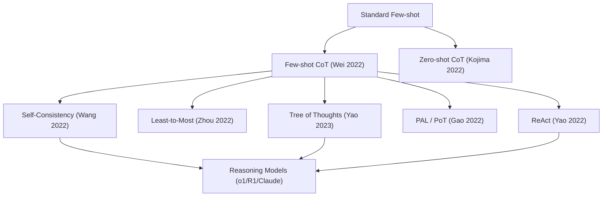
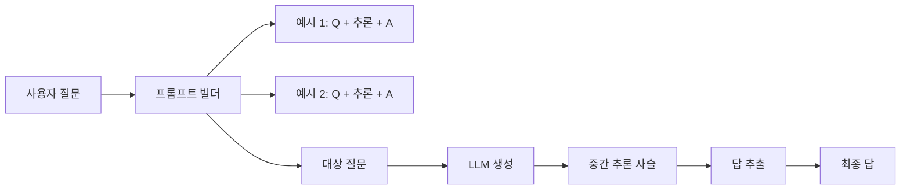

## 정의

**Chain-of-Thought (CoT) prompting** 은 대형 언어 모델이 최종 답을 내기 전에 **중간 추론 단계를 자연어로 생성하도록 유도** 하는 프롬프팅 기법입니다. 산술, 상식, 논리, 다단계 질문 응답 등 **다단계 추론이 필요한 태스크에서 정확도를 크게 향상** 시킵니다.

Wei et al. (Google Brain) 이 2022년 1월 논문에서 처음 체계화했고, GSM8K (초등 산술 문장 문제) 에서 PaLM 540B 의 정확도를 17.9% → 58.1% 로 끌어올린 결과가 인상적이었습니다.

## 왜 필요한가

기존 few-shot prompting 은 **입력 → 답** 을 그대로 요구했는데, 다단계 계산이 필요한 문제에서는 모델이 중간 사고를 생략한 채 답만 뱉으며 자주 틀렸습니다. CoT 는 모델이 사람이 문제를 푸는 순서 (읽고, 정리하고, 계산하고, 결론) 를 언어로 **명시적으로 서술** 하게 만들어, 이 서술 자체가 다음 토큰 예측의 문맥이 되어 정확도가 오른다는 발견입니다.

## 기본 예시 (Few-shot CoT)

**표준 few-shot** (틀림):

```
Q: Roger has 5 tennis balls. He buys 2 more cans of tennis balls.
   Each can has 3 tennis balls. How many tennis balls does he have now?
A: 11.

Q: The cafeteria had 23 apples. If they used 20 to make lunch and bought 6 more,
   how many apples do they have?
A: 27.   ← 오답 (정답 9)
```

**Chain-of-Thought** (정답):

```
Q: Roger has 5 tennis balls. He buys 2 more cans of tennis balls.
   Each can has 3 tennis balls. How many tennis balls does he have now?
A: Roger started with 5 balls. 2 cans of 3 tennis balls each is 6 balls.
   5 + 6 = 11. The answer is 11.

Q: The cafeteria had 23 apples. If they used 20 to make lunch and bought 6 more,
   how many apples do they have?
A: The cafeteria started with 23 apples. They used 20, so 23 - 20 = 3.
   Then they bought 6 more, so 3 + 6 = 9. The answer is 9.   ← 정답
```

같은 예시 개수, 같은 모델, 형식만 바꿨는데 정답률이 오릅니다.

## Zero-shot CoT

Kojima et al. (2022) 는 **예시 없이 지시문만** 으로도 CoT 를 유도할 수 있음을 보였습니다.

프롬프트 끝에 다음 마법 문장을 붙입니다:

```
Q: {question}
A: Let's think step by step.
```

이 한 줄이 InstructGPT-003 의 MultiArith 정확도를 17.7% → 78.7% 로 끌어올렸습니다. 한국어에서는 "차근차근 생각해 봅시다" 또는 "단계별로 풀이해 봅시다" 등으로 옮깁니다.

두 단계 프롬프트 (two-stage) 로 쓰기도 합니다:

1. **Reasoning extraction**: "Let's think step by step" 으로 추론 생성
2. **Answer extraction**: 위 추론을 이어 붙이고 "Therefore, the answer is" 로 답만 추출

## 창발성 (emergent ability)

Wei et al. 논문의 핵심 관찰: CoT 는 **일정 규모 이상** 에서만 효과가 나타납니다.

- ~62B 이하 모델: CoT 가 오히려 성능을 떨어뜨림 (틀린 추론을 확신 있게 씀)
- ~62B 이상: CoT 로 정확도 급상승 (특히 100B+ 에서 gap 이 커짐)

이것이 "emergent abilities" 논쟁의 대표 사례입니다 (Schaeffer et al. 2023 이 metric artifact 라고 반박한 논문도 있음). 실제로 오늘날 소형 모델도 instruction tuning + CoT-style SFT 를 거치면 CoT 를 어느 정도 흉내낼 수 있어, "임계 규모" 는 절대적이지 않습니다.

## 주요 확장

### Self-Consistency (Wang et al., 2022)

CoT 한 번만 샘플링하지 말고, **temperature > 0 으로 여러 개 (예: 40 개) 샘플링** 후 최종 답을 **다수결** 로 뽑습니다.

$$
\hat{y} = \arg\max_y \sum_{i=1}^{N} \mathbb{1}[\text{answer}(z_i) = y]
$$

여기서 $z_i$ 는 $i$ 번째 chain-of-thought, $\text{answer}(z_i)$ 는 그 chain 의 최종 답. GSM8K 에서 PaLM 의 성능이 SC 로 74.4% → 스코어링 대폭 개선.

### Least-to-Most (Zhou et al., 2022)

**문제 분해 후 순차 해결**. 프롬프트 두 개:

1. **Decomposition**: "이 문제를 더 쉬운 하위 문제로 나눠 봐"
2. **Solving**: 하위 문제를 순서대로 풀고 답을 다음 하위 문제에 참조

Compositional generalization (긴 조합 문제) 에서 CoT 를 크게 상회.

### Tree of Thoughts (Yao et al., 2023)

CoT 는 선형 사슬. **ToT** 는 **여러 추론 분기** 를 탐색합니다. 각 노드에서 여러 다음 스텝을 생성하고 self-evaluation 으로 점수를 매긴 뒤 BFS/DFS 로 탐색. Game of 24, Creative Writing 등에서 강함.

### Program-Aided (PAL, PoT)

자연어 대신 **Python 코드** 로 중간 추론을 씁니다. 계산은 언어 모델이 아니라 인터프리터가 실행 -> 산술 오류가 원천 차단.

```python
# Q: A juggler can juggle 16 balls. Half of them are golf balls,
#    and half of the golf balls are blue. How many blue golf balls?
total_balls = 16
golf_balls = total_balls / 2
blue_golf_balls = golf_balls / 2
answer = blue_golf_balls   # 4
```

### Auto-CoT (Zhang et al., 2022)

예시를 사람이 손으로 만들지 않고, **클러스터링 + Zero-shot CoT** 로 자동 생성한 예시를 few-shot 에 삽입. 사람 수작업 비용 절감.

### ReAct (Yao et al., 2022)

Reasoning + Acting. CoT 사이에 **도구 호출 (검색, 계산기, API)** 을 끼워 넣습니다. 오늘날 [[function-calling|Function Calling]] 기반 agent 의 원류.

## 2024-2025 진화: Reasoning models

CoT 를 **사후 학습 (RL)** 으로 내재화하고, 추론 시 훨씬 길고 정교한 사슬을 생성하도록 훈련한 계열이 등장했습니다.

- **OpenAI o1 / o3 / o4-mini** (2024-2025): 강화학습으로 CoT 능력 향상, hidden reasoning tokens 로 답 이전에 광범위한 내부 사슬 소비
- **DeepSeek-R1** (2025): 오픈웨이트 reasoning model, PPO/GRPO 로 CoT 학습
- **Claude 3.7 / 4 Extended Thinking**: 사용자에게 노출 가능한 thinking tokens
- **Gemini 2.5 Thinking**

이 계열에서는 프롬프트에 "step by step" 을 굳이 붙일 필요가 없습니다. 모델이 이미 알아서 확장 추론합니다. 오히려 지시가 이중이 되면 사슬이 산만해질 수 있습니다.

## 함정

> [!WARNING]
> **CoT 는 정확도를 항상 올리지 않습니다.** 태스크가 사실 조회 (facts), 스타일 변환, 짧은 감정 분류 등 **단발성 답변에 가까운 태스크** 라면 CoT 가 오히려 노이즈를 늘려 정확도가 떨어질 수 있습니다.

> [!CAUTION]
> **CoT 는 사후 정당화 (post-hoc rationalization) 를 할 수 있습니다.** 모델이 먼저 답을 내리고, 그럴듯한 사슬을 만들어 맞춰 쓰는 경우가 관측됩니다. 사슬이 논리적으로 완결돼 보인다고 실제 그렇게 추론했다고 신뢰하면 안 됩니다 (Turpin et al. 2023 "Language Models Don't Always Say What They Think").

> [!IMPORTANT]
> **비용 팽창.** 다단계 사슬은 출력 토큰이 늘어 API 요금이 몇 배 커집니다. Self-Consistency 는 여기에 샘플 수 배수를 더 곱합니다. 프로덕션에서는 답만 필요한 경우 사슬을 max_tokens 로 잘라내는 것이 아니라, 요약된 최종 답을 뽑는 **answer extraction** 을 별도로 두는 편이 안전합니다.

> [!WARNING]
> **작은 모델에는 역효과** 였다는 초기 관찰 (Wei 2022) 이 여전히 부분적으로 유효합니다. SLM (< 10B) 에는 CoT 를 유도하는 대신 instruction-tuned SFT 데이터에 이미 CoT-style 응답이 포함되어 있는지가 관건입니다.

## 실전 팁

- **예시 개수**: 4-8 shot 이 대개 최적. 그 이상은 return diminishing.
- **예시 순서**: 최근 예시가 답에 큰 영향 (recency bias). 다양한 라벨을 섞습니다.
- **분리 구분자**: `Q:` / `A:` 형식 또는 messages array 로 role 분리.
- **답 추출**: 정규식으로 최종 숫자만 뽑기 (` ... The answer is (\d+)` 등).
- **temperature**: 단답 CoT 는 0-0.3, Self-Consistency 는 0.5-0.8.
- **평가는 sample 여러 개 평균**: CoT 는 분산이 큽니다. n=3~5 로 여러 번 돌린 평균이 신뢰할 만합니다.

## CoT 변형 계보



위 계보는 논문 발표 순서를 대략 반영합니다. 하위로 내려갈수록 추론 구조가 복잡해지며, "Reasoning Models" 계열에서는 이 기법들이 강화학습으로 내재화됩니다.

## 벤치마크별 CoT 효과

CoT 가 특히 효과적인 태스크와 그렇지 않은 태스크:

| 벤치마크 | 태스크 성격 | CoT 효과 |
|:---|:---|:---|
| **GSM8K** | 초등 산술 문장 문제 | 매우 큼: PaLM 540B 17.9% → 58.1% |
| **MATH** | 고등 수학 경시 문제 | 큼: 다단계 증명에 적합 |
| **ARC-Challenge** | 4지선다 과학 | 중간: Self-Consistency 병행 시 효과적 |
| **StrategyQA** | 암묵적 다단계 추론 | 큼 |
| **CommonsenseQA** | 상식 추론 | 중간 |
| **HotpotQA** | 다단계 Wikipedia 추론 | 큼 |
| **TriviaQA** | 단순 사실 조회 | 거의 없음 |
| **NaturalQuestions** | 단순 사실 조회 | 없음 또는 음수 |

단순 사실 조회에서 CoT 가 오히려 노이즈를 늘려 정확도가 낮아지는 케이스도 관측됩니다.

## 프롬프트 구성 흐름



`two-stage` 방식에서는 1단계에서 사슬만 생성하고, 2단계에서 사슬을 붙여 "따라서 답은" 형태로 답만 추출합니다. 이렇게 하면 답 파싱이 안정적이고 출력 길이를 제어하기 쉽습니다.

## Self-Consistency 샘플링 전략

| 샘플 수 | temperature | 권장 상황 |
|:---|:---|:---|
| 5 | 0.5 | 빠른 검증, 비용 절감 우선 |
| 20 | 0.7 | 중간 신뢰도, 프로덕션 일반 |
| 40 | 0.7-0.8 | 논문 수준 평가, 비용 큼 |

다수결 집계는 numeric answer 에만 정규식으로 추출합니다. 자유 형식 답변에는 LLM-as-judge 로 별도 합의를 구합니다.

## 프로덕션 구현 체크리스트

- [ ] **answer extraction**: 최종 답만 파싱 (정규식 또는 extraction prompt 분리)
- [ ] **max_tokens 설정**: 사슬이 너무 길면 잘림 방지를 위해 여유분 확보
- [ ] **fallback**: CoT 사슬이 비어 오면 zero-shot 재시도
- [ ] **응답 캐시**: 동일 질문 반복이면 CoT 결과 캐시로 비용 절감
- [ ] **eval 로그**: temperature > 0 이므로 n=5 결과 평균으로 정확도 측정
- [ ] **streaming**: 긴 사슬은 streaming 응답으로 사용자 경험 개선

## 다른 프롬프팅 기법과 관계

| 기법 | 관계 |
|:---|:---|
| [[zero-shot-prompting|Zero-Shot Prompting]] | Zero-shot CoT 는 그 위에 "step by step" 을 얹은 것 |
| [[one-shot-prompting|One-Shot Prompting]] | 예시 1개 + CoT 조합 가능 |
| [[few-shot-prompting|Few-Shot Prompting]] | CoT 예시를 few-shot 형태로 삽입하는 것이 원본 CoT |
| [[function-calling|Function Calling]] | ReAct 계열에서 CoT + tool use 통합 |
| [[llm-rag|LLM RAG]] | Retrieval + CoT: 검색 결과를 근거로 사슬 구성 |

## 관련 위키

- [[few-shot-prompting|Few-Shot Prompting]] - CoT 의 예시 구조 기반
- [[zero-shot-prompting|Zero-Shot Prompting]] - "Let's think step by step" 계열
- [[one-shot-prompting|One-Shot Prompting]] - 예시 1개 CoT
- [[helm-llm-benchmark|HELM]] - CoT reasoning 벤치마크 (GSM8K, MATH)
- [[big-bench|BIG-Bench]] - CoT 초기 검증에 자주 쓰인 태스크 셋
- [[function-calling|Function Calling]] - ReAct 계열 tool-augmented reasoning
- [[llm-rag|LLM RAG]] - 검색 결과 위에 CoT
