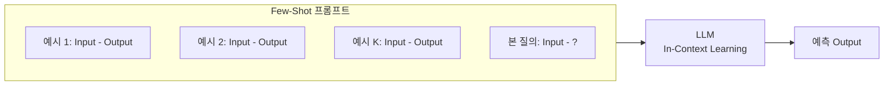
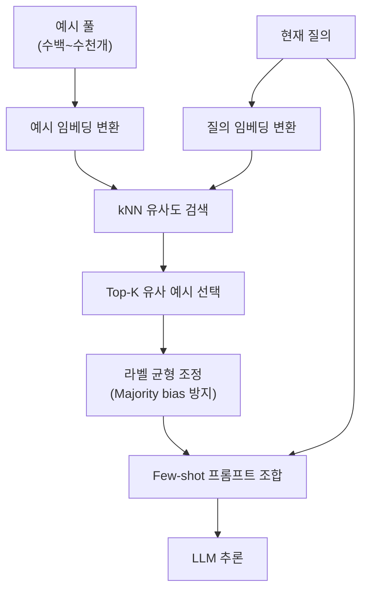

## 정의

**Few-shot prompting** 은 프롬프트 안에 **작업의 입력-출력 예시 K개 (보통 K = 2~16)** 를 함께 제공해 모델이 그 형식과 규칙을 유추해 새 입력에 답하도록 하는 기법입니다. 예시로부터의 학습이지만 **가중치 갱신이 없기 때문에 (no gradient update)** 이를 **in-context learning (ICL)** 이라 부릅니다.

Brown et al. (2020) 의 GPT-3 논문이 "규모가 커지면 파인튜닝 없이도 예시 몇 개만으로 태스크를 수행한다" 는 관찰을 대중화했습니다.

## 언제 쓰이나

- **엄격한 출력 형식 강제**: JSON 스키마, 특정 XML, 사내 보고서 양식
- **도메인 특화 어휘**: 의료, 법률, 사내 용어의 특수 컨벤션
- **비표준 분류 라벨**: 기존 상식과 다른 라벨 체계
- **zero-shot 오류가 반복될 때**: 예시가 지시문보다 훨씬 빠르게 문제를 해결
- **입력이 짧고 반복 패턴이 강한 태스크**: 구조적 예시의 효과가 극대화

## 기본 흐름



예시는 **가중치를 바꾸지 않는다**. 모델이 컨텍스트에서 패턴을 추출해 즉시 적용.

## 기본 구조

```
[선택] 시스템/지시문
[선택] 형식 스펙

[예시 1]
Input: ...
Output: ...

[예시 2]
Input: ...
Output: ...

...

[본 질의]
Input: {query}
Output:
```

Chat API 에서는 이를 **role-alternating messages** 로 옮기기도 합니다:

```json
[
  {"role": "system", "content": "감정을 positive/negative 로 분류"},
  {"role": "user", "content": "이 식당은 정말 좋았어요"},
  {"role": "assistant", "content": "positive"},
  {"role": "user", "content": "다시는 가고 싶지 않네요"},
  {"role": "assistant", "content": "negative"},
  {"role": "user", "content": "{query}"}
]
```

## K 값의 선택

| K | 특성 | 언제 |
|:---:|:---|:---|
| 0 | Zero-shot | 지시문이 명확하고 모델이 태스크를 잘 알 때 |
| 1 | One-shot | 형식만 맞추면 되는 단순 태스크 |
| 3-8 | 표준 few-shot | 대부분의 실전 태스크 |
| 16-32 | Many-shot | Complex reasoning, 다양한 클래스 커버 |
| 100+ | Many-shot (Gemini/Claude long context) | 컨텍스트 확장 후 등장한 실험적 영역 |

**Diminishing return** 이 K = 8 근처부터 관찰되는 경우가 많지만, Gemini 1.5 / Claude 3 이후의 초장문 컨텍스트에서는 K = 500 many-shot 이 여전히 유효하다는 결과 (Agarwal et al. 2024) 도 있습니다.

## 무엇이 성능을 결정하는가

Min et al. (2022) 의 "Rethinking the Role of Demonstrations" 이 반직관적 결과를 보였습니다.

- **라벨을 랜덤으로 섞어도** 정확도가 크게 안 떨어짐 (in-context 예시는 형식/도메인 시그널이 더 중요)
- 하지만 **입력 분포** 와 **라벨 분포** (어떤 클래스가 나올 수 있는지) 는 매우 중요
- **형식 (delimiter, template)** 이 라벨보다 더 중요할 때가 많음

즉 few-shot 예시가 하는 일은 **모델에게 "이 태스크의 표면 형식"** 을 상기시키는 것이지, 실제로 "라벨 규칙을 학습" 하는 것은 아닐 수 있습니다 (완전한 결론은 아니지만 강력한 경향성).

## 예시 선택 전략

Liu et al. (2021) 는 **kNN 유사도 기반 선택** 이 유리함을 보임. 프로덕션에서는:



- **RAG 스타일**: 질의를 임베딩 후 pool 에서 top-k 유사 예시 선택
- **Diverse selection**: 클러스터에서 골고루 뽑아 커버리지 확보
- **Hard example prioritization**: 어려운 케이스 (edge case) 를 예시로 포함

## 함정과 편향

### 1. Recency bias

마지막 예시의 라벨이 답에 강하게 영향. **다양한 클래스를 골고루 섞고 마지막에 특정 편향된 라벨을 두지 않도록** 주의.

### 2. Majority label bias

예시에 특정 클래스가 많으면 그쪽으로 편향. 균형된 분포로 샘플링.

### 3. Common token bias

빈도 높은 토큰 (예: "yes") 을 답으로 선호. **Calibrate Before Use** (Zhao et al., 2021) 는 이를 완화하는 후처리:

```
p_calibrated(y | x) = p(y | x) / p(y | "")
```

빈 입력에 대한 확률로 나누어 편향을 정규화.

### 4. Order sensitivity

Lu et al. (2022) 는 같은 예시라도 순서만 바꿔도 정확도가 큰 폭으로 흔들림을 보였습니다. **여러 순서로 앙상블** 하거나 **정보이론적 지표로 좋은 순서 선택** 을 시도.

### 5. Example selection

Liu et al. (2021) 는 **kNN 유사도 기반 선택** 이 유리함을 보임. 프로덕션에서는:

- **RAG 스타일**: 질의를 임베딩 -> pool 에서 top-k 유사 예시 선택
- **Diverse selection**: 클러스터에서 골고루 뽑아 커버리지 확보
- **Hard example prioritization**: 어려운 케이스 (edge case) 를 예시로 포함

## Chain-of-Thought 와 결합

Few-shot + [[chain-of-thought|CoT]] 는 CoT 원 논문의 정확한 방식. 예시 자체에 **추론 사슬** 을 포함:

```
Q: If John has 3 apples and gives 1 to Mary, how many left?
A: John started with 3. He gave away 1. 3 - 1 = 2. The answer is 2.

Q: {question}
A:
```

## 실전 예시

### Python 으로 few-shot 분류 (OpenAI)

```python
from openai import OpenAI

client = OpenAI()

def few_shot_classify(text: str, examples: list[dict]) -> str:
    """
    examples: [{"input": "...", "output": "positive/negative"}]
    """
    messages = [
        {"role": "system", "content": "고객 리뷰를 positive 또는 negative 로 분류합니다."}
    ]

    # few-shot 예시를 role-alternating 으로 추가
    for ex in examples:
        messages.append({"role": "user", "content": ex["input"]})
        messages.append({"role": "assistant", "content": ex["output"]})

    # 본 질의
    messages.append({"role": "user", "content": text})

    response = client.chat.completions.create(
        model="gpt-4o-mini",
        messages=messages,
        temperature=0.0,
    )
    return response.choices[0].message.content.strip()

examples = [
    {"input": "정말 만족스럽습니다!", "output": "positive"},
    {"input": "다시는 구매 안 합니다.", "output": "negative"},
    {"input": "무난하고 가성비 좋네요.", "output": "positive"},
    {"input": "포장이 너무 엉망이었어요.", "output": "negative"},
]

result = few_shot_classify("배송이 생각보다 늦었지만 제품은 좋아요.", examples)
print(result)  # "positive"
```

### JSON 스키마 강제 추출

```python
SYSTEM = "다음 양식에 맞게 JSON 만 출력하시오. 추가 텍스트 없이."
EXAMPLES = [
    {
        "input": "홍길동, 010-1234-5678, hong@example.com",
        "output": '{"name":"홍길동","phone":"010-1234-5678","email":"hong@example.com"}',
    },
    {
        "input": "김철수, 010-9999-0000, chul@corp.co.kr",
        "output": '{"name":"김철수","phone":"010-9999-0000","email":"chul@corp.co.kr"}',
    },
]

messages = [{"role": "system", "content": SYSTEM}]
for ex in EXAMPLES:
    messages += [
        {"role": "user", "content": ex["input"]},
        {"role": "assistant", "content": ex["output"]},
    ]
messages.append({"role": "user", "content": "이영희, 010-7777-8888, lee@startup.io"})
```

## Instruction-tuned 모델에서의 위상 변화

GPT-4, Claude, Gemini 등 instruction-tuned 계열은 **zero-shot 성능이 이미 높아** 대부분 태스크에서 few-shot 이득이 작아졌습니다. Few-shot 이 여전히 강한 곳은:

- **엄격한 출력 형식** (예: 특정 JSON 스키마)
- **도메인 특화 어휘** (의료, 법률의 특정 용어 컨벤션)
- **분류 태스크의 라벨 세트가 이상함** (기존 상식과 다른 라벨링)
- **입력이 짧고 반복 패턴이 강함**

## 실전 팁

- **가장 정보량 높은 예시** 를 선택 (경계 케이스, 오답이 자주 나오는 케이스).
- **예시 순서 다양화 후 앙상블** (n=3~5 순서).
- **라벨 균형 유지**: K=8 이면 각 라벨이 최대 2-3개.
- **명시적 구분자** (`###`, `---`, `Q:/A:`) 로 예시 경계를 확실히.
- **형식만 배우는 것 같으면** temperature 를 낮추고 (0-0.2) 결정적 출력.
- **비용 관리**: K 를 늘리면 입력 토큰이 선형 증가. K=8 → K=32 는 API 요금 4배.

## 함정

> [!WARNING]
> **Recency / Majority bias 로 인해 예상과 다른 라벨을 선호합니다.** 마지막 예시나 빈번한 라벨로 치우치는 경향이 있습니다. 예시 순서를 무작위로 섞거나 여러 순서의 앙상블을 고려하세요.

> [!CAUTION]
> **비용이 선형으로 증가합니다.** K = 16 예시를 모든 요청에 붙이면 입력 토큰이 크게 늘어납니다. RAG 스타일 동적 선택으로 관련 예시만 붙이는 방식이 비용 효율적입니다.

> [!IMPORTANT]
> **예시 품질이 결과 품질을 결정합니다.** 잘못된 예시 하나가 전체 성능을 끌어내릴 수 있습니다. 예시 pool 은 사람이 검증한 고품질 샘플로 구성하세요.

## 관련 위키

- [[zero-shot-prompting|Zero-Shot Prompting]] - K=0, 지시문만
- [[one-shot-prompting|One-Shot Prompting]] - K=1, 형식 정렬
- [[chain-of-thought|Chain-of-Thought]] - 예시에 추론 사슬 포함
- [[llm-rag|LLM RAG]] - 예시를 벡터 유사도로 검색
- [[function-calling|Function Calling]] - 함수 스키마를 few-shot 대체로
- [[transfer-learning|Transfer Learning]] - 파인튜닝의 대안으로서 ICL
- [[helm-llm-benchmark|HELM]] - few-shot 평가 표준화 벤치마크
- [[big-bench|BIG-Bench]] - few-shot 성능 다양성 테스트
