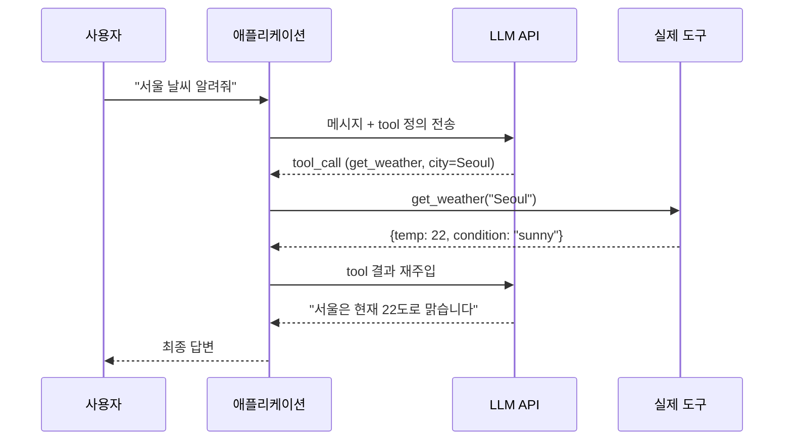
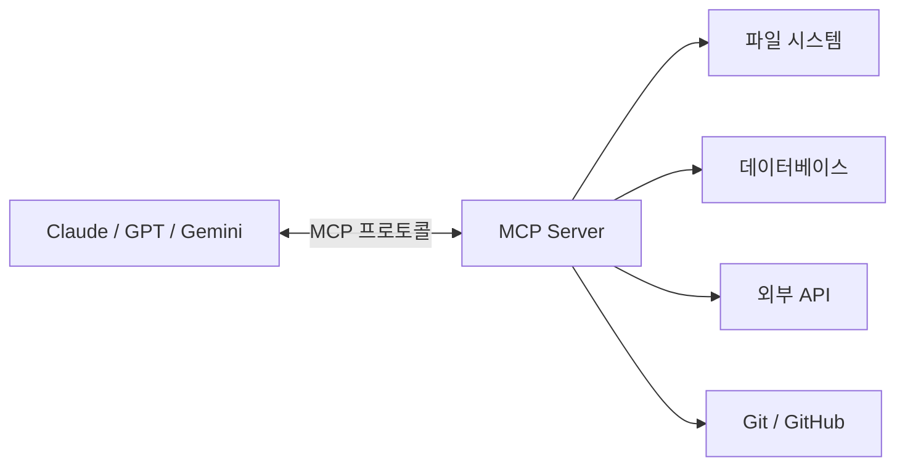
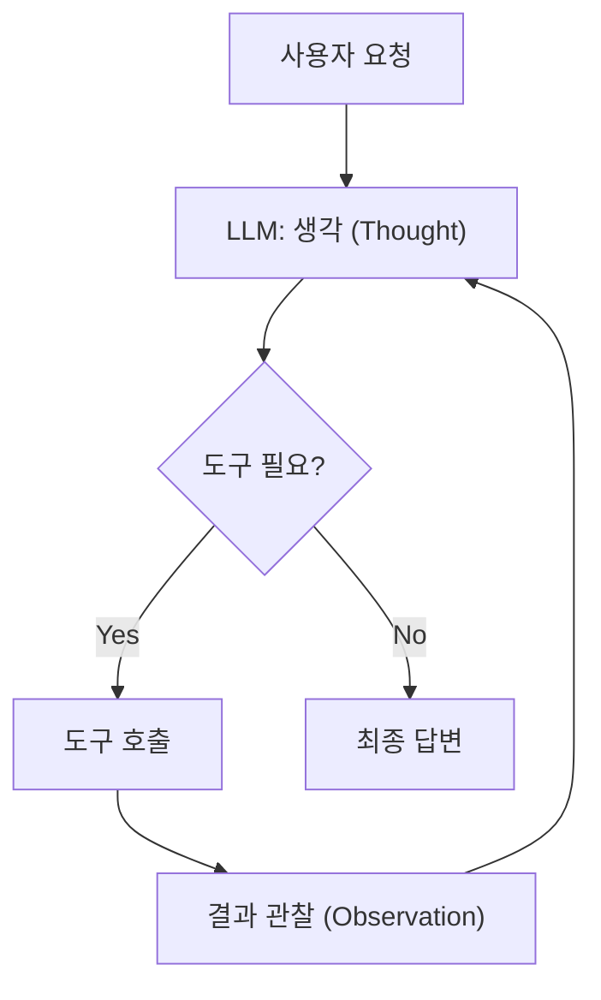

## 정의

**Function Calling** (또는 **Tool Use**) 은 LLM 이 사전 정의된 함수/도구를 **호출하기 위한 인자를 JSON 으로 생성** 하는 기능. JSON Schema 로 함수 시그니처를 알려주면, LLM 이 사용자 질의에 맞는 함수와 인자를 선택해 반환한다.

실제 함수 실행은 LLM 이 아닌 **애플리케이션 코드**가 담당. LLM 은 오직 "어떤 함수를, 어떤 인자로 호출할지" 만 결정한다.

## 언제 쓰이나

- 외부 API 연동 (날씨, 주식, 검색)
- 데이터베이스 쿼리 자동화
- LLM 이 직접 수행 불가능한 작업 (계산, 코드 실행, 파일 읽기)
- [[agent-patterns|AI 에이전트]] 구현 (ReAct, Plan-and-Execute)
- 구조화된 데이터 추출

## 전체 흐름



## JSON Schema 로 도구 정의

### OpenAI 형식

```json
{
  "type": "function",
  "function": {
    "name": "get_weather",
    "description": "특정 도시의 현재 날씨 조회. 도시명은 영어로.",
    "parameters": {
      "type": "object",
      "properties": {
        "city": {
          "type": "string",
          "description": "도시 이름 (예: Seoul, Tokyo)"
        },
        "unit": {
          "type": "string",
          "enum": ["C", "F"],
          "description": "온도 단위",
          "default": "C"
        }
      },
      "required": ["city"],
      "additionalProperties": false
    },
    "strict": true
  }
}
```

### Anthropic (Claude) 형식

```json
{
  "name": "get_weather",
  "description": "특정 도시의 현재 날씨 조회",
  "input_schema": {
    "type": "object",
    "properties": {
      "city": { "type": "string" },
      "unit": { "type": "string", "enum": ["C", "F"] }
    },
    "required": ["city"]
  }
}
```

> [!TIP]
> `description` 이 가장 중요하다. LLM 은 description 을 읽고 어떤 도구를 언제 호출할지 결정. 명확하고 구체적인 설명이 할루시네이션을 줄인다.

## OpenAI vs Anthropic vs Gemini 비교

| 항목 | OpenAI | Anthropic Claude | Google Gemini |
|:---|:---|:---|:---|
| 필드명 | `tools`, `function` | `tools`, `input_schema` | `tools`, `function_declarations` |
| 결과 전달 | `tool_call_id` + `role: tool` | `tool_use_id` + `role: user` | `function_response` |
| 병렬 호출 | `tool_calls[]` (배열) | 응답에 여러 `tool_use` | `function_calls[]` |
| strict mode | `"strict": true` (JSON 강제) | 없음 | 없음 |
| 멀티턴 | `tool_call_id` 로 매칭 | `tool_use_id` 로 매칭 | `id` 로 매칭 |

## 실전 코드

### OpenAI Python SDK

```python
from openai import OpenAI
import json

client = OpenAI()

tools = [
    {
        "type": "function",
        "function": {
            "name": "get_weather",
            "description": "현재 날씨 조회",
            "parameters": {
                "type": "object",
                "properties": {
                    "city": {"type": "string"},
                    "unit": {"type": "string", "enum": ["C", "F"]}
                },
                "required": ["city"]
            }
        }
    }
]

def get_weather(city: str, unit: str = "C") -> dict:
    # 실제 날씨 API 호출
    return {"temp": 22, "condition": "sunny", "city": city}

# 1단계: LLM 호출
response = client.chat.completions.create(
    model="gpt-4o",
    messages=[{"role": "user", "content": "서울 날씨 알려줘"}],
    tools=tools,
    tool_choice="auto"
)

message = response.choices[0].message

# 2단계: tool_calls 처리
if message.tool_calls:
    messages = [
        {"role": "user", "content": "서울 날씨 알려줘"},
        message,  # assistant 의 tool_call 메시지
    ]

    for tc in message.tool_calls:
        args = json.loads(tc.function.arguments)
        result = get_weather(**args)
        messages.append({
            "role": "tool",
            "tool_call_id": tc.id,
            "content": json.dumps(result, ensure_ascii=False)
        })

    # 3단계: 결과 재주입 후 최종 답변
    final = client.chat.completions.create(
        model="gpt-4o",
        messages=messages
    )
    print(final.choices[0].message.content)
```

### Anthropic Python SDK

```python
import anthropic
import json

client = anthropic.Anthropic()

tools = [
    {
        "name": "get_weather",
        "description": "현재 날씨 조회",
        "input_schema": {
            "type": "object",
            "properties": {
                "city": {"type": "string"},
            },
            "required": ["city"]
        }
    }
]

response = client.messages.create(
    model="claude-opus-4-5",
    max_tokens=1024,
    tools=tools,
    messages=[{"role": "user", "content": "서울 날씨 알려줘"}]
)

# stop_reason == "tool_use" 인 경우 처리
if response.stop_reason == "tool_use":
    tool_use = next(b for b in response.content if b.type == "tool_use")
    result = get_weather(**tool_use.input)

    final = client.messages.create(
        model="claude-opus-4-5",
        max_tokens=1024,
        tools=tools,
        messages=[
            {"role": "user", "content": "서울 날씨 알려줘"},
            {"role": "assistant", "content": response.content},
            {
                "role": "user",
                "content": [{
                    "type": "tool_result",
                    "tool_use_id": tool_use.id,
                    "content": json.dumps(result, ensure_ascii=False)
                }]
            }
        ]
    )
```

## 병렬 Tool Call

LLM 이 여러 도구를 동시에 호출해야 할 때 배열로 반환:

```json
{
  "tool_calls": [
    {"id": "call_1", "function": {"name": "get_weather", "arguments": "{\"city\": \"Seoul\"}"}},
    {"id": "call_2", "function": {"name": "get_weather", "arguments": "{\"city\": \"Tokyo\"}"}},
    {"id": "call_3", "function": {"name": "get_stock",  "arguments": "{\"symbol\": \"AAPL\"}"}}
  ]
}
```

병렬로 실행 후 결과를 한꺼번에 재주입:

```python
import asyncio

async def handle_parallel_tools(tool_calls):
    tasks = []
    for tc in tool_calls:
        args = json.loads(tc.function.arguments)
        if tc.function.name == "get_weather":
            tasks.append(get_weather_async(**args))
        elif tc.function.name == "get_stock":
            tasks.append(get_stock_async(**args))
    return await asyncio.gather(*tasks)
```

## MCP (Model Context Protocol)

Anthropic 이 2024년 발표한 **표준화 프로토콜**. Function calling 의 생태계 문제(각 공급사마다 다른 형식)를 해결.



MCP 의 특징:
- **표준 클라이언트-서버**: LLM 이 MCP client, 도구 공급자가 MCP server
- **stdio / HTTP 전송**: 로컬 프로세스 또는 원격 서버
- **세 가지 원시(primitive)**: `tools` (함수), `resources` (파일/데이터), `prompts` (프롬프트 템플릿)
- **인증**: OAuth 2.0 지원

### MCP 서버 예시 (Python)

```python
from mcp.server import Server
from mcp.server.stdio import stdio_server
from mcp import types

server = Server("weather-server")

@server.list_tools()
async def list_tools() -> list[types.Tool]:
    return [
        types.Tool(
            name="get_weather",
            description="현재 날씨 조회",
            inputSchema={
                "type": "object",
                "properties": {"city": {"type": "string"}},
                "required": ["city"]
            }
        )
    ]

@server.call_tool()
async def call_tool(name: str, arguments: dict) -> list[types.Content]:
    if name == "get_weather":
        city = arguments["city"]
        weather = await fetch_weather(city)  # 실제 API
        return [types.TextContent(type="text", text=str(weather))]

async def main():
    async with stdio_server() as (read, write):
        await server.run(read, write, server.create_initialization_options())
```

## Agent 루프 패턴

Function Calling 을 반복 사용하는 [[agent-patterns|에이전트 패턴]]:



이 패턴이 **ReAct (Reasoning + Acting)**. LangChain, LlamaIndex, Claude Code 등이 내부적으로 사용.

## JSON Schema 베스트 프랙티스

```json
{
  "name": "search_products",
  "description": "상품 검색. 반드시 카테고리를 지정해야 정확한 결과 반환.",
  "parameters": {
    "type": "object",
    "properties": {
      "query": {
        "type": "string",
        "description": "검색어 (한국어 가능)"
      },
      "category": {
        "type": "string",
        "enum": ["electronics", "clothing", "food", "books"],
        "description": "상품 카테고리. 모르면 'electronics' 기본값 사용."
      },
      "max_price": {
        "type": "number",
        "description": "최대 가격 (원화). 제한 없으면 null."
      },
      "page": {
        "type": "integer",
        "minimum": 1,
        "default": 1
      }
    },
    "required": ["query", "category"]
  }
}
```

주요 원칙:
- **description 이 핵심**: LLM 은 description 으로 판단. 누락 시 오호출 급증
- **enum 활용**: 자유 텍스트 대신 enum 으로 범위 제한
- **required 최소화**: 선택 필드는 LLM 이 생략 가능 (default 활용)
- **additionalProperties: false**: 정의 안 된 필드 차단 (strict mode)

## 흔한 함정

> [!WARNING]
> 1. **오호출 (Hallucinated call)**: LLM 이 없는 함수 호출 시도. 반드시 `name` 검증 후 실행.
> 2. **인자 할루시네이션**: 필수 필드 누락, enum 외 값 반환. JSON Schema 검증 레이어 필수 (`jsonschema` 라이브러리).
> 3. **무한 루프**: 도구 결과 → 다음 도구 호출 반복. 최대 반복 횟수 제한 설정.
> 4. **도구 스펙이 너무 큼**: 도구 정의만으로 수천 토큰 소비. 도구 수 최소화 (7-10개 이하 권장).
> 5. **결과 미검증**: 도구가 반환한 데이터를 그대로 LLM 에 재주입. XSS/injection 위험. 결과 sanitize 필수.
> 6. **tool_choice="required" 오남용**: LLM 이 항상 도구를 호출하도록 강제 → 필요 없는 상황에서도 호출.

## 관련 위키

- [[agent-patterns]] - Function Calling 을 활용한 에이전트 패턴
- [[llm-rag]] - RAG 에서의 검색 도구 활용
- [[llm-serving-vllm]] - vLLM 에서의 function calling 서빙
- [[chain-of-thought]] - LLM 추론 능력 향상 (도구 선택 품질에 영향)
- [[few-shot-prompting]] - few-shot 으로 도구 사용 패턴 학습
