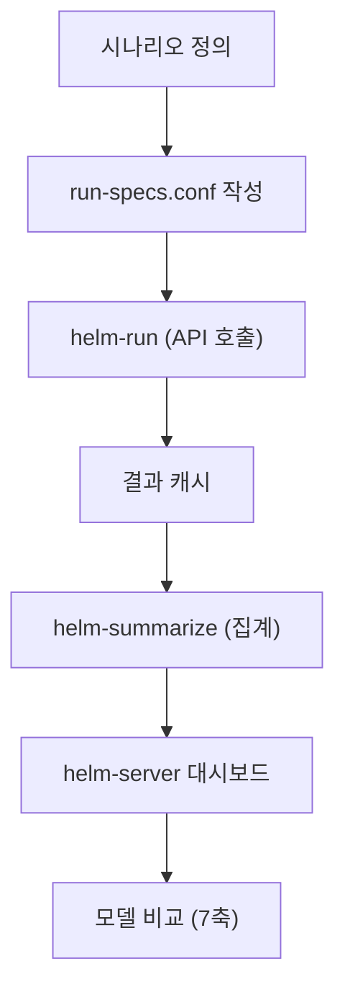

## 정의

**HELM (Holistic Evaluation of Language Models)** 는 Stanford CRFM (Center for Research on Foundation Models) 이 2022년 발표한 LLM 종합 평가 프레임워크입니다. 기존 벤치마크가 정확도 단일 지표에 편중되는 문제를 지적하며, **여러 시나리오 × 여러 메트릭의 행렬** 로 모델을 평가하는 것을 특징으로 합니다.

원 논문 제목이 곧 방법론입니다. Holistic (전체적): 정확도만이 아니라 공정성, 편향, 견고성, 효율성까지 함께 보겠다는 선언.

## 왜 등장했는가

2022 년 시점 LLM 평가의 문제:

- **단일 태스크 평가** (MMLU, HellaSwag 등) 는 특정 능력만 봄
- **정확도 지표만 리포트** (calibration, robustness, bias 등은 무시)
- **모델 비교가 임의적** (논문마다 다른 태스크 조합, 다른 세팅)
- **재현성 부족** (프롬프트, 파라미터, few-shot 개수가 논문마다 다름)

HELM 은 이를 **표준화된 시나리오 세트 + 표준화된 메트릭 세트 + 표준화된 프롬프트/실행 방식** 으로 해결하려 했습니다.

## 7 가지 핵심 메트릭 축

원 논문의 7 축입니다. 각 시나리오에 대해 이 7 가지를 모두 측정하려 시도합니다.

| 축 | 의미 | 예시 |
|:---|:---|:---|
| **Accuracy** | 정답 맞추는 능력 | 정확도, F1, exact match |
| **Calibration** | 확신도 vs 실제 정확도 일치 | ECE (Expected Calibration Error) |
| **Robustness** | 입력 변형에도 안정적인가 | Typo, paraphrase, adversarial 변형 아래 성능 |
| **Fairness** | 인구통계 집단별 성능 균등한가 | 이름/방언에 따른 성능 편차 |
| **Bias** | 스테레오타입 재생산 여부 | 성별/인종 등에 대한 연관성 통계 |
| **Toxicity** | 유해 텍스트 생성 여부 | Perspective API 등으로 측정 |
| **Efficiency** | 추론 비용, 학습 비용 | 초당 토큰, 학습에 든 FLOPs |

이 7 가지는 **완전한 목록이 아니라 출발점** 이라고 논문 스스로 명시했습니다. 이후 버전에서 확장되었습니다.

## 시나리오 (Scenario)

HELM 이 커버하는 태스크 유형입니다. 각 시나리오는 데이터셋 + 태스크 정의 + 평가 방식으로 구성됩니다. 초기 버전 42 개 시나리오를 대략 6 개 카테고리로 나눌 수 있습니다.

- **Question Answering**: NaturalQuestions, NarrativeQA, TruthfulQA, QuAC 등
- **Information Retrieval**: MS MARCO 등
- **Summarization**: CNN/DailyMail, XSum
- **Sentiment Analysis / Classification**: IMDB, RAFT
- **Toxicity Detection**: CivilComments
- **Reasoning**: MMLU, GSM8K, MATH, BBQ (bias)

이후 버전에서 코드 (HumanEval, MBPP), 롱-컨텍스트 (LongBench 계열), 멀티모달 등이 추가되었습니다.

## HELM Variants (2023~)

원 HELM (이하 **HELM Classic**) 은 모든 시나리오 × 모든 메트릭을 시도했기 때문에 **매우 비쌉니다** (수천~수만 달러 규모의 API 비용). 이를 축소한 파생 버전들이 나왔습니다.

### HELM Lite (2023 말~)

- 실전에서 자주 쓰이는 시나리오만 **10 개 내외** 로 축소
- MMLU (multiple-choice), GSM8K, MATH, NaturalQuestions, WMT, LegalBench 등
- 하루~며칠 단위로 리더보드 업데이트
- 빠른 반복 평가에 적합
- [https://crfm.stanford.edu/helm/lite/](https://crfm.stanford.edu/helm/lite/)

### HELM Instruct

- **지시 따르기 (instruction following)** 평가에 초점
- Open-ended generation 을 사람 또는 LLM-as-judge 로 평가
- MT-Bench, AlpacaEval 등과 유사한 접근
- [https://crfm.stanford.edu/helm/instruct/](https://crfm.stanford.edu/helm/instruct/)

### HELM Safety

- 안전성 (harmful content, jailbreak 저항성) 중심
- 유해 요청에 대한 거부, jailbreak 프롬프트 아래 견고성 등

### 도메인 특화 HELM

- **MedHELM**: 의료 도메인 (2024)
- **LegalBench** 통합
- **AIR-Bench**: 리스크 카테고리별

리더보드는 [https://crfm.stanford.edu/helm/](https://crfm.stanford.edu/helm/) 최상단에서 여러 트랙을 선택할 수 있습니다.

## 시나리오 × 메트릭 매트릭스

핵심 아이디어를 도식으로 표현하면:

|  | MMLU | HellaSwag | TruthfulQA | HumanEval | ... |
|:---|:---:|:---:|:---:|:---:|:---:|
| **Accuracy** | ✓ | ✓ | ✓ | pass@1 | ... |
| **Calibration** | ✓ | ✓ | ✓ | - | ... |
| **Robustness** | ✓ (typo) | ✓ | ✓ | ✓ | ... |
| **Fairness** | ✓ (이름 치환) | - | - | - | ... |
| **Bias** | - | - | ✓ (BBQ) | - | ... |
| **Toxicity** | - | - | - | - | ... |
| **Efficiency** | tok/s, FLOPs | ... | ... | ... | ... |

모든 셀이 다 채워지진 않습니다 (해당 메트릭이 그 시나리오에 적용 불가한 경우 존재). HELM 은 **어떤 셀이 비어 있는지도 명시적으로 보여주어** 평가의 불완전성을 드러냅니다.

## 리더보드 (2026 기준)

[https://crfm.stanford.edu/helm/lite/](https://crfm.stanford.edu/helm/lite/) 최신 리더보드에서 확인 가능합니다. 상위권에는 GPT-5, Claude Opus 4, Gemini 2.5 계열 등이 위치하며, 오픈 웨이트 (Llama, Qwen, DeepSeek) 도 근접해 있습니다. 정확한 순위는 시점마다 바뀌므로 링크 참조가 정답입니다.

## 실행 방법 (helm-run)

```bash
pip install crfm-helm

# 실행할 conf 파일 정의
cat > run-specs.conf << EOF
[
  {description: "mmlu:subject=philosophy,model=openai/gpt-4o", priority: 1},
  {description: "narrativeqa:model=openai/gpt-4o", priority: 1},
]
EOF

# 실행
helm-run \
  --conf-paths run-specs.conf \
  --suite my-eval \
  --max-eval-instances 100 \
  --num-threads 4

# 결과 요약 통합
helm-summarize --suite my-eval

# 웹 UI 로 결과 확인
helm-server --suite my-eval
# http://localhost:8000
```

지원 모델 provider: **OpenAI, Anthropic, Google, Meta, Microsoft, Cohere, HuggingFace Hub, vLLM, Together, DeepSeek, Mistral** 등. 자체 서빙 모델도 `LocalModel` 로 붙일 수 있습니다.

## 다른 벤치마크와 비교

| 벤치마크 | 초점 | 장점 | 단점 |
|:---|:---|:---|:---|
| **HELM** | Holistic (다면적) | 여러 축 동시 측정, 표준화 | 실행 비용 큼 |
| **MMLU / MMLU-Pro** | 지식 QA | 간단, 널리 인용됨 | 단일 정답 편중, 오염 우려 |
| **BIG-Bench** | 다양성 극대화 | 200+ 태스크 | 태스크 품질 편차 큼 |
| **Chatbot Arena** | 사람 선호도 | 실사용자 판단, 편향 적음 | 태스크 세분화 없음, 오랜 축적 필요 |
| **AlpacaEval** | Instruction following | LLM-as-judge 로 빠름 | Judge 편향 |
| **MT-Bench** | 대화 품질 | 짧고 실용적 | 소규모 (80 문항) |
| **LM Eval Harness** | 프레임워크 | EleutherAI, 매우 널리 쓰임 | 표준 축이 아니라 도구 |
| **AGIEval** | 인간 시험 (SAT, LSAT) | 실제 인간 기준 | 지역/언어 편중 |

**HELM 은 벤치마크 그 자체이자 프레임워크**입니다. 다른 벤치마크의 결과를 HELM 구조 안에서 재실행할 수 있게 통합해 왔습니다.

## 한계와 비판

- **오염 (contamination)**: MMLU 등 공개 벤치마크가 학습 데이터에 유출되어 점수가 부풀려질 수 있습니다. HELM 자체는 이를 감지하지 못합니다.
- **비용**: 원 HELM Classic 은 GPT-4 급 모델을 완전 실행하려면 수만 달러가 필요합니다.
- **7 축의 임의성**: 안전성/agentic 능력/멀티모달은 원 논문에 없었고 이후 추가되었지만 여전히 커버리지 논쟁.
- **단일 시드 실행**: 확률적 생성이므로 결과가 흔들리며, 여러 시드로 여러 번 실행하는 것이 이상적이지만 비용 문제로 어려움.
- **자동 평가의 한계**: LLM-as-judge 는 편향 (자기 편애, 길이 선호) 이 알려져 있습니다.

## 평가 파이프라인



## 시나리오별 추천 벤치마크

목적에 따라 집중할 시나리오가 다름.

| 목적 | 추천 시나리오 | 이유 |
|:---|:---|:---|
| 지식 QA / 상식 | MMLU, TruthfulQA | 광범위한 도메인 지식 |
| 수학 / 추론 | GSM8K, MATH | 다단계 논리 추론 |
| 코드 생성 | HumanEval, MBPP | 실행 가능 코드 |
| 긴 문맥 처리 | LongBench, SCROLLS | 컨텍스트 창 활용 |
| 안전성 | ToxiGen, BBQ | 편향, 독성 |
| 지시 따르기 | MT-Bench, AlpacaEval | 대화형 assistant 품질 |
| 의료 | MedQA, MedHELM | 임상 추론 |
| 법률 | LegalBench | 법률 문서 이해 |

## HELM 결과 해석

### 단일 점수 vs 프로파일

HELM 은 *단일 평균 순위보다 시나리오별 프로파일*을 중시. 모델 A 가 MMLU 에서 높아도 TruthfulQA 에서 낮으면 실사용 신뢰성에 문제가 됨.

### 신뢰 구간

단일 시드 실행 특성상 결과에 통계적 불확실성이 존재. 1-2% 차이는 의미 없을 수 있음. Elo 기반 Chatbot Arena 는 더 많은 샘플에서 통계적 신뢰도 제공.

### 오염 탐지 방법

```python
# n-gram overlap 기반 간이 탐지 (13-gram 기준)
from nltk.util import ngrams as make_ngrams

def ngram_overlap(train_text: str, test_text: str, n: int = 13) -> float:
    train_set = set(make_ngrams(train_text.split(), n))
    test_set = set(make_ngrams(test_text.split(), n))
    if not test_set:
        return 0.0
    return len(train_set & test_set) / len(test_set)

# 5% 이상이면 오염 의심
```

> 대규모 스캔에는 Min-Hash 또는 Bloom filter 활용. HELM 자체는 오염 탐지 기능 없음.

## 참고

- 관련 [[transfer-learning|Transfer Learning]] 은 HELM 이 평가하는 파운데이션 모델의 근본 기법입니다
- 관련 [[classification-metrics|분류 모델 지표]] 는 accuracy 축 세부 지표
- 관련 [[sagemaker-model-monitor|SageMaker Model Monitor]] 는 프로덕션 모니터링, HELM 은 모델 선정 단계
- 리더보드: [https://crfm.stanford.edu/helm/](https://crfm.stanford.edu/helm/)
- Paper: [Liang et al. 2022, HELM](https://arxiv.org/abs/2211.09110)
- GitHub: [https://github.com/stanford-crfm/helm](https://github.com/stanford-crfm/helm)
- 관련 커뮤니티: [Open LLM Leaderboard](https://huggingface.co/spaces/HuggingFaceH4/open_llm_leaderboard), [LM Eval Harness](https://github.com/EleutherAI/lm-evaluation-harness), [Chatbot Arena](https://chat.lmsys.org/)
