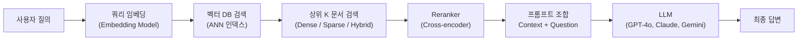
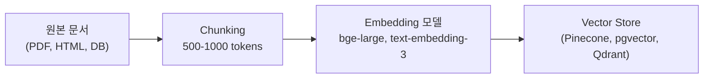
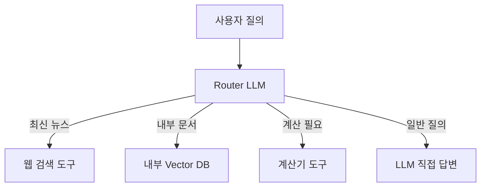

## 정의

**RAG (Retrieval-Augmented Generation)** 는 LLM 생성 전에 **외부 지식 베이스에서 관련 문서를 검색** 하여 프롬프트에 삽입하는 패턴. 최신 정보, 도메인 지식, 사설 데이터 접근이 필요할 때 사용한다.

LLM 파인튜닝 대신 검색으로 외부 지식을 주입하므로 **추가 학습 비용 없이** 최신 정보를 반영할 수 있다.

## 왜 필요한가

- **최신 정보**: LLM 학습 컷오프 이후 지식 (뉴스, 법령 개정 등)
- **도메인 데이터**: 회사 내부 문서, 개인 지식 베이스
- **hallucination 감소**: 검색된 "출처" 를 명시해 사실성 검증 가능
- **비용 절감**: 파인튜닝 대비 데이터 갱신이 쉬움 (벡터 DB 업서트만 하면 됨)

## 파이프라인 전체 흐름



### 인덱싱 파이프라인 (오프라인)



## 핵심 구성 요소

### 1. 문서 Chunking 전략

문서를 청크 단위로 분할. 청크 크기와 전략이 검색 품질에 직결된다.

| 전략 | 크기 | 장점 | 단점 |
|:---|:---:|:---|:---|
| 고정 크기 | 500 tokens | 단순 | 문맥 경계에서 끊김 |
| 슬라이딩 윈도우 | 500 + 50 overlap | 문맥 손실 최소화 | 중복 저장 |
| 문단/섹션 기반 | 가변 | 의미 단위 유지 | 크기 불균일 |
| 계층적 chunking | 문단 + 섹션 | 요약 + 상세 동시 | 복잡한 인덱싱 |

```python
from langchain.text_splitter import RecursiveCharacterTextSplitter

splitter = RecursiveCharacterTextSplitter(
    chunk_size=500,
    chunk_overlap=50,
    separators=["\n\n", "\n", ".", " ", ""],
)
chunks = splitter.split_text(document)
```

### 2. Embedding 모델

각 청크를 고밀도 벡터 (dense vector) 로 변환. 의미적으로 유사한 텍스트는 벡터 공간에서 가깝게 위치한다.

| 모델 | 차원 | 언어 | 특징 |
|:---|:---:|:---|:---|
| `text-embedding-3-small` | 1536 | 다국어 | OpenAI, 저비용 |
| `text-embedding-3-large` | 3072 | 다국어 | OpenAI, 고성능 |
| `bge-large-en-v1.5` | 1024 | 영어 | 오픈소스, MTEB 상위 |
| `bge-m3` | 1024 | 다국어 | 오픈소스, 한국어 우수 |
| `nomic-embed-text` | 768 | 영어 | 오픈소스, 로컬 실행 가능 |

```python
from openai import OpenAI

client = OpenAI()

def embed(text: str) -> list[float]:
    response = client.embeddings.create(
        model="text-embedding-3-small",
        input=text,
    )
    return response.data[0].embedding
```

### 3. Vector Store

임베딩 벡터를 저장하고 ANN (Approximate Nearest Neighbor) 검색을 제공하는 데이터베이스.

| 솔루션 | 유형 | 특징 |
|:---|:---|:---|
| **Pinecone** | 관리형 | 완전 관리, 서버리스 플랜 |
| **Qdrant** | 오픈소스 | Rust, 고성능, 페이로드 필터 |
| **Weaviate** | 오픈소스 | 멀티벡터, GraphQL |
| **Milvus** | 오픈소스 | 대규모, CNCF 프로젝트 |
| **pgvector** | PostgreSQL 확장 | 기존 PG 통합, HNSW 지원 |
| **[[redis-vector-search|Redis Vector Search]]** | Redis 모듈 | 인메모리, 저지연 |

```python
# pgvector 예시
import psycopg2
from pgvector.psycopg2 import register_vector

conn = psycopg2.connect("postgresql://...")
register_vector(conn)

cursor = conn.cursor()
cursor.execute("""
    SELECT content, embedding <=> %s AS distance
    FROM documents
    ORDER BY distance
    LIMIT 5
""", (query_embedding,))
results = cursor.fetchall()
```

### 4. Retrieval 방법

| 방법 | 설명 | 장점 |
|:---|:---|:---|
| **Dense (벡터)** | 코사인 유사도, HNSW | 의미적 유사성 |
| **Sparse (BM25)** | 단어 빈도 기반 | 정확한 키워드 매칭 |
| **Hybrid** | Dense + Sparse 결합 (RRF) | 양쪽 장점 |
| **Reranker** | Cross-encoder 재순위 | 정확도 향상 |

**RRF (Reciprocal Rank Fusion)**: Dense 와 Sparse 검색 결과 순위를 합산해 최종 순위 산출. 별도 학습 없이 Hybrid 효과.

### 5. Reranker

Dense 검색으로 상위 20-50개를 뽑은 뒤, Cross-encoder 모델로 질의-문서 쌍을 직접 스코어링해 재순위한다.

- `cross-encoder/ms-marco-MiniLM-L-12-v2` (오픈소스)
- Cohere Rerank API (관리형)

```python
from sentence_transformers import CrossEncoder

reranker = CrossEncoder("cross-encoder/ms-marco-MiniLM-L-12-v2")

pairs = [(query, doc) for doc in candidate_docs]
scores = reranker.predict(pairs)
ranked_docs = [doc for _, doc in sorted(zip(scores, candidate_docs), reverse=True)]
top_k = ranked_docs[:5]
```

### 6. Prompt Composition

검색된 문서를 LLM 프롬프트에 조합.

```
You are a helpful assistant. Answer the question based ONLY on the provided context.
If the answer is not in the context, say "I don't know."

Context:
[Document 1]: {chunk_1}
[Document 2]: {chunk_2}
[Document 3]: {chunk_3}

Question: {user_query}
Answer:
```

## 고급 RAG 패턴

### HyDE (Hypothetical Document Embeddings)

질의를 임베딩하는 대신, LLM 이 "가상의 답변" 을 먼저 생성한 뒤 그 답변을 임베딩해 검색. 질의와 문서 간 임베딩 공간 불일치 문제를 완화한다.

```python
hypothesis = llm.generate(f"Write a hypothetical answer to: {query}")
hypothesis_embedding = embed(hypothesis)
results = vector_store.search(hypothesis_embedding, k=5)
```

### Multi-Query Rewriting

질의를 여러 관점으로 재작성해 다수의 검색 결과를 합산.

```python
queries = llm.generate(f"Rewrite the following query from 3 different perspectives:\n{query}")
all_results = [vector_store.search(q) for q in queries]
# RRF 로 합산
```

### Query Routing

질의 종류에 따라 다른 인덱스나 도구로 라우팅.



## 평가 지표

| 지표 | 측정 대상 |
|:---|:---|
| **Recall@K** | K 개 검색 결과에 정답 포함 비율 |
| **MRR** | Mean Reciprocal Rank, 정답 순위 |
| **Faithfulness** | 답변이 컨텍스트에 근거한 정도 |
| **Answer Relevance** | 답변이 질의에 적절한 정도 |
| **Context Precision** | 검색된 문서 중 관련 비율 |

```python
from ragas import evaluate
from ragas.metrics import faithfulness, answer_relevancy, context_recall

result = evaluate(
    dataset=test_dataset,
    metrics=[faithfulness, answer_relevancy, context_recall],
)
print(result)
```

## 함정

> [!WARNING]
> **청크 경계에서 문맥이 잘린다.** 고정 크기 chunking 은 문장 중간이나 표 안에서 잘릴 수 있다. 슬라이딩 윈도우 (overlap) 나 문단 기반 chunking 으로 보완해야 한다.

> [!CAUTION]
> **Reranker 후보군이 부족하면 역효과.** Dense 검색 1차 후보를 top-5 만 뽑으면, 실제 정답이 애초에 후보에 없을 수 있다. 1차 검색은 top-20 이상, Reranker 로 top-5 압축하는 패턴이 일반적이다.

> [!IMPORTANT]
> **RAG 는 hallucination 을 줄이지 무조건 없애지 않는다.** LLM 이 컨텍스트를 무시하고 학습 지식을 사용하는 경우가 있다. "컨텍스트에만 근거해 답하라" 지시 + Faithfulness 평가로 지속 모니터링이 필요하다.

## 관련 위키

- [[redis-vector-search|Redis Vector Search]] - 인메모리 벡터 검색
- [[function-calling|Function Calling]] - 도구 호출 기반 에이전트 (RAG 의 대안/보완)
- [[one-shot-prompting|One-Shot Prompting]] - 예시 기반 프롬프팅
- [[helm-llm-benchmark|HELM]] - LLM 평가 벤치마크
- [[voice-rag|Voice RAG]] - 음성 인터페이스 RAG
- [[agent-patterns|Agent Patterns]] - RAG 를 포함한 에이전트 패턴
- [[llm-serving-vllm|vLLM]] - RAG 백엔드 LLM 서빙
