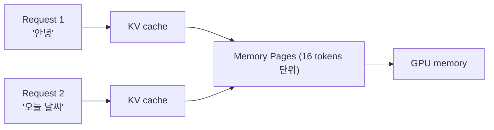
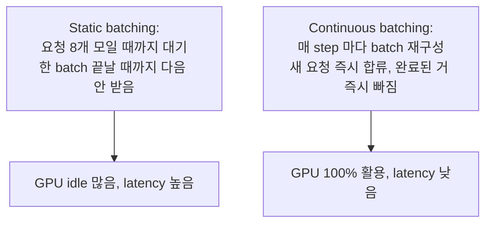
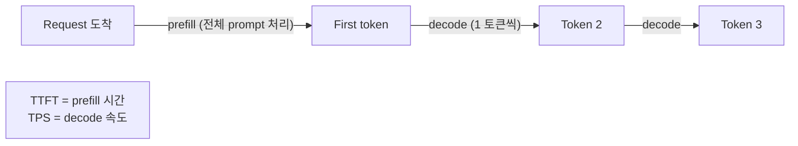
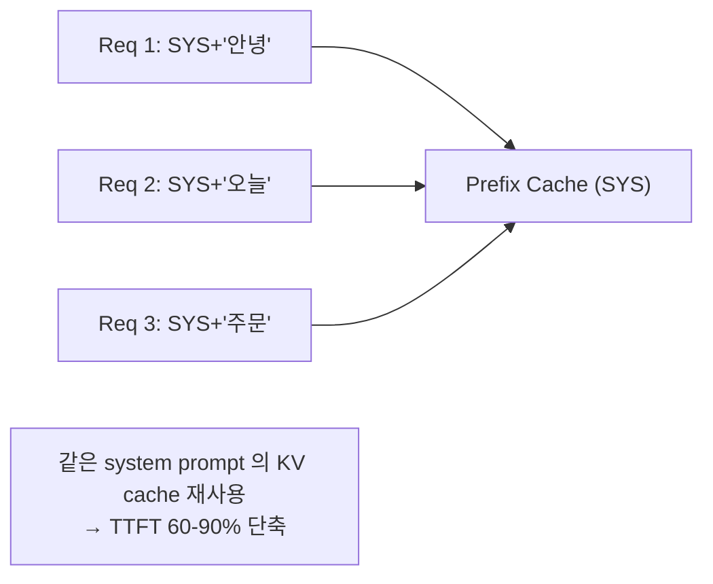
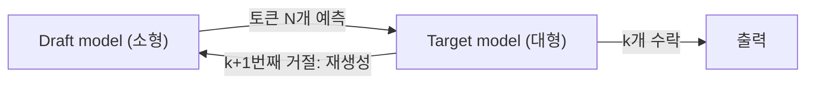
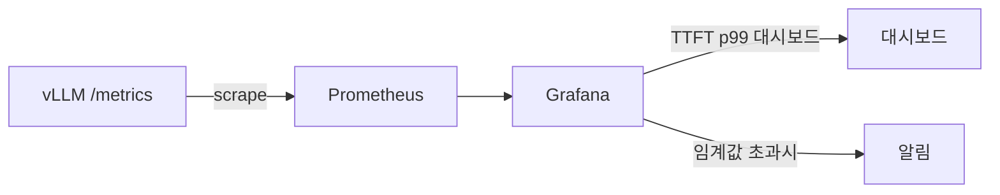

## 정의

**LLM Serving** = 자체 호스팅 LLM 을 *낮은 TTFT + 높은 throughput* 으로 제공. 음성 에이전트의 *LLM 단계 지연* 결정.

| 도구 | 특징 |
|---|---|
| **vLLM** | *PagedAttention*, 표준. 한국에서도 압도적 |
| **TGI** (Hugging Face) | 안정, 옛 표준 |
| **SGLang** | structured output 강함, 2024+ |
| **LMDeploy** | InternLM, 중국 |
| **TensorRT-LLM** | NVIDIA 전용, 최고 성능 |

## PagedAttention



| 기존 (LLaMA, TGI 옛) | PagedAttention (vLLM) |
|---|---|
| 요청 시작 시 *최대 길이 만큼 KV cache 예약* | *Page 단위 동적 할당* |
| 짧은 응답도 *2K-32K 토큰 메모리* | 실제 사용 만큼만 |
| GPU 메모리 *심한 단편화* | *< 4% 낭비* |
| Throughput 낮음 | *2-4x 향상* |

> 운영체제의 *Virtual Memory + paging* 의 *LLM inference 적용*. 모든 modern serving 의 기본.

## Continuous Batching



> *step 단위 dynamic batching* = vLLM, TGI 등의 *2026 표준*.

## TTFT (Time-to-First-Token) vs TPS



| 지표 | 의미 | 목표 |
|---|---|---|
| **TTFT** | 첫 토큰까지 | *< 200ms* (음성) |
| **TPS** | 초당 토큰 | > 50 tok/s |
| **Throughput** | 동시 요청 처리 | GPU 효율 |

> 음성 에이전트 = *TTFT 가 결정적*. sentence aggregator 가 *첫 문장 받으면 TTS 시작*.

## SSE 스트리밍 (Server-Sent Events)

```http
GET /v1/chat/completions
Accept: text/event-stream

data: {"choices": [{"delta": {"content": "안"}}]}\n\n
data: {"choices": [{"delta": {"content": "녕"}}]}\n\n
data: {"choices": [{"delta": {"content": "하세요"}}]}\n\n
data: [DONE]\n\n
```

```python
from openai import AsyncOpenAI
client = AsyncOpenAI(base_url="http://localhost:8000/v1")

stream = await client.chat.completions.create(
    model="llama-3.1-8b-instruct",
    messages=messages,
    stream=True,
)

async for chunk in stream:
    delta = chunk.choices[0].delta.content
    if delta:
        sentence_aggregator.feed(delta)
```

자세한 SSE 는 [[SSE]] 의 일반.

## vLLM 시작

```bash
pip install vllm

# OpenAI 호환 server
python -m vllm.entrypoints.openai.api_server \
    --model meta-llama/Llama-3.1-8B-Instruct \
    --max-model-len 8192 \
    --gpu-memory-utilization 0.9 \
    --enable-chunked-prefill \
    --enable-prefix-caching \
    --port 8000
```

| 옵션 | 의미 |
|---|---|
| `--max-model-len` | 최대 context |
| `--gpu-memory-utilization` | GPU 메모리 사용률 (0.9 권장) |
| `--enable-chunked-prefill` | 긴 prompt 를 청크로 분할 (latency 균형) |
| `--enable-prefix-caching` | *같은 prefix 의 KV cache 재사용* (system prompt!) |
| `--tensor-parallel-size N` | N GPU 분산 |
| `--pipeline-parallel-size N` | pipeline 분산 |

## Prefix Caching (system prompt 재사용)



> 모든 요청이 *같은 긴 system prompt* 면 *prefix caching* 으로 *prefill 시간 거의 0*. 음성 에이전트의 *고정 페르소나 prompt* 와 완벽 매칭.

## Quantization

| 종류 | 메모리 | 정확도 |
|---|---|---|
| FP16 | 100% | 기준 |
| FP8 (H100+) | 50% | ~99% |
| INT8 (smoothquant) | 50% | ~98% |
| INT4 (AWQ, GPTQ) | 25% | ~95% |
| INT4 + KV cache FP8 | 작음 | ~93% |

```bash
# AWQ 4-bit 모델
python -m vllm.entrypoints.openai.api_server \
    --model TheBloke/Llama-3.1-8B-Instruct-AWQ \
    --quantization awq
```

자세한 quantization 은 [[quantization]] 참고.

## 모델 크기 vs 음성 적합성

| 모델 | 한국어 | TTFT (8B GPU) | 적합 |
|---|---|---|---|
| Llama-3.1 8B Instruct | 보통 | 150ms | 일반 |
| Llama-3.1 70B AWQ | 우수 | 400ms | 복잡 task |
| Qwen2.5 7B Instruct | 우수 | 130ms | 한국어 강함 |
| EXAONE 3 7.8B | *최우수 (한국어)* | 150ms | 한국어 voice agent |
| Phi-3.5 mini (3.8B) | 보통 | 60ms | edge, latency critical |
| GPT-4o-mini (API) | 우수 | 200ms (API) | 일반 |
| Gemini Flash 2.0 (API) | 우수 | 250ms (API) | 일반 |

## Speculative Decoding

작은 **draft model** 이 여러 토큰을 연속 생성하고, 큰 **target model** 이 한 번의 forward pass 로 전부 검증. 드래프트가 맞으면 한 번에 여러 토큰 확보, 틀리면 target 이 재생성.



| 항목 | 값 |
|---|---|
| 적합한 draft 크기 | target 파라미터의 10-20% |
| 평균 수용률 | 60-85% |
| decode 속도 향상 | 2-3x |
| TTFT 영향 | 없음 (prefill 미변경) |

vLLM 옵션: `--num-speculative-tokens 5 --speculative-model /path/to/draft`

> draft 와 target 의 **tokenizer 가 반드시 동일**해야 함. 다르면 token ID mismatch.

## Docker 배포

```bash
docker run --runtime nvidia --gpus all \
    -v ~/.cache/huggingface:/root/.cache/huggingface \
    -p 8000:8000 \
    --ipc=host \
    vllm/vllm-openai:latest \
    --model meta-llama/Llama-3.1-8B-Instruct \
    --max-model-len 8192 \
    --enable-prefix-caching \
    --gpu-memory-utilization 0.9
```

multi-GPU (tensor parallel):

```bash
docker run --runtime nvidia --gpus all \
    -p 8000:8000 --ipc=host \
    vllm/vllm-openai:latest \
    --model meta-llama/Llama-3.1-70B-Instruct \
    --tensor-parallel-size 4
```

## 운영 지표



| 지표 | 의미 | 경보 기준 |
|---|---|---|
| `vllm:time_to_first_token_seconds` | TTFT | p99 > 500ms |
| `vllm:e2e_request_latency_seconds` | 전체 지연 | p99 > 3s |
| `vllm:num_requests_running` | 처리 중 요청 수 | > max batch size |
| `vllm:num_requests_waiting` | 대기 큐 | > 50 |
| `vllm:gpu_cache_usage_perc` | KV cache 점유율 | > 90% |

`--disable-log-requests` 플래그로 액세스 로그 비활성화. Prometheus 스크레이프는 `/metrics` 엔드포인트.

## 흔한 함정

> [!WARNING]
> 1. **prefix caching 없이 큰 system prompt** = 매 요청 prefill 1초+. 활성화 필수.
> 2. **streaming 안 함** = 응답 끝나길 기다림. *항상 stream=True*.
> 3. **GPU memory util 너무 높음 (0.95+)** = OOM 위험. 0.85-0.9.
> 4. **연속 batching 없는 옛 서빙** = throughput 1/5. vLLM 으로.

## 관련 위키

- [[voice-agent-architecture]]
- [[tts-streaming-ssml]] (LLM 토큰 → SSE → TTS)
- [[quantization]]
- [[SSE]]
- [[latency-percentiles]]
