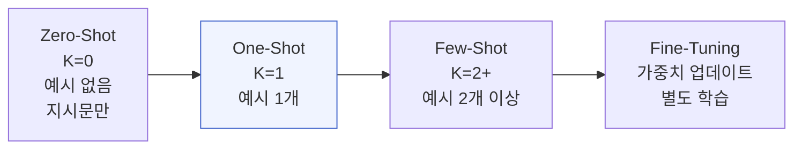
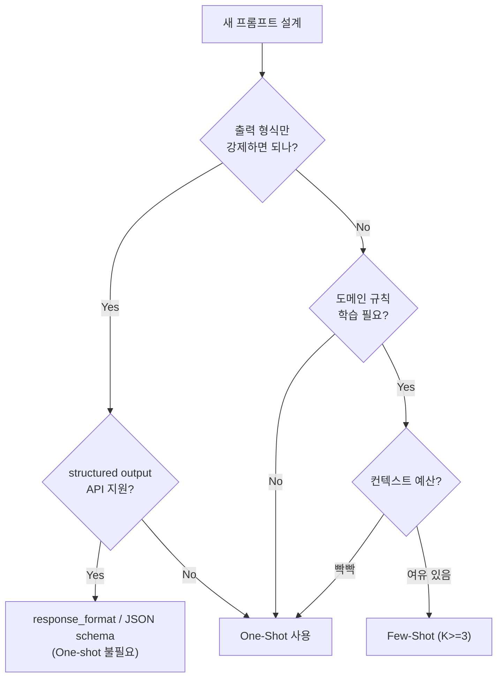

## 정의

**One-shot prompting** 은 프롬프트에 **정확히 1개의 입력-출력 예시** 를 함께 제공하는 프롬프팅입니다. K=1 인 [[few-shot-prompting|few-shot]] 의 특수 케이스이자 [[zero-shot-prompting|zero-shot]] 과 few-shot 사이의 경계입니다.

GPT-3 논문 (Brown et al., 2020) 이 zero-shot / one-shot / few-shot 세 축으로 실험 테이블을 구성하면서 명확한 용어로 자리잡았습니다.

## In-Context Learning 스펙트럼



| 방법 | 예시 수 | 형식 강제력 | 비용 |
|:---|:---:|:---:|:---|
| Zero-Shot | 0 | 낮음 | 최소 |
| **One-Shot** | **1** | **중간** | **소폭 증가** |
| Few-Shot | 2+ | 높음 | K 배 증가 |
| Fine-Tuning | 수천 | 매우 높음 | 학습 비용 |

## 언제 쓰나

One-shot 이 유용한 지점은 좁습니다.

1. **출력 형식만 강제** 하고 싶을 때 (JSON 스키마, 특정 어투)
2. **예시 하나로 충분한 단순 매핑** (레이블 몇 개 안 되는 분류, 도메인 없는 정렬 등)
3. **컨텍스트 예산이 빡빡** 해서 예시를 더 많이 못 넣을 때
4. **파일럿 실험**: few-shot 으로 확장하기 전에 K=1 로 형식만 맞춰 보기

## 기본 구조

```
{지시문}

Input: {예시 입력}
Output: {예시 출력}

Input: {실제 질의}
Output:
```

Chat API 에서는 user/assistant 각 1회 왕복 예시:

```json
[
  {"role": "system", "content": "다음 문장을 formal 한국어로 다시 써 주세요."},
  {"role": "user", "content": "야 이거 어떻게 해?"},
  {"role": "assistant", "content": "이것을 어떻게 처리하면 좋을까요?"},
  {"role": "user", "content": "{실제 입력}"}
]
```

## Zero-Shot / Few-Shot 과 비교

| 축 | Zero-shot | One-shot | Few-shot |
|:---|:---|:---|:---|
| 예시 수 | 0 | 1 | 2 이상 |
| 형식 강제력 | 낮음 (지시문만) | 중간 | 높음 |
| 도메인 규칙 학습 | 안 됨 | 어렵 | 가능 |
| 입력 비용 | 최소 | 소폭 증가 | K 배 증가 |
| Recency bias | 없음 | 유일한 예시 = 강한 앵커 | 마지막 예시 편중 |

**핵심**: One-shot 예시는 유일하므로 그 자체가 **강한 앵커** 로 작용합니다. Recency bias 를 다양화로 완화할 방법이 없어, 예시가 대표성을 잃으면 **오히려 zero-shot 보다 성능이 나빠질 수 있습니다**.

## Min et al. 재조명

Min et al. (2022) "Rethinking the Role of Demonstrations" 결과가 one-shot 에도 적용됩니다:

- 예시의 **입력 도메인** 이 실제 질의와 다르면 큰 손해
- 예시의 **라벨** 을 랜덤으로 바꿔도 성능이 크게 안 떨어지는 경우 (형식 시그널이 지배)
- 예시가 **형식 스펙만 알려주고** 실제 규칙은 지시문이 전달

이는 one-shot 에서 특히 강하게 나타납니다: 한 예시가 모든 신호를 담당하기 때문.

## Chain-of-Thought 와 결합

One-shot + [[chain-of-thought|CoT]] 는 흔한 조합. 사슬 예시 1개를 넣어 형식과 추론 스타일 모두 유도:

```
Q: If a train leaves at 3pm and travels 60 mph for 2 hours, where is it?
A: The train travels 60 miles per hour. After 2 hours it has gone 60 * 2 = 120 miles.
   The answer is 120 miles from the start.

Q: {question}
A:
```

이 방식이 zero-shot CoT ("Let's think step by step") 보다 정확도가 높을 때가 많습니다. 형식과 사슬 스타일을 모두 명시하기 때문.

## 예시 선택 기준

One-shot 은 예시 하나가 결과를 좌우하므로 **선택이 매우 중요**합니다.

1. **대표성**: 실제 질의 분포의 중앙에 있는 예시
2. **정보량**: 지시문에서 놓친 규칙을 예시가 채워줌
3. **간결성**: 너무 긴 예시는 컨텍스트 낭비 + 모델 주의 분산
4. **명확한 라벨**: 애매한 경계 케이스는 오히려 혼선

프로덕션에서는 **입력을 임베딩해 유사도 top-1 예시** 를 동적으로 선택하는 retrieval-based one-shot 이 실전에서 강합니다.

## 실전 예시

### 감성 분류

```python
prompt = """Classify the sentiment of the review as Positive or Negative.

Review: "The food was absolutely amazing and the staff was super friendly!"
Sentiment: Positive

Review: "{review}"
Sentiment:"""
```

### 구조화 출력 (JSON 스키마 강제)

```python
prompt = """Extract the key information from the meeting note as JSON.

Note: "Team sync on Jan 5. Attendees: Alice, Bob. Action items: Alice to send report by Jan 10."
JSON: {"date": "Jan 5", "attendees": ["Alice", "Bob"], "action_items": [{"owner": "Alice", "task": "send report", "due": "Jan 10"}]}

Note: "{meeting_note}"
JSON:"""
```

### 코드 변환 (Python to TypeScript)

```python
prompt = """Convert the Python function to TypeScript.

Python:
def add(a: int, b: int) -> int:
    return a + b

TypeScript:
function add(a: number, b: number): number {
    return a + b;
}

Python:
{python_code}

TypeScript:"""
```

## Retrieval-Based One-Shot (동적 예시 선택)

정적으로 예시를 고르지 않고, 입력과 가장 유사한 예시를 예시 풀에서 검색해 삽입. [[llm-rag|RAG]] 와 결합한 패턴이다.

```python
from sentence_transformers import SentenceTransformer
import numpy as np

model = SentenceTransformer("all-MiniLM-L6-v2")

# 예시 풀 (질의, 정답) 쌍
example_pool = [
    ("What is the capital of France?", "The capital of France is Paris."),
    ("How do I sort a list in Python?", "Use list.sort() or sorted(list)."),
    # ... 수백~수천 개
]

# 오프라인: 예시 임베딩
example_embeddings = model.encode([ex[0] for ex in example_pool])

def select_one_shot_example(query: str) -> tuple[str, str]:
    q_emb = model.encode([query])
    scores = np.dot(example_embeddings, q_emb.T).squeeze()
    best_idx = scores.argmax()
    return example_pool[best_idx]

query = "What is the tallest mountain in the world?"
ex_input, ex_output = select_one_shot_example(query)

prompt = f"""Answer the geography question.

Q: {ex_input}
A: {ex_output}

Q: {query}
A:"""
```

## One-Shot 결정 플로우



## 언제 One-shot 이 최적인가

- 예시가 실제 질의와 매우 유사할 때 (retrieval-augmented one-shot)
- 지시문 + 예시 조합이 API 응답 스키마를 명확히 고정할 때
- CoT 스타일을 정확히 지정하고 싶을 때 (사슬 예시 1개)
- 컨텍스트 예산이 매우 제한적 (모바일 온디바이스 등)

## 함정

> [!WARNING]
> **잘못된 예시는 zero-shot 보다 나쁩니다.** 지시문에는 없는 이상한 형식/스타일을 예시가 강제하면 모델이 그것을 따라갑니다. One-shot 은 그 예시가 유일한 신호이므로 잘못된 예시의 영향이 특히 큽니다.

> [!CAUTION]
> **엣지 케이스를 커버 못 합니다.** 한 예시로 모든 케이스를 담을 수 없어, 예상 밖 입력에는 모델이 형식만 따르고 규칙은 놓치는 경우가 자주 발생합니다.

> [!IMPORTANT]
> **Instruction-tuned 최신 모델 (GPT-4o, Claude 3.5+, Gemini 2.0+) 에서는 zero-shot 만으로 충분한 경우가 많아졌습니다.** 형식 강제가 목표라면 one-shot 대신 structured output (`response_format`, JSON schema) 을 쓰는 편이 안정적입니다.

## 관련 위키

- [[zero-shot-prompting|Zero-Shot Prompting]] - K=0
- [[few-shot-prompting|Few-Shot Prompting]] - K>=2
- [[chain-of-thought|Chain-of-Thought]] - one-shot CoT 조합
- [[function-calling|Function Calling]] - 형식 강제의 대안
- [[llm-rag|LLM RAG]] - 유사도 기반 예시 검색
- [[helm-llm-benchmark|HELM]] - 다양한 shot 조건에서의 평가
- [[big-bench|BIG-Bench]] - one-shot 성능 다양성 실험
