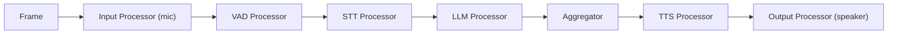
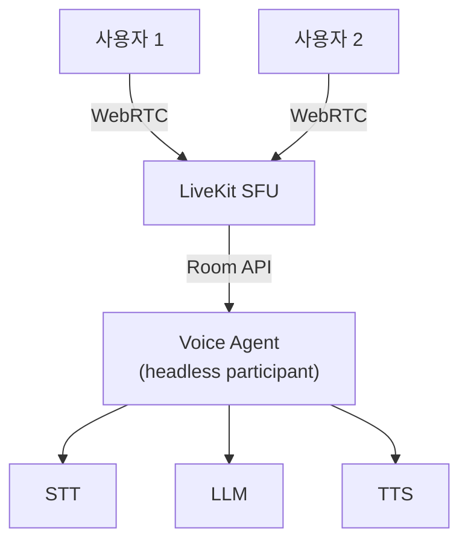
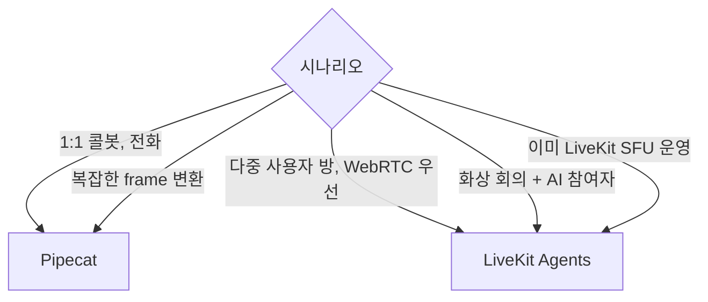
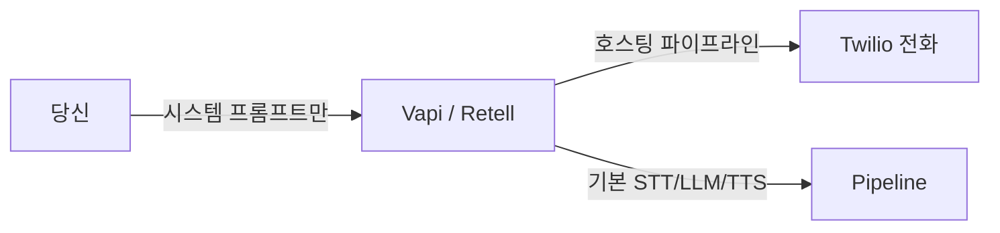
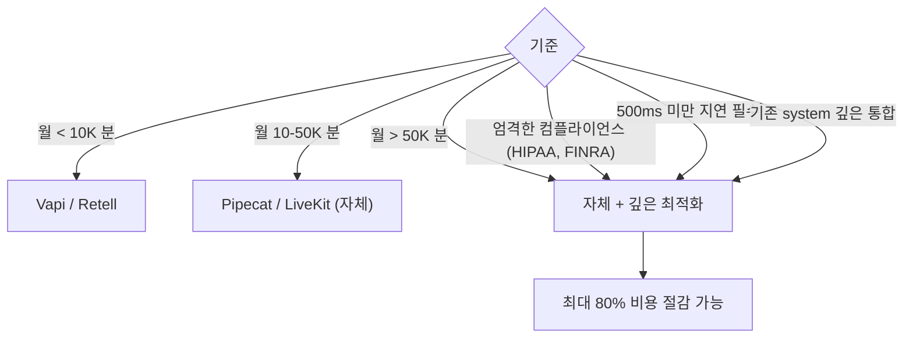
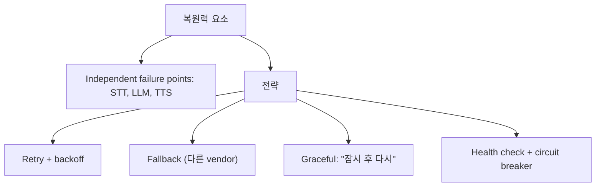

## 정의

2026 시점 *voice agent 프레임워크* 4가지 선택지:

| | Pipecat | LiveKit Agents | Vapi / Retell | 자체 구축 |
|---|---|---|---|---|
| 카테고리 | OSS framework | OSS SFU + framework | Managed | 직접 |
| 운영 | self-host | self-host 또는 LiveKit Cloud | 호스팅 | self |
| 학습 곡선 | 중간 | 중간 | *낮음* | 높음 |
| 비용 | 인프라만 | 인프라만 (LK Cloud 옵션) | 비쌈 ($0.13-0.30/min) | 인프라 |
| 유연성 | *높음* | 높음 | *낮음* (블랙박스) | *최고* |
| 시간 | 1-2주 | 1-2주 | 1-2일 | 1-3개월 |

## Pipecat



> *Frame 이 processor 파이프라인을 흐름*. Linux pipe 의 기능적 추상. 컴포넌트 *한 줄 교체*.

```python
from pipecat.pipeline.pipeline import Pipeline
from pipecat.services.deepgram import DeepgramSTTService
from pipecat.services.openai import OpenAILLMService
from pipecat.services.cartesia import CartesiaTTSService
from pipecat.transports.services.daily import DailyTransport
from pipecat.vad.silero import SileroVADAnalyzer

transport = DailyTransport(room_url, token, "Bot", DailyParams(
    audio_in_enabled=True,
    audio_out_enabled=True,
    vad_analyzer=SileroVADAnalyzer(),
))

pipeline = Pipeline([
    transport.input(),
    DeepgramSTTService(api_key="..."),
    OpenAILLMService(api_key="...", model="gpt-4o-mini"),
    CartesiaTTSService(api_key="...", voice_id="..."),
    transport.output(),
])

runner = PipelineRunner()
await runner.run(PipelineTask(pipeline))
```

### Pipecat 의 Frame 종류

| Frame | 의미 |
|---|---|
| `AudioRawFrame` | 오디오 청크 |
| `TextFrame` | 텍스트 |
| `TranscriptionFrame` | 전사 |
| `LLMResponseStartFrame` / `EndFrame` | LLM 응답 경계 |
| `TTSStartFrame` / `EndFrame` | TTS 시작/종료 |
| `UserStartedSpeakingFrame` | 사용자 발화 시작 |
| `UserStoppedSpeakingFrame` | 종료 |
| `InterruptionFrame` | 끼어들기 |

> *Frame 종류 추가 = 새 processor 추가*. 확장이 깔끔.

## LiveKit Agents



> *LiveKit SFU* 가 *WebRTC + room* 인프라. *Agent 가 room 에 headless participant 로 합류* → 다중 사용자 회의 / 룸 기반 voice agent 자연스러움.

```python
from livekit.agents import VoiceAssistant, AutoSubscribe, JobContext, WorkerOptions, cli
from livekit.agents.llm import ChatContext
from livekit.plugins import openai, silero, deepgram, cartesia

async def entrypoint(ctx: JobContext):
    await ctx.connect(auto_subscribe=AutoSubscribe.AUDIO_ONLY)

    initial_ctx = ChatContext().append(
        role="system",
        text="당신은 친절한 한국어 음성 어시스턴트입니다. 짧게 답하세요."
    )

    assistant = VoiceAssistant(
        vad=silero.VAD.load(),
        stt=deepgram.STT(language="ko"),
        llm=openai.LLM(model="gpt-4o-mini"),
        tts=cartesia.TTS(voice="...", language="ko"),
        chat_ctx=initial_ctx,
        min_endpointing_delay=0.5,
        allow_interruptions=True,
    )

    assistant.start(ctx.room)
    await assistant.aclose()
```

## Pipecat vs LiveKit Agents 결정



| | Pipecat | LiveKit Agents |
|---|---|---|
| Transport | Daily, Twilio, Plivo, FastAPI 등 다양 | LiveKit SFU 중심 |
| 추상 단위 | Frame + Processor | Function 기반 |
| 회의 / 룸 | 단순 | *강력* (Multi-participant) |
| Python | *우선* | Python + Node + Go |
| 학습 | 약간 가파름 | 친절한 docs |

## Managed (Vapi, Retell)



| | 장점 | 단점 |
|---|---|---|
| Vapi | 5분 만에 PoC | *블랙박스*, $0.13-0.30/min |
| Retell | 빠른 시작, 음성 좋음 | 동일, *latency 가시성 낮음* |

## Build vs Buy 기준 (Hamming AI 가이드)



> [!IMPORTANT]
> *PoC = Vapi/Retell*. *확장 시 → Pipecat/LiveKit 마이그레이션* 흐름이 일반.

## 복원력 설계



각 단계 독립 실패 → 우아하게 처리. 자세한 건 [[retry-with-backoff]] / [[circuit-breaker]].

## 흔한 함정

> [!WARNING]
> 1. **Managed 만 사용** = 비용 폭증 + 가시성 0. 1000분+ 면 self-host.
> 2. **Pipecat 의 Frame 무시** = 직접 콜백으로 짜다가 *경합 / 순서 문제*. Frame 모델 활용.
> 3. **LiveKit 의 transcription frame** = STT 결과가 *partial vs final* 분리 안 보임. 명시 처리.
> 4. **자체 구축 시 turn detection** = VAD 만으로 한계. 시맨틱 모델 필요. Pipecat / LK 가 내장한 이유.

## 관련 위키

- [[voice-agent-architecture]]
- [[vad-silero]]
- [[turn-detection-barge-in]]
- [[webrtc]]
- [[circuit-breaker]]
