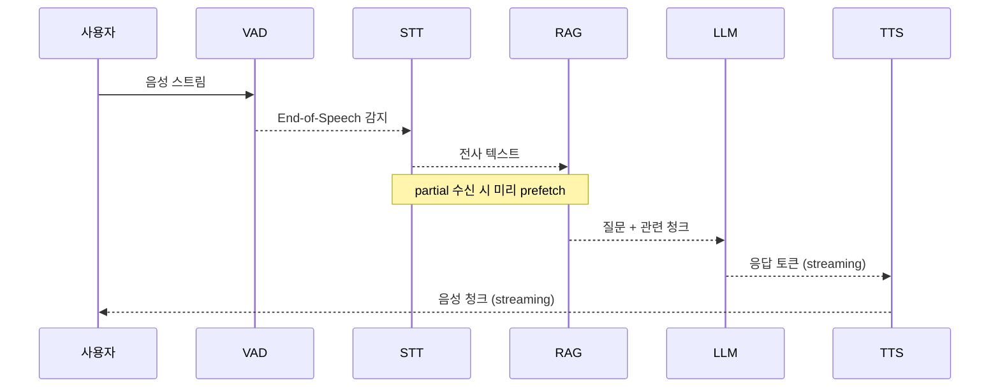
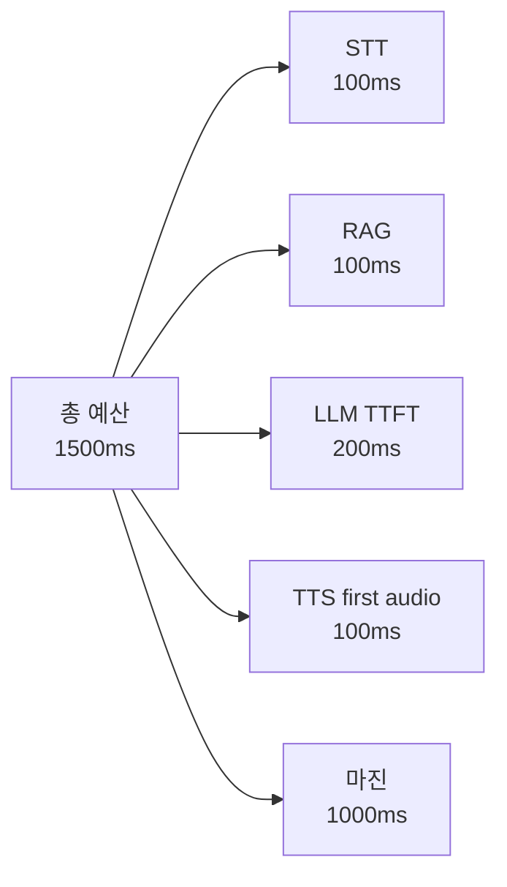
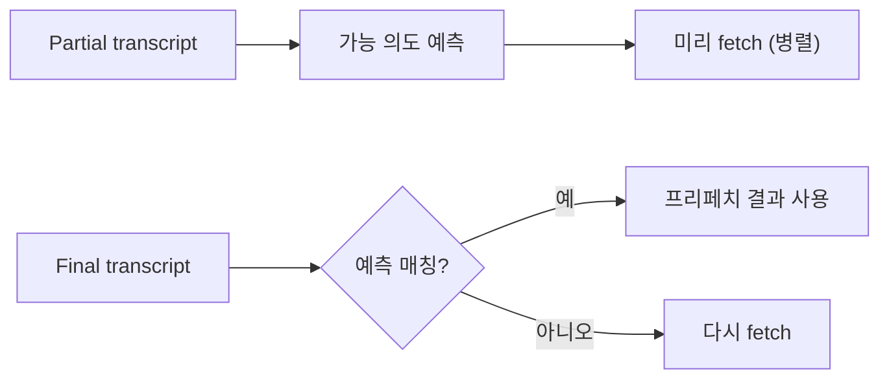
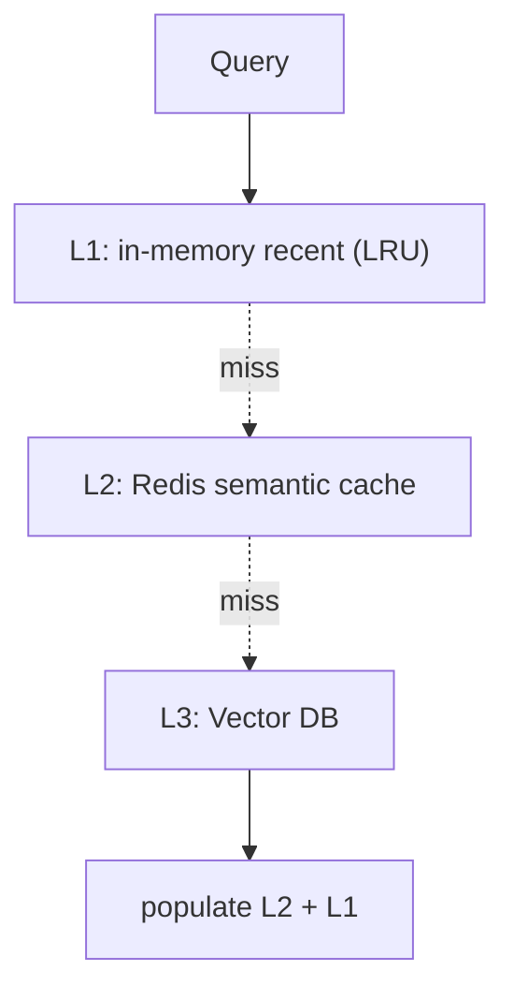
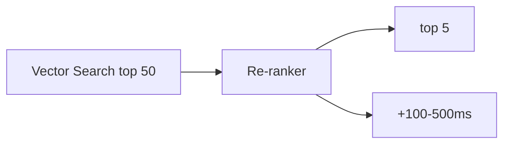

## 정의

**Voice RAG** = 음성 에이전트에 *RAG (Retrieval-Augmented Generation)* 결합. *벡터 DB 조회* 가 *지연 누적* 의 큰 원인이 되므로 *예측적 프리페치* 같은 패턴 필수.

음성 응답 허용 지연(Time to First Audio)은 일반적으로 1.5-2초 이하를 목표로 하는데, 기존 RAG 파이프라인의 직렬 구조는 이 예산을 쉽게 초과합니다.

## 언제 쓰이나

- **도메인 지식 필요 음성 에이전트**: 콜센터, 의료 Q&A, 사내 챗봇
- **실시간 대화 + 사실 근거**: 환각을 줄이고 정확한 출처 기반 답변 필요
- **다회차 음성 대화**: 이전 발화 컨텍스트 + 외부 지식 결합

## 전체 파이프라인



> *각 단계가 직렬*. RAG 추가 *200-1000ms* → 종단 지연 *2초+*.

## 지연 분해

| 단계 | 일반 | 최적 |
|---|---|---|
| STT (Whisper 등) | 200-500ms | 50ms (streaming + local) |
| Embedding | 50-200ms | 30ms (로컬 small 모델) |
| Vector DB query | 30-200ms | 10ms (Redis vector, ES kNN) |
| Re-ranking | 100-500ms | 50ms (cross-encoder small) |
| LLM prompt assembly | 5-20ms | 5ms |
| LLM TTFT (first token) | 200-800ms | 100ms (cached prefix) |
| TTS (first audio) | 100-300ms | 50ms (streaming) |
| **RAG overhead** | **200-1000ms** | **< 100ms** |

### 지연 예산 할당



## VAD (Voice Activity Detection)

발화 시작/종료를 감지하는 첫 단계. End-of-Speech 감지 정확도가 UX 를 결정합니다.

```python
import webrtcvad

class VADHandler:
    def __init__(self, aggressiveness: int = 3, sample_rate: int = 16000):
        self.vad = webrtcvad.Vad(aggressiveness)  # 0~3, 3 = 가장 민감
        self.sample_rate = sample_rate
        self.frame_ms = 30  # 10, 20, 30ms 중 하나
        self.speech_frames: list[bytes] = []
        self.silence_count = 0
        self.SILENCE_THRESHOLD = 20  # 연속 silence frame 수

    def process_frame(self, frame: bytes) -> str | None:
        """Return 'START', 'CONTINUE', 'END', or None"""
        is_speech = self.vad.is_speech(frame, self.sample_rate)
        if is_speech:
            self.silence_count = 0
            self.speech_frames.append(frame)
            return "CONTINUE"
        else:
            self.silence_count += 1
            if self.silence_count >= self.SILENCE_THRESHOLD and self.speech_frames:
                audio = b"".join(self.speech_frames)
                self.speech_frames = []
                return "END"  # 발화 종료
        return None
```

## 예측적 프리페치 (Speculative Retrieval)



```python
class SpeculativeRAG:
    def __init__(self):
        self.prefetched: Dict[str, Future] = {}

    async def on_partial(self, partial: str):
        """partial 받자마자 예측 fetch 시작"""
        if len(partial.split()) < 3:
            return   # 너무 짧으면 skip

        # 이미 fetch 중인 것이 있고 유사하면 재사용
        if any(self._similar(partial, k) for k in self.prefetched):
            return

        # 미리 fetch (병렬)
        fut = asyncio.create_task(self._retrieve(partial))
        self.prefetched[partial] = fut

    async def on_final(self, final: str) -> List[Chunk]:
        """final 시 prefetched 결과 활용 또는 새로 fetch"""
        # 가장 유사한 prefetched 찾기
        best = max(self.prefetched.keys(),
                   key=lambda k: self._similarity(k, final),
                   default=None)
        if best and self._similarity(best, final) > 0.85:
            return await self.prefetched[best]
        return await self._retrieve(final)
```

> *partial 받자마자 추측 fetch* → final 시 *대부분 즉시 사용 가능*. RAG overhead → 0 에 가깝게.

## 캐시 계층



### Semantic Cache

```python
class SemanticCache:
    """비슷한 질문의 결과 재사용"""
    def __init__(self, similarity_threshold=0.92):
        self.cache = {}   # embedding → result
        self.threshold = similarity_threshold

    async def get(self, query: str):
        emb = await embed(query)
        for cached_emb, result in self.cache.items():
            sim = cosine_similarity(emb, cached_emb)
            if sim > self.threshold:
                return result
        return None
```

자세한 건 [[Redis Vector Search]] 의 semantic cache.

## Streaming TTS 패턴

LLM 응답을 기다렸다가 한번에 TTS 에 넘기면 추가 지연이 발생합니다. 토큰 단위로 스트리밍해 첫 문장이 완성되는 즉시 TTS 를 시작합니다.

```python
async def stream_response(llm_stream, tts_client):
    """LLM 토큰을 문장 단위로 누적, 문장 완성 즉시 TTS 로 전달"""
    buffer = ""
    SENTENCE_END = {".", "!", "?", "。", "！", "？"}

    async for token in llm_stream:
        buffer += token
        # 문장 끝 감지
        if buffer and buffer[-1] in SENTENCE_END:
            sentence = buffer.strip()
            if sentence:
                # 문장 완성 즉시 TTS 트리거 (비동기)
                asyncio.create_task(tts_client.speak(sentence))
            buffer = ""

    # 남은 텍스트 처리
    if buffer.strip():
        await tts_client.speak(buffer.strip())
```

## RAG 인덱스 선택 (음성 환경)

| | Pinecone | Redis Vector | ES kNN | Qdrant |
|---|---|---|---|---|
| Latency (kNN) | 30-100ms | 5-20ms | 20-50ms | 10-30ms |
| 운영 | managed | 익숙 | 익숙 | 중간 |
| Hybrid (BM25 + vector) | X | 별도 | *우수 (RRF)* | 가능 |

> 음성 에이전트 + 한국어 hybrid search = *ElasticSearch kNN + nori* 가 강력.

## 청크 전략 (음성 친화)

```python
# 일반 RAG: 큰 청크 (500-1000 tokens)
# 음성 RAG: *짧은 청크* (100-300 tokens) → LLM 응답 짧게 유도

def chunk_for_voice(doc: str) -> list[str]:
    """문장 단위 + 의미 단위 분할"""
    sentences = nltk.sent_tokenize(doc, language='korean')
    chunks = []
    cur = ""
    for s in sentences:
        if len(cur) + len(s) > 300:
            chunks.append(cur)
            cur = s
        else:
            cur += " " + s
    if cur:
        chunks.append(cur)
    return chunks
```

짧은 청크는 검색 정밀도를 높이고 LLM 이 짧고 자연스러운 음성 응답을 생성하도록 유도합니다.

## Re-ranking 의 trade-off



> *정확도 ↑ vs 지연 ↑*. 음성 에이전트는 *작은 cross-encoder* (Cohere rerank-v3 light, BAAI bge-reranker-base) 권장.

## 흔한 함정

> [!WARNING]
> 1. **RAG 매 turn 동기 fetch** = 매 응답 200-1000ms 증가. *예측적 프리페치*.
> 2. **거대 청크** = LLM 응답이 길어짐. 짧은 청크 (100-300 tokens).
> 3. **Cross-encoder rerank 무조건** = 500ms+ 부담. *trade-off* 결정.
> 4. **결과 그대로 prompt** = 토큰 폭증. 요약 또는 selection.
> 5. **VAD 미사용** = 발화 종료 감지가 느려 STT 에 불필요한 silence 포함. 지연 증가.

> [!CAUTION]
> **Semantic cache 유사도 임계값을 낮추면 오답 반환 위험이 생깁니다.** 0.92 이하에서는 의미가 다른 질의의 캐시 결과를 반환할 수 있습니다. 도메인 특성에 맞게 검증 후 설정하세요.

## 관련 위키

- [[voice-agent-architecture]]
- [[voice-first-prompt]]
- [[elasticsearch-vector-search]]
- [[Redis Vector Search]]
- [[latency-percentiles]]
- [[llm-rag|LLM RAG]] - 일반 RAG 파이프라인
