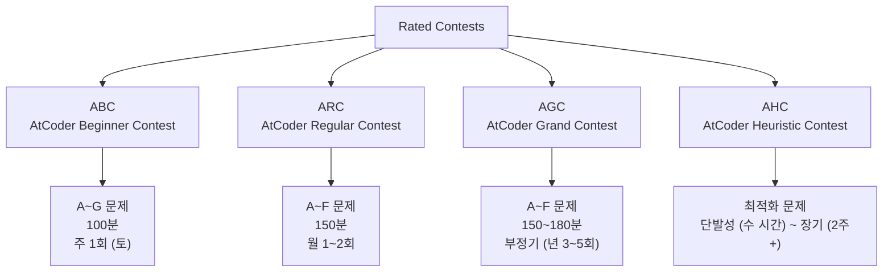
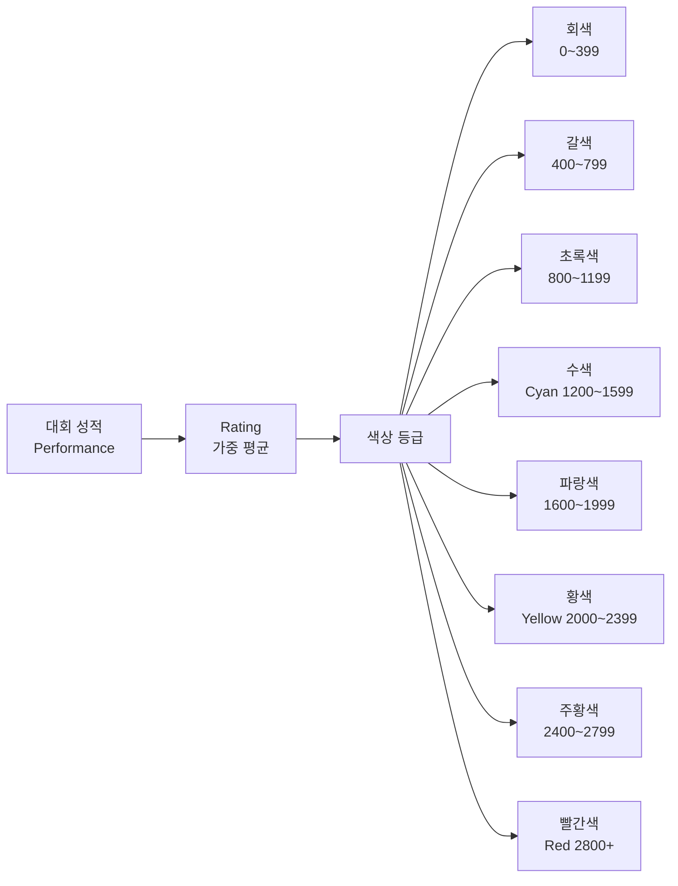
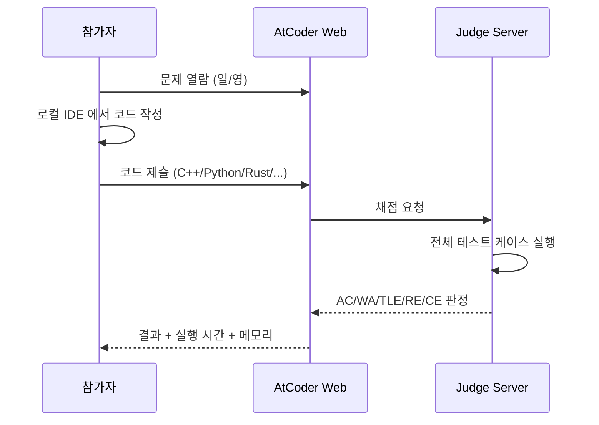

## 정의

**AtCoder** 는 일본에서 운영되는 온라인 알고리즘 경진대회 플랫폼입니다. 2012년 서비스 시작, 주간 정기 대회 (Contest) 를 개최하며 참가자에게 색깔 기반 레이팅을 부여합니다. Codeforces 와 함께 세계 최대 규모의 경쟁 프로그래밍 커뮤니티 중 하나입니다.

일본어와 영어 양쪽으로 문제가 제공되고, 문제 품질과 해설 (Editorial) 의 상세함이 높다는 평판이 있어 알고리즘 학습용으로도 자주 활용됩니다.

## 왜 AtCoder 를 하는가

경쟁 프로그래밍 학습 관점에서 [[codeforces|Codeforces]], 백준 (BOJ), LeetCode 대비 특징:

- **문제 품질**: 아이디어 중심, 구현 노이즈 최소화. 짧은 코드로 풀리는 우아한 문제가 많음.
- **Editorial**: 대회 종료 직후 상세한 해설 공개 (일본어 원문 + 영어 번역).
- **레이팅 안정성**: Elo 기반의 두 종류 (Performance / Rating) 로 짧은 슬럼프에도 큰 변동 적음.
- **문제 세트 밸런스**: ABC 는 초보 6, 중급 1, 고수 1 로 구성되어 학습 단계별 진입장벽이 완만.

vs Codeforces: CF 가 "빠른 사고력 + 애드혹" 중심이라면, AtCoder 는 "정확한 알고리즘 + 수학"에 무게.

## 대회 종류



### ABC (AtCoder Beginner Contest)

- **난이도**: 입문 ~ 중급 (Perf 400 ~ 2400)
- **문제 수**: 8문제 (A ~ H, 예전 6~7문제)
- **레이팅 범위**: 0 ~ 1999 (Perf 반영)
- **시간**: 100분
- **주기**: 토요일 21:00 JST (거의 매주)

일반적으로 A/B 는 단순 시뮬레이션, C/D 는 표준 알고리즘 (그리디, DP), E/F 는 세그트리/그래프/기하, G/H 는 고급 조합/데이터 구조. **입문자 학습에 최적**.

### ARC (AtCoder Regular Contest)

- **난이도**: 중급 ~ 상급 (Perf 1200 ~ 3200)
- **문제 수**: 6문제
- **레이팅 범위**: 1200 ~ 2799
- **주기**: 부정기, 월 1~2회

수학적 사고와 관찰이 핵심. Div1 / Div2 나뉘어 진행됩니다.

### AGC (AtCoder Grand Contest)

- **난이도**: 상급 ~ 최상급
- **문제 수**: 6문제
- **주기**: 년 3~5회 (부정기)

세계 정상급 대회. Editorial 을 봐도 아이디어를 이해하기 어려운 문제 다수. Rated 는 1200 이상.

### AHC (AtCoder Heuristic Contest)

- **성격**: 최적해가 없는 최적화 문제 (Travelling Salesman 변형, 스케줄링 등)
- **채점**: 상대 점수 (제출한 해의 품질을 다른 참가자와 비교)
- **시간**: 4시간 (Short) ~ 2주 (Long)

머신러닝, 시뮬레이티드 어닐링, 빔서치 등 heuristic 기법 실전 연습.

## 레이팅 시스템



### 색상 등급의 의미

| 색 | Rating | 대략적 실력 (Algorithm) |
|:---|---:|:---|
| **회색 (Gray)** | 0 ~ 399 | 프로그래밍 입문, 기본 구현 |
| **갈색 (Brown)** | 400 ~ 799 | 기본 알고리즘 (DFS/BFS, DP 입문) |
| **초록색 (Green)** | 800 ~ 1199 | 코딩테스트 상위권 실력 |
| **수색 (Cyan)** | 1200 ~ 1599 | 코딩테스트 대부분 통과, 알고리즘 대회 초심자 |
| **파랑색 (Blue)** | 1600 ~ 1999 | 대회 중급자, IT 대기업 알고리즘 면접 여유 |
| **황색 (Yellow)** | 2000 ~ 2399 | 대회 상급자, 상위 5% |
| **주황색 (Orange)** | 2400 ~ 2799 | 프로 수준, 상위 1% |
| **빨간색 (Red)** | 2800+ | 세계 정상, 상위 0.1% |

Perf (그 대회 한정 성적) 와 Rating (누적 평균) 이 다름. 초기에는 큰 폭 변동, 참가 수 늘어날수록 안정.

### 레이팅 계산 (요약)

$$
\text{Rating} = \text{Perf}_1 + f(\text{참가 횟수})
$$

- **AtCoder 초기 부스트**: 첫 10회 참여까지 rating 이 올라가는 폭이 큼 ($f$ 값이 큼)
- **Perf 계산**: 대회 순위에 따라 Elo 기반으로 산출. 상위 참가자를 이길수록 큰 Perf.
- **하락 방지**: unrated 참여 가능 (rating 변동 없음)

## 문제 접근 방식



### 지원 언어

C++, Python (CPython/PyPy), Rust, Go, Java, Kotlin, C#, JavaScript, Ruby, Swift, Haskell 등 **50+ 언어**. 대부분 대회는 C++ / Python / Rust 사용률이 압도적.

### 시간/메모리 제한

- **기본 시간 제한**: 2초 (Python 은 관대하게 처리, 대략 CPP 의 5~10배 여유)
- **메모리**: 1024 MB (대부분 문제)
- **입력**: 표준 입력 (stdin)
- **출력**: 표준 출력 (stdout)

C++ 은 `#include <bits/stdc++.h>` 허용, Python 은 재귀 제한 (`sys.setrecursionlimit`) 필요할 때 있음.

## 실전 참여 팁

### 1. Beginner 는 ABC 부터

첫 10회는 rating 부스트가 크므로 ABC 위주로 참여. A~C 만 풀어도 회색 → 갈색 상승 가능.

### 2. 대회 직후 Editorial 정독

문제 자체가 잘 안 풀렸어도 Editorial 을 보고 이해하는 습관이 실력 향상에 결정적. 대회 종료 직후 (약 10분 후) 공개.

### 3. 문제 저장소

- **AtCoder Problems**: <https://kenkoooo.com/atcoder/> 참가자별 통계, 태그별 문제 필터
- **Virtual Contest**: 과거 문제로 가상 대회 진행 가능. 시간 압박 연습.

### 4. Rated 조건

- ABC/ARC: 특정 rating 이하만 rated (예: ABC 는 1999 이하)
- 관심 없으면 unrated 로도 참여 가능

### 5. 언어별 팁

**C++**:
```cpp
#include <bits/stdc++.h>
using namespace std;
int main() {
    ios_base::sync_with_stdio(false);
    cin.tie(NULL);
    // ...
}
```

**Python**:
```python
import sys
input = sys.stdin.readline
sys.setrecursionlimit(10**6)
```

**PyPy** 는 순수 Python 코드에서 3~10배 빠름. CPython 이 TLE 일 때 PyPy 로 재시도.

## 학습 자원

### 공식 자원

- **AtCoder Beginner Selection**: 신규 참가자용 10문제 (<https://atcoder.jp/contests/abs/tasks>)
- **AtCoder Library (ACL)**: 공식 C++ 알고리즘 라이브러리, 세그트리/펜윅/문자열 등

### 대회 아카이브

- **AtCoder Problems**: 개인 진척도, 난이도 (Difficulty) 표시
- **AtCoder Tags**: 태그별 필터 (DP, 그래프, 기하, 문자열 등)

### 커뮤니티

- **Twitter**: 국내외 참가자 대회 후기 활발
- **Reddit r/atcoder**: 영문 커뮤니티

## 다른 플랫폼과 비교

| 항목 | AtCoder | [[codeforces|Codeforces]] | 백준 (BOJ) | LeetCode |
|:---|:---|:---|:---|:---|
| **본사** | 일본 | 러시아 | 한국 | 미국 |
| **주력** | 알고리즘 대회 | 알고리즘 대회 | 문제 아카이브 + 대회 | 면접 준비 |
| **대회 주기** | 주 1~2회 | 주 1~2회 | 부정기 (BOJ Open Contest) | 주 1회 (컨테스트) |
| **문제 스타일** | 아이디어 중심, 우아 | 사고력 + 애드혹 | 다양 (구현 노이즈 많음) | 면접형 (DS/DP 중심) |
| **Editorial** | 매우 상세 | 대회 후 며칠 뒤 | 사용자 풀이 위주 | 짧은 힌트 |
| **레이팅** | 색상 8단계 | 색상 6단계 | 티어 (Bronze~Ruby) | 없음 (Rating 별도) |
| **한국어** | 영어 | 영어 | 한국어 | 영어 |

## 함정

### 1. 첫 대회 rating 이 낮게 나올 수 있음

첫 참가는 Performance 자체가 낮게 산정되는 경향. 실망하지 말고 5~10회는 참여할 것.

### 2. Python 시간 제한

일부 문제는 CPython 만으로 절대 통과 불가. PyPy 나 다른 언어 전환 필요.

### 3. 문제 번호와 난이도 무관

ABC-A 가 항상 쉬운 건 아님. Editorial 이 상세하므로 어려우면 즉시 확인.

### 4. Editorial 언어

일본어 우선 작성, 이후 영어 번역. 급할 땐 자동 번역 활용.

### 5. 계정 활동 부족 시 unrated 처리

**"unrated" 참여** 를 계속하면 rating 이 오히려 하락할 수 있음. 준비 안 됐다면 그냥 참여하지 않는 게 나음.

## 관련 위키

- [[codeforces|Codeforces]] - 러시아 기반 알고리즘 대회
- [[sorting-algorithm|정렬 알고리즘]]
- [[dp|동적 계획법]]
- [[bfs|BFS]]
- [[dfs|DFS]]
- [[segtree|세그먼트 트리]]
- [[graph-traversal|그래프 탐색]]
