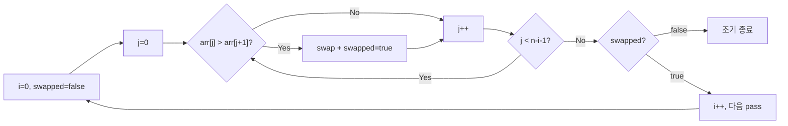

## 정의

**Bubble Sort (버블 정렬)** 는 인접한 두 원소를 비교해 잘못된 순서면 교환하는 작업을 배열을 통과하며 반복하는 정렬. 한 번의 통과 (pass) 마다 가장 큰 원소가 마지막으로 *떠오른다 (bubble up)* 해서 이름이 붙음.

알고리즘 교육의 단골이지만, **실무에서는 거의 쓰이지 않는다** (O(n²)). 다만 한 번의 통과로 정렬 완료 여부를 알 수 있다는 점 때문에 *거의 정렬된* 입력에 한해 빠를 수 있다.

전체 비교는 [[정렬 알고리즘]] 참고.

## 시각화

```anim:bubble-sort
{}
```

아래는 한 번의 pass 에서 최댓값이 오른쪽으로 "떠오르는" 흐름:



## 알고리즘

```text
bubbleSort(arr):
  n = length(arr)
  for i = 0 to n-1:
    swapped = false
    for j = 0 to n-i-2:
      if arr[j] > arr[j+1]:
        swap(arr[j], arr[j+1])
        swapped = true
    if not swapped:
      break  // 이미 정렬됨, 조기 종료
```

### 핵심 동작

매 통과마다 가장 큰 값이 *끝으로 떠오른다*.

```text
[5, 2, 8, 1, 4]   초기
[2, 5, 8, 1, 4]   5 > 2, swap
[2, 5, 8, 1, 4]   5 < 8
[2, 5, 1, 8, 4]   8 > 1, swap
[2, 5, 1, 4, 8]   8 > 4, swap   ← 8 이 끝으로 떠올랐다

다음 통과는 마지막 원소 제외하고:
[2, 5, 1, 4, |8|]
```

n-1 번의 통과 후 정렬 완료. 단, 한 통과에서 교환이 한 번도 없으면 이미 정렬된 것이므로 조기 종료 가능.

## 구현

<CodeWithOutput
  variants={[
    {
      language: "cpp",
      label: "C++",
      code: `#include <bits/stdc++.h>
using namespace std;

void bubbleSort(vector<int>& arr) {
    int n = arr.size();
    for (int i = 0; i < n - 1; i++) {
        bool swapped = false;
        for (int j = 0; j < n - i - 1; j++) {
            if (arr[j] > arr[j+1]) {
                swap(arr[j], arr[j+1]);
                swapped = true;
            }
        }
        if (!swapped) break;  // 이미 정렬됨
    }
}

int main() {
    vector<int> arr = {64, 34, 25, 12, 22, 11, 90};
    int n = arr.size();
    cout << "Before: ";
    for (int x : arr) cout << x << " ";
    cout << "\\n";
    bubbleSort(arr);
    cout << "After:  ";
    for (int x : arr) cout << x << " ";
    cout << "\\n";
}`,
    },
    {
      language: "python",
      label: "Python",
      code: `def bubble_sort(arr: list) -> None:
    n = len(arr)
    for i in range(n - 1):
        swapped = False
        for j in range(n - i - 1):
            if arr[j] > arr[j+1]:
                arr[j], arr[j+1] = arr[j+1], arr[j]
                swapped = True
        if not swapped:
            break  # 이미 정렬됨

arr = [64, 34, 25, 12, 22, 11, 90]
print("Before:", arr)
bubble_sort(arr)
print("After: ", arr)`,
    },
  ]}
  cases={[
    {
      label: "기본 실행",
      input: "",
      output: `Before: 64 34 25 12 22 11 90
After:  11 12 22 25 34 64 90`,
    },
    {
      label: "이미 정렬된 입력 (조기 종료)",
      input: "",
      output: `Before: 1 2 3 4 5
After:  1 2 3 4 5`,
    },
  ]}
/>

## 복잡도

| 항목 | 값 | 설명 |
|:---|:---|:---|
| **시간 (최선)** | O(n) | 이미 정렬됨 (early exit) |
| **시간 (평균)** | O(n²) | |
| **시간 (최악)** | O(n²) | 역순 입력 |
| **공간** | O(1) | in-place |
| **안정성** | ✓ Stable | 같은 키는 교환 안 함 |
| **In-place** | ✓ | |

## 다른 O(n²) 정렬과의 비교

| 알고리즘 | 비교 횟수 | 교환 횟수 | 특징 |
|:---|:---:|:---:|:---|
| **Bubble** | O(n²) | O(n²) | 안정. 거의 정렬된 입력 빠름 |
| [[Insertion Sort]] | O(n²) | O(n²) | 안정. 거의 정렬된 입력 가장 빠름 |
| [[Selection Sort]] | O(n²) | **O(n)** | 불안정. **교환 비용 비쌀 때 유리** |

> [!CAUTION]
> 셋 다 O(n²) 지만 **상수항이 다르다**. 실측 평균:
> - Insertion Sort > Selection Sort > Bubble Sort (Bubble 이 가장 느림)
> - Insertion 이 캐시 친화적이라 가장 빠름

## 변형

### Cocktail Shaker Sort

양방향으로 통과. 작은 값은 앞으로, 큰 값은 뒤로 동시에 이동.

```text
forward pass:  큰 값을 끝으로
backward pass: 작은 값을 앞으로
```

순방향만 하는 Bubble 보다 빨라지는 입력이 있지만 여전히 O(n²).

### Comb Sort

처음에는 멀리 떨어진 원소끼리 비교 (gap 사용), 점차 gap 을 줄임. Shell Sort 와 비슷한 발상으로 O(n²) 평균 → O(n log n) 평균 가능.

## 왜 가르치는가

실용성보다는 **교육적 가치**:

1. **가장 쉬운 정렬 알고리즘**, 한눈에 이해
2. **swap, in-place, stability 같은 개념의 첫 접점**
3. **O(n²) 의 직관**, 두 중첩 루프
4. **early termination 같은 최적화 사고**

## 거의 정렬된 입력에 빠른 이유

```javascript
const arr = [1, 2, 4, 3, 5, 6, 7, 8]; // 3, 4 만 어긋남

// 1 회 통과: 3, 4 교환 → swapped = true
// 2 회 통과: 교환 없음 → swapped = false → 조기 종료
// 총 2n 비교, 1 swap → O(n)
```

이 경우 Insertion Sort 도 마찬가지로 O(n). 둘 다 *거의 정렬된* 입력에 강하다.

## 실무 사용 사례 (드뭄)

- **임베디드 / 펌웨어**: 코드 크기가 극단적으로 작아야 할 때 (수십 바이트)
- **교육 / 예제 코드**
- **테스트용 reference implementation**, 다른 정렬 알고리즘의 결과 검증

그 외에는 사실상 사용되지 않는다.

## 함정

### 1. 내부 루프 범위 오류

`j < n - i - 1` 에서 `-1` 을 빠뜨리면 `arr[j+1]` 이 범위를 벗어남. 매 pass 마다 이미 확정된 뒤쪽을 비교할 필요 없음을 명심.

### 2. swapped 플래그 위치

`swapped = false` 를 내부 루프 전에 초기화해야 함. 외부 루프 전에 하면 첫 pass 이후 항상 false 가 되어 조기 종료가 절대 발생하지 않음.

### 3. 안정성 보장 조건

`arr[j] > arr[j+1]` 에서 등호 없이 **strict** 비교를 해야 stable. `>=` 로 비교하면 같은 원소도 교환해 unstable 이 됨.

### 4. 역순 입력이 최악

역순 배열: 1번째 pass = n-1 비교, 2번째 pass = n-2 비교 ... 총 n*(n-1)/2 비교 + 교환. Insertion Sort 도 비슷하지만 **이동** 비용이 다름: Bubble 은 인접 swap (O(1) per swap), Insertion 은 shift (O(1) per element, 더 효율적).

### 5. 비교 횟수 최소화가 목표가 아닐 때

교환 비용이 비교 비용보다 훨씬 비싼 경우 (예: 대용량 객체 이동): [[Selection Sort]] 가 교환 횟수 O(n) 으로 더 유리.

## BOJ 연습 문제

| 번호 | 제목 | 연관 |
|:---|:---|:---|
| BOJ 1517 | 버블 소트 | Bubble Sort swap 횟수 = 역전쌍 수. Merge Sort 로 O(n log n) 계산 |
| BOJ 2750 | 수 정렬하기 | 정렬 기본 구현 연습 |
| BOJ 25305 | 커트라인 | 정렬 후 k번째 원소 탐색 |

> [!IMPORTANT]
> BOJ 1517 "버블 소트" 는 실제로 Bubble Sort 를 구현하는 문제가 **아니다**. O(n^2) 으로는 TLE. Bubble Sort swap 횟수 = 역전쌍 (inversion pair) 수라는 성질을 활용해 Merge Sort / BIT / Segment Tree 로 O(n log n) 에 계산해야 한다.

## 참고

- [[정렬 알고리즘]]
- [[Insertion Sort]]
- [[Selection Sort]]
- [[Quick Sort]]
- Knuth, *TAOCP Vol. 3 §5.2.2*
- "Bubble Sort: An Archaeological Algorithmic Analysis" (Owen Astrachan, 2003)
