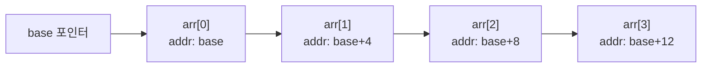
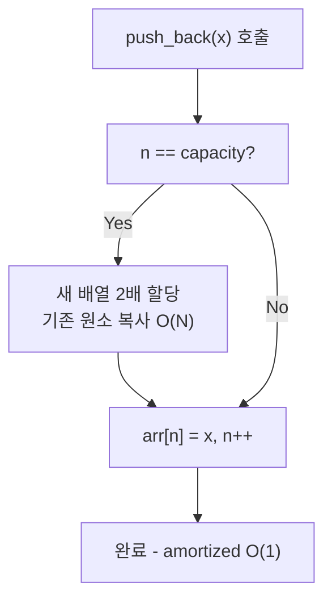

## 정의

**배열 (Array)** 는 동일한 타입의 원소를 메모리에 **연속으로** 저장하는 가장 기본적인 선형 자료구조다.

- **정적 배열 (Static Array)**: 크기가 컴파일 타임에 고정. C++ `int arr[N]`, Java `int[]`.
- **동적 배열 (Dynamic Array)**: 런타임에 크기 조정 가능. C++ `std::vector`, Python `list`, Java `ArrayList`.

인덱스 `i` 번째 원소의 주소 = `base_address + i × element_size`. 이 계산이 O(1) 이므로 **랜덤 접근 O(1)** 이 보장된다.

PS 에서 가장 많이 사용하는 자료구조. 캐시 친화성과 단순한 인터페이스 덕에 다른 자료구조로 교체 가능한 상황에서도 배열을 우선 고려한다.

## 문제 상황과 동기

N개 원소를 저장하고, 특정 위치 접근이 잦은 경우를 생각하자.

- **naive (별도 변수)**: `a`, `b`, `c`, `d`... 인덱스로 접근 불가. 루프 작성 불가능.
- **[[linked-list|연결 리스트]]**: 임의 접근 O(N), 캐시 miss 빈발.
- **배열**: 임의 접근 O(1), 캐시 지역성 우수.

핵심 통찰: *메모리 연속 배치* 가 가져오는 두 가지 이점:

1. **랜덤 접근 O(1)**: `arr[i]` = `*(base + i)` 계산 한 번.
2. **캐시 지역성 (Cache Locality)**: 순차 접근 시 CPU 캐시에 인접 원소가 함께 로드됨.

중간 삽입/삭제가 잦으면 배열이 불리 (O(N) shift). 그럼에도 PS 에서는 **대부분의 경우 배열이 먼저**.

## 시각화

### 메모리 구조



`arr[i]` 에 접근하면 `base + i × sizeof(int)` 주소를 읽는다. 상수 시간 연산.

### 동적 배열 확장 (push_back)



재할당이 필요한 경우는 드물다. N번 push_back 의 총 복사 비용은 O(N) → 1회 평균 O(1).

## 핵심 아이디어

### 정적 배열 vs 동적 배열

| 항목 | 정적 배열 | 동적 배열 |
|:---|:---:|:---:|
| **크기 결정 시점** | 컴파일 타임 | 런타임 |
| **메모리 재할당** | 없음 | 용량 초과 시 2배 확장 |
| **tail 삽입** | 불가 (고정) | O(1) amortized |
| **메모리 오버헤드** | 없음 | 용량 - 실제 크기 |

### 언어별 구현

| 언어 | 정적 배열 | 동적 배열 |
|:---|:---|:---|
| **C++** | `int arr[N]`, `std::array<int,N>` | `std::vector<int>` |
| **Python** | - | `list` (항상 동적) |
| **Java** | `int[] arr = new int[N]` | `ArrayList<Integer>` |

> [!IMPORTANT]
> Python `list` 와 Java `ArrayList<Integer>` 는 내부적으로 참조/박싱 오버헤드가 있어 int 기본형 배열보다 메모리를 더 쓴다. 성능이 중요한 Java PS 코드에서는 `int[]` 를 우선한다.

### 캐시 지역성

```text
배열 순차 탐색:   arr[0], arr[1], arr[2], ...
  -> 캐시 라인(64 bytes)에 연속 원소 16개가 함께 로드
  -> 캐시 히트율 높음, 매우 빠름

연결 리스트 탐색: node0 -> node1 -> node2 -> ...
  -> 각 노드가 힙 메모리 전역에 산재
  -> 캐시 miss 빈발, 실제 느림
```

이론 복잡도가 같아도 배열 순회가 연결 리스트보다 수 배 빠른 이유.

## 알고리즘

### 1. 중간 삽입 (인덱스 k)

```text
insert(arr, n, k, x):
    for i = n-1 downto k:
        arr[i+1] = arr[i]     // 오른쪽으로 shift
    arr[k] = x
    n += 1
```

시간: O(N) (k 이후 원소 shift). 배열 크기 여유가 필요하다.

### 2. 중간 삭제 (인덱스 k)

```text
delete(arr, n, k):
    for i = k+1 to n-1:
        arr[i-1] = arr[i]     // 왼쪽으로 shift
    n -= 1
```

시간: O(N). 마지막 원소 삭제는 O(1) (shift 불필요).

### 3. 동적 배열 확장 (push_back)

```text
push_back(arr, n, capacity, x):
    if n == capacity:
        new_arr = allocate(2 * capacity)   // O(capacity)
        copy arr[0..n-1] to new_arr        // O(N)
        capacity = 2 * capacity
        arr = new_arr
    arr[n] = x
    n += 1
```

재할당 발생 횟수: O(log N). 각 재할당 시 복사 비용 총합: 1 + 2 + 4 + ... + N = O(N) → 1회 평균 O(1) amortized.

## 구현

<CodeWithOutput
  variants={[
    {
      language: "cpp",
      label: "C++",
      code: `// 정적 배열 vs 동적 배열 (vector) 기본 연산
#include <bits/stdc++.h>
using namespace std;
int main() {
    ios_base::sync_with_stdio(false);
    cin.tie(nullptr);
    int n;
    cin >> n;

    // 정적 배열 (최대 크기 선언)
    int a[100005];
    for (int i = 0; i < n; i++) cin >> a[i];

    // 동적 배열 (vector)
    vector<int> v(a, a + n);

    // 랜덤 접근 O(1)
    cout << "a[0]=" << a[0] << " v[n-1]=" << v[n-1] << "\\n";

    // 정렬 O(N log N)
    sort(v.begin(), v.end());
    cout << "sorted[0]=" << v[0] << " sorted[n-1]=" << v[n-1] << "\\n";

    // tail 삽입 O(1) amortized
    v.push_back(-1);
    cout << "after push_back: size=" << v.size() << "\\n";

    // 중간 삽입 O(N)
    v.insert(v.begin() + 1, 999);
    cout << "after insert(1,999): v[1]=" << v[1] << "\\n";

    return 0;
}`,
    },
    {
      language: "python",
      label: "Python",
      code: `import sys
input = sys.stdin.readline

n = int(input())
a = list(map(int, input().split()))

# 랜덤 접근 O(1)
print(f"a[0]={a[0]} a[n-1]={a[n-1]}")

# 정렬 O(N log N) - sorted()는 새 리스트, sort()는 in-place
a_sorted = sorted(a)
print(f"sorted[0]={a_sorted[0]} sorted[n-1]={a_sorted[n-1]}")

# tail 삽입 O(1) amortized
a.append(-1)
print(f"after append: len={len(a)}")

# 중간 삽입 O(N)
a.insert(1, 999)
print(f"after insert(1, 999): a[1]={a[1]}")`,
    },
    {
      language: "java",
      label: "Java",
      code: `import java.util.*;
import java.io.*;
public class Main {
    public static void main(String[] args) throws IOException {
        BufferedReader br = new BufferedReader(new InputStreamReader(System.in));
        int n = Integer.parseInt(br.readLine().trim());
        StringTokenizer st = new StringTokenizer(br.readLine());

        // 정적 배열: int[] (primitive, 메모리 효율적)
        int[] a = new int[n];
        for (int i = 0; i < n; i++) a[i] = Integer.parseInt(st.nextToken());

        // 동적 배열: ArrayList
        ArrayList<Integer> v = new ArrayList<>();
        for (int x : a) v.add(x);

        // 랜덤 접근 O(1)
        System.out.println("a[0]=" + a[0] + " v.get(n-1)=" + v.get(n - 1));

        // 정렬 O(N log N)
        Collections.sort(v);
        System.out.println("sorted[0]=" + v.get(0) + " sorted[n-1]=" + v.get(n - 1));

        // tail 삽입 O(1) amortized
        v.add(-1);
        System.out.println("after add: size=" + v.size());

        // 중간 삽입 O(N)
        v.add(1, 999);
        System.out.println("after add(1,999): v.get(1)=" + v.get(1));
    }
}`,
    },
  ]}
  cases={[
    {
      label: "기본",
      input: `5
3 1 4 1 5`,
      output: `a[0]=3 v[n-1]=5
sorted[0]=1 sorted[n-1]=5
after push_back: size=6
after insert(1,999): v[1]=999`,
    },
  ]}
/>

## 복잡도

| 연산 | 정적 배열 | 동적 배열 (amortized) | 비고 |
|:---|:---:|:---:|:---|
| **랜덤 접근 arr[i]** | O(1) | O(1) | base + i 계산 |
| **tail 삽입** | 불가 | O(1) amortized | 가끔 O(N) 재할당 |
| **head/중간 삽입** | O(N) | O(N) | 전체/부분 shift |
| **tail 삭제** | O(1) | O(1) | 마지막 원소 제거 |
| **중간 삭제** | O(N) | O(N) | shift 비용 |
| **선형 탐색** | O(N) | O(N) | unsorted |
| **이분 탐색 (정렬 후)** | O(log N) | O(log N) | 정렬 상태 필요 |
| **공간** | O(N) | O(N) | 동적은 최대 2N |

## 변형 / 활용

| 패턴 | 설명 |
|:---|:---|
| **[[prefix-sum|누적 합]]** | 전처리 O(N), 구간 합 쿼리 O(1) |
| **[[difference-array|차분 배열]]** | 구간 일괄 업데이트 O(1), 복원 O(N) |
| **정렬 + [[binary-search|이분 탐색]]** | 검색 O(log N). 정렬 비용 O(N log N) |
| **[[stack|스택]] / [[deque|덱]]** | 배열로 구현. push/pop O(1) |
| **2차원 배열 (격자)** | `arr[r][c]` = `arr[r*C + c]`. 시뮬레이션/BFS 에서 핵심 |
| **비트마스크 배열** | `bool` 대신 `bitset` 으로 8배 메모리 절약 |

## 함정

> [!WARNING]
> **중간 삽입/삭제 O(N)** 를 N번 하면 O(N^2). 삽입/삭제가 빈번하면 [[linked-list|연결 리스트]] 또는 [[segtree|세그먼트 트리]] 검토.

> [!WARNING]
> **C++ 범위 초과 (OOB)**: `int arr[N]` 에서 `arr[N]` 접근 시 undefined behavior (UB). 런타임 에러 없이 이상한 값 반환하거나 segfault. 반드시 인덱스 범위 확인.

> [!WARNING]
> **C++ `vector` iterator 무효화**: `push_back`, `insert`, `erase` 후 기존 iterator 가 무효화될 수 있다. 루프 안에서 `insert`/`erase` 후 iterator 재사용 금지.

> [!CAUTION]
> **Python `list.insert(i, x)`**: 시간 복잡도 O(N). Python 에서 중간 삽입을 N번 하면 O(N^2). `collections.deque` 의 `appendleft` (O(1)) 또는 다른 자료구조 검토.

> [!IMPORTANT]
> **정렬된 배열에 삽입**: 삽입 위치를 이분 탐색 O(log N) 으로 찾을 수 있지만, shift 는 여전히 O(N). 총 삽입 N번이면 O(N^2).

## BOJ 연습 문제

| 번호 | 제목 | 설명 |
|:---|:---|:---|
| BOJ 10818 | 최소, 최대 | 배열 선형 탐색 |
| BOJ 2562 | 최댓값 | 인덱스 함께 추적 |
| BOJ 11399 | ATM | 누적 합 기초 |
| BOJ 10989 | 수 정렬하기 3 | 카운팅 정렬 (배열 활용) |
| BOJ 1546 | 평균 | 배열 변환 |

## 관련 위키

- [[linked-list|연결 리스트]] - 삽입/삭제 O(1), 임의 접근 O(N)
- [[data-structures|자료구조 개요]] - 자료구조 선택 기준
- [[difference-array|차분 배열]] - 배열 기반 구간 업데이트
- [[prefix-sum|누적 합]] - 배열 기반 구간 합 쿼리
- [[stack|스택]] - 배열로 구현하는 LIFO
- [[deque|덱]] - 양방향 삽입/삭제
- [[binary-search|이분 탐색]] - 정렬된 배열에서 O(log N) 검색
- [[segtree|세그먼트 트리]] - 배열 기반 구간 쿼리/갱신
