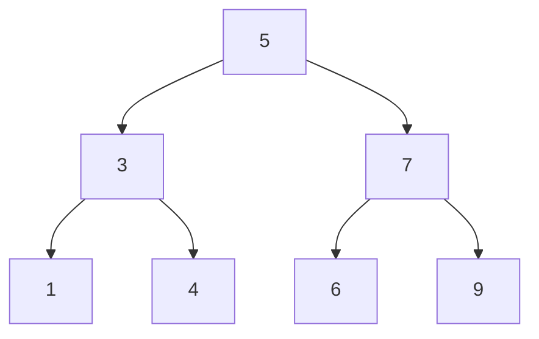
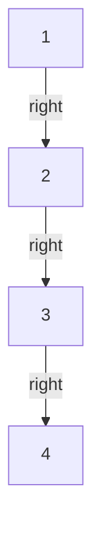

## 정의

**Binary Search Tree (BST)** 는 각 노드가 다음 **BST 불변식**을 만족하는 이진 트리:

- 왼쪽 서브트리의 모든 키 < 노드 키
- 오른쪽 서브트리의 모든 키 > 노드 키

**연산**: 탐색, 삽입, 삭제 모두 **평균 O(log N)**. 최악은 O(N) (편향 트리).

**핵심 성질**: 중위 순회 (inorder: 왼 -> 루트 -> 오른) 하면 키가 오름차순 정렬된 순서로 출력된다.

## 문제 상황

정렬 배열:
- 탐색 O(log N) (이진 탐색)
- 삽입/삭제 O(N) (원소 shift)

연결 리스트:
- 삽입/삭제 O(1) (포인터 조작)
- 탐색 O(N) (선형 탐색)

BST 는 두 자료구조의 트레이드오프를 해결: **탐색/삽입/삭제 모두 평균 O(log N)**.

## 시각화



탐색(4): 루트(5) -> 왼쪽(3) -> 오른쪽(4) 찾음. 비교 3회.

삽입(8): 루트(5) -> 오른(7) -> 오른(9) -> 9의 왼쪽에 삽입.

중위 순회: 1, 3, 4, 5, 6, 7, 9 (오름차순).

## 핵심 아이디어

### 탐색 (search)

현재 노드와 목표 키를 비교해 재귀:

```text
search(node, k):
    if node is null or node.key == k: return node
    if k < node.key: return search(node.left, k)
    else:            return search(node.right, k)
```

트리 높이 H 에 비례 = O(H). 균형 트리이면 H = O(log N).

### 삽입 (insert)

탐색과 동일한 경로로 내려가다 null 을 만나면 노드 생성:

```text
insert(node, k):
    if node is null: return new Node(k)
    if k < node.key: node.left  = insert(node.left,  k)
    else:            node.right = insert(node.right, k)
    return node
```

### 삭제 (delete)

삭제 케이스 3가지:
1. **자식 없음 (leaf)**: 그냥 제거.
2. **자식 1개**: 자식으로 대체.
3. **자식 2개**: **inorder successor** (오른쪽 서브트리의 최솟값) 를 현재 노드로 복사, successor 삭제.

## 알고리즘

### 전체 구현 (C++)

```cpp
struct Node {
    int key;
    Node *l, *r;
    Node(int k) : key(k), l(nullptr), r(nullptr) {}
};

Node* search(Node* r, int k) {
    if (!r || r->key == k) return r;
    return k < r->key ? search(r->l, k) : search(r->r, k);
}

Node* insert(Node* r, int k) {
    if (!r) return new Node(k);
    if (k < r->key) r->l = insert(r->l, k);
    else if (k > r->key) r->r = insert(r->r, k);
    return r;
}

Node* minNode(Node* r) {
    while (r->l) r = r->l;
    return r;
}

Node* remove(Node* r, int k) {
    if (!r) return nullptr;
    if (k < r->key) r->l = remove(r->l, k);
    else if (k > r->key) r->r = remove(r->r, k);
    else {
        // 삭제 케이스
        if (!r->l) { Node* tmp = r->r; delete r; return tmp; }
        if (!r->r) { Node* tmp = r->l; delete r; return tmp; }
        // 자식 2개: inorder successor
        Node* succ = minNode(r->r);
        r->key = succ->key;
        r->r = remove(r->r, succ->key);
    }
    return r;
}
```

### 중위 순회

```cpp
void inorder(Node* r, vector<int>& res) {
    if (!r) return;
    inorder(r->l, res);
    res.push_back(r->key);
    inorder(r->r, res);
}
```

## 구현

<CodeWithOutput
  variants={[
    {
      language: "cpp",
      label: "C++",
      code: `#include <bits/stdc++.h>
using namespace std;

struct Node {
    int key;
    Node *l, *r;
    Node(int k) : key(k), l(nullptr), r(nullptr) {}
};

Node* insert(Node* r, int k) {
    if (!r) return new Node(k);
    if (k < r->key) r->l = insert(r->l, k);
    else if (k > r->key) r->r = insert(r->r, k);
    return r;
}

Node* minNode(Node* r) { while (r->l) r = r->l; return r; }

Node* remove(Node* r, int k) {
    if (!r) return nullptr;
    if (k < r->key) r->l = remove(r->l, k);
    else if (k > r->key) r->r = remove(r->r, k);
    else {
        if (!r->l) { Node* t = r->r; delete r; return t; }
        if (!r->r) { Node* t = r->l; delete r; return t; }
        Node* s = minNode(r->r);
        r->key = s->key;
        r->r = remove(r->r, s->key);
    }
    return r;
}

void inorder(Node* r, vector<int>& v) {
    if (!r) return;
    inorder(r->l, v);
    v.push_back(r->key);
    inorder(r->r, v);
}

int main() {
    ios::sync_with_stdio(false);
    cin.tie(nullptr);

    int n; cin >> n;
    Node* root = nullptr;
    for (int i = 0; i < n; i++) {
        int x; cin >> x;
        root = insert(root, x);
    }
    // 삭제
    int d; cin >> d;
    root = remove(root, d);
    // 중위 순회 출력
    vector<int> res;
    inorder(root, res);
    for (int i = 0; i < (int)res.size(); i++) {
        cout << res[i];
        if (i + 1 < (int)res.size()) cout << " ";
    }
    cout << "\\n";
}`,
    },
    {
      language: "python",
      label: "Python",
      code: `import sys
input = sys.stdin.readline

class Node:
    def __init__(self, key):
        self.key = key
        self.l = self.r = None

def insert(node, k):
    if node is None:
        return Node(k)
    if k < node.key:
        node.l = insert(node.l, k)
    elif k > node.key:
        node.r = insert(node.r, k)
    return node

def min_node(node):
    while node.l:
        node = node.l
    return node

def remove(node, k):
    if node is None:
        return None
    if k < node.key:
        node.l = remove(node.l, k)
    elif k > node.key:
        node.r = remove(node.r, k)
    else:
        if node.l is None:
            return node.r
        if node.r is None:
            return node.l
        s = min_node(node.r)
        node.key = s.key
        node.r = remove(node.r, s.key)
    return node

def inorder(node, res):
    if node is None:
        return
    inorder(node.l, res)
    res.append(node.key)
    inorder(node.r, res)

n = int(input())
vals = list(map(int, input().split()))
root = None
for v in vals:
    root = insert(root, v)
d = int(input())
root = remove(root, d)
res = []
inorder(root, res)
print(*res)`,
    },
  ]}
  cases={[
    {
      label: "삽입 후 삭제",
      input: `6
5 3 7 1 4 9
3`,
      output: `1 4 5 7 9`,
    },
  ]}
/>

## 복잡도

| 연산 | 평균 | 최악 (편향) |
|:---|:---:|:---:|
| **탐색** | O(log N) | O(N) |
| **삽입** | O(log N) | O(N) |
| **삭제** | O(log N) | O(N) |
| **중위 순회** | O(N) | O(N) |
| **공간** | O(N) | O(N) |

## 왜 균형이 필요한가

정렬된 입력 `1, 2, 3, ..., N` 을 순서대로 삽입하면 **오른쪽으로만 뻗는 일자 트리** 가 되어 높이 H = N, 모든 연산이 O(N) 로 퇴화.



이를 해결하는 **균형 BST**:

| 자료구조 | 균형 전략 | 사용 |
|:---|:---|:---|
| [[avl-tree|AVL Tree]] | 높이 차 <= 1, 회전 | 탐색 편향 시 유리 |
| **Red-Black Tree** | 색 기반 완화 균형 | C++ STL set/map |
| [[bbst|Treap]] | 우선순위 무작위화 | 경쟁 프로그래밍 |
| **Splay Tree** | 최근 접근 노드 루트로 | 캐시 패턴 편향 시 |
| [[order-statistics-tree|OST]] | BST + 서브트리 크기 | rank/select 필요 시 |

## 함정

### 1. 중복 원소 처리

`k < r->key` / `k > r->key` 만 처리하면 중복은 삽입 무시. 중복 허용이 필요하면 `k <= r->key` 로 왼쪽에 넣거나 카운터 필드 추가.

> [!WARNING]
> 중복 원소를 왼/오른쪽에 일관성 없이 넣으면 삭제 시 버그 발생. 방향을 통일해야 한다.

### 2. 삭제 후 inorder successor 재귀 삭제

```cpp
Node* s = minNode(r->r);
r->key = s->key;
r->r = remove(r->r, s->key);  // s->key 로 삭제해야 정확
```

`s` 포인터를 직접 삭제하면 안 된다. `remove` 재귀로 처리해야 구조 유지.

### 3. 메모리 누수 (C++)

`delete r` 을 leaf 삭제 시점에 해야 한다. 재귀 삭제 시 자식 포인터가 남아 있으면 누수.

### 4. 랜덤 입력 가정

BST 평균 O(log N) 는 **입력이 랜덤 순서**일 때만. 정렬/역순 입력이면 O(N). 실전에서는 균형 BST 사용 권장.

## BOJ 연습 문제

| 번호 | 제목 | 비고 |
|:---|:---|:---|
| BOJ 5639 | 이진 검색 트리 | 전위 순회로 BST 복원 |
| BOJ 2104 | 부분배열 고르기 | BST 응용 |
| BOJ 1991 | 트리 순회 | 전위/중위/후위 순회 |

## 참고

- [[avl-tree|AVL Tree]] (엄격한 균형)
- [[bbst|Treap / BBST]] (균형 BST)
- [[order-statistics-tree|Order Statistics Tree]] (BST + rank/select)
- [[segtree|Segment Tree]] (구간 쿼리)
- [[fenwick-tree|Fenwick Tree]] (prefix sum)
