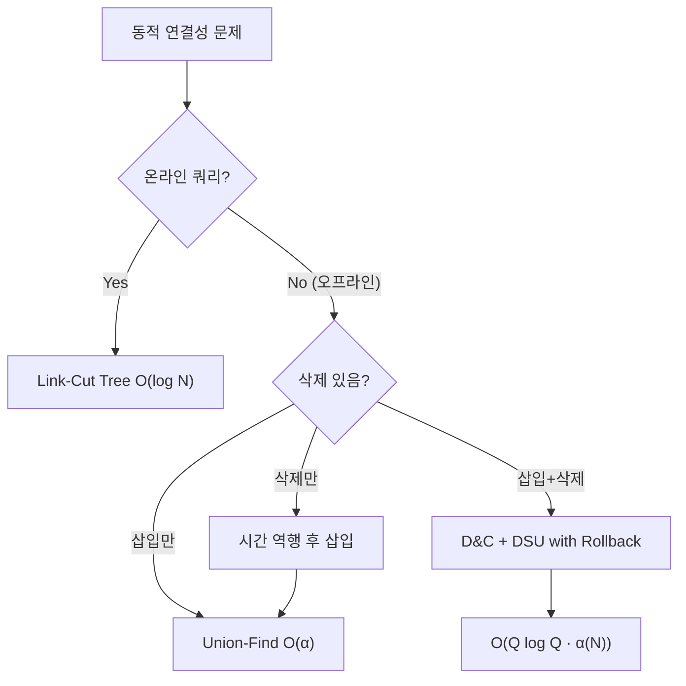

## 정의

**Dynamic Connectivity** 는 간선의 **추가와 삭제** 가 모두 일어나는 그래프에서 두 정점의 연결 여부를 유지하는 문제입니다.

- 정점 N 개, 쿼리 Q 개
- 각 쿼리: 간선 추가 / 간선 삭제 / 두 정점이 같은 컴포넌트인지 확인

## 문제 상황과 동기

간선 삽입만 있는 경우 [[disjoint-set|Union-Find]] 로 O(α(N)) amortized 처리가 가능합니다. 하지만 **삭제가 포함되면** Union-Find 를 그대로 쓸 수 없습니다.

| 연산 | 방법 | 복잡도 |
|:---|:---|:---|
| 삽입만 | [[disjoint-set|Union-Find]] | O(α(N)) amortized |
| 삭제만 | 시간 역행 후 삽입 문제로 환원 | O(α(N)) amortized |
| 삽입 + 삭제 (오프라인) | D&C + DSU with Rollback | O(Q log Q · α(N)) |
| 삽입 + 삭제 (온라인) | [[dynamic-tree|Link-Cut Tree]] | O(Q log N) |

### 오프라인 vs 온라인

**오프라인**: 쿼리를 미리 전부 알고 있는 경우. 배치 처리 가능. PS 에서 가장 자주 등장.

**온라인**: 쿼리가 이전 답에 의존하는 경우. [[dynamic-tree|Link-Cut Tree]] 또는 [[euler-tour-technique|Euler Tour Tree]] 필요.

## 시각화

알고리즘 선택 흐름:



오프라인 D&C 핵심 구조:


## 핵심 아이디어

### 오프라인 D&C + DSU with Rollback

각 간선은 **존재하는 시간 구간** `[add_time, del_time)` 을 가집니다. 이 구간을 **세그먼트 트리의 시간 축** 에 배분하면, 각 노드에는 그 시간 범위 전체에서 활성인 간선 목록이 들어갑니다.

```
시간 [0, 8) 에서 간선 e 가 [2, 6) 에 존재한다면:
  세그트리 노드 [2,3], [4,5] 등에 e 를 배분 (최대 2 log Q 개 노드)
```

트리를 DFS 하며:
- **진입**: 현재 노드의 간선들을 DSU 에 추가 (union by rank, path compression 없이)
- **리프 도달**: 해당 시간 슬롯의 쿼리에 답
- **퇴출**: 진입 시 추가한 간선들을 롤백

### Rollback DSU

Path compression 을 **쓰지 않고** union by rank 만 사용. 대신 연산 스택에 변경 내역을 기록하고 퇴출 시 되돌립니다.

```
rollback_stack: [(node, old_parent, old_rank), ...]
union(u, v):
    u = find(u), v = find(v)  // path compression 없이
    if rank[u] < rank[v]: swap(u, v)
    stack.push((v, parent[v], rank[u]))
    parent[v] = u
    if rank[u] == rank[v]: rank[u]++

rollback(checkpoint):
    while stack.size() > checkpoint:
        (v, old_parent, old_rank_u) = stack.pop()
        parent[v] = old_parent (즉, v)
        rank[find(v)] = old_rank_u
```

### Small-to-Large 병합 (Smaller-to-Larger Merge)

[[smaller-to-larger|Smaller-to-Larger]] 기법은 동적 연결성과 조합할 수 있습니다. 각 컴포넌트의 속성 집합을 유지할 때, 크기가 작은 쪽을 큰 쪽에 병합하면 총 이동 횟수 O(N log N).

## 알고리즘: 오프라인 D&C

### 전처리

1. 각 간선의 `(add_time, del_time)` 구간 계산
2. 세그먼트 트리 노드에 간선 배분: `assign(node, l, r, el, er, edge_id)`
3. 쿼리 배열 구성: `queries[t]` = 시간 t 에서 확인할 (u, v) 쌍

### DFS

```text
dfs(node, l, r, dsu):
    checkpoint = dsu.stack.size()
    for edge in seg_tree[node]:
        dsu.union(edge.u, edge.v)
    if l == r:
        answer[queries[l]] = dsu.connected(qu, qv)
    else:
        mid = (l + r) / 2
        dfs(2*node, l, mid, dsu)
        dfs(2*node+1, mid+1, r, dsu)
    dsu.rollback(checkpoint)
```

## 구현

<CodeWithOutput
  variants={[
    {
      language: "cpp",
      label: "C++",
      code: `// Dynamic Connectivity: Offline D&C + DSU with Rollback
#include <bits/stdc++.h>
using namespace std;

struct DSU {
    vector<int> par, rank_;
    vector<pair<int,int>> stk; // (node, old_par_or_rank_flag)
    vector<tuple<int,int,int>> ops; // (v, old_par, old_rank_u)

    DSU(int n) : par(n), rank_(n, 0) {
        iota(par.begin(), par.end(), 0);
    }
    int find(int x) {
        while (par[x] != x) x = par[x]; // no path compression
        return x;
    }
    bool unite(int u, int v) {
        u = find(u); v = find(v);
        if (u == v) { ops.push_back({-1, -1, -1}); return false; }
        if (rank_[u] < rank_[v]) swap(u, v);
        ops.push_back({v, par[v], rank_[u]});
        par[v] = u;
        if (rank_[u] == rank_[v]) rank_[u]++;
        return true;
    }
    bool connected(int u, int v) { return find(u) == find(v); }
    int checkpoint() { return ops.size(); }
    void rollback(int cp) {
        while ((int)ops.size() > cp) {
            auto [v, old_par, old_rank_u] = ops.back(); ops.pop_back();
            if (v == -1) continue;
            rank_[par[v]] = old_rank_u;
            par[v] = old_par; // restore to itself
        }
    }
};

const int MAXQ = 1 << 18;
vector<pair<int,int>> seg[MAXQ * 2];

void seg_add(int node, int l, int r, int ql, int qr, pair<int,int> e) {
    if (qr < l || r < ql) return;
    if (ql <= l && r <= qr) { seg[node].push_back(e); return; }
    int mid = (l + r) / 2;
    seg_add(2*node, l, mid, ql, qr, e);
    seg_add(2*node+1, mid+1, r, ql, qr, e);
}

int ans[MAXQ];
pair<int,int> query[MAXQ]; // {u, v}

void dfs(int node, int l, int r, DSU& dsu) {
    int cp = dsu.checkpoint();
    for (auto [u, v] : seg[node]) dsu.unite(u, v);
    if (l == r) {
        if (query[l].first != -1)
            ans[l] = dsu.connected(query[l].first, query[l].second);
    } else {
        int mid = (l + r) / 2;
        dfs(2*node, l, mid, dsu);
        dfs(2*node+1, mid+1, r, dsu);
    }
    dsu.rollback(cp);
}

int main() {
    ios::sync_with_stdio(0); cin.tie(0);
    int n, q; cin >> n >> q;
    // edge_time[{u,v}] = add_time
    map<pair<int,int>, int> edge_time;

    fill(query, query + q, make_pair(-1, -1));

    for (int t = 0; t < q; t++) {
        int type; cin >> type;
        if (type == 1) { // add edge
            int u, v; cin >> u >> v;
            if (u > v) swap(u, v);
            edge_time[{u, v}] = t;
        } else if (type == 2) { // delete edge
            int u, v; cin >> u >> v;
            if (u > v) swap(u, v);
            auto it = edge_time.find({u, v});
            seg_add(1, 0, q-1, it->second, t-1, {u, v});
            edge_time.erase(it);
        } else { // query connectivity
            int u, v; cin >> u >> v;
            query[t] = {u, v};
        }
    }
    // 쿼리 종료 시까지 살아있는 간선
    for (auto& [e, st] : edge_time)
        seg_add(1, 0, q-1, st, q-1, e);

    DSU dsu(n);
    dfs(1, 0, q-1, dsu);

    for (int t = 0; t < q; t++)
        if (query[t].first != -1)
            cout << (ans[t] ? "YES" : "NO") << "\\n";
}`,
    },
    {
      language: "python",
      label: "Python",
      code: `# Dynamic Connectivity: Offline D&C + DSU with Rollback
import sys
from collections import defaultdict
input = sys.stdin.readline

class DSU:
    def __init__(self, n):
        self.par = list(range(n))
        self.rank = [0] * n
        self.ops = []  # (v, old_par_v, old_rank_u)

    def find(self, x):
        while self.par[x] != x:
            x = self.par[x]  # no path compression
        return x

    def unite(self, u, v):
        u, v = self.find(u), self.find(v)
        if u == v:
            self.ops.append(None)
            return False
        if self.rank[u] < self.rank[v]:
            u, v = v, u
        self.ops.append((v, self.par[v], self.rank[u]))
        self.par[v] = u
        if self.rank[u] == self.rank[v]:
            self.rank[u] += 1
        return True

    def connected(self, u, v):
        return self.find(u) == self.find(v)

    def checkpoint(self):
        return len(self.ops)

    def rollback(self, cp):
        while len(self.ops) > cp:
            op = self.ops.pop()
            if op is None:
                continue
            v, old_par, old_rank_u = op
            self.rank[self.par[v]] = old_rank_u
            self.par[v] = old_par

def main():
    n, q = map(int, input().split())
    seg = defaultdict(list)

    def seg_add(node, l, r, ql, qr, e):
        if qr < l or r < ql:
            return
        if ql <= l and r <= qr:
            seg[node].append(e)
            return
        mid = (l + r) // 2
        seg_add(2*node, l, mid, ql, qr, e)
        seg_add(2*node+1, mid+1, r, ql, qr, e)

    edge_time = {}
    queries = [None] * q

    for t in range(q):
        line = input().split()
        tp = int(line[0])
        u, v = int(line[1]), int(line[2])
        if u > v:
            u, v = v, u
        if tp == 1:
            edge_time[(u, v)] = t
        elif tp == 2:
            st = edge_time.pop((u, v))
            seg_add(1, 0, q-1, st, t-1, (u, v))
        else:
            queries[t] = (u, v)

    for e, st in edge_time.items():
        seg_add(1, 0, q-1, st, q-1, e)

    dsu = DSU(n)
    ans = {}

    def dfs(node, l, r):
        cp = dsu.checkpoint()
        for u, v in seg[node]:
            dsu.unite(u, v)
        if l == r:
            if queries[l] is not None:
                u, v = queries[l]
                ans[l] = dsu.connected(u, v)
        else:
            mid = (l + r) // 2
            dfs(2*node, l, mid)
            dfs(2*node+1, mid+1, r)
        dsu.rollback(cp)

    sys.setrecursionlimit(10**6)
    dfs(1, 0, q-1)

    out = []
    for t in range(q):
        if queries[t] is not None:
            out.append("YES" if ans[t] else "NO")
    print("\\n".join(out))

main()`,
    },
  ]}
  cases={[
    {
      label: "기본",
      input: `4 6
1 0 1
1 1 2
3 0 2
2 1 2
3 0 2
3 0 3`,
      output: `YES
YES
NO`,
    },
  ]}
/>

## 복잡도

| 방법 | 쿼리 | 전처리/공간 | 비고 |
|:---|:---:|:---:|:---|
| D&C + DSU Rollback | O(log Q · α(N)) | O(Q log Q) | 오프라인 |
| [[dynamic-tree|Link-Cut Tree]] | O(log N) | O(N) | 온라인 |
| Holm-Lichtenberg-Thorup | O(log² N) amortized | O(N + M) | 온라인, 구현 복잡 |

오프라인 D&C 는 **세그트리 높이 O(log Q)** 번 union/rollback 이 발생하고, 각 union/find 는 rank 만 쓰므로 O(log N). 총 O(Q log Q log N).

## 변형 / 활용

### 간선 가중치 연결성

간선에 가중치가 있고, "임의 경로 중 최대 간선 가중치 최솟값" 을 구하는 경우 ([[dynamic-tree|Link-Cut Tree]] 의 path aggregate 기능) 도 D&C 프레임워크로 처리 가능.

### 연결 컴포넌트 크기 유지

DSU 에 컴포넌트 크기 배열을 추가하고 롤백 시 함께 복구. 추가 비용 없음.

### 이분 그래프 여부 체크

간선 추가/삭제 중 이분성 유지 여부: 가중치 있는 DSU (홀수 사이클 감지) + 롤백.

### [[euler-tour-technique|Euler Tour Tree]] 기반 온라인

온라인이 필요하면 각 스패닝 포레스트를 Euler Tour 로 표현, 스패닝 포레스트 간선 추가/삭제를 O(log² N) 에 처리.

## 함정

> [!WARNING]
> DSU with Rollback 에서 **path compression 절대 금지**. Path compression 을 쓰면 롤백이 불가능합니다. Union by rank 만 사용하세요.

### 1. 간선 중복 처리

같은 간선이 여러 번 추가/삭제되는 경우 `edge_time` 을 multimap 또는 카운터로 관리해야 합니다.

### 2. 쿼리 인덱스

시간 축 [0, Q) 는 쿼리 개수로 잡되, 간선 add/del 이 같은 시간 슬롯에 쿼리가 없어도 올바르게 처리해야 합니다.

### 3. 재귀 깊이

Python 에서 `sys.setrecursionlimit(10**6)` 필수. Q = 10^5 면 세그트리 높이 17, 충분.

### 4. 메모리

세그트리 노드 `2Q` 개 × 간선 목록. 최악 O(Q log Q) 간선. Q = 10^5 에서 약 170만 간선 슬롯.

## BOJ 연습 문제

| 번호 | 제목 | 링크 |
|:---|:---|:---|
| BOJ 15675 | 괄호 문자열과 쿼리 (연결성 변형) | [BOJ](https://www.acmicpc.net/problem/15675) |
| BOJ 16905 | Dynamic Graph | [BOJ](https://www.acmicpc.net/problem/16905) |

## 참고

- [[disjoint-set|Union-Find]]
- [[dynamic-tree|Link-Cut Tree]]
- [[euler-tour-technique|Euler Tour Tree]]
- [[smaller-to-larger|Smaller-to-Larger 병합]]
- [[segtree|Segment Tree]]
