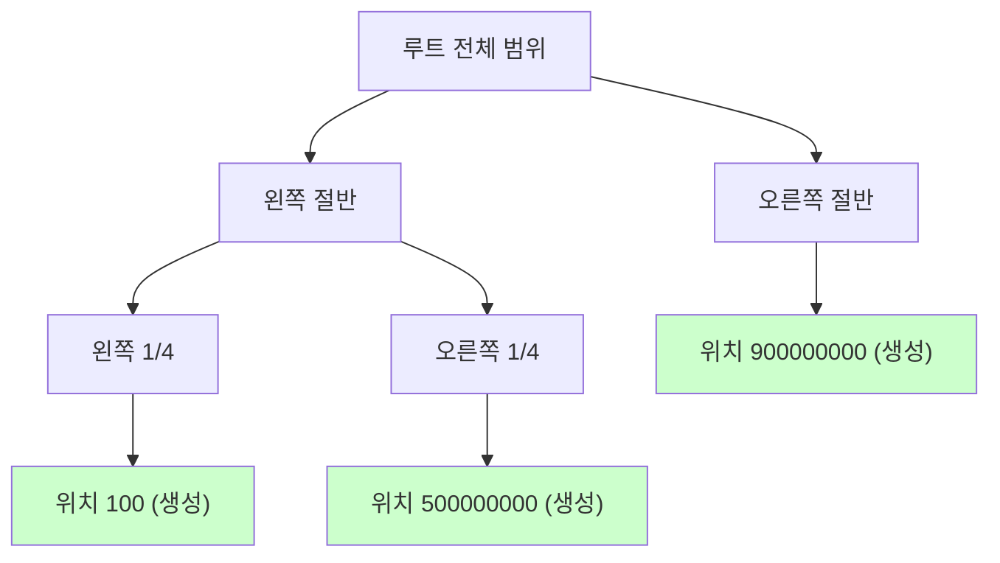
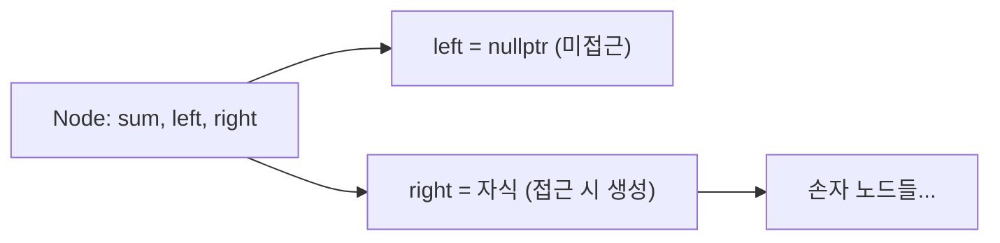

## 정의

**Dynamic Segment Tree** 는 값 범위가 매우 크지만 실제 접근 위치가 희소할 때, **필요한 노드만 동적으로 생성** 하는 세그먼트 트리.

**공간**: O(Q log V), Q = 쿼리 수, V = 값 범위 (최대 10^18).

일반 세그먼트 트리는 O(V) 공간 필요 → V = 10^9 이면 4GB, 불가능. 동적 세그먼트 트리는 실제 접근한 위치만 노드 생성.

## 문제 상황과 동기

### 언제 필요한가

- **좌표 범위가 극단적**: 1 <= x <= 10^9, 하지만 쿼리 수 Q <= 10^5
- **온라인 쿼리**: 좌표 압축을 위해 쿼리를 미리 알아야 하지만 불가능한 경우
- **버전 추적 불필요**: Persistent Segtree 보다 구현 단순

### 방법 비교

| 방법 | 전제 조건 | 공간 | 복잡도 |
|:---|:---|:---|:---|
| 일반 세그트리 | V 작음 | O(V) | 낮음 |
| 좌표 압축 + 세그 | 오프라인 처리 | O(Q) | 낮음 |
| **동적 세그트리** | **온라인, V 큼** | **O(Q log V)** | **중간** |
| [[persistent-segtree|Persistent Segtree]] | 버전 추적 필요 | O(Q log V) | 높음 |

## 시각화

### 희소 노드 생성 원리

범위 [1, 10^9] 에서 쿼리 3개: 위치 100, 500000000, 900000000.



3개 쿼리 = 약 3 x log(10^9) = 약 90개 노드만 생성. 나머지는 nullptr.

### 포인터 노드 구조



## 핵심 아이디어

**Lazy node creation**: 자식에 실제 접근할 때만 `new Node()` 생성. nullptr 이면 값은 기본값 0.

두 가지 구현 방식:

1. **포인터 기반**: `Node* left, *right` - 직관적, 동적 메모리 할당
2. **Pool allocator**: 배열 풀 미리 확보, 인덱스로 자식 참조 - 캐시 친화, new 오버헤드 없음

실전에서는 **Pool allocator** 권장 (TLE 방지).

## 알고리즘

### Update (점 업데이트)

```text
update(node, lo, hi, pos, delta):
    if node is null: node = new Node()
    if lo == hi:
        node.sum += delta
        return
    mid = (lo + hi) / 2
    if pos <= mid: update(node.left, lo, mid, pos, delta)
    else: update(node.right, mid+1, hi, pos, delta)
    node.sum = (node.left?.sum or 0) + (node.right?.sum or 0)
```

### Query (구간 합)

```text
query(node, lo, hi, ql, qr):
    if node is null: return 0
    if ql <= lo and hi <= qr: return node.sum
    mid = (lo + hi) / 2
    result = 0
    if ql <= mid: result += query(node.left, lo, mid, ql, qr)
    if qr > mid: result += query(node.right, mid+1, hi, ql, qr)
    return result
```

## 구현

<CodeWithOutput
  variants={[
    {
      language: "cpp",
      label: "C++",
      code: `// Dynamic Segment Tree - 구간 합
// 범위 [1, 10^9], 포인터 기반 + Pool allocator 두 방법
#include <bits/stdc++.h>
using namespace std;

// ===== 방법 1: 포인터 기반 =====
struct NodeP {
    long long sum = 0;
    NodeP *l = nullptr, *r = nullptr;
};

void update_p(NodeP*& n, long long lo, long long hi, long long pos, long long v) {
    if (!n) n = new NodeP();
    if (lo == hi) { n->sum += v; return; }
    long long mid = (lo + hi) / 2;
    if (pos <= mid) update_p(n->l, lo, mid, pos, v);
    else            update_p(n->r, mid+1, hi, pos, v);
    n->sum = (n->l ? n->l->sum : 0) + (n->r ? n->r->sum : 0);
}

long long query_p(NodeP* n, long long lo, long long hi, long long ql, long long qr) {
    if (!n) return 0;
    if (ql <= lo && hi <= qr) return n->sum;
    long long mid = (lo + hi) / 2, res = 0;
    if (ql <= mid) res += query_p(n->l, lo, mid, ql, qr);
    if (qr > mid)  res += query_p(n->r, mid+1, hi, ql, qr);
    return res;
}

// ===== 방법 2: Pool allocator (실전 권장) =====
const int POOL = 6000000;  // Q * log(V) 여유 있게
struct NodeA { long long sum; int l, r; } pool[POOL];
int pcnt = 1;  // 0 은 null 역할

void update_a(int n, long long lo, long long hi, long long pos, long long v) {
    pool[n].sum += v;
    if (lo == hi) return;
    long long mid = (lo + hi) / 2;
    if (pos <= mid) {
        if (!pool[n].l) pool[n].l = pcnt++;
        update_a(pool[n].l, lo, mid, pos, v);
    } else {
        if (!pool[n].r) pool[n].r = pcnt++;
        update_a(pool[n].r, mid+1, hi, pos, v);
    }
}

long long query_a(int n, long long lo, long long hi, long long ql, long long qr) {
    if (!n) return 0;
    if (ql <= lo && hi <= qr) return pool[n].sum;
    long long mid = (lo + hi) / 2, res = 0;
    if (ql <= mid) res += query_a(pool[n].l, lo, mid, ql, qr);
    if (qr > mid)  res += query_a(pool[n].r, mid+1, hi, ql, qr);
    return res;
}

int main() {
    const long long V = 1e9;

    // 포인터 기반
    NodeP* root_p = nullptr;
    update_p(root_p, 1, V, 100LL, 5);
    update_p(root_p, 1, V, 500000000LL, 3);
    update_p(root_p, 1, V, 900000000LL, 7);
    cout << "포인터: [100, 9e8] = "
         << query_p(root_p, 1, V, 100, 900000000LL) << "\\n";  // 15

    // Pool allocator
    int root_a = pcnt++;
    update_a(root_a, 1, V, 100LL, 5);
    update_a(root_a, 1, V, 500000000LL, 3);
    cout << "Pool: [1, 5e8] = "
         << query_a(root_a, 1, V, 1, 500000000LL) << "\\n";  // 8
}`,
    },
    {
      language: "python",
      label: "Python",
      code: `# Dynamic Segment Tree - 딕셔너리 기반 (Python 특성 활용)
class DynamicSegTree:
    def __init__(self, lo, hi):
        self.lo = lo
        self.hi = hi
        self.nodes = {}  # (lo, hi) -> sum

    def update(self, pos, val):
        self._update(self.lo, self.hi, pos, val)

    def query(self, ql, qr):
        return self._query(self.lo, self.hi, ql, qr)

    def _update(self, lo, hi, pos, val):
        key = (lo, hi)
        self.nodes[key] = self.nodes.get(key, 0) + val
        if lo == hi:
            return
        mid = (lo + hi) // 2
        if pos <= mid:
            self._update(lo, mid, pos, val)
        else:
            self._update(mid + 1, hi, pos, val)

    def _query(self, lo, hi, ql, qr):
        key = (lo, hi)
        if key not in self.nodes:
            return 0
        if ql <= lo and hi <= qr:
            return self.nodes[key]
        mid = (lo + hi) // 2
        res = 0
        if ql <= mid:
            res += self._query(lo, mid, ql, qr)
        if qr > mid:
            res += self._query(mid + 1, hi, ql, qr)
        return res

# 사용 예시 (범위 [1, 10^9])
seg = DynamicSegTree(1, 10**9)
seg.update(100, 5)
seg.update(500_000_000, 3)
seg.update(900_000_000, 7)

print(seg.query(1, 10**9))              # 15
print(seg.query(100, 500_000_000))      # 8
print(seg.query(1, 99))                 # 0
print(f"노드 수: {len(seg.nodes)}")     # 약 3*30 = 90`,
    },
  ]}
  cases={[
    {
      label: "희소 업데이트 후 구간 합",
      input: "update(100,5), update(500000000,3), update(900000000,7)\nquery(1, 10^9)",
      output: "15",
    },
    {
      label: "부분 구간 쿼리",
      input: "query(100, 500000000)",
      output: "8",
    },
    {
      label: "빈 구간 쿼리",
      input: "query(1, 99)",
      output: "0",
    },
  ]}
/>

## 복잡도

| 항목 | 값 |
|:---|:---|
| **Update** | O(log V) |
| **Query** | O(log V) |
| **공간** | O(Q log V) |

Q = 총 쿼리 수, V = 값 범위. V = 10^9 이면 log V ≈ 30, Q = 2 x 10^5 이면 약 600만 노드.

## Lazy Propagation 결합

구간 업데이트 (범위 전체에 값 추가) 가 필요하면 lazy tag 추가:

```cpp
struct NodeL {
    long long sum = 0, lazy = 0;
    NodeL *l = nullptr, *r = nullptr;
};

void push_down(NodeL* n, long long lo, long long hi) {
    if (!n->lazy) return;
    long long mid = (lo + hi) / 2;
    if (!n->l) n->l = new NodeL();
    if (!n->r) n->r = new NodeL();
    n->l->sum += n->lazy * (mid - lo + 1);
    n->l->lazy += n->lazy;
    n->r->sum += n->lazy * (hi - mid);
    n->r->lazy += n->lazy;
    n->lazy = 0;
}
```

## 함정

### 1. Pool 크기 부족

Q x log(V) 를 넉넉히 잡지 않으면 배열 초과. V = 10^9 이면 log_2 V ≈ 30, 구간 업데이트는 x2 필요.

### 2. new/delete 반복 시 TLE

포인터 기반에서 매 쿼리마다 new 하면 할당자 오버헤드. Pool 방식 권장.

### 3. Lazy push 시 nullptr 자식 생성 타이밍

push_down 에서 nullptr 자식을 즉시 생성해야 lazy 값 전파 가능.

### 4. Pool 인덱스 0 충돌

Pool 기반에서 0 을 null 로 사용하고 실제 노드는 인덱스 1 부터. pcnt = 1 로 초기화.

### 5. 음수 좌표 범위

범위가 [-10^9, 10^9] 이면 lo, hi 타입을 long long 으로 선언. int 오버플로우 주의.

## 대안 비교

- **좌표 압축 + 일반 [[segtree|Segment Tree]]**: 오프라인 처리 가능하면 더 빠르고 단순
- **[[persistent-segtree|Persistent Segtree]]**: 버전 추적 (과거 상태 쿼리) 필요 시
- **BIT (펜윅 트리)**: 점 업데이트 + 구간 합만 필요하면 구현 단순, 동적 버전은 복잡

## BOJ 연습 문제

| 번호 | 제목 | 정답률 | 링크 |
|:---|:---|---:|:---|
| BOJ 12899 | 데이터 구조 | 47.2% | [kokoa-lab](https://github.com/kokoa-lab/boj-problems/tree/main/organize_problems/12800-12899/12899) |
| BOJ 3653 | 영화 수집 | 42.3% | [kokoa-lab](https://github.com/kokoa-lab/boj-problems/tree/main/organize_problems/3600-3699/3653) |
| BOJ 1168 | 요세푸스 문제 2 | 41.7% | [kokoa-lab](https://github.com/kokoa-lab/boj-problems/tree/main/organize_problems/1100-1199/1168) |

## 참고

- [[segtree|Segment Tree]]
- [[persistent-segtree|Persistent Segtree]]
