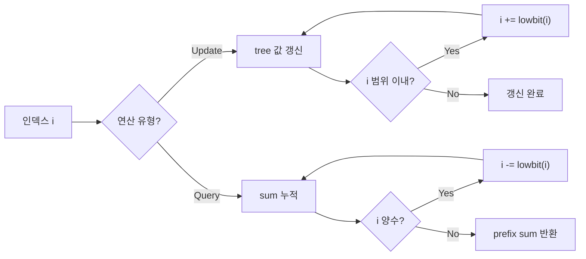

## 정의

**Fenwick Tree** (또는 **BIT, Binary Indexed Tree**) 는 배열의 **prefix sum 을 O(log N) 에 갱신·조회** 하는 자료구조입니다. Peter Fenwick 이 1994 년 발표.

핵심 아이디어: **각 인덱스가 자신의 lowbit 만큼의 구간을 담당** 하도록 정의하여, prefix 합을 몇 개의 노드 값의 합으로 표현합니다.

## 문제 상황

배열의 원소를 자주 변경하면서 구간 합을 빠르게 구해야 하는 상황.

- **naive**: 배열 직접 유지 → 갱신 O(1), 쿼리 O(N). 쿼리가 많을수록 느림.
- **prefix sum 배열**: 갱신 O(N), 쿼리 O(1). 원소가 자주 바뀌면 비용이 큼.
- **Fenwick Tree**: 갱신 O(log N), 쿼리 O(log N). 두 연산의 균형점.

핵심 통찰: *각 인덱스가 2의 거듭제곱 크기의 구간을 담당하도록 설계하면, O(log N) 번의 비트 조작으로 prefix sum 을 계산할 수 있다.*

## 왜 [[Segtree|Segment Tree]] 대신 쓰는가

| 항목 | Fenwick Tree | Segment Tree |
|:---|:---|:---|
| 코드 길이 | 매우 짧음 (10줄) | 김 (30~50줄) |
| 상수 | 매우 작음 | 큼 |
| 지원 연산 | 합, XOR 등 역연산 가능한 것 | 임의 결합 연산 (min, max, gcd) |
| 구간 갱신 | 별도 트릭 필요 | Lazy propagation 자연스럽게 지원 |

**합 쿼리 위주라면 Fenwick 이 압도적**입니다.

## lowbit 연산

핵심은 **`x & -x`** (2의 보수 특성).

- x = 6 = `0110` → `x & -x = 0010` = 2
- x = 12 = `1100` → `x & -x = 0100` = 4
- x = 8 = `1000` → `x & -x = 1000` = 8

**의미**: x 의 이진표현에서 **가장 낮은 1 비트** 만 남긴 값. 이것이 Fenwick 배열에서 그 인덱스가 담당하는 구간의 길이입니다.

## 구조

인덱스 i (1-based) 는 구간 $[i - \text{lowbit}(i) + 1, i]$ 의 합을 담당합니다.

```
i:  1 2 3 4 5 6 7 8
    │ ┴ │ ┴ ┴ ┴ │ ┴─────
    │   │       │       ┴
    ┴───┴───────┴───────
1 담당: [1,1]
2 담당: [1,2]
3 담당: [3,3]
4 담당: [1,4]
5 담당: [5,5]
6 담당: [5,6]
7 담당: [7,7]
8 담당: [1,8]
```

## 연산 흐름

Update 는 lowbit 를 **더하며** 상위로 올라가고, Query 는 lowbit 를 **빼며** 하위로 내려갑니다.



## Query 흐름 예 (N=8, query(6))

`6 = 110`

1. i=6 (`110`), t[6] 더함. i -= lowbit(6)=2 → i=4
2. i=4 (`100`), t[4] 더함. i -= lowbit(4)=4 → i=0
3. 종료.

prefix[6] = t[6] + t[4].

## Update 흐름 예 (N=8, update(3, +5))

`3 = 011`

1. i=3 (`011`), t[3]+=5. i += lowbit(3)=1 → i=4
2. i=4 (`100`), t[4]+=5. i += lowbit(4)=4 → i=8
3. i=8 (`1000`), t[8]+=5. i += lowbit(8)=8 → i=16 > 8, 종료.

## 구현

<CodeWithOutput
  variants={[
    {
      language: "cpp",
      label: "C++",
      code: `#include <bits/stdc++.h>
using namespace std;

struct Fenwick {
    vector<long long> t;
    int n;
    Fenwick(int n) : n(n), t(n + 1, 0) {}
    void update(int i, long long v) {
        for (; i <= n; i += i & -i) t[i] += v;
    }
    long long query(int i) {
        long long s = 0;
        for (; i > 0; i -= i & -i) s += t[i];
        return s;
    }
    long long range(int l, int r) {
        return query(r) - query(l - 1);
    }
};

int main() {
    int n, q; cin >> n >> q;
    Fenwick f(n);
    while (q--) {
        int op; cin >> op;
        if (op == 1) {
            int i; long long v; cin >> i >> v;
            f.update(i, v);
        } else {
            int l, r; cin >> l >> r;
            cout << f.range(l, r) << "\\n";
        }
    }
}`,
    },
    {
      language: "python",
      label: "Python",
      code: `import sys
input = sys.stdin.readline

class Fenwick:
    def __init__(self, n):
        self.n = n
        self.t = [0] * (n + 1)

    def update(self, i, v):
        while i <= self.n:
            self.t[i] += v
            i += i & -i

    def query(self, i):
        s = 0
        while i > 0:
            s += self.t[i]
            i -= i & -i
        return s

    def range_query(self, l, r):
        return self.query(r) - self.query(l - 1)

n, q = map(int, input().split())
f = Fenwick(n)
for _ in range(q):
    op, *args = map(int, input().split())
    if op == 1:
        f.update(args[0], args[1])
    else:
        print(f.range_query(args[0], args[1]))`,
    },
  ]}
  cases={[
    {
      label: "update + range query",
      input: `5 4
1 2 3
1 4 2
2 1 4
2 2 3`,
      output: `5
3`,
    },
    {
      label: "단일 원소 쿼리",
      input: `3 3
1 1 10
1 2 5
2 1 2`,
      output: `15`,
    },
  ]}
/>

**시간 복잡도**: update, query 모두 O(log N).

## 응용

### 1. 역수 세기 (Inversion Count)

배열 $a$ 에서 $i < j$ 지만 $a_i > a_j$ 인 쌍의 개수.

```cpp
// a 를 오른쪽에서 왼쪽으로 순회
long long inv = 0;
Fenwick f(MAX_VALUE);
for (int i = n - 1; i >= 0; i--) {
    inv += f.query(a[i] - 1);   // 나보다 작은 값이 오른쪽에 몇 개?
    f.update(a[i], 1);
}
```

### 2. K-th 원소 (Fenwick 위 이분탐색)

값들에 카운트를 저장하고, prefix 합을 이분탐색으로 뒤져 k 번째 값 찾기. O(log² N).

### 3. 구간 갱신 + 점 쿼리 (차분 배열 트릭)

```
update(l, r, v):  fenwick.update(l, +v); fenwick.update(r+1, -v);
query(i):         fenwick.query(i)  // = a[i] 값
```

### 4. 구간 갱신 + 구간 쿼리 (Fenwick 2 개)

BIT 두 개 $B_1, B_2$ 로 임의 구간 갱신, 구간 합을 O(log N) 유지 가능.

## 2D Fenwick

2 차원 부분합에도 확장:

```cpp
void update(int x, int y, long long v) {
    for (int i = x; i <= n; i += i & -i)
        for (int j = y; j <= m; j += j & -j)
            t[i][j] += v;
}

long long query(int x, int y) {
    long long s = 0;
    for (int i = x; i > 0; i -= i & -i)
        for (int j = y; j > 0; j -= j & -j)
            s += t[i][j];
    return s;
}
```

O(log² N), 이미지/그리드 계열 문제에 유용.

## 함정

- **인덱스 시작**: Fenwick 은 반드시 **1-based**. `i > 0` 종료 조건을 잊고 0-based 로 쓰면 무한 루프.
- **역연산 필요**: `range(l, r) = query(r) - query(l-1)` 이 되려면 **역연산 (뺄셈, XOR)** 이 있어야 함. `min/max` 는 Fenwick 로 쿼리 불가 → [[segtree|Segment Tree]] 사용.
- **크기 제한**: 좌표 압축 잊지 말 것. 값 범위가 크면 index 로 못 씀.
- **구간 갱신 주의**: `update(l, r, v)` 는 차분 배열 트릭 필요. 일반 update 와 혼용하면 버그.

## BOJ 연습 문제

| 번호 | 제목 | 정답률 | 링크 |
|:---|:---|---:|:---|
| BOJ 2042 | 구간 합 구하기 | - | [kokoa-lab](https://github.com/kokoa-lab/boj-problems/tree/main/organize_problems/2000-2099/2042) |
| BOJ 1275 | 커피숍2 | - | [kokoa-lab](https://github.com/kokoa-lab/boj-problems/tree/main/organize_problems/1200-1299/1275) |
| BOJ 11054 | 가장 긴 바이토닉 부분 수열 | - | [kokoa-lab](https://github.com/kokoa-lab/boj-problems/tree/main/organize_problems/11000-11099/11054) |
| BOJ 3392 | 화성 지도 | - | [kokoa-lab](https://github.com/kokoa-lab/boj-problems/tree/main/organize_problems/3300-3399/3392) |

## 참고

- 관련 [[segtree|Segment Tree]]: 임의 연산 지원
- 관련 [[prefix-sum|Prefix Sum]]: 정적 배열에 O(1) 쿼리
- 관련 [[merge-sort-tree|Merge Sort Tree]], [[wavelet-tree|Wavelet Tree]]: 더 복잡한 쿼리
- cp-algorithms: [Fenwick Tree](https://cp-algorithms.com/data_structures/fenwick.html)
