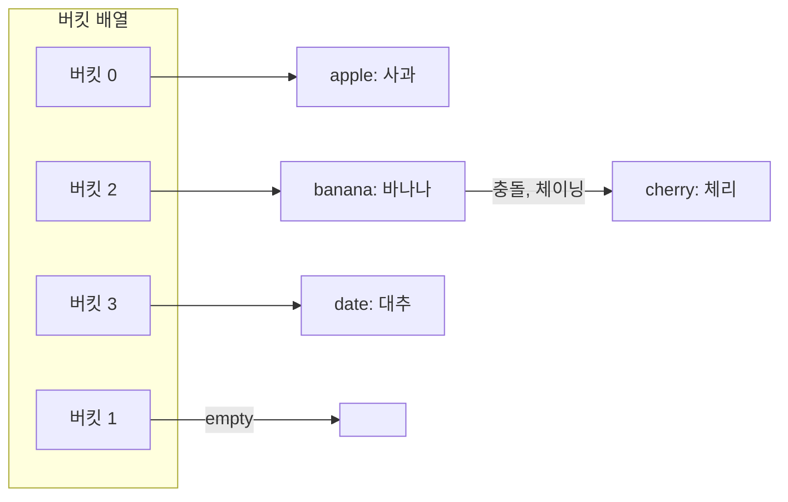
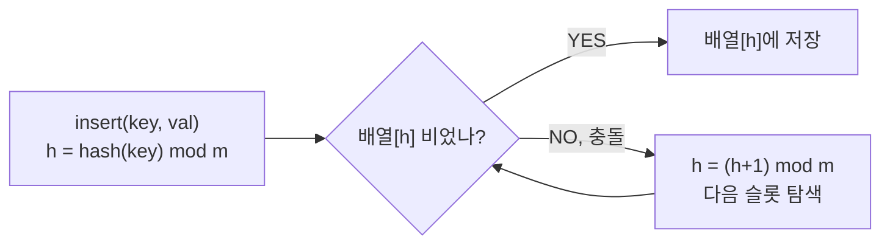

## 정의

**Hash Table** 은 해시 함수로 키를 배열 인덱스에 매핑하여 **평균 O(1)** 삽입/탐색/삭제를 제공하는 자료구조.

키 k를 인덱스 `h(k) mod m`으로 변환하여 버킷 배열에 저장. 두 키가 같은 인덱스를 가리키면 **충돌(collision)** 발생.

## 문제 상황

N개의 키-값 쌍을 저장하고, 임의 키에 대해 빠르게 값을 조회/삽입/삭제해야 한다.

**naive (정렬 배열)**: 이진 탐색으로 O(log N) 조회. 삽입/삭제 O(N).

**naive (연결 리스트)**: 탐색 O(N). 삽입 O(1).

**핵심 통찰**: 해시 함수로 키를 인덱스로 변환. 충돌이 없다면 O(1) 모든 연산. 충돌을 체이닝 또는 개방 주소법으로 처리.

## 시각화

### Chaining 구조 (버킷 배열 + 연결 리스트)



### Open Addressing (선형 탐사)



## 핵심 아이디어

### Chaining

각 버킷에 연결 리스트/트리 저장. 충돌 시 리스트에 추가.

- **삽입**: O(1) amortized (리스트 헤드에 추가)
- **탐색**: O(1) 평균, O(N) 최악 (해시 충돌 집중 시)
- **부하율(load factor)** alpha = N/M: alpha가 높으면 평균 체인 길이 증가

### Open Addressing

충돌 시 배열 내 다른 슬롯 탐색. 별도 메모리 필요 없음.

| 탐사 방법 | 다음 슬롯 | 특징 |
|:---|:---|:---|
| **Linear probing** | `(h + i) mod m` | 클러스터링 문제 |
| **Quadratic probing** | `(h + i^2) mod m` | 일차 클러스터링 완화 |
| **Double hashing** | `(h1 + i*h2) mod m` | 최적. h2 신중히 선택 |

**부하율 0.5~0.7 유지** 권장. 초과 시 rehash(테이블 크기 2배 확장).

### 해시 함수 선택

- 정수 키: `h(k) = k mod m` (m은 소수 추천)
- 문자열: Polynomial rolling hash `h = (c0 + c1*p + c2*p^2 + ...) mod m`
- 적대적 입력 대비: SipHash (C++ unordered_map의 일부 구현), 무작위 salt

## 알고리즘

```text
# Chaining 삽입
insert(table, key, val):
    h = hash(key) mod m
    table[h].append((key, val))

# Chaining 탐색
search(table, key):
    h = hash(key) mod m
    for (k, v) in table[h]:
        if k == key: return v
    return NOT_FOUND

# Rehash (부하율 초과 시)
rehash(table):
    new_table = new array of size 2*m
    for each entry (key, val) in table:
        new_h = hash(key) mod (2*m)
        new_table[new_h].append((key, val))
    return new_table
```

## 구현

<CodeWithOutput
  variants={[
    {
      language: "cpp",
      label: "C++ (unordered_map)",
      code: `#include <bits/stdc++.h>
using namespace std;

int main() {
    ios::sync_with_stdio(false);
    cin.tie(nullptr);

    int n, q;
    cin >> n >> q;

    unordered_map<string, int> table;
    table.reserve(1 << 17);  // 초기 버킷 크기 예약 (rehash 방지)

    // 삽입
    for (int i = 0; i < n; i++) {
        string key;
        int val;
        cin >> key >> val;
        table[key] = val;
    }

    // 쿼리
    for (int i = 0; i < q; i++) {
        string key;
        cin >> key;
        auto it = table.find(key);
        if (it != table.end()) cout << it->second << "\\n";
        else cout << "NOT_FOUND\\n";
    }
    return 0;
}`,
    },
    {
      language: "python",
      label: "Python (dict)",
      code: `import sys
input = sys.stdin.readline

def solve():
    n, q = map(int, input().split())

    table = {}

    for _ in range(n):
        parts = input().split()
        key, val = parts[0], int(parts[1])
        table[key] = val

    for _ in range(q):
        key = input().strip()
        if key in table:
            print(table[key])
        else:
            print("NOT_FOUND")

solve()`,
    },
  ]}
  cases={[
    {
      label: "기본 삽입/조회",
      input: `3 3
apple 1
banana 2
cherry 3
banana
grape
apple`,
      output: `2
NOT_FOUND
1`,
    },
    {
      label: "중복 키 갱신",
      input: `3 1
x 10
x 20
x 30
x`,
      output: `30`,
    },
  ]}
/>

## 복잡도

| 연산 | 평균 | 최악 | 조건 |
|:---|:---:|:---:|:---|
| **삽입** | O(1) | O(N) | 충돌 집중 시 최악 |
| **탐색** | O(1) | O(N) | 적대적 해시 입력 |
| **삭제** | O(1) | O(N) | |
| **Rehash** | O(N) | O(N) | 부하율 초과 시 발생 |
| **공간** | O(N) | O(N) | |

> [!NOTE]
> 트리 기반 맵(BST, `std::map`)은 O(log N) 보장. 정렬 순서가 필요하면 BST, 순수 속도만 필요하면 Hash Table.

## 언어별 구현

| 언어 | 자료형 | 내부 구현 |
|:---|:---|:---|
| C++ | `unordered_map`, `unordered_set` | chaining (GCC) |
| Java | `HashMap`, `HashSet` | chaining + tree (Java 8+, bucket >= 8) |
| Python | `dict`, `set` | open addressing (compact, 삽입 순서 보장 3.7+) |
| Go | `map` | chaining |
| Rust | `HashMap` | SipHash 기본, open addressing |

## 함정

### 1. 최악 O(N): 적대적 입력

같은 해시값을 갖는 키만 삽입하면 체인 길이 O(N). C++ `unordered_map`의 기본 해시는 예측 가능하여 취약.

**해결책**:
```cpp
// 무작위 salt 기반 커스텀 해시
struct custom_hash {
    static uint64_t splitmix64(uint64_t x) {
        x += 0x9e3779b97f4a7c15;
        x = (x ^ (x >> 30)) * 0xbf58476d1ce4e5b9;
        x = (x ^ (x >> 27)) * 0x94d049bb133111eb;
        return x ^ (x >> 31);
    }
    size_t operator()(uint64_t x) const {
        static const uint64_t FIXED_RANDOM = chrono::steady_clock::now().time_since_epoch().count();
        return splitmix64(x + FIXED_RANDOM);
    }
};
unordered_map<long long, int, custom_hash> safe_map;
```

### 2. 부하율 초과 방치

부하율이 높아지면 충돌 증가로 성능 저하. `reserve`로 미리 크기 확보하거나 `max_load_factor` 조정.

```cpp
table.reserve(1 << 17);
table.max_load_factor(0.25);
```

### 3. iteration 순서

Python 3.7+는 삽입 순서 보장, C++ unordered_map은 임의 순서. 순서 의존 코드 주의.

### 4. Open Addressing 삭제

삭제된 슬롯을 그냥 비우면 이후 탐색 시 체인이 끊김. **Tombstone** 마커로 표시하거나 backward shift deletion.

### 5. 정수 키에서 % 연산 오버플로

C++에서 `long long` 키를 `int` 버킷 크기로 나누면 문제 없지만, 음수 키는 `%` 연산이 음수 반환. `(h % m + m) % m`으로 처리.

## BOJ 연습 문제

| 번호 | 제목 | 난이도 | 알고리즘 |
|:---|:---|:---|:---|
| BOJ 1920 | 수 찾기 | Silver 4 | 해시셋 / 이분탐색 |
| BOJ 10546 | 배부른 마라토너 | Bronze 2 | 해시맵 |
| BOJ 1764 | 듣보잡 | Silver 4 | 해시셋 교집합 |
| BOJ 1717 | 집합의 표현 | Gold 5 | Disjoint Set (해시맵 응용 가능) |

## 참고

- [[binary-search-tree|BST]] (정렬 필요 시 대체, O(log N) 보장)
- [[bloom-filter|Bloom Filter]] (근사 존재 확인, 메모리 절약)
