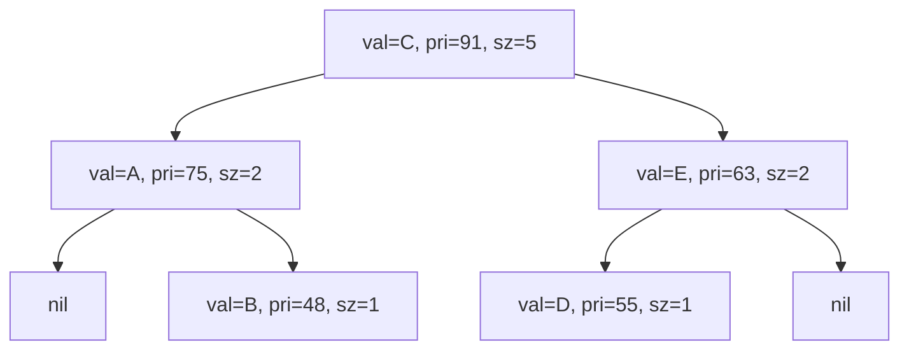
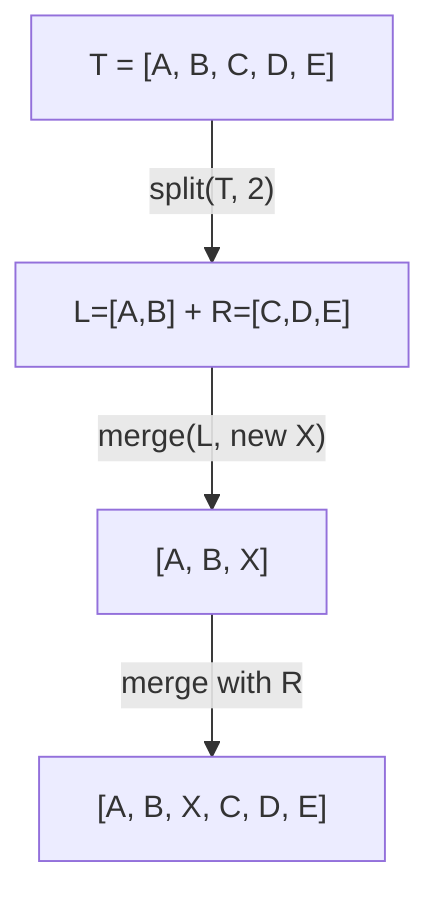

## 정의

**Implicit Treap** 은 [[bbst|Treap]] 에서 키 대신 **서브트리 크기 (위치)** 로 인덱싱하는 변형입니다. 배열의 삽입/삭제/이동/구간 반전 등을 **O(log N)** 에 지원합니다.

각 노드에 명시적 키를 저장하지 않고, 서브트리 크기 (`sz`) 로부터 암묵적으로 인덱스를 계산합니다. 현재 노드의 0-indexed 인덱스 = 왼쪽 서브트리 크기.

## 문제 상황과 동기

일반 배열은 임의 위치 접근이 O(1)이지만 삽입/삭제가 O(N)입니다. [[linked-list|연결 리스트]]는 삽입/삭제가 O(1)이지만 임의 접근이 O(N)입니다. Implicit Treap 은 두 연산을 모두 O(log N) 으로 지원합니다.

| 연산 | 일반 배열 | 연결 리스트 | Implicit Treap |
|:---|:---:|:---:|:---:|
| 임의 위치 접근 | O(1) | O(N) | O(log N) |
| 임의 위치 삽입/삭제 | O(N) | O(N)* | O(log N) |
| 구간 반전 | O(N) | O(N) | O(log N) |
| 구간 합/최소/최대 | O(N) | O(N) | O(log N) |

*탐색 O(N) + 삽입 O(1). 위치를 알더라도 단순 배열보다 상수가 크다.

대표 응용: 임의 위치 삽입/삭제, 구간 반전, 구간 이동, [[rope|Rope]] (문자열 편집기).

## 시각화

배열 `[A, B, C, D, E]` 의 Implicit Treap 표현 (pri = 랜덤 우선순위, sz = 서브트리 크기):



- 중위 순회 (inorder) 하면 `A B C D E` 순서 유지
- pri 기준 최대 힙: 부모 pri > 자식 pri
- sz = 해당 노드를 포함한 서브트리 총 노드 수

`insert(root, 2, X)` 수행 과정 (0-indexed pos=2 에 X 삽입):



## 핵심 아이디어

### 암묵적 인덱스 (Implicit Key)

일반 [[binary-search-tree|BST]] 는 키로 순서를 결정합니다. Implicit Treap 에서는 키를 저장하지 않고, **서브트리 크기** 로 순서를 결정합니다.

```text
// 현재 노드의 0-indexed 위치
index(node) = sz(node.left)
```

루트에서 왼쪽으로 갈 때마다 인덱스가 줄고, 오른쪽으로 갈 때마다 늘어납니다. 이 성질로 임의 위치를 O(log N) 에 찾을 수 있습니다.

### split(t, k)

트리 t 를 **앞 k 개** 와 **나머지** 로 분리합니다. O(log N).

```text
split(t, k):           // t 앞 k 개 노드를 L로, 나머지를 R로 분리
    if t == nil: return (nil, nil)
    push(t)            // lazy propagation flush
    lsz = sz(t.left)
    if lsz >= k:
        (L, R) = split(t.left, k)
        t.left = R; upd(t)
        return (L, t)
    else:
        (L, R) = split(t.right, k - lsz - 1)
        t.right = L; upd(t)
        return (t, R)
```

### merge(a, b)

두 트리 a, b 를 이어붙입니다 (a 의 모든 원소가 b 보다 앞에 위치). O(log N).

```text
merge(a, b):
    if a == nil: return b
    if b == nil: return a
    push(a); push(b)
    if a.pri > b.pri:   // a 가 힙 상위 -> a 가 루트
        a.right = merge(a.right, b); upd(a); return a
    else:
        b.left = merge(a, b.left); upd(b); return b
```

### Lazy Propagation: 구간 반전

구간 반전 시 서브트리의 left/right 를 swap 합니다. lazy flag (`rev`) 로 실제 swap 을 노드 방문 시점까지 미룹니다.

```text
push(t):
    if t.rev:
        swap(t.left, t.right)
        if t.left:  t.left.rev  ^= 1
        if t.right: t.right.rev ^= 1
        t.rev = false

// split/merge 에서 노드 방문 전에 반드시 push 호출
```

### 삽입 / 삭제

```text
insert(t, pos, val):   // 0-indexed pos 위치에 val 삽입
    (L, R) = split(t, pos)
    return merge(merge(L, new Node(val)), R)

erase(t, pos):         // 0-indexed pos 위치 삭제
    (L, MR) = split(t, pos)
    (M, R)  = split(MR, 1)
    return merge(L, R)  // M 은 삭제
```

## 알고리즘

### 구간 뒤집기 (Range Reversal)

```text
reverse(t, l, r):      // [l, r] 구간 반전, 0-indexed
    (L, MR) = split(t, l)
    (M, R)  = split(MR, r - l + 1)
    M.rev ^= 1         // lazy flag 설정
    return merge(merge(L, M), R)
```

### 구간 이동 (Range Move)

```text
move(t, l, r, dest):   // [l, r] 을 위치 dest 앞으로 이동
    (L, MR) = split(t, l)
    (M, R)  = split(MR, r - l + 1)
    t2 = merge(L, R)              // M 제거
    (LL, RR) = split(t2, dest)    // dest 위치에 M 삽입
    return merge(merge(LL, M), RR)
```

## 구현

<CodeWithOutput
  variants={[
    {
      language: "cpp",
      label: "C++",
      code: `// Implicit Treap: 삽입(I pos val), 삭제(D pos), 구간 반전(R l r)
#include <bits/stdc++.h>
using namespace std;

mt19937 rng(42);

struct Node {
    int val, pri, sz;
    bool rev;
    Node *l, *r;
    Node(int v) : val(v), pri(rng()), sz(1), rev(false), l(nullptr), r(nullptr) {}
};

int sz(Node* t) { return t ? t->sz : 0; }

void upd(Node* t) {
    if (t) t->sz = 1 + sz(t->l) + sz(t->r);
}

void push(Node* t) {
    if (!t || !t->rev) return;
    swap(t->l, t->r);
    if (t->l) t->l->rev ^= 1;
    if (t->r) t->r->rev ^= 1;
    t->rev = false;
}

pair<Node*, Node*> split(Node* t, int k) {
    if (!t) return {nullptr, nullptr};
    push(t);
    int lsz = sz(t->l);
    if (lsz >= k) {
        auto [L, R] = split(t->l, k);
        t->l = R; upd(t);
        return {L, t};
    } else {
        auto [L, R] = split(t->r, k - lsz - 1);
        t->r = L; upd(t);
        return {t, R};
    }
}

Node* merge(Node* l, Node* r) {
    if (!l) return r;
    if (!r) return l;
    push(l); push(r);
    if (l->pri > r->pri) {
        l->r = merge(l->r, r); upd(l); return l;
    } else {
        r->l = merge(l, r->l); upd(r); return r;
    }
}

Node* ins(Node* t, int pos, int v) {
    auto [L, R] = split(t, pos);
    return merge(merge(L, new Node(v)), R);
}

Node* era(Node* t, int pos) {
    auto [L, MR] = split(t, pos);
    auto [M, R]  = split(MR, 1);
    delete M;
    return merge(L, R);
}

Node* rev(Node* t, int l, int r) {
    auto [L, MR] = split(t, l);
    auto [M, R]  = split(MR, r - l + 1);
    if (M) M->rev ^= 1;
    return merge(merge(L, M), R);
}

void print(Node* t) {
    if (!t) return;
    push(t);
    print(t->l);
    cout << t->val << " ";
    print(t->r);
}

int main() {
    ios::sync_with_stdio(0); cin.tie(0);
    int n; cin >> n;
    Node* root = nullptr;
    for (int i = 0; i < n; i++) {
        int v; cin >> v;
        root = ins(root, i, v);
    }
    int q; cin >> q;
    while (q--) {
        char op; cin >> op;
        if (op == 'I') {
            int pos, v; cin >> pos >> v;
            root = ins(root, pos, v);
        } else if (op == 'D') {
            int pos; cin >> pos;
            root = era(root, pos);
        } else {
            int l, r; cin >> l >> r;
            root = rev(root, l, r);
        }
    }
    print(root); cout << "\\n";
}`,
    },
    {
      language: "python",
      label: "Python",
      code: `# Implicit Treap (Python) - 삽입, 삭제, 구간 반전
import sys
from random import randint
input = sys.stdin.readline
sys.setrecursionlimit(300000)

class Node:
    __slots__ = ['val', 'pri', 'sz', 'rev', 'l', 'r']
    def __init__(self, v):
        self.val = v; self.pri = randint(0, 10**9)
        self.sz = 1; self.rev = False; self.l = self.r = None

def sz(t): return t.sz if t else 0

def upd(t):
    if t: t.sz = 1 + sz(t.l) + sz(t.r)

def push(t):
    if not t or not t.rev: return
    t.l, t.r = t.r, t.l
    if t.l: t.l.rev ^= 1
    if t.r: t.r.rev ^= 1
    t.rev = False

def split(t, k):
    if not t: return None, None
    push(t)
    lsz = sz(t.l)
    if lsz >= k:
        L, R = split(t.l, k); t.l = R; upd(t); return L, t
    else:
        L, R = split(t.r, k - lsz - 1); t.r = L; upd(t); return t, R

def merge(l, r):
    if not l: return r
    if not r: return l
    push(l); push(r)
    if l.pri > r.pri:
        l.r = merge(l.r, r); upd(l); return l
    else:
        r.l = merge(l, r.l); upd(r); return r

def ins(t, pos, v):
    L, R = split(t, pos); return merge(merge(L, Node(v)), R)

def era(t, pos):
    L, MR = split(t, pos); M, R = split(MR, 1); return merge(L, R)

def rev(t, l, r):
    L, MR = split(t, l); M, R = split(MR, r - l + 1)
    if M: M.rev ^= 1
    return merge(merge(L, M), R)

def collect(t, res):
    if not t: return
    push(t); collect(t.l, res); res.append(t.val); collect(t.r, res)

n = int(input())
vals = list(map(int, input().split()))
root = None
for i, v in enumerate(vals):
    root = ins(root, i, v)

q = int(input())
for _ in range(q):
    tok = input().split()
    if tok[0] == 'I':
        root = ins(root, int(tok[1]), int(tok[2]))
    elif tok[0] == 'D':
        root = era(root, int(tok[1]))
    else:
        root = rev(root, int(tok[1]), int(tok[2]))

res = []; collect(root, res)
print(*res)`,
    },
    {
      language: "java",
      label: "Java",
      code: `// Implicit Treap (Java) - 배열 기반 노드 풀
import java.util.*;
import java.io.*;

public class Main {
    static final int MAXN = 400005;
    static int[] val = new int[MAXN], pri = new int[MAXN];
    static int[] sz  = new int[MAXN], L = new int[MAXN], R = new int[MAXN];
    static boolean[] rev = new boolean[MAXN];
    static int tot = 0, root = 0;
    static Random rng = new Random(42);

    static int newNode(int v) {
        int t = ++tot;
        val[t] = v; pri[t] = rng.nextInt();
        sz[t] = 1; L[t] = R[t] = 0; rev[t] = false;
        return t;
    }

    static int getSz(int t) { return t == 0 ? 0 : sz[t]; }

    static void upd(int t) {
        if (t != 0) sz[t] = 1 + getSz(L[t]) + getSz(R[t]);
    }

    static void push(int t) {
        if (t == 0 || !rev[t]) return;
        int tmp = L[t]; L[t] = R[t]; R[t] = tmp;
        if (L[t] != 0) rev[L[t]] ^= true;
        if (R[t] != 0) rev[R[t]] ^= true;
        rev[t] = false;
    }

    static int[] t1 = new int[2], t2 = new int[2];

    static void split(int t, int k, int[] res) {
        if (t == 0) { res[0] = res[1] = 0; return; }
        push(t);
        int lsz = getSz(L[t]);
        if (lsz >= k) {
            split(L[t], k, res); L[t] = res[1]; upd(t); res[1] = t;
        } else {
            split(R[t], k - lsz - 1, res); R[t] = res[0]; upd(t); res[0] = t;
        }
    }

    static int merge(int a, int b) {
        if (a == 0) return b; if (b == 0) return a;
        push(a); push(b);
        if (Integer.compareUnsigned(pri[a], pri[b]) > 0) {
            R[a] = merge(R[a], b); upd(a); return a;
        } else {
            L[b] = merge(a, L[b]); upd(b); return b;
        }
    }

    static void ins(int pos, int v) {
        split(root, pos, t1);
        root = merge(merge(t1[0], newNode(v)), t1[1]);
    }

    static void era(int pos) {
        split(root, pos, t1); split(t1[1], 1, t2);
        root = merge(t1[0], t2[1]);
    }

    static void revRange(int l, int r) {
        split(root, l, t1); split(t1[1], r - l + 1, t2);
        if (t2[0] != 0) rev[t2[0]] ^= true;
        root = merge(merge(t1[0], t2[0]), t2[1]);
    }

    static StringBuilder sb = new StringBuilder();

    static void print(int t) {
        if (t == 0) return;
        push(t); print(L[t]); sb.append(val[t]).append(' '); print(R[t]);
    }

    public static void main(String[] args) throws IOException {
        BufferedReader br = new BufferedReader(new InputStreamReader(System.in));
        int n = Integer.parseInt(br.readLine());
        StringTokenizer st = new StringTokenizer(br.readLine());
        for (int i = 0; i < n; i++) ins(i, Integer.parseInt(st.nextToken()));
        int q = Integer.parseInt(br.readLine());
        while (q-- > 0) {
            st = new StringTokenizer(br.readLine());
            char op = st.nextToken().charAt(0);
            if (op == 'I') ins(Integer.parseInt(st.nextToken()), Integer.parseInt(st.nextToken()));
            else if (op == 'D') era(Integer.parseInt(st.nextToken()));
            else revRange(Integer.parseInt(st.nextToken()), Integer.parseInt(st.nextToken()));
        }
        print(root);
        System.out.println(sb);
    }
}`,
    },
  ]}
  cases={[
    {
      label: "삽입 + 반전 + 삭제",
      input: `5
1 2 3 4 5
3
R 1 3
I 2 9
D 4`,
      output: `1 4 9 3 5 `,
    },
  ]}
/>

## 복잡도

| 항목 | 값 |
|:---|:---|
| **split** | O(log N) 기대 |
| **merge** | O(log N) 기대 |
| **insert / erase** | O(log N) 기대 |
| **range reverse** | O(log N) 기대 |
| **공간** | O(N) |

Treap 의 기대 높이 = O(log N). 랜덤 우선순위로 편향 트리 확률이 극히 낮습니다.

## 변형 / 활용

| 응용 | 설명 |
|:---|:---|
| **Rope** | 문자열 편집기. 임의 위치 삽입/삭제/분할/합병. |
| **구간 lazy 연산** | 구간 덧셈, 구간 최솟값 등 [[lazyprop|레이지 프로파게이션]] 추가. |
| **순서 통계** | k 번째 원소 조회, 원소의 순위 조회. |
| **구간 이동** | 배열 구간을 다른 위치로 이동. split 3번 + merge 2번. |
| **Persistent** | 버전 관리. 노드 복사로 과거 상태 유지. |

## 함정

> [!WARNING]
> Implicit Treap 구현 시 자주 발생하는 실수들.

### 1. push 누락

split/merge 에서 노드 방문 전에 `push` 를 호출하지 않으면 lazy flag 가 잘못 전파됩니다. 구간 반전 결과가 틀립니다.

### 2. upd 누락

split/merge 에서 자식 포인터를 변경한 뒤 `upd` 를 호출하지 않으면 sz 가 틀립니다. 이후 모든 위치 계산이 틀립니다.

### 3. 0-indexed vs 1-indexed 혼용

split(t, k) 는 앞 k 개를 분리합니다. 0-indexed pos 에 삽입하려면 `split(t, pos)` 입니다. 1-indexed 로 혼용하면 off-by-one 버그가 납니다.

### 4. 재귀 깊이 (Python)

Python 기본 재귀 한도 1000. N=10^5 이면 `sys.setrecursionlimit(300000)` 필요. 또는 반복 구현 사용.

### 5. 메모리 누수 (C++)

`erase` 에서 삭제된 노드를 `delete` 하지 않으면 메모리 누수. 또는 메모리 풀 (배열 기반) 사용.

## BOJ 연습 문제

| 번호 | 제목 | 설명 |
|:---|:---|:---|
| BOJ 13159 | 배열 | 삽입/삭제/반전 지원 배열 |
| BOJ 1655 | 가운데를 말해요 | 중앙값 유지 (treap 응용) |
| BOJ 7469 | K번째 수 | 구간 k번째 수 (merge sort tree 또는 treap) |

## 관련 위키

- [[bbst|Treap]]
- [[binary-search-tree|BST]]
- [[lazyprop|레이지 프로파게이션]]
- [[rope|Rope]]
- [[segtree|세그먼트 트리]]
- [[linked-list|연결 리스트]]
