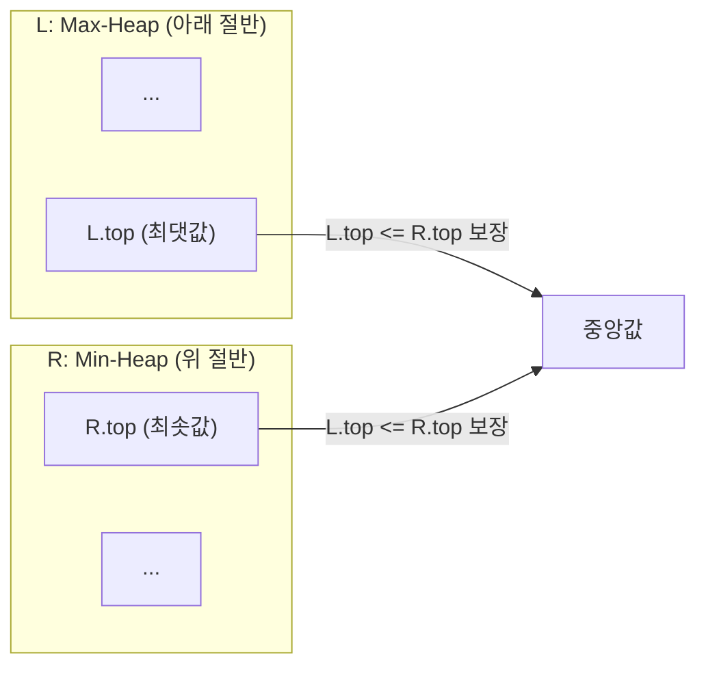
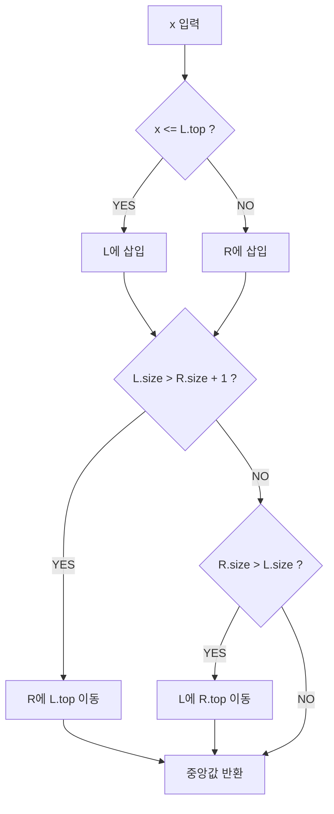

## 정의

스트림으로 들어오는 정수의 **중앙값을 O(log N)** 에 유지하는 문제.

중앙값 = 정렬했을 때 가운데 값. 원소가 짝수 개이면 두 중간 값의 평균.

## 문제 상황

정수가 하나씩 들어올 때마다 현재까지의 중앙값을 출력해야 한다.

**naive**: 매번 정렬 후 중간 인덱스 반환. O(N log N) per query, 총 O(N^2 log N). N = 10^5이면 불가능.

**핵심 통찰**: 정렬된 배열을 절반으로 나눠, 아래 절반은 Max-heap, 위 절반은 Min-heap으로 유지. 두 heap의 top을 보면 O(1)로 중앙값을 알 수 있고, 삽입/삭제는 O(log N).

## 시각화

### 두 힙 구조



### 원소 삽입 흐름 (x 삽입)



## 핵심 아이디어

- **Max-heap `L`**: 아래 절반 저장. top = 아래 절반의 최댓값.
- **Min-heap `R`**: 위 절반 저장. top = 위 절반의 최솟값.
- **불변식**: `L.top <= R.top` (아래 절반 최댓값 <= 위 절반 최솟값)
- **크기 균형**: `|L.size - R.size| <= 1` (원소 수 차이 최대 1)

**중앙값 반환**:
- `L.size > R.size`: 중앙값 = `L.top`
- `L.size == R.size`: 중앙값 = `(L.top + R.top) / 2.0`

**삽입 시 균형 유지**:
1. x <= L.top이면 L에, 그렇지 않으면 R에 삽입
2. L.size가 R.size + 1보다 크면: L.top을 R로 이동
3. R.size가 L.size보다 크면: R.top을 L로 이동

## 알고리즘

```text
L: max-heap (아래 절반)
R: min-heap (위 절반)

add(x):
    if L.empty() or x <= L.top():
        L.push(x)
    else:
        R.push(x)

    # 크기 균형 유지
    if L.size() > R.size() + 1:
        R.push(L.top()); L.pop()
    if R.size() > L.size():
        L.push(R.top()); R.pop()

median():
    if L.size() > R.size():
        return L.top()
    return (L.top() + R.top()) / 2.0
```

## 구현

<CodeWithOutput
  variants={[
    {
      language: "cpp",
      label: "C++",
      code: `#include <bits/stdc++.h>
using namespace std;

int main() {
    ios::sync_with_stdio(false);
    cin.tie(nullptr);

    int n;
    cin >> n;

    priority_queue<int> L;                             // max-heap (아래 절반)
    priority_queue<int, vector<int>, greater<int>> R;  // min-heap (위 절반)

    while (n--) {
        int x;
        cin >> x;

        // 삽입
        if (L.empty() || x <= L.top()) L.push(x);
        else R.push(x);

        // 크기 균형 유지
        if ((int)L.size() > (int)R.size() + 1) {
            R.push(L.top()); L.pop();
        }
        if ((int)R.size() > (int)L.size()) {
            L.push(R.top()); R.pop();
        }

        // 중앙값 출력
        if (L.size() > R.size()) cout << L.top() << "\\n";
        else cout << (long long)(L.top() + R.top()) / 2 << "\\n";
    }
    return 0;
}`,
    },
    {
      language: "python",
      label: "Python",
      code: `import heapq
import sys
input = sys.stdin.readline

def solve():
    n = int(input())

    L = []   # max-heap (음수화)
    R = []   # min-heap

    for _ in range(n):
        x = int(input())

        # 삽입 (Python heapq는 min-heap, max-heap은 음수화)
        if not L or x <= -L[0]:
            heapq.heappush(L, -x)
        else:
            heapq.heappush(R, x)

        # 크기 균형 유지
        if len(L) > len(R) + 1:
            heapq.heappush(R, -heapq.heappop(L))
        if len(R) > len(L):
            heapq.heappush(L, -heapq.heappop(R))

        # 중앙값 출력
        if len(L) > len(R):
            print(-L[0])
        else:
            print((-L[0] + R[0]) // 2)

solve()`,
    },
  ]}
  cases={[
    {
      label: "BOJ 1655 스타일",
      input: `7
1
5
2
10
-99
7
5`,
      output: `1
2
2
3
2
3
5`,
    },
    {
      label: "단조 증가",
      input: `4
1
2
3
4`,
      output: `1
1
2
2`,
    },
  ]}
/>

## 복잡도

| 항목 | 값 |
|:---|:---|
| **삽입 add(x)** | O(log N) |
| **중앙값 쿼리 median()** | O(1) |
| **공간** | O(N) |
| **N개 삽입 + N개 쿼리 합계** | O(N log N) |

두 힙의 크기 합 = N. 삽입/삭제는 힙 연산이므로 O(log N).

## 변형

| 변형 | 방법 |
|:---|:---|
| **K번째 작은 수 유지** | L.size = K, R.size = N-K 로 비율 조정 |
| **슬라이딩 윈도우 중앙값** | 힙 + lazy deletion. 삭제된 원소를 set으로 추적 |
| **온라인 중앙값 (정수 범위 제한)** | 세그먼트 트리 또는 BIT로 O(log V) |

## 함정

### 1. Python에서 max-heap

Python `heapq`는 min-heap만 지원. Max-heap 구현 시 **음수화**:

```python
heapq.heappush(L, -x)   # 삽입
-L[0]                    # top 참조 (음수 되돌리기)
-heapq.heappop(L)        # pop (음수 되돌리기)
```

### 2. 크기 균형 순서

삽입 후 L의 크기 체크를 먼저, R의 크기 체크를 나중에 해야 함. 두 조건이 동시에 참이 되는 경우 있음.

### 3. 짝수 개 중앙값

정수 두 개의 평균이 소수점 이하가 될 수 있음. 문제에 따라 정수 나눗셈(`//`) 또는 실수 나눗셈(`/`) 선택.

### 4. size() 비교 시 타입 주의 (C++)

`L.size() > R.size() + 1`에서 `size()`는 `size_t`(unsigned). R.size()가 0일 때 `R.size() - 1`은 언더플로우. `(int)` 캐스팅 권장.

### 5. 슬라이딩 윈도우 변형

윈도우에서 원소를 제거할 때 힙에서 직접 삭제 불가. **Lazy deletion**: 삭제 대상을 별도 집합에 기록, top 참조 시 삭제 대상이면 pop 반복.

## BOJ 연습 문제

| 번호 | 제목 | 난이도 | 알고리즘 |
|:---|:---|:---|:---|
| BOJ 1655 | 가운데를 말해요 | Gold 2 | 두 힙 |
| BOJ 2696 | 중앙값 구하기 | Gold 2 | 두 힙 |
| BOJ 13537 | 수열과 쿼리 1 | Platinum 5 | 머지 소트 트리 |

## 참고

- [[priority-queue-heap|Priority Queue / Heap]]
- [[top-k-selection|Top K 선택]]
