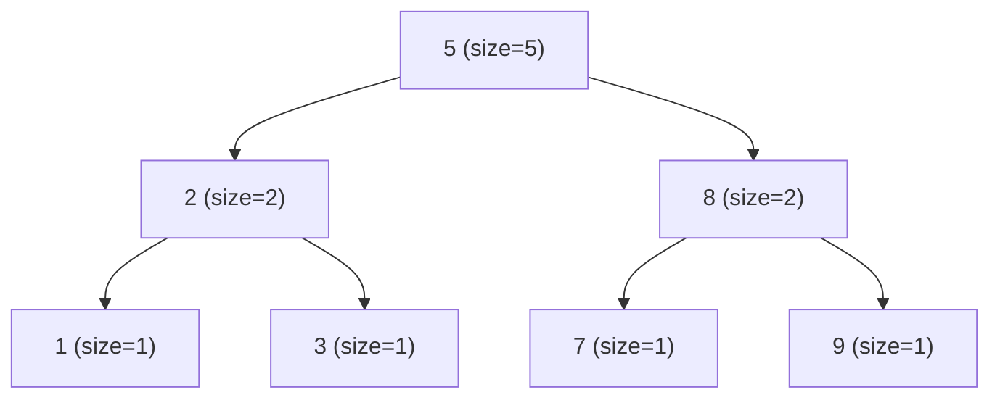

## 정의

**Order Statistics Tree (OST)** 는 각 노드에 **서브트리 크기 (size)** 를 추가로 저장한 균형 [[binary-search-tree|BST]]. 두 가지 새 연산을 O(log N) 에 지원한다.

- **rank(x)**: x 보다 작은 원소 수 (= x 의 0-indexed 순위)
- **select(k)**: k 번째 원소 (0-indexed)

일반 BST 에 `size` 필드만 추가하면 구현 가능하지만, 균형이 깨지면 O(N) 로 퇴화한다. 실전에서는 **Treap**, **AVL**, **Red-Black Tree** 기반으로 구현한다.

## 문제 상황

정수 집합 `{3, 7, 1, 9, 5}` 에 대해 다음을 O(log N) 에 처리하고 싶다.

- `rank(5)` = 2 (5보다 작은 원소: 1, 3)
- `select(3)` = 7 (정렬 순서로 3번째: 1, 3, 5, 7, 9 에서 index 3)
- 삽입/삭제도 O(log N)

정렬 배열이면 이진 탐색으로 rank/select O(log N) 가능하지만, **삽입/삭제가 O(N)** (shift). OST 는 세 연산 모두 O(log N).

## 시각화



`size` = 노드 자신 + 왼쪽 서브트리 크기 + 오른쪽 서브트리 크기.

`rank(5)` 계산: 루트(5)에서 왼쪽 서브트리 크기 = 2. 즉 rank = 2.

`select(3)`: 루트 왼쪽 크기 = 2. 3 > 2 이므로 오른쪽 서브트리에서 index 0 을 찾음. 오른쪽 루트(8), 왼쪽 크기=1, index 0 == 1 이므로 왼쪽 자식 7 반환.

## 핵심 아이디어

### 불변식

모든 노드 `n` 에 대해:

```text
n->size = (n->l ? n->l->size : 0) + (n->r ? n->r->size : 0) + 1
```

삽입/삭제 시 조상 노드의 size 를 모두 갱신해야 한다. (재귀 리턴 시 갱신)

### select(k) 로직

```text
left_size = n->l ? n->l->size : 0

if k == left_size:    return n  (현재 노드가 k번째)
if k  < left_size:   return select(n->l, k)
else:                return select(n->r, k - left_size - 1)
```

### rank(x) 로직

```text
if x <= n->key:  return rank(n->l, x)
else:            return (n->l ? n->l->size : 0) + 1 + rank(n->r, x)
```

## 알고리즘

### 핵심 구조 및 헬퍼

```cpp
struct Node {
    int key, size;
    Node *l, *r;
    Node(int k) : key(k), size(1), l(nullptr), r(nullptr) {}
};

int sz(Node* n) { return n ? n->size : 0; }

void update(Node* n) {
    if (n) n->size = sz(n->l) + sz(n->r) + 1;
}
```

### select / rank

```cpp
Node* select(Node* r, int k) {
    if (!r) return nullptr;
    int lsz = sz(r->l);
    if (k == lsz) return r;
    if (k < lsz) return select(r->l, k);
    return select(r->r, k - lsz - 1);
}

int rank(Node* r, int key) {
    if (!r) return 0;
    if (key <= r->key) return rank(r->l, key);
    return sz(r->l) + 1 + rank(r->r, key);
}
```

일반 BST 삽입/삭제 시 `update(n)` 로 size 를 갱신한다.

## 구현: C++ policy-based tree

경쟁 프로그래밍에서는 GNU PBDS 를 활용한다. 직접 구현보다 훨씬 간단하고 안정적.

<CodeWithOutput
  variants={[
    {
      language: "cpp",
      label: "C++ (GNU PBDS)",
      code: `#include <bits/stdc++.h>
#include <ext/pb_ds/assoc_container.hpp>
#include <ext/pb_ds/tree_policy.hpp>
using namespace std;
using namespace __gnu_pbds;

typedef tree<int, null_type, less<int>,
             rb_tree_tag, tree_order_statistics_node_update> OST;

int main() {
    OST ost;
    // 삽입
    ost.insert(3); ost.insert(1); ost.insert(7);
    ost.insert(5); ost.insert(9);

    // find_by_order(k): k번째 원소 (0-indexed)
    cout << *ost.find_by_order(0) << "\\n";  // 1
    cout << *ost.find_by_order(2) << "\\n";  // 5

    // order_of_key(x): x보다 작은 원소 수 (= rank)
    cout << ost.order_of_key(5) << "\\n";  // 2
    cout << ost.order_of_key(8) << "\\n";  // 4

    // 삭제
    ost.erase(7);
    cout << ost.size() << "\\n";  // 4

    return 0;
}`,
    },
    {
      language: "python",
      label: "Python (SortedList)",
      code: `# Python: sortedcontainers.SortedList 로 유사 기능
from sortedcontainers import SortedList

sl = SortedList([3, 1, 7, 5, 9])

# select: k번째 원소 (0-indexed)
print(sl[0])   # 1
print(sl[2])   # 5

# rank: x보다 작은 원소 수
print(sl.bisect_left(5))  # 2
print(sl.bisect_left(8))  # 4

# 삽입/삭제
sl.remove(7)
print(len(sl))  # 4`,
    },
  ]}
  cases={[
    {
      label: "rank/select 예시",
      input: ``,
      output: `1
5
2
4
4`,
    },
  ]}
/>

## 복잡도

| 연산 | OST (균형) | 정렬 배열 | 일반 BST |
|:---|:---:|:---:|:---:|
| **삽입** | O(log N) | O(N) | O(log N) 평균 |
| **삭제** | O(log N) | O(N) | O(log N) 평균 |
| **rank(x)** | O(log N) | O(log N) | O(log N) 평균 |
| **select(k)** | O(log N) | O(1) | O(log N) 평균 |
| **공간** | O(N) | O(N) | O(N) |

## 언어별 지원 현황

| 언어 | 라이브러리 | 지원 여부 |
|:---|:---|:---:|
| **C++** | `__gnu_pbds::tree` (GCC) | ✅ |
| **Python** | `sortedcontainers.SortedList` | 유사 (bisect 활용) |
| **Java** | `TreeMap.headMap().size()` | 유사 (O(log N) 아님) |
| **Rust** | `std::collections::BTreeSet` | 미지원, 직접 구현 |

> [!IMPORTANT]
> C++ `__gnu_pbds::tree` 는 **중복 원소를 허용하지 않는다**. 중복이 있으면 `pair<int,int>` 로 wrapping (value, unique_id).

## 함정

### 1. 중복 원소

GNU PBDS `tree<int, ...>` 는 set 기반이라 중복 삽입 무시.

중복 처리: `pair<int, int>` 로 (값, 고유번호) 저장.

```cpp
typedef tree<pair<int,int>, null_type, less<pair<int,int>>,
             rb_tree_tag, tree_order_statistics_node_update> OST;

int uid = 0;
ost.insert({5, uid++});
ost.insert({5, uid++});  // 중복 허용
```

### 2. size 갱신 누락

직접 구현 시 삽입/삭제 재귀 리턴 경로에서 `update(n)` 빠뜨리면 rank/select 오류. 회전 시도 포함해서 갱신 필요.

> [!WARNING]
> Treap 회전 시 회전 후 자식부터 `update()` 해야 부모 size 가 정확해진다.

### 3. Fenwick Tree 대안

좌표 압축 후 Fenwick Tree 로 rank/select 를 O(log N) 에 처리 가능. 삽입/삭제 범위가 정해진 경우 더 빠름. [[fenwick-tree|Fenwick Tree]] 참조.

## BOJ 연습 문제

| 번호 | 제목 | 비고 |
|:---|:---|:---|
| BOJ 1539 | 이진 검색 트리 | rank/select 연습 |
| BOJ 7469 | K번째 수 | OST 또는 Merge Sort Tree |
| BOJ 2042 | 구간 합 구하기 | Fenwick Tree 대안 비교 |

## 참고

- [[binary-search-tree|BST (이진 탐색 트리)]]
- [[bbst|Treap (Balanced BST)]]
- [[fenwick-tree|Fenwick Tree]] (좌표 압축 후 rank/select 대체)
- [[segtree|Segment Tree]] (구간 쿼리)
