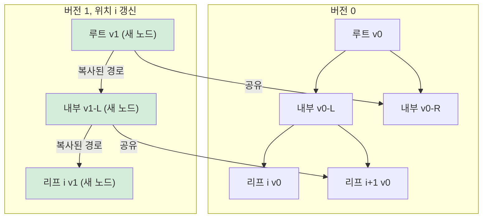

## 정의

**Persistent Segment Tree** 는 매 갱신마다 **이전 버전을 그대로 유지**하면서 새 버전을 만드는 세그먼트 트리입니다. 각 버전은 **루트 포인터** 로 식별됩니다.

핵심 트릭: **path copying**. 갱신 경로 (O(log N) 노드) 만 복사하고 나머지는 이전 버전과 공유.

- **공간**: 갱신 1 회당 O(log N) 노드 추가
- **시간**: 조회/갱신 모두 O(log N)

## 문제 상황

배열에서 아래 두 가지를 동시에 처리해야 할 때:

- **과거 버전 조회**: "버전 v 시점의 구간 합을 구하라"
- **K-th smallest in range**: 구간 [l, r] 에서 k 번째 작은 값을 O(log N) 에

단순 세그먼트 트리는 현재 상태만 저장 → 과거 조회 불가.

| 방식 | 갱신 1회 추가 공간 | 시간 | 과거 조회 |
|:---|:---:|:---:|:---:|
| 배열 전체 복사 | O(N) | O(log N) | ✅ |
| **Persistent Segment Tree** | O(log N) | O(log N) | ✅ |
| 기본 세그먼트 트리 | O(1) | O(log N) | ❌ |

## 시각화

버전 0 에서 위치 i 를 갱신해 버전 1 을 만드는 path copying 과정.



초록 노드만 새로 할당. `C0`, `E0` 는 두 버전이 공유해 공간을 절약.

## 핵심 아이디어

**path copying**: 갱신이 필요한 루트에서 리프까지의 경로만 새 노드로 복사. 나머지 자식은 이전 버전 노드를 그대로 가리킴.

```
버전 v 루트: root[v]
버전 v+1 생성:
  1. 루트 노드 새로 할당 (기존 복사)
  2. 갱신 방향 자식: 재귀적으로 새 노드 생성
  3. 반대 방향 자식: 이전 버전 노드 포인터 그대로 유지
  4. root[v+1] = 새 루트
```

**두 버전의 차이로 범위 쿼리**: `query(root[l-1], root[r], ...)` 처럼 두 버전 PST 의 합 차이를 이용하면 구간 통계를 O(log N) 에 계산.

## 알고리즘

### Build

```text
build(l, r):
    id = 새 노드 할당
    if l == r: return id
    m = (l + r) / 2
    node[id].left  = build(l, m)
    node[id].right = build(m+1, r)
    return id
```

### Update (path copying)

```text
update(prev, l, r, pos, val):
    id = 새 노드 (pool[prev] 복사)
    node[id].sum += val
    if l == r: return id
    m = (l + r) / 2
    if pos <= m:
        node[id].left  = update(node[prev].left,  l, m, pos, val)
    else:
        node[id].right = update(node[prev].right, m+1, r, pos, val)
    node[id].sum = node[node[id].left].sum + node[node[id].right].sum
    return id
```

### Query (두 버전 차이)

```text
query(u, v, l, r, L, R):
    // node[v] - node[u] = 이 두 버전 사이 갱신 합
    if L <= l and r <= R:
        return node[v].sum - node[u].sum
    m = (l + r) / 2
    res = 0
    if L <= m: res += query(node[u].left,  node[v].left,  l, m, L, R)
    if R > m:  res += query(node[u].right, node[v].right, m+1, r, L, R)
    return res
```

### K-th Smallest in Range

좌표 압축 후, `a[1..i]` 에 값 삽입한 누적 PST 를 구축.

```text
kth(u, v, l, r, k):
    // [l-1 버전]과 [r 버전] 차이로 구간 원소 카운트
    if l == r: return l   // 좌표 압축값 -> 실제 값 복원
    m = (l + r) / 2
    left_cnt = node[node[v].left].sum - node[node[u].left].sum
    if k <= left_cnt:
        return kth(node[u].left,  node[v].left,  l, m, k)
    else:
        return kth(node[u].right, node[v].right, m+1, r, k - left_cnt)
```

## 구현

<CodeWithOutput
  language="cpp"
  label="C++ (PST, K-th Smallest)"
  outputLanguage="text"
  outputLabel="결과"
  title="BOJ 7469: K번째 수 (구간 k-th smallest)"
  code={`#include <bits/stdc++.h>
using namespace std;

const int MAXN = 6000005;
struct Node { int l, r, sum; } pool[MAXN];
int root[100005], sz;

int build(int l, int r) {
    int id = ++sz;
    pool[id] = {0, 0, 0};
    if (l == r) return id;
    int m = (l + r) >> 1;
    pool[id].l = build(l, m);
    pool[id].r = build(m + 1, r);
    return id;
}

int update(int prev, int l, int r, int pos) {
    int id = ++sz;
    pool[id] = pool[prev];
    pool[id].sum++;
    if (l == r) return id;
    int m = (l + r) >> 1;
    if (pos <= m) pool[id].l = update(pool[prev].l, l, m, pos);
    else          pool[id].r = update(pool[prev].r, m+1, r, pos);
    return id;
}

int kth(int u, int v, int l, int r, int k) {
    if (l == r) return l;
    int m = (l + r) >> 1;
    int left_cnt = pool[pool[v].l].sum - pool[pool[u].l].sum;
    if (k <= left_cnt) return kth(pool[u].l, pool[v].l, l, m, k);
    return kth(pool[u].r, pool[v].r, m+1, r, k - left_cnt);
}

int main() {
    ios::sync_with_stdio(false);
    cin.tie(nullptr);
    int n, q;
    cin >> n >> q;
    vector<int> a(n+1);
    vector<int> coords;
    for (int i = 1; i <= n; i++) {
        cin >> a[i];
        coords.push_back(a[i]);
    }
    sort(coords.begin(), coords.end());
    coords.erase(unique(coords.begin(), coords.end()), coords.end());
    int M = (int)coords.size();
    auto comp = [&](int x) {
        return (int)(lower_bound(coords.begin(), coords.end(), x)
                     - coords.begin()) + 1;
    };
    root[0] = build(1, M);
    for (int i = 1; i <= n; i++)
        root[i] = update(root[i-1], 1, M, comp(a[i]));
    while (q--) {
        int l, r, k;
        cin >> l >> r >> k;
        int idx = kth(root[l-1], root[r], 1, M, k);
        cout << coords[idx-1] << "\\n";
    }
    return 0;
}`}
  output={`// 예: n=5, a=[1,5,2,6,3], 쿼리: l=2 r=5 k=2
// 구간 [2,5] = {5,2,6,3} 정렬 -> {2,3,5,6}
// 2번째 = 3
3`}
/>

## 복잡도

| 연산 | 시간 | 추가 공간 |
|:---|:---:|:---:|
| Build | O(N) | O(N) |
| Update 1회 | O(log N) | O(log N) 노드 |
| Query | O(log N) | O(1) |
| K-th 1회 | O(log N) | O(1) |

**전체 공간**: O((N + Q) log N). 좌표 압축 값 범위 M 에 대해 초기 build O(M).

pool 배열 크기: 최소 `M + Q * log(M)`. 실전에서는 `N * 40` 이 안전.

## 함정

> [!WARNING]
> **pool 크기 과소 추정**: 갱신 1 회당 log N 노드 소모. N = 10^5, Q = 10^5, log N ≈ 17 이면 최소 340 만. 여유 있게 `600 만` 이상 잡는다.

> [!WARNING]
> **kth 에서 버전 순서 혼동**: `kth(root[l-1], root[r], ...)` 에서 `root[l-1]` 이 "빼는" 기준 버전. 순서가 바뀌면 left_cnt 가 음수가 되어 WA.

> [!CAUTION]
> **좌표 압축 없이 값 범위가 클 때**: 값 범위 1~10^9 이면 build 단계가 O(10^9) → MLE/TLE. 반드시 좌표 압축하거나 [[dynamic-segtree|Dynamic Segtree]] 를 사용.

- merge sort tree 는 구현이 단순하지만 O(log²N). PST 는 O(log N) 이지만 pool 관리 필요.
- 다차원 PST 는 공간 복잡도가 기하급수로 늘어남 (실전에서 대부분 [[wavelet-tree|Wavelet Tree]] 대체).

## BOJ

| 문제 | 설명 |
|:---|:---|
| [BOJ 7469 K번째 수](https://www.acmicpc.net/problem/7469) | 구간 k-th smallest, 대표 문제 |
| [BOJ 16978 수열과 쿼리 22](https://www.acmicpc.net/problem/16978) | 과거 버전 구간 합 조회 |
| [BOJ 13557 수열과 쿼리 10](https://www.acmicpc.net/problem/13557) | 구간 최대 부분합 + 버저닝 |
| [BOJ 8904 2차원 랜덤 게임](https://www.acmicpc.net/problem/8904) | 머지 소트 트리 vs PST 비교 |

## 관련 위키

- [[segtree|Segment Tree]] (기반 자료구조)
- [[wavelet-tree|Wavelet Tree]] (k-th in range 대안)
- [[dynamic-segtree|Dynamic Segtree]] (좌표 압축 없이 사용)
- [[merge-sort-tree|Merge Sort Tree]] (k-th 대안, O(log²N))
