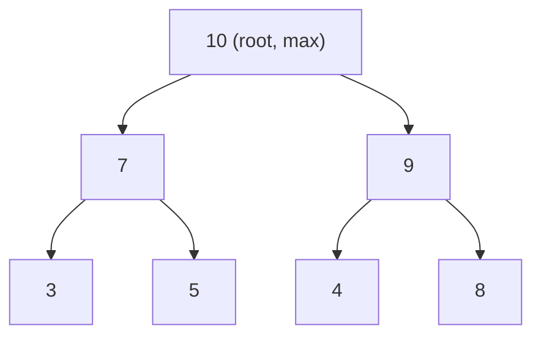

## 정의

**Priority Queue** 는 우선순위가 가장 높은 원소를 O(log N) 에 pop 할 수 있는 자료구조. **Binary Heap** 이 표준 구현.

- **Max-heap**: 부모 >= 자식. `top()` 이 최대값.
- **Min-heap**: 부모 <= 자식. `top()` 이 최소값.

**핵심 연산**:
- `push(x)`: 원소 삽입, O(log N)
- `top()`: 최솟값/최댓값 조회, O(1)
- `pop()`: 최솟값/최댓값 제거, O(log N)
- `build_heap(arr)`: 배열에서 힙 구성, O(N) (Floyd's algorithm)

## 문제 상황

여러 원소 중 항상 최솟/최댓값을 빠르게 꺼내야 할 때:

| 자료구조 | push | top | pop | 용도 |
|:---|:---:|:---:|:---:|:---|
| 정렬된 배열 | O(N) | O(1) | O(N) | - |
| 정렬 안 된 배열 | O(1) | O(N) | O(N) | - |
| Binary Heap | O(log N) | O(1) | O(log N) | **Priority Queue** |
| BST (std::set) | O(log N) | O(log N) | O(log N) | 삭제/탐색 유연 |

Binary Heap: push/pop 모두 O(log N), `top()` O(1). 가장 실용적.

## 시각화



부모 인덱스 `(i-1)/2`, 왼쪽 자식 `2i+1`, 오른쪽 자식 `2i+2`.

위 max-heap 을 배열로 표현: `[10, 7, 9, 3, 5, 4, 8]`.

## 핵심 아이디어

### 배열 표현

완전 이진 트리를 배열로 compact 하게 저장:

```text
인덱스 0-based:
  부모: (i - 1) / 2
  왼쪽 자식: 2 * i + 1
  오른쪽 자식: 2 * i + 2
```

포인터 없이 배열만으로 트리 구조 유지. 캐시 친화적.

### Heapify Up (push 후)

새 원소를 맨 끝에 추가 후, 부모보다 크면 swap 반복:

```text
heap_push(x):
    arr.append(x)
    i = len(arr) - 1
    while i > 0:
        p = (i - 1) // 2
        if arr[p] < arr[i]:  // max-heap: 부모보다 크면 swap
            swap(arr[p], arr[i])
            i = p
        else:
            break
```

### Heapify Down (pop 후)

루트 제거 후 맨 끝 원소를 루트로 이동, 자식보다 작으면 swap 반복:

```text
heap_pop():
    arr[0] = arr[-1]
    arr.pop()
    i = 0
    while True:
        l = 2*i+1; r = 2*i+2
        largest = i
        if l < len(arr) and arr[l] > arr[largest]: largest = l
        if r < len(arr) and arr[r] > arr[largest]: largest = r
        if largest == i: break
        swap(arr[i], arr[largest])
        i = largest
```

## 알고리즘

### C++ STL 사용

```cpp
priority_queue<int> pq;              // max-heap (default)
priority_queue<int, vector<int>, greater<>> mn;  // min-heap

pq.push(5); pq.push(3); pq.push(8);
cout << pq.top() << "\n";   // 8
pq.pop();
cout << pq.top() << "\n";   // 5

// 쌍 (pair): first 기준 정렬
priority_queue<pair<int,int>> pq2;
pq2.push({3, 'a'}); pq2.push({1, 'b'});
// top() = {3, 'a'}
```

### Python heapq (min-heap)

```python
import heapq

pq = []
heapq.heappush(pq, 5)
heapq.heappush(pq, 3)
heapq.heappush(pq, 8)
print(heapq.heappop(pq))  # 3 (min)

# max-heap: 부호 반전
heapq.heappush(pq, -8)
print(-heapq.heappop(pq))  # 8

# heapify: O(N)
arr = [5, 3, 8, 1, 9]
heapq.heapify(arr)
print(heapq.heappop(arr))  # 1
```

### Dijkstra 에서의 활용

[[dijkstra|Dijkstra]] 알고리즘에서 min-heap 으로 다음 처리 정점 선택:

```cpp
priority_queue<pair<int,int>, vector<pair<int,int>>, greater<>> pq;
pq.push({0, src});  // {거리, 정점}
while (!pq.empty()) {
    auto [d, u] = pq.top(); pq.pop();
    if (d > dist[u]) continue;  // 이미 처리된 정점 스킵 (lazy deletion)
    for (auto [v, w] : adj[u])
        if (dist[u] + w < dist[v]) {
            dist[v] = dist[u] + w;
            pq.push({dist[v], v});
        }
}
```

## 구현

<CodeWithOutput
  variants={[
    {
      language: "cpp",
      label: "C++: Dijkstra with min-heap",
      code: `#include <bits/stdc++.h>
using namespace std;
typedef pair<int,int> pii;
const int INF = 1e9;

int main() {
    int n, m; cin >> n >> m;
    vector<vector<pii>> adj(n + 1);
    for (int i = 0; i < m; i++) {
        int u, v, w; cin >> u >> v >> w;
        adj[u].push_back({v, w});
        adj[v].push_back({u, w});
    }
    int src = 1;
    vector<int> dist(n + 1, INF);
    dist[src] = 0;
    priority_queue<pii, vector<pii>, greater<pii>> pq;
    pq.push({0, src});
    while (!pq.empty()) {
        auto [d, u] = pq.top(); pq.pop();
        if (d > dist[u]) continue;
        for (auto [v, w] : adj[u]) {
            if (dist[u] + w < dist[v]) {
                dist[v] = dist[u] + w;
                pq.push({dist[v], v});
            }
        }
    }
    for (int i = 1; i <= n; i++)
        cout << (dist[i] == INF ? -1 : dist[i]) << "\\n";
    return 0;
}`,
    },
    {
      language: "python",
      label: "Python: Dijkstra with heapq",
      code: `import heapq
import sys
input = sys.stdin.readline
INF = float('inf')

def dijkstra(n, adj, src):
    dist = [INF] * (n + 1)
    dist[src] = 0
    pq = [(0, src)]  # (거리, 정점)
    while pq:
        d, u = heapq.heappop(pq)
        if d > dist[u]:
            continue
        for v, w in adj[u]:
            nd = dist[u] + w
            if nd < dist[v]:
                dist[v] = nd
                heapq.heappush(pq, (nd, v))
    return dist

n, m = map(int, input().split())
adj = [[] for _ in range(n + 1)]
for _ in range(m):
    u, v, w = map(int, input().split())
    adj[u].append((v, w))
    adj[v].append((u, w))

dist = dijkstra(n, adj, 1)
for i in range(1, n + 1):
    print(-1 if dist[i] == INF else dist[i])`,
    },
  ]}
  cases={[
    {
      label: "기본 (n=4, m=5)",
      input: `4 5
1 2 1
1 3 4
2 3 2
2 4 5
3 4 1`,
      output: `0
1
3
4`,
    },
  ]}
/>

## 복잡도

| 연산 | Binary Heap | Fibonacci Heap | Pairing Heap |
|:---|:---:|:---:|:---:|
| `push` | O(log N) | O(1) amortized | O(1) amortized |
| `top` | O(1) | O(1) | O(1) |
| `pop` | O(log N) | O(log N) amortized | O(log N) amortized |
| `decrease-key` | O(log N) | O(1) amortized | O(log log N) amortized |
| `merge` | O(N) | O(1) | O(1) |
| `build` | O(N) | O(N) | O(N) |

실전에서는 Binary Heap 이 상수가 작아 가장 빠름. Fibonacci Heap 은 이론적으로만 유리.

## 변형

| 변형 | 특징 | 용도 |
|:---|:---|:---|
| **Fibonacci Heap** | `decrease-key` O(1) amortized | Dijkstra 이론적 최적 (실전 느림) |
| **Pairing Heap** | 구현 단순, 실전 성능 양호 | 범용 |
| **Binomial Heap** | merge O(log N) | 힙 병합 필요 시 |
| **d-ary Heap** | d 개 자식, cache 효율 | 실전 최적화 |
| **두 heap (median)** | max-heap + min-heap | [[median-of-stream|Median of Stream]] |

## 함정

> [!WARNING]
> **Lazy Deletion**: priority queue 에서 값을 업데이트할 때 기존 항목을 직접 삭제하기 어렵다. 오래된 항목을 pop 할 때 무시하는 lazy deletion 패턴 사용.

> [!WARNING]
> **Python heapq 는 min-heap**: max-heap 이 필요하면 값을 부호 반전해서 넣어야 함. `(-val, idx)` 튜플 활용.

> [!CAUTION]
> **C++ `priority_queue` 기본값은 max-heap**: min-heap 은 `greater<>` 지정 필수. 혼동하면 Dijkstra 에서 틀림.

### 흔한 실수

1. `pop()` 전에 `empty()` 확인 안 함 (런타임 에러)
2. Dijkstra 에서 lazy deletion `if d > dist[u] continue` 없이 구현
3. Custom comparator 방향을 반대로 (min-heap 에 `less<>` 지정)
4. Python `heapq.heappush(pq, (val, obj))` 에서 val 동점 시 obj 비교 오류

## BOJ 연습 문제

| 번호 | 제목 | 키워드 |
|:---|:---|:---|
| BOJ 1927 | 최솟값 | min-heap 기본 |
| BOJ 11279 | 최댓값 힙 | max-heap 기본 |
| BOJ 1655 | 가운데를 말해요 | max-heap + min-heap |
| BOJ 7662 | 이중 우선순위 큐 | 최대/최소 모두 |
| BOJ 1916 | 최소 비용 구하기 | Dijkstra + min-heap |
| BOJ 23291 | 어항 정리 | 시뮬레이션 + heap |

## 참고

- [[dijkstra|Dijkstra]]
- [[top-k-selection|Top K]]
- [[median-of-stream|Median of Stream]]
- [[heap-sort|Heap Sort]]
- [[mst|MST (Prim 알고리즘)]]
