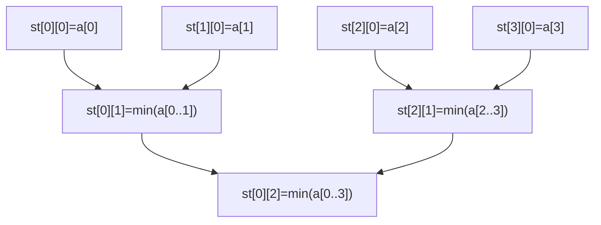
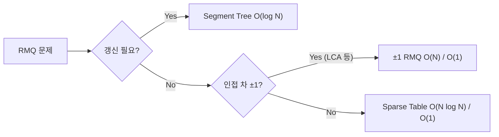

## 정의

**Range Minimum Query** 는 배열 A 에 대해 구간 [l, r] 의 최솟값을 답하는 문제입니다. 최댓값, gcd, XOR 등으로 자연스럽게 일반화됩니다.

- **정적 배열 + 반복 쿼리**: [[sparse-table|Sparse Table]] 으로 O(1) 쿼리
- **동적 배열 + 업데이트**: [[segtree|Segment Tree]] 로 O(log N) 쿼리/갱신
- **트리 LCA 환원**: [[lca|LCA]] 를 RMQ 로 변환하면 O(1) 쿼리 가능

## 방법 비교

| 방법 | 전처리 | 쿼리 | 갱신 | 비고 |
|:---|:---:|:---:|:---:|:---|
| 순회 | O(1) | O(N) | O(1) | 가장 단순 |
| [[sparse-table|Sparse Table]] | O(N log N) | O(1) | 불가 | idempotent 연산만 |
| [[segtree|Segment Tree]] | O(N) | O(log N) | O(log N) | 범용 |
| Sqrt Decomposition | O(N) | O(√N) | O(1) | 구현 단순 |
| **±1 RMQ** (LCA 용) | O(N) | O(1) | 불가 | 인접 차 ±1 조건 필요 |

## 시각화

Sparse Table 구조 (N = 8):



RMQ 쿼리 선택 흐름:



## Sparse Table 상세

### 핵심 아이디어

`st[i][j]` = `min(A[i], A[i+1], ..., A[i + 2^j - 1])`. 즉 인덱스 i 에서 시작하는 길이 `2^j` 구간의 최솟값.

임의 구간 `[l, r]` 의 최솟값은 **두 개의 2^k 블록** 으로 덮을 수 있습니다.

```
k = floor(log2(r - l + 1))
ans = min(st[l][k], st[r - 2^k + 1][k])
```

두 블록이 중복되어도 idempotent 성질(`min(a, a) = a`) 덕분에 결과가 올바릅니다.

### 전처리

```text
st[i][0] = A[i]
for j in 1..K:
    for i in 0..N - 2^j:
        st[i][j] = min(st[i][j-1], st[i + 2^(j-1)][j-1])
```

## ±1 RMQ (Farach-Colton and Bender)

### 조건과 배경

인접 원소의 차가 정확히 ±1 인 배열 (예: 트리의 Euler tour depth 배열) 에서만 적용됩니다. 이 조건을 이용해 **O(N) 전처리, O(1) 쿼리** 를 달성합니다.

### 핵심 아이디어

블록 분해 방식:

1. 배열을 길이 `B = (log N) / 2` 블록으로 나눕니다
2. 각 블록의 **최솟값과 위치** 를 계산 → 블록 최솟값 배열 구성
3. 블록 최솟값 배열에 **Sparse Table** 적용 → O(N/B · log(N/B)) = O(N) 공간
4. **블록 내부**: ±1 이동이므로 길이 B 의 블록 유형 수는 최대 `2^B = sqrt(N)` 가지. 각 유형의 RMQ 테이블 전처리 후 룩업 테이블.

쿼리 [l, r] 처리:
- `l, r` 이 같은 블록: 룩업 테이블 O(1)
- 다른 블록: 왼쪽 부분 블록 + 가운데 블록들 (Sparse Table) + 오른쪽 부분 블록 → 총 O(1)

> [!NOTE]
> PS 에서 직접 구현할 일은 드뭅니다. LCA 를 O(1) 로 줄이고 싶을 때 주로 이론으로 등장합니다. 실전에서는 Sparse Table + Euler tour 로 충분합니다.

## Cartesian Tree 와 RMQ

**Cartesian Tree** 는 배열 A 에서 만든 이진 트리로, 루트가 최솟값, 왼쪽/오른쪽 서브트리가 각 부분 배열의 Cartesian Tree 입니다.

RMQ(l, r) = Cartesian Tree 에서 l 과 r 의 LCA 노드 값.

즉, **배열 RMQ = Cartesian Tree 의 LCA** 로 환원됩니다. [[cartesian-tree|Cartesian Tree]] 참조.

## LCA -> RMQ 변환

트리의 **Euler tour** 를 만들면 길이 `2N - 1` 의 depth 배열이 생깁니다. 두 정점 u, v 의 LCA 는 Euler tour 에서 u 등장 위치와 v 등장 위치 사이의 **최소 depth 위치** 입니다.

```
LCA(u, v) = Euler_tour[RMQ(first[u], first[v])]
```

Euler tour depth 배열은 인접 차가 ±1 이므로 ±1 RMQ 적용 가능 → LCA O(N) 전처리, O(1) 쿼리.

[[lca|LCA]], [[euler-tour-technique|Euler Tour]] 참조.

## 구현

<CodeWithOutput
  variants={[
    {
      language: "cpp",
      label: "C++ (Sparse Table)",
      code: `// Sparse Table RMQ, O(N log N) build + O(1) query
#include <bits/stdc++.h>
using namespace std;

struct SparseTable {
    vector<vector<int>> st;
    vector<int> log2_;
    int n;

    SparseTable(vector<int>& a) : n(a.size()), st(a.size()), log2_(a.size() + 1) {
        log2_[1] = 0;
        for (int i = 2; i <= n; i++) log2_[i] = log2_[i/2] + 1;
        int K = log2_[n] + 1;
        for (int i = 0; i < n; i++) st[i].resize(K);
        for (int i = 0; i < n; i++) st[i][0] = a[i];
        for (int j = 1; j < K; j++)
            for (int i = 0; i + (1 << j) <= n; i++)
                st[i][j] = min(st[i][j-1], st[i + (1 << (j-1))][j-1]);
    }

    int query(int l, int r) { // 0-indexed [l, r]
        int k = log2_[r - l + 1];
        return min(st[l][k], st[r - (1 << k) + 1][k]);
    }
};

int main() {
    ios::sync_with_stdio(0); cin.tie(0);
    int n, q; cin >> n >> q;
    vector<int> a(n);
    for (auto& v : a) cin >> v;
    SparseTable rmq(a);
    while (q--) {
        int l, r; cin >> l >> r; l--; r--;
        cout << rmq.query(l, r) << "\\n";
    }
}`,
    },
    {
      language: "python",
      label: "Python (Sparse Table)",
      code: `# Sparse Table RMQ, O(N log N) build + O(1) query
import sys
input = sys.stdin.readline

n, q = map(int, input().split())
a = list(map(int, input().split()))

K = n.bit_length()
st = [a[:]]
for j in range(1, K):
    prev = st[j-1]
    cur = []
    half = 1 << (j-1)
    for i in range(n - (1 << j) + 1):
        cur.append(min(prev[i], prev[i + half]))
    st.append(cur)

def query(l, r):  # 0-indexed [l, r]
    k = (r - l + 1).bit_length() - 1
    return min(st[k][l], st[k][r - (1 << k) + 1])

out = []
for _ in range(q):
    l, r = map(int, input().split())
    l -= 1; r -= 1
    out.append(str(query(l, r)))
print("\\n".join(out))`,
    },
    {
      language: "java",
      label: "Java (Sparse Table)",
      code: `// Sparse Table RMQ
import java.util.*;
import java.io.*;

public class Main {
    static int[][] st;
    static int[] log2;

    public static void main(String[] args) throws IOException {
        BufferedReader br = new BufferedReader(new InputStreamReader(System.in));
        StringTokenizer tok = new StringTokenizer(br.readLine());
        int n = Integer.parseInt(tok.nextToken());
        int q = Integer.parseInt(tok.nextToken());

        int[] a = new int[n];
        tok = new StringTokenizer(br.readLine());
        for (int i = 0; i < n; i++) a[i] = Integer.parseInt(tok.nextToken());

        int K = 32 - Integer.numberOfLeadingZeros(n);
        log2 = new int[n + 1];
        for (int i = 2; i <= n; i++) log2[i] = log2[i / 2] + 1;

        st = new int[n][K];
        for (int i = 0; i < n; i++) st[i][0] = a[i];
        for (int j = 1; j < K; j++)
            for (int i = 0; i + (1 << j) <= n; i++)
                st[i][j] = Math.min(st[i][j-1], st[i + (1 << (j-1))][j-1]);

        StringBuilder sb = new StringBuilder();
        for (int i = 0; i < q; i++) {
            tok = new StringTokenizer(br.readLine());
            int l = Integer.parseInt(tok.nextToken()) - 1;
            int r = Integer.parseInt(tok.nextToken()) - 1;
            int k = log2[r - l + 1];
            sb.append(Math.min(st[l][k], st[r - (1 << k) + 1][k])).append('\\n');
        }
        System.out.print(sb);
    }
}`,
    },
  ]}
  cases={[
    {
      label: "기본 RMQ",
      input: `5 3
3 1 4 1 5
1 3
2 5
1 5`,
      output: `1
1
1`,
    },
  ]}
/>

## 복잡도 요약

| 항목 | Sparse Table | Segment Tree | ±1 RMQ |
|:---|:---:|:---:|:---:|
| **전처리** | O(N log N) | O(N) | O(N) |
| **쿼리** | O(1) | O(log N) | O(1) |
| **갱신** | 불가 | O(log N) | 불가 |
| **공간** | O(N log N) | O(N) | O(N) |

## 변형 / 활용

### Range Maximum Query

`min` 을 `max` 로 교체. identity 원소는 `-INF`.

### Range GCD Query

gcd 도 idempotent 이므로 Sparse Table 사용 가능.

### Sliding Window Minimum

모노토닉 덱으로 O(N) 총 처리. RMQ 의 특수 케이스.

### 2D RMQ

2D Sparse Table 로 O(N M log N log M) 전처리, O(1) 쿼리.

## 함정

> [!WARNING]
> Sparse Table 은 **갱신 불가**입니다. 원소가 변하면 전체 재구성 O(N log N). 갱신이 필요하면 반드시 Segment Tree 를 사용하세요.

### 1. idempotent 확인

합(sum) 은 idempotent 하지 않으므로 Sparse Table 쿼리 결과가 틀립니다. sum 은 [[segtree|Segment Tree]] 나 [[fenwick-tree|Fenwick Tree]] 를 사용하세요.

### 2. log2 계산

C++ `__lg(x)` 또는 `__builtin_clz` 활용. Python `(x).bit_length() - 1`. Java `31 - Integer.numberOfLeadingZeros(x)`.

### 3. 0-indexed vs 1-indexed

입력이 1-indexed 이면 `l--, r--` 필수. 인덱스 혼동이 잦은 버그 원인.

### 4. 메모리

N = 10^6, K = 20 이면 20M 정수 배열, 약 80MB. 큰 N 에서 주의.

## BOJ 연습 문제

| 번호 | 제목 | 링크 |
|:---|:---|:---|
| BOJ 17435 | 합성함수와 쿼리 | [BOJ](https://www.acmicpc.net/problem/17435) |
| BOJ 10868 | 최솟값 | [BOJ](https://www.acmicpc.net/problem/10868) |
| BOJ 14428 | 수열과 쿼리 16 | [BOJ](https://www.acmicpc.net/problem/14428) |

## 참고

- [[sparse-table|Sparse Table]]
- [[segtree|Segment Tree]]
- [[lca|LCA]]
- [[euler-tour-technique|Euler Tour]]
- [[cartesian-tree|Cartesian Tree]]
- [[fenwick-tree|Fenwick Tree]]
