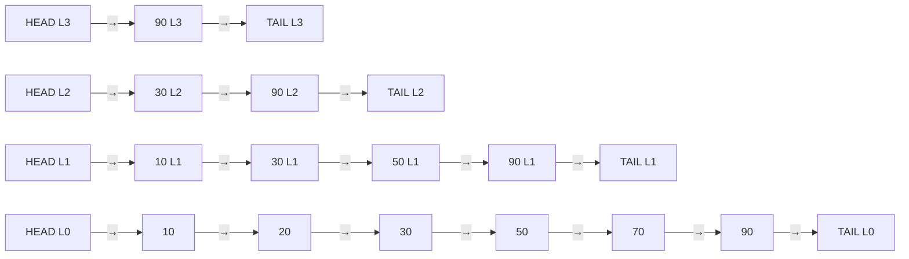

## 정의

**Skip List** 는 정렬된 [[linked-list|연결 리스트]] 를 여러 층으로 쌓아 **확률적으로 O(log N)** 탐색을 제공하는 자료구조입니다.

각 노드는 **확률 p = 1/2** 로 더 높은 층에 승격됩니다. 상위 층은 아래 층의 축소판 인덱스 역할을 합니다. 최대 높이는 `log_{1/p}(N)` 층으로 제한.

## 문제 상황과 동기

[[binary-search-tree|이진 탐색 트리 (BST)]] 는 최악 O(N) (편향 트리) 이고, [[bbst|균형 BST (AVL, Red-Black)]] 는 회전 연산으로 균형을 유지해 O(log N) 를 보장하지만 구현이 복잡합니다.

Skip List 는 **임의화 (randomization)** 로 편향을 방지하면서, **균형 트리에 비해 구현이 훨씬 단순** 합니다.

| 자료구조 | 탐색 | 삽입 | 삭제 | 구현 복잡도 |
|:---|:---:|:---:|:---:|:---:|
| [[linked-list|정렬 연결리스트]] | O(N) | O(N) | O(N) | 쉬움 |
| [[binary-search-tree|BST]] | O(N) 최악 | O(N) 최악 | O(N) 최악 | 쉬움 |
| [[bbst|균형 BST]] | O(log N) | O(log N) | O(log N) | 어려움 |
| **Skip List** | O(log N) 기대 | O(log N) 기대 | O(log N) 기대 | **보통** |

## 시각화

레벨 4 Skip List 예시 (N = 7, p = 1/2):



탐색 경로 (값 50 찾기): L3 → L2(30) → L1(50) 도달. 방문 노드 수 = O(log N).

## 핵심 아이디어

### 레벨 구조

레벨 0: 모든 원소가 있는 정렬된 연결 리스트.
레벨 k: 레벨 k-1 원소 중 확률 p 로 선택된 원소들.

기대 노드 수:
- 레벨 0: N개
- 레벨 1: N/2개
- 레벨 k: N/2^k 개
- 총 노드 수: N + N/2 + N/4 + ... = 2N (p = 1/2 일 때)

### 탐색 알고리즘

```
search(head, target):
    cur = head
    for level = MAX_LEVEL downto 0:
        while cur.next[level] != null and cur.next[level].val < target:
            cur = cur.next[level]  // 오른쪽으로 이동
        // 더 이상 못 가면 아래 레벨로
    // cur.next[0] 가 target 이면 found
    return cur.next[0]
```

핵심: **높은 레벨에서 빠르게 건너뛰고, 아래 레벨에서 정밀하게 탐색**.

### 노드 레벨 결정 (확률 p = 1/2)

```
random_level():
    level = 1
    while random() < 0.5 and level < MAX_LEVEL:
        level++
    return level
```

기대 레벨 = 1 / (1 - p) = 2. 최대 레벨 = log₂(N). 각 레벨에 올라갈 확률 = 1/2.

### 삽입 알고리즘

```
insert(head, val):
    update[0..MAX_LEVEL-1] = 각 레벨에서 삽입 위치 직전 노드
    
    // update 배열 계산 (탐색과 동일)
    cur = head
    for level = MAX_LEVEL downto 0:
        while cur.next[level] != null and cur.next[level].val < val:
            cur = cur.next[level]
        update[level] = cur
    
    new_level = random_level()
    new_node = Node(val, new_level)
    for i = 0 to new_level - 1:
        new_node.next[i] = update[i].next[i]
        update[i].next[i] = new_node
```

## 특징

- 삽입/삭제/탐색: **기댓값 O(log N)**, 최악 O(N) (이론적, 실제 거의 발생 안 함)
- 균형 트리 (AVL, Red-Black) 대비 **구현 훨씬 단순**
- **락 없는 (lock-free)** 동시성 구현 쉬움: CAS 연산으로 각 레벨 포인터 업데이트 가능
- **Redis Sorted Set** 내부 구조 (ziplist 임계값 초과 시 Skip List 사용)

## Redis Sorted Set 실제 사용

Redis 의 `ZSET` (Sorted Set) 은 내부적으로 Skip List + Hash Table 을 사용합니다.

- **Hash Table**: `O(1)` 멤버 스코어 조회
- **Skip List**: `O(log N)` 범위 쿼리 (ZRANGEBYSCORE, ZRANK 등)

```
ZADD leaderboard 100 "alice"
ZADD leaderboard 200 "bob"
ZADD leaderboard 150 "charlie"
ZRANGE leaderboard 0 -1 WITHSCORES  # Skip List 범위 탐색
ZRANK leaderboard "charlie"          # 순위 조회
```

레벨 임계값: 원소 수 128개 이하, 값 길이 64바이트 이하면 ziplist (메모리 효율적). 초과 시 Skip List 로 전환.

<UrlPreview url="https://redis.io/docs/data-types/sorted-sets/" />

## 구현

<CodeWithOutput
  variants={[
    {
      language: "cpp",
      label: "C++",
      code: `// Skip List: 탐색/삽입/삭제 O(log N) 기대
#include <bits/stdc++.h>
using namespace std;

const int MAX_LEVEL = 16;
const double P = 0.5;

struct Node {
    int val;
    vector<Node*> next;
    Node(int v, int level) : val(v), next(level, nullptr) {}
};

struct SkipList {
    Node* head;
    int level;
    mt19937 rng{42};

    SkipList() : level(1) {
        head = new Node(INT_MIN, MAX_LEVEL);
    }

    int random_level() {
        int lv = 1;
        while ((rng() & 1) && lv < MAX_LEVEL) lv++;
        return lv;
    }

    bool search(int val) {
        Node* cur = head;
        for (int i = level - 1; i >= 0; i--) {
            while (cur->next[i] && cur->next[i]->val < val)
                cur = cur->next[i];
        }
        cur = cur->next[0];
        return cur && cur->val == val;
    }

    void insert(int val) {
        vector<Node*> update(MAX_LEVEL, head);
        Node* cur = head;
        for (int i = level - 1; i >= 0; i--) {
            while (cur->next[i] && cur->next[i]->val < val)
                cur = cur->next[i];
            update[i] = cur;
        }

        int new_lv = random_level();
        if (new_lv > level) {
            for (int i = level; i < new_lv; i++) update[i] = head;
            level = new_lv;
        }

        Node* newNode = new Node(val, new_lv);
        for (int i = 0; i < new_lv; i++) {
            newNode->next[i] = update[i]->next[i];
            update[i]->next[i] = newNode;
        }
    }

    bool remove(int val) {
        vector<Node*> update(MAX_LEVEL, nullptr);
        Node* cur = head;
        for (int i = level - 1; i >= 0; i--) {
            while (cur->next[i] && cur->next[i]->val < val)
                cur = cur->next[i];
            update[i] = cur;
        }
        cur = cur->next[0];
        if (!cur || cur->val != val) return false;

        for (int i = 0; i < level; i++) {
            if (update[i]->next[i] != cur) break;
            update[i]->next[i] = cur->next[i];
        }
        while (level > 1 && !head->next[level - 1]) level--;
        delete cur;
        return true;
    }
};

int main() {
    ios::sync_with_stdio(0); cin.tie(0);
    int n; cin >> n;
    SkipList sl;
    while (n--) {
        int type, val; cin >> type >> val;
        if (type == 1) sl.insert(val);
        else if (type == 2) sl.remove(val);
        else cout << (sl.search(val) ? "YES" : "NO") << "\\n";
    }
}`,
    },
    {
      language: "python",
      label: "Python",
      code: `# Skip List: 탐색/삽입/삭제 O(log N) 기대
import random

MAX_LEVEL = 16
P = 0.5

class Node:
    def __init__(self, val, level):
        self.val = val
        self.next = [None] * level

class SkipList:
    def __init__(self):
        self.head = Node(float('-inf'), MAX_LEVEL)
        self.level = 1

    def _random_level(self):
        lv = 1
        while random.random() < P and lv < MAX_LEVEL:
            lv += 1
        return lv

    def search(self, val):
        cur = self.head
        for i in range(self.level - 1, -1, -1):
            while cur.next[i] and cur.next[i].val < val:
                cur = cur.next[i]
        cur = cur.next[0]
        return cur and cur.val == val

    def insert(self, val):
        update = [self.head] * MAX_LEVEL
        cur = self.head
        for i in range(self.level - 1, -1, -1):
            while cur.next[i] and cur.next[i].val < val:
                cur = cur.next[i]
            update[i] = cur

        new_lv = self._random_level()
        if new_lv > self.level:
            for i in range(self.level, new_lv):
                update[i] = self.head
            self.level = new_lv

        new_node = Node(val, new_lv)
        for i in range(new_lv):
            new_node.next[i] = update[i].next[i]
            update[i].next[i] = new_node

    def remove(self, val):
        update = [None] * MAX_LEVEL
        cur = self.head
        for i in range(self.level - 1, -1, -1):
            while cur.next[i] and cur.next[i].val < val:
                cur = cur.next[i]
            update[i] = cur
        cur = cur.next[0]
        if not cur or cur.val != val:
            return False
        for i in range(self.level):
            if update[i].next[i] != cur:
                break
            update[i].next[i] = cur.next[i]
        while self.level > 1 and not self.head.next[self.level - 1]:
            self.level -= 1
        return True

import sys
input = sys.stdin.readline

def main():
    n = int(input())
    sl = SkipList()
    out = []
    for _ in range(n):
        line = input().split()
        t, v = int(line[0]), int(line[1])
        if t == 1:
            sl.insert(v)
        elif t == 2:
            sl.remove(v)
        else:
            out.append("YES" if sl.search(v) else "NO")
    print("\\n".join(out))

main()`,
    },
  ]}
  cases={[
    {
      label: "기본",
      input: `6
1 10
1 30
1 50
3 30
2 30
3 30`,
      output: `YES
NO`,
    },
  ]}
/>

## 복잡도 분석

### 기댓값 O(log N)

레벨 k 에서 왼쪽으로 이동하는 기대 횟수 = 1/p (기하 분포). 총 레벨 수 = log_{1/p}(N). 전체 탐색 기대 = O((1/p) · log_{1/p}(N)).

p = 1/2 일 때: 기대 비교 횟수 = 2 log₂(N).

### 최악 O(N)

이론적 최악: 모든 노드가 레벨 1에만 있으면 O(N). 하지만 이 사건의 확률 = (1/2)^N → 실제로는 무시 가능.

### 공간

기대 총 노드 포인터 수 = N · (1 + 1/2 + 1/4 + ...) = 2N / (1-p). p = 1/2 면 **기대 2N 포인터**.

## 변형 / 활용

### Lock-Free Skip List

CAS (Compare-And-Swap) 연산으로 각 레벨 포인터를 원자적으로 업데이트. 멀티스레드 환경에서 뮤텍스 없이 동시 삽입/삭제 가능. Java `ConcurrentSkipListMap` 이 이 구현.

### 확률 p 조정

p = 1/4 면 포인터 절약, p = 1/2 면 탐색 속도 최적. 메모리와 속도 트레이드오프.

### Range Query

`[lo, hi]` 범위의 모든 원소 나열: lo 를 탐색 후 레벨 0 에서 순회. O(log N + K) (K = 결과 수).

### Order Statistics

각 노드에 하위 레벨 원소 수를 추가하면 K번째 원소 탐색 O(log N). [[order-statistics-tree|Order Statistics Tree]] 와 동일 기능.

## 함정

> [!WARNING]
> **최악 O(N)** 이 이론상 존재합니다. 적대적 입력 (adversarial) 이 랜덤 시드를 알면 최악을 유도할 수 있습니다. 경쟁 프로그래밍에서 랜덤 시드 고정 시 해킹 가능 - 반드시 시드를 시간 기반으로 설정하세요.

### 1. MAX_LEVEL 설정

N = 10^6 이면 MAX_LEVEL = 20 으로 충분. 너무 작으면 레벨 초과 삽입 시 오류.

### 2. 메모리

각 노드가 레벨 수만큼 포인터를 가짐. 동적 할당 빈번 → 메모리 단편화. 풀 할당자 고려.

### 3. 탐색 위치 update 배열

삽입/삭제 시 update 배열을 MAX_LEVEL 크기로 초기화해야 합니다. 현재 level 로 초기화하면 레벨 확장 시 버그.

### 4. PS 에서의 위치

PS 대회에서는 [[bbst|Treap]] 이나 `std::set` 을 대신 쓰는 경우가 많습니다. Skip List 는 구현이 단순해 보이지만 포인터 조작 버그가 잦습니다. 실전에서는 `std::set` / `std::map` 우선.

## BOJ 연습 문제

| 번호 | 제목 | 링크 |
|:---|:---|:---|
| BOJ 7662 | 이중 우선순위 큐 | [BOJ](https://www.acmicpc.net/problem/7662) |
| BOJ 1927 | 최솟값 heap | [BOJ](https://www.acmicpc.net/problem/1927) |

## 참고

- [[linked-list|연결 리스트]]
- [[binary-search-tree|BST]]
- [[bbst|균형 BST (Treap)]]
- [[order-statistics-tree|Order Statistics Tree]]
- [[priority-queue-heap|Priority Queue / Heap]]
