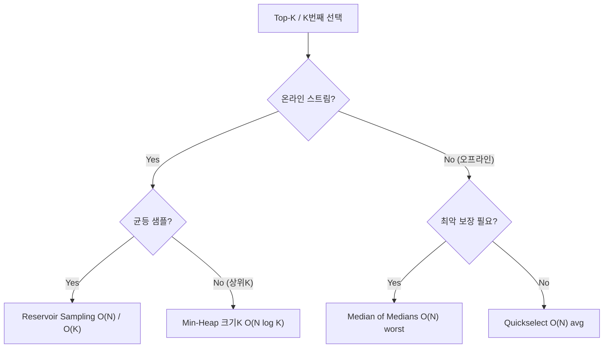
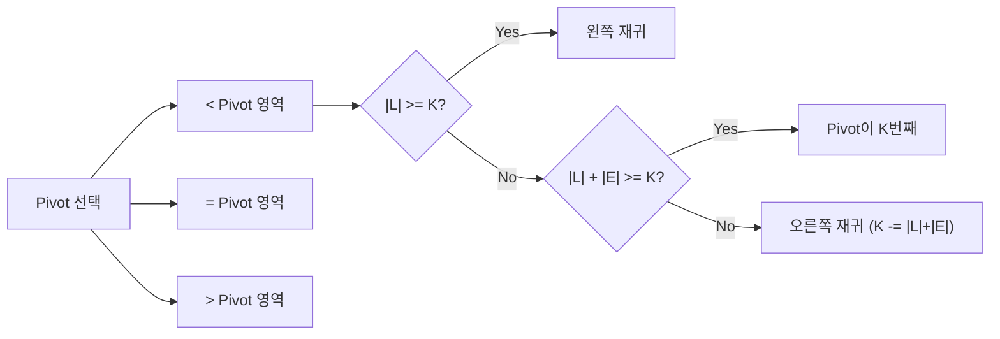

## 정의

배열 또는 스트림에서 **상위 K 개** 원소를 뽑는 문제. 혹은 K 번째로 큰/작은 원소 하나만 찾는 선택(selection) 문제.

- **오프라인**: 배열 전체가 주어짐 → Quickselect, Introselect, 정렬
- **온라인 (스트림)**: 원소가 하나씩 들어옴 → Min-Heap, Reservoir Sampling

## 문제 상황과 동기

N = 10^7 의 배열에서 K = 100 인 원소를 뽑는 상황:
- **정렬**: O(N log N) = 약 2.3억 연산. 낭비가 큼.
- **Min-Heap (K 유지)**: O(N log K) ≈ 700만 연산. 훨씬 빠름.
- **Quickselect (K 번째 하나만)**: 평균 O(N). 약 1000만 연산.

## 접근 방법 비교

| 방법 | 시간 | 공간 | 온라인 | 비고 |
|:---|:---:|:---:|:---:|:---|
| 정렬 후 자르기 | O(N log N) | O(1) | No | 구현 가장 단순 |
| Min-Heap (크기 K) | O(N log K) | O(K) | **Yes** | 스트림 적합 |
| Quickselect | O(N) avg, O(N²) worst | O(log N) | No | 평균 최고 |
| Median of Medians | **O(N) worst** | O(N) | No | 상수 크지만 보장 |
| Reservoir Sampling | O(N) | O(K) | **Yes** | 균등 랜덤 K개 |

## 시각화

알고리즘 선택:



Quickselect Partition 구조:



## 핵심 아이디어

### 1. 정렬 후 자르기

O(N log N). K 가 작을 때 낭비 심함.

### 2. Min-Heap (크기 K)

크기 K 의 Min-Heap 유지. 새 원소가 heap 최솟값보다 크면 교체.

```cpp
priority_queue<int, vector<int>, greater<>> pq;
for (int x : arr) {
    pq.push(x);
    if ((int)pq.size() > K) pq.pop();
}
// pq 에 상위 K개 원소 남음
```

O(N log K). **스트리밍에도 적합**.

### 3. Quickselect

Pivot 기반 partition, 원하는 위치 도달할 때까지 한쪽만 재귀. 평균 O(N) 이지만 최악 O(N²) (이미 정렬된 배열 + 나쁜 pivot).

```
quickselect(a, l, r, k):
    if l == r: return a[l]
    pivot = a[random(l, r)]
    partition into a[l..p1-1] < pivot, a[p1..p2] = pivot, a[p2+1..r] > pivot
    if k < p1:   return quickselect(a, l, p1-1, k)
    if k > p2:   return quickselect(a, p2+1, r, k)
    return pivot
```

C++ `std::nth_element` 가 이 계열 (Introselect). **평균 O(N) 보장, 실전 최고 속도**.

### 4. Median of Medians (Introselect)

**최악 O(N)** 을 보장하는 pivot 선택 방법:

1. 배열을 5개씩 묶어 각 그룹의 중앙값 계산 → 총 N/5 개
2. N/5 개의 중앙값들의 중앙값 = 전체의 대략 30~70% 분위수
3. 이 값을 pivot 으로 사용 → 항상 일정 비율로 배열을 쪼갬

T(N) = T(N/5) + T(7N/10) + O(N) → 점화식 풀면 T(N) = O(N).

> [!NOTE]
> 실제 상수가 크기 때문에 Quickselect 의 랜덤 pivot 보다 느린 경우가 많습니다. C++ `std::nth_element` 는 Introselect 계열 (Quickselect + 최악 시 Heapsort 로 전환) 로 최악 O(N log N) 을 보장합니다.

### 5. Reservoir Sampling

**n 개 중 K 개를 균등하게 랜덤 선택** (스트림 처리).

```
reservoir = arr[0..K-1]
for i = K to n-1:
    j = random(0, i)
    if j < K: reservoir[j] = arr[i]
```

각 원소가 reservoir 에 포함될 확률 = K/n. **선택 편향 없이** K개 랜덤 샘플. O(N) 시간, O(K) 공간.

## 구현

<CodeWithOutput
  variants={[
    {
      language: "cpp",
      label: "C++ (Quickselect + Heap)",
      code: `// K번째 작은 원소 (Quickselect) + 상위 K개 (Min-Heap)
#include <bits/stdc++.h>
using namespace std;

// K번째 작은 원소 (0-indexed): O(N) avg
int quickselect(vector<int>& a, int l, int r, int k) {
    if (l == r) return a[l];
    int pivot = a[l + (r - l) / 2];
    int i = l, j = r, m = l;
    while (m <= j) {
        if (a[m] < pivot) swap(a[i++], a[m++]);
        else if (a[m] > pivot) swap(a[m], a[j--]);
        else m++;
    }
    if (k < i) return quickselect(a, l, i - 1, k);
    if (k > j) return quickselect(a, j + 1, r, k);
    return a[k];
}

// 상위 K개 원소: O(N log K)
vector<int> topK_heap(vector<int>& arr, int K) {
    priority_queue<int, vector<int>, greater<>> pq;
    for (int x : arr) {
        pq.push(x);
        if ((int)pq.size() > K) pq.pop();
    }
    vector<int> res;
    while (!pq.empty()) { res.push_back(pq.top()); pq.pop(); }
    return res;
}

int main() {
    ios::sync_with_stdio(0); cin.tie(0);
    int n, k; cin >> n >> k;
    vector<int> a(n);
    for (auto& v : a) cin >> v;

    // K번째 작은 원소 (1-indexed -> 0-indexed)
    vector<int> b = a;
    cout << "K번째: " << quickselect(b, 0, n-1, k-1) << "\\n";

    // 상위 K개 (K개의 최대값들)
    // 최댓값 기준 상위 K개: nth_element 사용
    nth_element(a.begin(), a.begin() + n - k, a.end());
    cout << "상위 K개: ";
    for (int i = n - k; i < n; i++) cout << a[i] << " ";
    cout << "\\n";

    return 0;
}`,
    },
    {
      language: "python",
      label: "Python (Quickselect + Reservoir)",
      code: `# Quickselect + Reservoir Sampling
import random
import heapq

def quickselect(a, k):
    """K번째 작은 원소 (0-indexed k), O(N) avg"""
    if len(a) == 1:
        return a[0]
    pivot = random.choice(a)
    lo = [x for x in a if x < pivot]
    mi = [x for x in a if x == pivot]
    hi = [x for x in a if x > pivot]
    if k < len(lo):
        return quickselect(lo, k)
    elif k < len(lo) + len(mi):
        return pivot
    else:
        return quickselect(hi, k - len(lo) - len(mi))

def top_k_heap(stream, k):
    """스트림에서 상위 K개 (최댓값), O(N log K)"""
    heap = []
    for x in stream:
        heapq.heappush(heap, x)
        if len(heap) > k:
            heapq.heappop(heap)
    return heap

def reservoir_sample(stream, k):
    """균등 랜덤 K개 선택, O(N)"""
    res = []
    for i, x in enumerate(stream):
        if i < k:
            res.append(x)
        else:
            j = random.randint(0, i)
            if j < k:
                res[j] = x
    return res

# 사용 예시
import sys
input = sys.stdin.readline

def main():
    n, k = map(int, input().split())
    a = list(map(int, input().split()))

    # K번째 작은 원소 (1-indexed)
    b = a[:]
    print("K번째:", quickselect(b, k - 1))

    # 상위 K개 최댓값
    top_k = top_k_heap(a, k)
    print("상위 K개:", sorted(top_k, reverse=True))

main()`,
    },
    {
      language: "java",
      label: "Java (nth_element + PriorityQueue)",
      code: `// Top-K Selection: PriorityQueue 기반
import java.util.*;
import java.io.*;

public class Main {
    // Quickselect: K번째 작은 원소 (0-indexed)
    static int quickselect(int[] a, int l, int r, int k) {
        if (l == r) return a[l];
        int pivot = a[l + (r - l) / 2];
        int i = l, j = r, m = l;
        while (m <= j) {
            if (a[m] < pivot) { int t = a[i]; a[i] = a[m]; a[m] = t; i++; m++; }
            else if (a[m] > pivot) { int t = a[m]; a[m] = a[j]; a[j] = t; j--; }
            else m++;
        }
        if (k < i) return quickselect(a, l, i - 1, k);
        if (k > j) return quickselect(a, j + 1, r, k);
        return a[k];
    }

    public static void main(String[] args) throws IOException {
        BufferedReader br = new BufferedReader(new InputStreamReader(System.in));
        StringTokenizer st = new StringTokenizer(br.readLine());
        int n = Integer.parseInt(st.nextToken());
        int k = Integer.parseInt(st.nextToken());
        int[] a = new int[n];
        st = new StringTokenizer(br.readLine());
        for (int i = 0; i < n; i++) a[i] = Integer.parseInt(st.nextToken());

        // K번째 작은 원소
        int[] b = a.clone();
        System.out.println("K번째: " + quickselect(b, 0, n - 1, k - 1));

        // 상위 K개 최댓값 (Min-Heap 크기 K)
        PriorityQueue<Integer> pq = new PriorityQueue<>();
        for (int x : a) {
            pq.offer(x);
            if (pq.size() > k) pq.poll();
        }
        List<Integer> topK = new ArrayList<>(pq);
        topK.sort(Collections.reverseOrder());
        System.out.println("상위 K개: " + topK);
    }
}`,
    },
  ]}
  cases={[
    {
      label: "기본",
      input: `7 3
3 1 4 1 5 9 2`,
      output: `K번째: 3
상위 K개: [9, 5, 4]`,
    },
  ]}
/>

## 복잡도 상세

### Quickselect 분석

랜덤 pivot 기준 기댓값:

```
E[T(N)] = E[T(max(K-1, N-K))] + O(N)
         = T(3N/4) + O(N) (평균 pivot 이 25~75% 위치)
         = O(N)
```

최악: 매번 1개씩만 제거 → O(N²). Introselect 는 Heapsort 로 fallback → O(N log N) 최악.

### Median of Medians 분석

```
T(N) = T(N/5) + T(7N/10) + O(N)
```

N/5 개의 그룹 중앙값 재귀, 전체 원소의 30% 이상이 pivot 보다 크고 30% 이상이 작음을 보장.

T(N/5) + T(7N/10) = T(9N/10) → T(N) = O(N) (점화식 풀면).

## 변형 / 활용

### Sliding Window K번째 원소

슬라이딩 윈도우에서 K번째 원소: 크기 K 의 정렬 구조 (order statistics tree) 유지. O(N log K). [[order-statistics-tree|Order Statistics Tree]] 참조.

### 온라인 중앙값 (Median of Stream)

두 개의 heap: max-heap (작은 절반) + min-heap (큰 절반). 중앙값은 top 원소. [[median-of-stream|Median of Stream]] 참조.

### K번째 최소 경로 합

그래프 문제에서 K 번째 최단 경로: Yen's algorithm, K-shortest paths.

## 함정

> [!WARNING]
> Quickselect 는 **최악 O(N²)** 입니다. PS 에서 시간 초과가 날 수 있는 환경 (anti-quickselect 테스트케이스) 이면 `std::nth_element` (Introselect) 또는 Heap 을 사용하세요.

### 1. K 가 N 보다 큰 경우

K >= N 이면 그냥 전체 정렬. 예외 처리 필요.

### 2. 동점 처리

"정확히 K 번째" vs "상위 K 개" 의 의미가 다름. 동점이 있으면 어떤 원소를 포함할지 문제 조건 확인.

### 3. Reservoir Sampling 균등성

shuffle 없이 단순히 처음 K개를 고르는 건 랜덤이 아닙니다. 반드시 Reservoir Sampling 알고리즘을 써야 균등 분포.

### 4. min-heap vs max-heap

"상위 K 최댓값" 유지 시 min-heap (크기 K). "하위 K 최솟값" 유지 시 max-heap (크기 K). 헷갈리기 쉬움.

## BOJ 연습 문제

| 번호 | 제목 | 링크 |
|:---|:---|:---|
| BOJ 2696 | 중앙값 구하기 | [BOJ](https://www.acmicpc.net/problem/2696) |
| BOJ 1655 | 가운데를 말해요 | [BOJ](https://www.acmicpc.net/problem/1655) |
| BOJ 7469 | K번째 수 | [BOJ](https://www.acmicpc.net/problem/7469) |

## 참고

- [[priority-queue-heap|Priority Queue / Heap]]
- [[median-of-stream|Median of Stream]]
- [[order-statistics-tree|Order Statistics Tree]]
- [[wavelet-tree|Wavelet Tree]]
