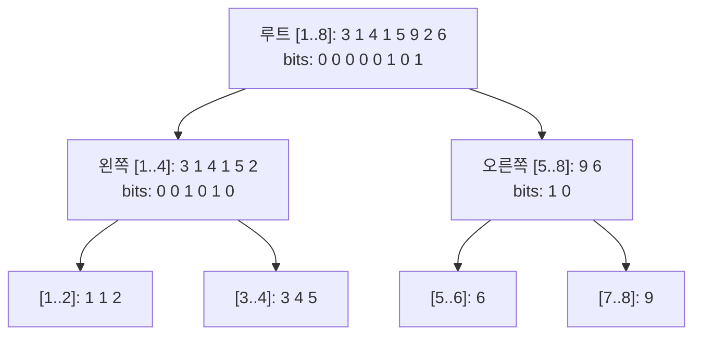

## 정의

**Wavelet Tree** 는 시퀀스의 값 범위를 이진 분할하며 만든 트리 자료구조입니다. **k-th smallest in range**, **rank/select**, **count in range** 등을 O(log |Σ|) 에 답합니다.

- |Σ| = 값 범위 (좌표 압축 후 N 이하로 만들 수 있음)
- N = 시퀀스 길이
- 공간: O(N log |Σ|)
- 전처리: O(N log |Σ|)
- 쿼리: O(log |Σ|)

[[persistent-segtree|Persistent Segment Tree]] 와 동일한 쿼리를 지원하면서 구현이 단순하고 공간 효율이 좋습니다.

## 문제 상황과 동기

배열 A[0..N-1] 에서 다음 쿼리를 처리해야 하는 상황:

- `kth(l, r, k)`: A[l..r] 에서 k 번째로 작은 원소
- `rank(l, r, v)`: A[l..r] 에서 v 보다 작은 원소 개수
- `count(l, r, lo, hi)`: A[l..r] 에서 값이 [lo, hi] 인 원소 개수

| 방법 | 전처리 | 쿼리 | 공간 |
|:---|:---:|:---:|:---:|
| 정렬 매번 | O(1) | O(N log N) | O(1) |
| Merge Sort Tree | O(N log N) | O(log² N) | O(N log N) |
| [[persistent-segtree|Persistent Segtree]] | O(N log N) | O(log N) | O(N log N) |
| **Wavelet Tree** | O(N log |Σ|) | O(log |Σ|) | O(N log |Σ|) |

## 핵심 아이디어

각 레벨에서 값 범위를 반으로 나누어 **왼쪽 반 (0) / 오른쪽 반 (1)** 인지 비트 시퀀스를 만듭니다. 재귀적으로 각 반에 대해 반복.

```
input: [3 1 4 1 5 9 2 6]  (값 범위 [1..9])

level 0 (mid=5): [0 0 0 0 0 1 0 1]   0→[3 1 4 1 5 2], 1→[9 6]
level 1 왼쪽 (mid=3): [0 0 1 0 1 0]   0→[1 1 2], 1→[3 4 5]
level 1 오른쪽 (mid=7): [1 0]         0→[6], 1→[9]
...
```

각 노드에 **prefix sum 배열** (비트 0 인 원소의 누적 수) 을 저장하면, 쿼리 시 O(1) 에 왼쪽/오른쪽 자식 범위를 계산 가능.

## 시각화

입력 `[3, 1, 4, 1, 5, 9, 2, 6]` (값 범위 1..9, 좌표 압축 후 1..8) 에서 Wavelet Tree 구성:



## 구현 구조

### 노드 구조

각 Wavelet Tree 노드는 구간 `[lo, hi]` 에 해당하며:
- 원소 배열의 순서 (배열 전체를 레벨별로 재배열)
- `cnt[i]` = 처음 i개 원소 중 왼쪽 자식 (값 <= mid) 으로 간 원소 수 (prefix sum)

### kth 쿼리 알고리즘

`kth(node, l, r, k)`: 현재 노드 범위 [l, r] 에서 k번째 작은 원소

```text
kth(lo, hi, l, r, k):
    if lo == hi: return lo
    mid = (lo + hi) / 2
    // 범위 [l, r] 에서 왼쪽 자식으로 간 원소 수
    left_count = cnt[r+1] - cnt[l]
    if k <= left_count:
        // 왼쪽 자식에서 k번째
        new_l = cnt[l]
        new_r = cnt[r+1] - 1
        return kth(lo, mid, new_l, new_r, k)
    else:
        // 오른쪽 자식에서 (k - left_count)번째
        new_l = (l - cnt[l])                   // 오른쪽 자식 내 인덱스
        new_r = (r + 1 - cnt[r+1]) - 1
        return kth(mid+1, hi, new_l, new_r, k - left_count)
```

### rank 쿼리 알고리즘

`rank(l, r, v)`: `A[l..r]` 에서 v 보다 작은 원소 수

```text
rank(lo, hi, l, r, v):
    if hi < v: return r - l + 1   // 범위 전체가 v 미만
    if lo >= v: return 0           // 범위 전체가 v 이상
    mid = (lo + hi) / 2
    left_l = cnt[l]
    left_r = cnt[r+1] - 1
    right_l = l - cnt[l]
    right_r = r - cnt[r+1] + 1 - 1
    return rank(lo, mid, left_l, left_r, v) + rank(mid+1, hi, right_l, right_r, v)
```

## 구현

<CodeWithOutput
  variants={[
    {
      language: "cpp",
      label: "C++",
      code: `// Wavelet Tree: kth smallest in range [l, r]
#include <bits/stdc++.h>
using namespace std;

struct WaveletTree {
    int lo, hi;  // 값 범위 [lo, hi]
    WaveletTree *left = nullptr, *right = nullptr;
    vector<int> cnt;  // cnt[i] = arr[0..i-1] 중 왼쪽(<=mid)으로 간 수

    // arr [from, to) 를 빌드. 좌표 압축된 값 1-indexed 가정.
    void build(int* from, int* to, int lo, int hi) {
        this->lo = lo; this->hi = hi;
        if (lo == hi) return;
        int mid = (lo + hi) / 2;
        // cnt[i] = 처음 i개 중 <= mid 인 수
        cnt.reserve(to - from + 1);
        cnt.push_back(0);
        for (auto it = from; it != to; it++)
            cnt.push_back(cnt.back() + (*it <= mid ? 1 : 0));
        // stable partition: <= mid 먼저, > mid 나중
        auto pivot = stable_partition(from, to, [mid](int x){ return x <= mid; });
        left = new WaveletTree();
        left->build(from, pivot, lo, mid);
        right = new WaveletTree();
        right->build(pivot, to, mid + 1, hi);
    }

    // a[l..r] (0-indexed) 에서 k번째 작은 원소 (1-indexed k)
    int kth(int l, int r, int k) {
        if (lo == hi) return lo;
        int lb = cnt[l];           // [0..l-1] 중 왼쪽으로 간 수
        int rb = cnt[r + 1];       // [0..r] 중 왼쪽으로 간 수
        int left_cnt = rb - lb;    // [l..r] 중 왼쪽으로 간 수
        if (k <= left_cnt)
            return left->kth(lb, rb - 1, k);
        else
            return right->kth(l - lb, r - rb, k - left_cnt);
    }

    // a[l..r] 에서 v보다 작은 원소 수 (rank)
    int rank_lt(int l, int r, int v) {
        if (l > r) return 0;
        if (lo == hi) return (lo < v) ? (r - l + 1) : 0;
        if (hi < v) return r - l + 1;
        if (lo >= v) return 0;
        int mid = (lo + hi) / 2;
        int lb = cnt[l], rb = cnt[r + 1];
        return left->rank_lt(lb, rb - 1, v)
             + right->rank_lt(l - lb, r - rb, v);
    }
};

int main() {
    ios::sync_with_stdio(0); cin.tie(0);
    int n, q; cin >> n >> q;
    vector<int> a(n);
    for (auto& v : a) cin >> v;

    // 좌표 압축
    vector<int> sorted_a = a;
    sort(sorted_a.begin(), sorted_a.end());
    sorted_a.erase(unique(sorted_a.begin(), sorted_a.end()), sorted_a.end());
    int sigma = sorted_a.size();
    for (auto& v : a)
        v = lower_bound(sorted_a.begin(), sorted_a.end(), v) - sorted_a.begin() + 1;

    WaveletTree* wt = new WaveletTree();
    vector<int> tmp = a;
    wt->build(tmp.data(), tmp.data() + n, 1, sigma);

    while (q--) {
        int l, r, k; cin >> l >> r >> k; l--; r--;
        int compressed = wt->kth(l, r, k);
        cout << sorted_a[compressed - 1] << "\\n";
    }
}`,
    },
    {
      language: "python",
      label: "Python",
      code: `# Wavelet Tree: K번째 작은 원소 쿼리
import sys
from bisect import bisect_left, insort
input = sys.stdin.readline

class WaveletTree:
    def __init__(self, arr, lo, hi):
        self.lo = lo
        self.hi = hi
        self.left = None
        self.right = None
        self.cnt = [0]  # prefix count of elements <= mid

        if lo == hi or not arr:
            return

        mid = (lo + hi) // 2
        for x in arr:
            self.cnt.append(self.cnt[-1] + (1 if x <= mid else 0))

        left_arr = [x for x in arr if x <= mid]
        right_arr = [x for x in arr if x > mid]

        if left_arr:
            self.left = WaveletTree(left_arr, lo, mid)
        if right_arr:
            self.right = WaveletTree(right_arr, mid + 1, hi)

    def kth(self, l, r, k):
        """arr[l..r] (0-indexed) 에서 k번째 작은 원소 (1-indexed k)"""
        if self.lo == self.hi:
            return self.lo
        lb = self.cnt[l] if l < len(self.cnt) else self.cnt[-1]
        rb = self.cnt[r + 1] if r + 1 < len(self.cnt) else self.cnt[-1]
        left_cnt = rb - lb
        if k <= left_cnt:
            return self.left.kth(lb, rb - 1, k)
        else:
            return self.right.kth(l - lb, r - rb, k - left_cnt)

def main():
    sys.setrecursionlimit(10**6)
    n, q = map(int, input().split())
    a = list(map(int, input().split()))

    # 좌표 압축
    sorted_a = sorted(set(a))
    compress = {v: i + 1 for i, v in enumerate(sorted_a)}
    sigma = len(sorted_a)
    ca = [compress[x] for x in a]

    wt = WaveletTree(ca, 1, sigma)

    out = []
    for _ in range(q):
        l, r, k = map(int, input().split())
        l -= 1; r -= 1
        compressed = wt.kth(l, r, k)
        out.append(str(sorted_a[compressed - 1]))
    print("\\n".join(out))

main()`,
    },
  ]}
  cases={[
    {
      label: "K번째 작은 원소",
      input: `5 3
3 1 4 1 5
1 3 2
2 4 1
1 5 3`,
      output: `3
1
3`,
    },
  ]}
/>

## 복잡도

| 항목 | 값 |
|:---|:---|
| **전처리** | O(N log |Σ|) |
| **공간** | O(N log |Σ|) |
| **kth 쿼리** | O(log |Σ|) |
| **rank 쿼리** | O(log |Σ|) |
| **count in range 쿼리** | O(log |Σ|) |

좌표 압축 후 |Σ| = N 으로 줄일 수 있으므로, 실제로 O(N log N) / O(log N).

## 지원 쿼리 목록

### kth smallest in range

`kth(l, r, k)`: A[l..r] 에서 k 번째로 작은 원소. O(log |Σ|).

### count in range

`count(l, r, lo, hi)`: A[l..r] 에서 값 [lo, hi] 인 원소 수.

```
count(l, r, lo, hi) = rank(l, r, hi+1) - rank(l, r, lo)
```

### rank (이전 값 개수)

`rank(l, r, v)`: A[l..r] 에서 v 보다 작은 원소 수. O(log |Σ|).

### K번째 고유값

범위 [l, r] 에서 k 번째로 작은 고유값: kth 를 변형하여 처리.

## 응용

### K-th Smallest in Rectangle

2D 배열에서 특정 사각형 범위의 K번째 작은 원소. Wavelet Tree 를 2D 로 확장하거나, 오프라인으로 처리.

### 문자열 위 처리

문자열의 접미사 배열(Suffix Array) 위에 Wavelet Tree 를 얹으면 LCP 관련 쿼리를 효율적으로 처리합니다. [[suffix-array|Suffix Array]] 참조.

### Persistent Segtree 대체

[[persistent-segtree|Persistent Segment Tree]] 와 동일한 쿼리 셋을 지원하지만, 포인터 없이 배열 기반으로 구현 가능해 캐시 친화적입니다.

## 함정

> [!WARNING]
> Wavelet Tree 는 **정적 자료구조** 입니다. 원소 추가/삭제가 있으면 재빌드 필요. 동적 갱신이 필요하면 Balanced BST 기반 [[order-statistics-tree|Order Statistics Tree]] 를 고려하세요.

### 1. 좌표 압축 필수

값 범위가 크면 (최대 10^9) 좌표 압축 없이는 메모리 초과. 압축 후 |Σ| = N 으로 만드세요.

### 2. stable_partition 필수

빌드 시 원소 순서를 보존해야 합니다. 단순 partition 은 순서를 망가뜨립니다.

### 3. 인덱스 범위 오류

`cnt` 배열은 크기 N+1. `cnt[r+1]` 접근 시 경계 초과 주의.

### 4. 재귀 깊이

Python 에서 |Σ| = N = 10^5 이면 깊이 약 17. `sys.setrecursionlimit(10**6)` 필수.

## BOJ 연습 문제

| 번호 | 제목 | 링크 |
|:---|:---|:---|
| BOJ 7469 | K번째 수 | [BOJ](https://www.acmicpc.net/problem/7469) |
| BOJ 13537 | 수열과 쿼리 1 | [BOJ](https://www.acmicpc.net/problem/13537) |

## 참고

- [[persistent-segtree|Persistent Segtree]]
- [[order-statistics-tree|Order Statistics Tree]]
- [[suffix-array|Suffix Array]]
- [[merge-sort-tree|Merge Sort Tree]]
- [[top-k-selection|Top-K Selection]]
