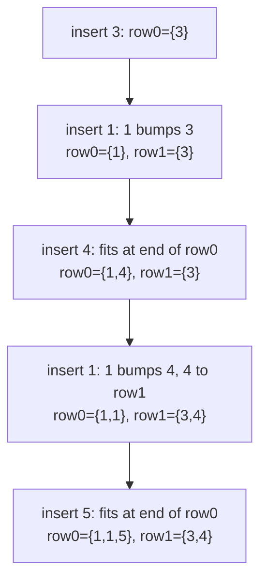
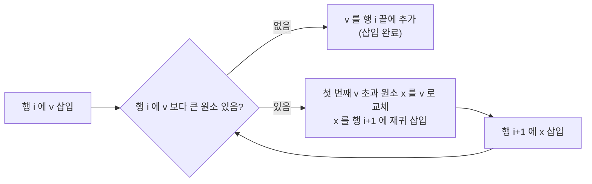

## 정의

**Young Tableau** 는 정수를 격자(grid) 에 배치한 자료구조로, 다음 조건을 만족합니다:

- 각 행(row): 왼쪽에서 오른쪽으로 **비감소 (non-decreasing)**
- 각 열(column): 위에서 아래로 **비감소 (non-decreasing)**

```text
표준 Young Tableau 예시 (행/열 모두 증가):
  1  3  5
  2  4  8
  6  7
```

**Standard Young Tableau (SYT)**: 1 부터 n 까지 각 숫자가 정확히 한 번씩 등장하며 행/열이 증가.

**Semistandard Young Tableau (SSYT)**: 행은 비감소, 열은 순증가.

## RSK 대응 (Robinson-Schensted-Knuth)

**RSK 대응** 은 순열 (또는 수열) 과 Young Tableau 쌍 (P, Q) 사이의 일대일 대응입니다.

- P: **삽입 태블로 (Insertion Tableau)** - 원소를 Schensted 삽입으로 구성
- Q: **기록 태블로 (Recording Tableau)** - 삽입 순서를 기록

핵심 성질:
- 수열의 [[lis|LIS]] 길이 = P 의 **첫 행 길이**
- 수열의 LDS (Longest Decreasing Subsequence) 길이 = P 의 **첫 열 길이**

## 시각화

수열 `[3, 1, 4, 1, 5]` 의 RSK 삽입 과정:



첫 행 길이 = 3 = LIS 길이 (예: [1, 4, 5] 또는 [1, 1, 5]).

Schensted 삽입 규칙 (행 i 에 값 v 삽입):



## 핵심 아이디어

### Schensted 삽입 (Row Bumping)

값 v 를 태블로 P 에 삽입하는 과정:

```text
insert(P, v):
    for i = 0, 1, 2, ...:
        if i == len(P):
            P.append([v])   // 새 행 추가
            return
        // 행 i 에서 v 보다 큰 첫 번째 원소 찾기
        j = first index where P[i][j] > v
        if j == len(P[i]):
            P[i].append(v)  // 행 끝에 추가
            return
        // bump: P[i][j] 를 v 로 교체, 기존 값을 다음 행으로
        v, P[i][j] = P[i][j], v
        // v (= 기존 P[i][j]) 를 행 i+1 에 삽입
```

### Young Tableau 의 힙 성질

Young Tableau 는 2D 힙으로도 볼 수 있습니다:

- **최솟값**: 항상 (0, 0) 위치
- **최솟값 추출**: (0, 0) 을 제거하고 재구성 O(m + n)
- **삽입**: Schensted 삽입 O(m + n)

m x n 크기 Young Tableau 에서 k 번째 최솟값을 O(k log(m+n)) 에 찾을 수 있습니다.

### LIS 와의 관계

[[lis|LIS]] 길이를 Young Tableau 로 구하는 방법:

```text
LIS_via_RSK(seq):
    P = []  // 빈 태블로
    for v in seq:
        insert(P, v)
    return len(P[0])  // 첫 행 길이
```

이는 patience sorting 과 동일합니다. 각 행의 마지막 원소들이 patience sorting 의 더미 (pile) 상단과 같습니다.

## 알고리즘

### 삽입 (Schensted Insertion)

```text
schensted_insert(P, v):
    for i in 0..len(P):
        if i == len(P):
            P.append([v]); return
        // upper_bound: v 보다 큰 첫 번째 위치
        j = upper_bound(P[i], v)
        if j == len(P[i]):
            P[i].append(v); return
        P[i][j], v = v, P[i][j]  // bump
```

### 최솟값 추출

```text
extract_min(P):
    result = P[0][0]
    // 오른쪽 아래 방향으로 재구성
    i, j = 0, 0
    while True:
        right = P[i][j+1] if j+1 < len(P[i]) else INF
        down  = P[i+1][j] if i+1 < len(P) else INF
        if right == INF and down == INF:
            P[i].pop()
            if not P[i]: P.pop()
            break
        if right <= down:
            P[i][j] = right; j += 1
        else:
            P[i][j] = down; i += 1
    return result
```

### 정렬 (Young Tableau Sort)

m x n Young Tableau 에서 mn 개 원소를 정렬: 최솟값을 mn 번 추출. O(mn * (m+n)).

## 구현

<CodeWithOutput
  variants={[
    {
      language: "cpp",
      label: "C++",
      code: `// Young Tableau: RSK 삽입 + LIS 길이
#include <bits/stdc++.h>
using namespace std;

// Schensted 삽입: P 에 v 삽입
void insert(vector<vector<int>>& P, int v) {
    for (int i = 0; ; i++) {
        if (i == (int)P.size()) {
            P.push_back({v});
            return;
        }
        // v 보다 큰 첫 번째 원소 위치 (upper_bound)
        auto it = upper_bound(P[i].begin(), P[i].end(), v);
        if (it == P[i].end()) {
            P[i].push_back(v);
            return;
        }
        // bump: *it 를 v 로 교체, 기존 *it 를 다음 행으로
        swap(*it, v);
    }
}

// LIS 길이 = RSK 후 첫 행 길이
int lis_length(vector<int>& seq) {
    vector<vector<int>> P;
    for (int v : seq) insert(P, v);
    return P.empty() ? 0 : (int)P[0].size();
}

// 태블로 출력
void print_tableau(vector<vector<int>>& P) {
    for (auto& row : P) {
        for (int x : row) cout << x << " ";
        cout << "\\n";
    }
}

int main() {
    ios::sync_with_stdio(0); cin.tie(0);
    int n; cin >> n;
    vector<int> seq(n);
    for (int& x : seq) cin >> x;

    vector<vector<int>> P;
    for (int v : seq) insert(P, v);

    cout << "LIS length: " << P[0].size() << "\\n";
    cout << "Insertion Tableau:\\n";
    print_tableau(P);
}`,
    },
    {
      language: "python",
      label: "Python",
      code: `# Young Tableau: RSK 삽입 + LIS 길이
import sys
from bisect import bisect_right
input = sys.stdin.readline

def insert(P, v):
    """Schensted 삽입: P 에 v 삽입"""
    for i in range(len(P) + 1):
        if i == len(P):
            P.append([v])
            return
        # v 보다 큰 첫 번째 원소 위치
        j = bisect_right(P[i], v)
        if j == len(P[i]):
            P[i].append(v)
            return
        # bump
        P[i][j], v = v, P[i][j]

def lis_length(seq):
    """LIS 길이 = RSK 후 첫 행 길이"""
    P = []
    for v in seq:
        insert(P, v)
    return len(P[0]) if P else 0

n = int(input())
seq = list(map(int, input().split()))

P = []
for v in seq:
    insert(P, v)

print(f"LIS length: {len(P[0]) if P else 0}")
print("Insertion Tableau:")
for row in P:
    print(*row)`,
    },
    {
      language: "java",
      label: "Java",
      code: `// Young Tableau: RSK 삽입 + LIS 길이
import java.util.*;
import java.io.*;

public class Main {
    static List<List<Integer>> P = new ArrayList<>();

    static void insert(int v) {
        for (int i = 0; ; i++) {
            if (i == P.size()) {
                List<Integer> row = new ArrayList<>();
                row.add(v); P.add(row); return;
            }
            List<Integer> row = P.get(i);
            // upper_bound: v 보다 큰 첫 번째 위치
            int lo = 0, hi = row.size();
            while (lo < hi) {
                int mid = (lo + hi) / 2;
                if (row.get(mid) <= v) lo = mid + 1;
                else hi = mid;
            }
            if (lo == row.size()) {
                row.add(v); return;
            }
            // bump
            int bumped = row.get(lo);
            row.set(lo, v);
            v = bumped;
        }
    }

    public static void main(String[] args) throws IOException {
        BufferedReader br = new BufferedReader(new InputStreamReader(System.in));
        int n = Integer.parseInt(br.readLine());
        StringTokenizer st = new StringTokenizer(br.readLine());
        for (int i = 0; i < n; i++) insert(Integer.parseInt(st.nextToken()));

        StringBuilder sb = new StringBuilder();
        sb.append("LIS length: ").append(P.isEmpty() ? 0 : P.get(0).size()).append('\\n');
        sb.append("Insertion Tableau:\\n");
        for (List<Integer> row : P) {
            for (int x : row) sb.append(x).append(' ');
            sb.append('\\n');
        }
        System.out.print(sb);
    }
}`,
    },
  ]}
  cases={[
    {
      label: "기본 (LIS = 3)",
      input: `5
3 1 4 1 5`,
      output: `LIS length: 3
Insertion Tableau:
1 1 5 
3 4 `,
    },
  ]}
/>

## 복잡도

| 항목 | 값 |
|:---|:---|
| **Schensted 삽입** | O(m + n) (m x n 태블로) |
| **최솟값 추출** | O(m + n) |
| **LIS 계산 (n 원소)** | O(n log n) (이진 탐색 사용 시) |
| **공간** | O(n) |

Schensted 삽입에서 각 행에서 이진 탐색을 쓰면 O(log n) 이지만, 행 수가 O(n) 이므로 전체는 O(n log n).

## 변형 / 활용

| 응용 | 설명 |
|:---|:---|
| **LIS** | 첫 행 길이 = LIS 길이. Patience sorting 과 동일. |
| **LDS** | 첫 열 길이 = LDS (Longest Decreasing Subsequence) 길이. |
| **Dilworth 정리** | 최소 체인 분해 = 최대 반체인 크기 (LIS 와 관련). |
| **2D 힙** | 최솟값 추출 O(m+n). 우선순위 큐 대안. |
| **표현론** | 대칭군의 기약 표현과 일대일 대응. |

## 함정

> [!WARNING]
> Young Tableau 구현 시 자주 발생하는 실수들.

### 1. upper_bound vs lower_bound

Schensted 삽입에서 **upper_bound** (v 보다 큰 첫 번째 위치) 를 써야 합니다. lower_bound (v 이상인 첫 번째 위치) 를 쓰면 같은 값이 있을 때 잘못 bump 됩니다.

SSYT (Semistandard) 에서는 열이 순증가이므로 같은 값을 같은 열에 넣으면 안 됩니다. 이 경우 lower_bound 를 씁니다.

### 2. 빈 태블로 처리

n = 0 이거나 빈 수열일 때 P 가 비어 있습니다. `P[0].size()` 접근 전에 빈 체크가 필요합니다.

### 3. LIS 와 patience sorting 의 차이

Patience sorting 의 더미 상단 배열은 Young Tableau 의 각 행 마지막 원소와 같습니다. 하지만 실제 LIS 를 복원하려면 추가 정보가 필요합니다.

### 4. 행/열 조건 혼동

Standard Young Tableau: 행/열 모두 **순증가**.
Semistandard Young Tableau: 행은 **비감소**, 열은 **순증가**.
RSK 삽입으로 만들어지는 것은 SSYT 입니다.

## BOJ 연습 문제

| 번호 | 제목 | 설명 |
|:---|:---|:---|
| BOJ 12015 | 가장 긴 증가하는 부분 수열 2 | LIS O(n log n) |
| BOJ 14003 | 가장 긴 증가하는 부분 수열 5 | LIS 복원 |
| BOJ 2568 | 전깃줄 2 | LIS 응용 |

## 관련 위키

- [[lis|최장 증가 부분 수열 (LIS)]]
- [[permutation-cycle-decomposition|순열 분해]]
- [[priority-queue-heap|우선순위 큐]]
- [[combinatorics|조합론]]
