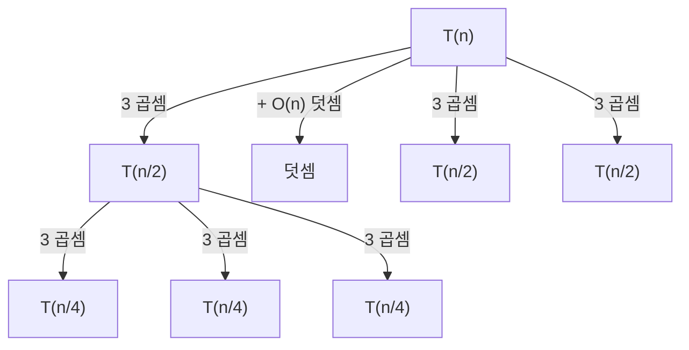
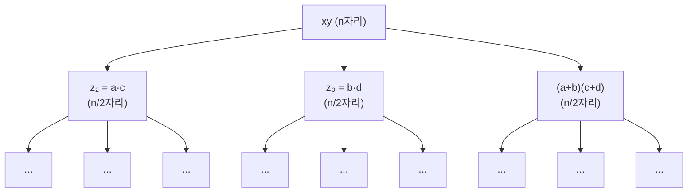
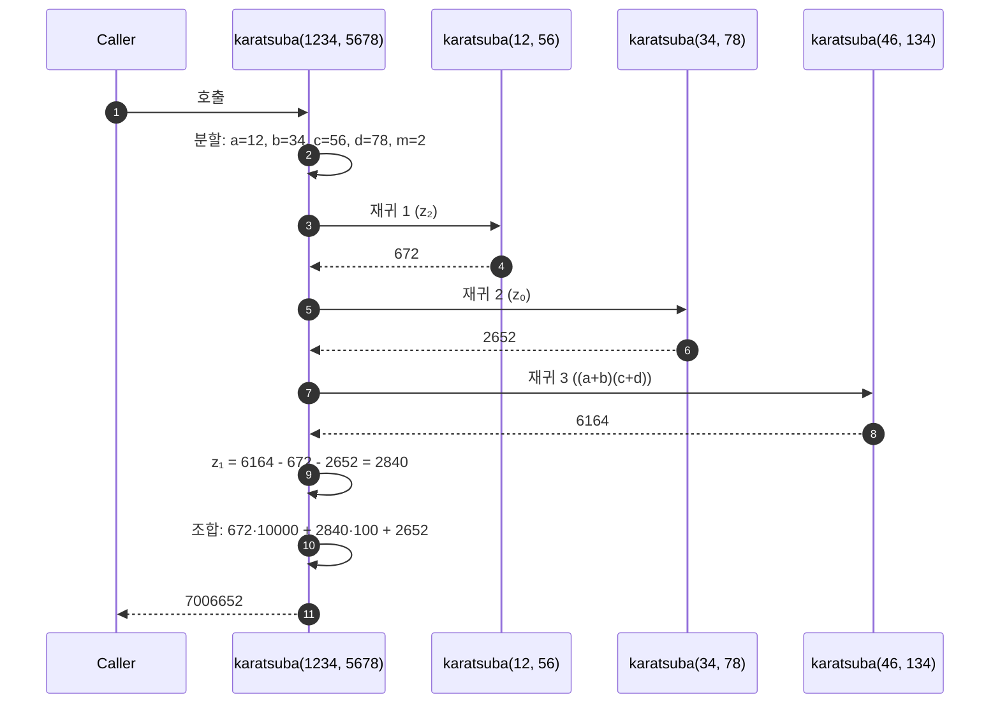
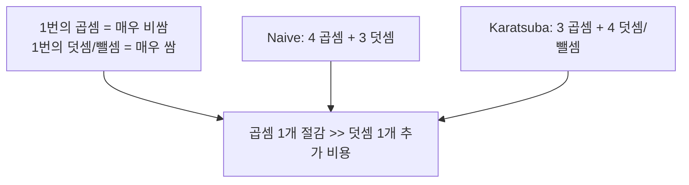
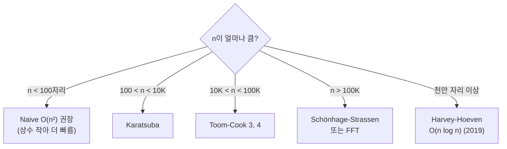
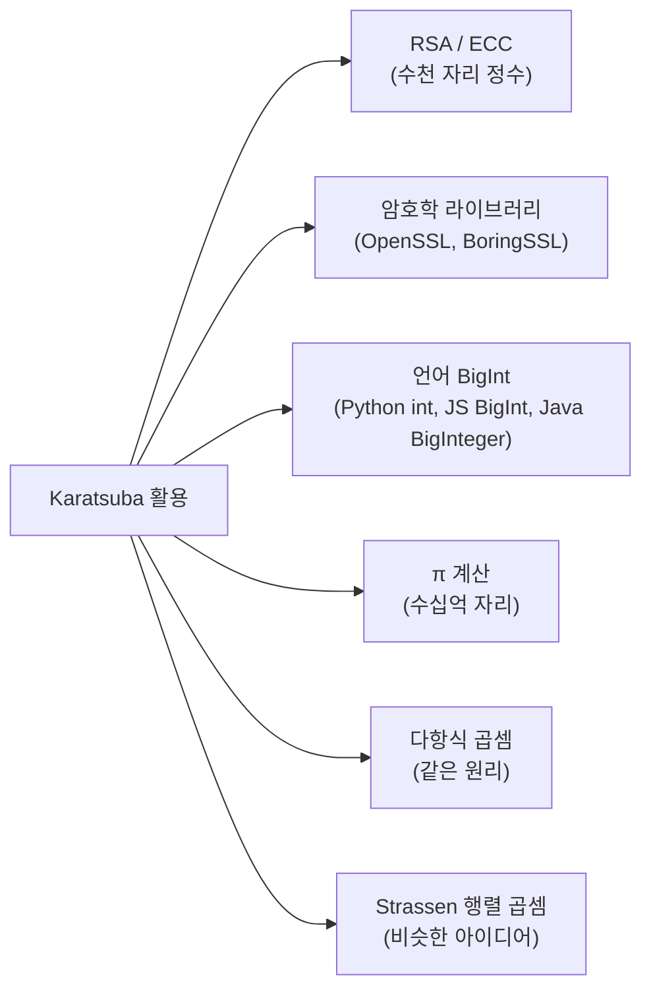

## 정의

**Karatsuba 알고리즘** 은 *두 큰 정수의 곱셈* 을 *분할 정복* 으로 풀어 **O(n^log₂3) ≈ O(n^1.585)** 시간에 처리하는 알고리즘. 1962년 *Anatoly Karatsuba* (당시 23세 학생) 가 *Kolmogorov 의 "곱셈은 Ω(n²) 이다" 추측을 반박* 한 결과물.

> [!IMPORTANT]
> *"곱셈은 더 빨라질 수 없다"* 라고 믿어진 *수십 년의 추측을 깬 알고리즘*. *분할 정복으로 산술 자체를 가속할 수 있다* 는 *패러다임 전환*. 이후 *Toom-Cook, FFT 기반 Schönhage-Strassen, 2019 Harvey-Hoeven 의 O(n log n)* 으로 이어진다.

## 동기: O(n²) 의 한계

n자리 정수 곱셈을 *손으로* 하면 *각 자리마다 모든 자리와 곱셈* → *O(n²)*:

```
        1234
      × 5678
      ──────
        9872     ← 1234 × 8
       8638      ← 1234 × 7
      7404       ← 1234 × 6
     6170        ← 1234 × 5
     ──────
     7006652
```

| n | O(n²) 연산 |
|---|---|
| 10 | 100 |
| 100 | 10,000 |
| 1,000 | 1,000,000 |
| 1,000,000 (백만 자리) | *10¹²* (불가능) |

> *암호학 (RSA, ECC), 컴퓨터 대수 시스템 (Mathematica, SymPy), π 계산* 등에서 *수백만 자리* 곱셈 필요. O(n²) 으로는 *불가능*.

## 핵심 아이디어: 3번의 곱셈으로 분해

```anim:arithmetic
{}
```

두 n자리 수 *x, y* 를 *반으로 분할* (`m = n/2` 자리):

```
x = a · Bᵐ + b      (a = 상위 m자리, b = 하위 m자리)
y = c · Bᵐ + d
```

> B = 진수 (보통 10, 또는 2³² 같은 워드 크기).

전통 곱셈 (4번):

```
x · y = (a·Bᵐ + b)(c·Bᵐ + d)
      = ac · B²ᵐ + (ad + bc) · Bᵐ + bd
```

→ `ac`, `ad`, `bc`, `bd` *4번의 (n/2)자리 곱셈* + 덧셈/시프트.

**Karatsuba 의 통찰**:

```
(a + b)(c + d) = ac + ad + bc + bd
            ad + bc = (a+b)(c+d) - ac - bd
```

→ *ad + bc* 를 *별도 곱셈 없이* 다른 결과의 *조합* 으로 얻는다!

```
z₂ = a · c
z₀ = b · d
z₁ = (a + b)(c + d) - z₂ - z₀     ← ad + bc

x · y = z₂ · B²ᵐ + z₁ · Bᵐ + z₀
```

**3번의 (n/2)자리 곱셈 + 몇 번의 덧셈/뺄셈/시프트**.

## 복잡도 분석



재귀 관계:

```
T(n) = 3 · T(n/2) + O(n)
```

*Master Theorem* (a=3, b=2, f(n)=O(n^1)):

```
log_b(a) = log₂3 ≈ 1.585
n^log_b(a) = n^1.585 > n^1 = f(n)

→ T(n) = Θ(n^log₂3) ≈ Θ(n^1.585)
```

### 시간 복잡도 비교

<ChartJs
  client:visible
  type="line"
  title="입력 자리수별 곱셈 연산 횟수 (log scale)"
  caption="n이 커질수록 Karatsuba 가 압도. FFT 는 더 큰 n에서 더 빠름 (threshold ~10⁵)."
  height="320px"
  data={{
    labels: ['10', '100', '1K', '10K', '100K', '1M'],
    datasets: [
      {
        label: 'Naive O(n²)',
        data: [100, 10000, 1e6, 1e8, 1e10, 1e12],
        borderColor: '#ef4444',
        backgroundColor: 'transparent',
        borderWidth: 2.5,
        tension: 0.3,
      },
      {
        label: 'Karatsuba O(n^1.585)',
        data: [38, 1380, 50000, 1.8e6, 6.6e7, 2.4e9],
        borderColor: '#3b82f6',
        backgroundColor: 'transparent',
        borderWidth: 2.5,
        tension: 0.3,
      },
      {
        label: 'FFT O(n log n)',
        data: [33, 664, 9966, 132877, 1.66e6, 1.99e7],
        borderColor: '#22c55e',
        backgroundColor: 'transparent',
        borderWidth: 2.5,
        tension: 0.3,
      },
    ],
  }}
  options={{
    scales: {
      y: { type: 'logarithmic', title: { display: true, text: '연산 횟수 (log)' } },
      x: { title: { display: true, text: '입력 자리수 n' } },
    },
  }}
/>

| n | Naive | Karatsuba | FFT | Naive / Karatsuba |
|---|---|---|---|---|
| 10 | 100 | 38 | 33 | 2.6× |
| 100 | 10K | 1.4K | 664 | 7.2× |
| 1K | 1M | 50K | 10K | 20× |
| 10K | 100M | 1.8M | 133K | *55×* |
| 100K | 10B | 66M | 1.7M | *152×* |
| 1M | 1T | 2.4B | 20M | *416×* |

> *n = 1M 자리* (RSA-4096 같은 거대 정수) 에서 Karatsuba 는 *400배 이상* 빠르다.

## 알고리즘 (의사 코드)

```text
function karatsuba(x, y):
  # Base case: 작은 수는 일반 곱셈
  if x < BASE or y < BASE:
    return x * y

  n = max(digits(x), digits(y))
  m = ⌈n / 2⌉
  B^m = base^m  # 시프트 단위

  # 1. Divide: x, y 를 각각 상/하위로 분할
  a, b = divmod(x, B^m)   # x = a · B^m + b
  c, d = divmod(y, B^m)   # y = c · B^m + d

  # 2. Conquer: 3번의 재귀 호출 (4번 → 3번)
  z2 = karatsuba(a, c)
  z0 = karatsuba(b, d)
  z1 = karatsuba(a + b, c + d) - z2 - z0

  # 3. Combine: 시프트 + 덧셈
  return z2 · B^(2m) + z1 · B^m + z0
```

## 재귀 트리 시각화

```anim:divide-and-conquer
{}
```

> 위는 *일반 분할 정복* 의 동작. Karatsuba 도 *같은 흐름* 이지만 *2개가 아닌 3개로 분기*.



각 노드가 *3개로 분기*. 깊이 *log₂n*. 총 노드 수 *3^log₂n = n^log₂3*.

## 단계별 추적: 1234 × 5678

```text
입력: x = 1234, y = 5678, n = 4, m = 2, B^m = 100

분할:
  a = 12, b = 34   (1234 = 12·100 + 34)
  c = 56, d = 78   (5678 = 56·100 + 78)

3번의 재귀:
  z₂ = karatsuba(12, 56) = 672
  z₀ = karatsuba(34, 78) = 2652
  (a+b)(c+d) = karatsuba(46, 134) = 6164
  z₁ = 6164 - 672 - 2652 = 2840

조합:
  xy = 672 · 10000 + 2840 · 100 + 2652
     = 6720000 + 284000 + 2652
     = 7006652  ✓

검산: 1234 × 5678 = 7006652  ✓
```

## 구현 (5개 언어)

<CodeWithOutput
  outputLanguage="text"
  outputLabel="동일"
  title="Karatsuba: 같은 알고리즘, 5개 언어"
  variants={[
    {
      label: 'python',
      language: 'python',
      code: `def karatsuba(x: int, y: int) -> int:
    # base case
    if x < 10 or y < 10:
        return x * y

    n = max(len(str(x)), len(str(y)))
    m = n // 2
    B = 10 ** m

    a, b = divmod(x, B)
    c, d = divmod(y, B)

    z2 = karatsuba(a, c)
    z0 = karatsuba(b, d)
    z1 = karatsuba(a + b, c + d) - z2 - z0

    return z2 * (B * B) + z1 * B + z0

print(karatsuba(1234, 5678))
print(karatsuba(12345678, 87654321))`,
    },
    {
      label: 'javascript',
      language: 'javascript',
      code: `// BigInt 로 임의 크기 정수 지원
function karatsuba(x, y) {
  if (x < 10n || y < 10n) return x * y;

  const n = Math.max(x.toString().length, y.toString().length);
  const m = BigInt(Math.floor(n / 2));
  const B = 10n ** m;

  const a = x / B, b = x % B;
  const c = y / B, d = y % B;

  const z2 = karatsuba(a, c);
  const z0 = karatsuba(b, d);
  const z1 = karatsuba(a + b, c + d) - z2 - z0;

  return z2 * (B * B) + z1 * B + z0;
}

console.log(karatsuba(1234n, 5678n).toString());
console.log(karatsuba(12345678n, 87654321n).toString());`,
    },
    {
      label: 'java',
      language: 'java',
      code: `import java.math.BigInteger;

class Karatsuba {
  static BigInteger karatsuba(BigInteger x, BigInteger y) {
    final BigInteger TEN = BigInteger.TEN;
    if (x.compareTo(TEN) < 0 || y.compareTo(TEN) < 0)
      return x.multiply(y);

    int n = Math.max(x.toString().length(), y.toString().length());
    int m = n / 2;
    BigInteger B = TEN.pow(m);

    BigInteger[] xs = x.divideAndRemainder(B);
    BigInteger[] ys = y.divideAndRemainder(B);
    BigInteger a = xs[0], b = xs[1];
    BigInteger c = ys[0], d = ys[1];

    BigInteger z2 = karatsuba(a, c);
    BigInteger z0 = karatsuba(b, d);
    BigInteger z1 = karatsuba(a.add(b), c.add(d))
                      .subtract(z2).subtract(z0);

    return z2.multiply(B.pow(2))
      .add(z1.multiply(B))
      .add(z0);
  }

  public static void main(String[] args) {
    System.out.println(karatsuba(
      BigInteger.valueOf(1234),
      BigInteger.valueOf(5678)));
  }
}`,
    },
    {
      label: 'rust',
      language: 'rust',
      code: `// num-bigint crate 사용
use num_bigint::BigInt;
use num_traits::Zero;

fn karatsuba(x: &BigInt, y: &BigInt) -> BigInt {
    let ten = BigInt::from(10);
    if x < &ten || y < &ten {
        return x * y;
    }

    let n = x.to_string().len().max(y.to_string().len());
    let m = n / 2;
    let b = BigInt::from(10).pow(m as u32);

    let (a, b_lo) = (x / &b, x % &b);
    let (c, d) = (y / &b, y % &b);

    let z2 = karatsuba(&a, &c);
    let z0 = karatsuba(&b_lo, &d);
    let z1 = karatsuba(&(&a + &b_lo), &(&c + &d)) - &z2 - &z0;

    z2 * b.pow(2) + z1 * &b + z0
}`,
    },
    {
      label: 'go',
      language: 'go',
      code: `package main

import (
    "fmt"
    "math/big"
)

func karatsuba(x, y *big.Int) *big.Int {
    ten := big.NewInt(10)
    if x.Cmp(ten) < 0 || y.Cmp(ten) < 0 {
        return new(big.Int).Mul(x, y)
    }

    n := max(len(x.String()), len(y.String()))
    m := n / 2
    B := new(big.Int).Exp(ten, big.NewInt(int64(m)), nil)

    a, b := new(big.Int).DivMod(x, B, new(big.Int))
    c, d := new(big.Int).DivMod(y, B, new(big.Int))

    z2 := karatsuba(a, c)
    z0 := karatsuba(b, d)
    sum := karatsuba(new(big.Int).Add(a, b),
                     new(big.Int).Add(c, d))
    z1 := new(big.Int).Sub(sum, z2)
    z1.Sub(z1, z0)

    // z2*B^2 + z1*B + z0
    res := new(big.Int).Mul(z2, new(big.Int).Mul(B, B))
    res.Add(res, new(big.Int).Mul(z1, B))
    res.Add(res, z0)
    return res
}`,
    },
  ]}
  output={`1234 × 5678 = 7006652
12345678 × 87654321 = 1082152022374638`}
/>

## 동작 흐름 (sequence)



## 왜 *3 곱셈* 이 *2 덧셈* 보다 가치 있는가?



n자리 곱셈 = *O(n²)*. n자리 덧셈 = *O(n)*. *큰 n* 에서:

```
4M(n/2) + 3A(n/2)   →  4 · (n/2)² + 3 · (n/2)   ≈  n²
3M(n/2) + 4A(n/2)   →  3 · (n/2)² + 4 · (n/2)   ≈  0.75n²

비율 0.75, 한 단계당. 재귀 깊이 log₂n 곱하면 → n^1.585
```

## Recursion 깊이의 직관

```anim:recursion
{}
```

> 재귀 호출 = 콜 스택 누적. Karatsuba 의 *재귀 깊이 = log₂n*. *n = 10⁶* 면 *20단계*. 작음.

## 실전: 언제 Karatsuba?



| 알고리즘 | 시간 | 사용 임계 (GMP) |
|---|---|---|
| 학교 곱셈 | O(n²) | n < ~80 (limb) |
| **Karatsuba** | O(n^1.585) | ~80 ≤ n < ~450 |
| Toom-Cook 3-way | O(n^1.465) | ~450 ≤ n < ~1500 |
| Toom-Cook 4, 5, 6-way | 약간 더 빠름 | 다음 단계 |
| Schönhage-Strassen | O(n log n log log n) | n > ~3000 |
| Harvey-Hoeven (2019) | O(n log n) | *이론* (실용성 아직) |

> [!IMPORTANT]
> *작은 n 에서는 Naive 가 더 빠르다*. Karatsuba 의 *상수가 큼* (재귀 + 덧셈/뺄셈 + 메모리 할당). *GMP* 같은 라이브러리는 *자동으로 임계값 결정*.

## 자주 보는 함정

> [!WARNING]
> 1. **`(a+b)(c+d)` 의 자리수 증가** = *m+1 자리* 가 될 수 있다 (캐리). 메모리 / 재귀 base case 처리 주의.
> 2. **Base case 너무 작게** = 재귀 오버헤드 폭증. n < 32 같은 *적절한 임계*.
> 3. **음수 부호 처리** = `a+b`, `c+d` 모두 양수면 OK. 부호 있는 정수면 *별도 처리*.
> 4. **자리수 균등 분할** = `m = ⌈n/2⌉` 와 `n - m` 비균등 분할. 큰 쪽의 자리수에 맞춤.

## 활용 영역



> *Strassen 행렬 곱셈* (1969) 도 *같은 패러다임*: *8개 곱셈을 7개로 줄임* → O(n^log₂7) ≈ O(n^2.807). *Karatsuba 의 후예*.

## 다항식 곱셈으로의 일반화

Karatsuba 는 *다항식 곱셈* 으로 자연 일반화:

```
P(x) = a·x + b
Q(x) = c·x + d
P(x)·Q(x) = ac·x² + (ad+bc)·x + bd
```

> 정수 곱셈은 *x = B (진수) 인 다항식 곱셈의 평가*. 다항식 곱셈을 빠르게 풀면 *정수 곱셈도 빨라진다*.

```anim:polynomial-interpolation
{}
```

```anim:fft-ntt
{}
```

> *FFT (Fast Fourier Transform)* 도 *다항식 곱셈* 의 분할 정복. *Karatsuba 의 점근적 후계자*. 자세한 건 [[fft-ntt]].

## 역사적 의의

```mermaid
gantt
    title 곱셈 알고리즘의 진화
    dateFormat YYYY
    axisFormat %Y

    section 추측의 시대
    Kolmogorov: 곱셈은 Ω(n²) (1956) :milestone, k1, 1956, 1d

    section Karatsuba
    Karatsuba: O(n^1.585) (1960 발견, 1962 출판) :a1, 1960, 2y

    section 가속
    Toom-Cook (1963)         :a2, 1963, 1y
    Schönhage-Strassen (1971) :a3, 1971, 1y
    Fürer (2007 O(n log n 2^O(log* n))) :a4, 2007, 1y

    section 최종
    Harvey-Hoeven O(n log n) (2019) :milestone, hh, 2019, 1d
```

> 1960년 Moscow State University 의 *세미나에서 Kolmogorov 가 추측 발표 → Karatsuba 가 1주일 안에 반박 해법 제시*. Kolmogorov 가 *발표는 본인 이름이 아니라 Karatsuba 의 이름으로* 진행. 학문적 *겸손의 표본*.

## 관련 위키

- [[Divide and Conquer]] (상위 패러다임)
- [[arbitrary-precision]] (다정밀 정수)
- [[fft-ntt]] (더 빠른 곱셈)
- [[exponentiation-by-squaring]] (같은 패러다임의 거듭제곱)
- [[Merge Sort]], [[Quick Sort]] (분할 정복 동족)
- [[recursion]] (재귀의 일반)

## 참고

- 공식: [Karatsuba 1962 (원논문)](https://www.mathnet.ru/eng/dan26729)
- GMP threshold: [Multiplication Algorithms](https://gmplib.org/manual/Multiplication-Algorithms.html)
- 2019 Harvey-Hoeven: [Integer multiplication in time O(n log n)](https://hal.science/hal-02070778)
- CLRS *Introduction to Algorithms*, "Divide and Conquer" 챕터
