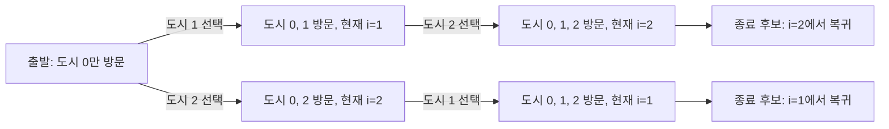

## 정의

**부분집합 상태를 비트마스크로 인코딩**하여 DP를 수행하는 기법. 정수 `mask`의 *i*번째 비트가 1이면 "원소 i 선택", 0이면 "미선택"을 의미한다. 원소 수 N ≤ 20 정도의 집합 문제에서 유효하다.

$$
\text{dp}[mask][i] = \text{mask에 속한 원소들을 처리하고 현재 위치가 } i \text{ 일 때의 최적값}
$$

비트 연산 기초: [[dp-bitfield|DP Bitfield]] 참조.

## 문제 상황

"어떤 원소를 선택했는가" 자체가 상태인 최적화 문제:

- **TSP (Traveling Salesman Problem)**: 모든 도시를 한 번씩 방문하는 최소 비용 순환 경로
- **Assignment Problem**: 사람과 태스크를 1:1로 매칭하여 비용 최소화
- **Hamiltonian Path**: 모든 정점을 방문하는 경로 존재 여부
- **Set Cover**: 최소 개수의 집합으로 전체 원소를 커버

N ≤ 20이면 2^20 = 1,048,576으로 메모리와 시간 모두 허용 범위.

## 시각화

N=3 TSP 상태 전이 (도시 0 고정 출발):



N=3 비트마스크 표현:

| mask (이진) | 십진 | 선택된 도시 |
|:---|:---|:---|
| 000 | 0 | 공집합 |
| 001 | 1 | {0} |
| 010 | 2 | {1} |
| 011 | 3 | {0, 1} |
| 100 | 4 | {2} |
| 101 | 5 | {0, 2} |
| 110 | 6 | {1, 2} |
| 111 | 7 | {0, 1, 2} |

## 핵심 아이디어

상태를 `(mask, i)` 쌍으로 표현:

- `mask`: 현재까지 방문/선택한 원소들의 비트마스크
- `i`: 현재 위치 (마지막으로 선택한 원소)

전이: 미방문 원소 j를 다음에 선택 → `(mask | (1<<j), j)`

핵심 비트 연산:

- i번째 포함 여부: `mask & (1 << i)` 가 0이 아니면 포함
- i번째 원소 추가: `mask | (1 << i)` 로 새 mask 생성
- i번째 원소 제거: `mask & ~(1 << i)`
- 전체 집합: `(1 << N) - 1` (모든 비트 1)
- 부분집합 순회: `for (int s = mask; s > 0; s = (s-1) & mask)`

### TSP 점화식

$$
\text{dp}[mask \mid (1 \ll j)][j] = \min\bigl(\text{dp}[mask \mid (1 \ll j)][j],\; \text{dp}[mask][i] + \text{cost}[i][j]\bigr)
$$

**초기**: `dp[1][0] = 0` (도시 0만 방문, 도시 0에 위치), 나머지 INF.
**답**: `min(dp[(1<<N)-1][i] + cost[i][0])` for i in 1..N-1.

### Assignment Problem 변형

`dp[i][mask]` = i번째 사람까지 처리, 사용된 태스크 집합 = mask.

$$
\text{dp}[i+1][mask \mid (1 \ll j)] = \min(\text{dp}[i+1][mask \mid (1 \ll j)],\; \text{dp}[i][mask] + \text{cost}[i][j])
$$

TSP와 달리 외부 루프가 사람 인덱스 i, 내부 루프가 mask. `popcount(mask) == i` 조건으로 유효 상태만 처리.

### 부분집합 열거 패턴

모든 부분집합을 열거하는 표준 패턴:

```cpp
// mask의 모든 부분집합 열거 (공집합 포함)
for (int s = mask; ; s = (s - 1) & mask) {
    process(s);
    if (s == 0) break;
}
```

모든 mask에 대해 실행하면 O(3^N) (각 원소가 mask 포함/부분집합 포함/부분집합 미포함 3가지).

## 알고리즘

```text
# TSP 비트마스크 DP
dp[1][0] = 0          # 도시 0 방문, 도시 0 위치
for mask = 1 to (1<<N)-1:
    for i = 0 to N-1:
        if dp[mask][i] == INF: continue
        if not (mask & (1<<i)): continue  # i가 mask에 없으면 무효 상태
        for j = 0 to N-1:
            if mask & (1<<j): continue    # 이미 방문한 도시
            nmask = mask | (1 << j)
            dp[nmask][j] = min(dp[nmask][j], dp[mask][i] + cost[i][j])

full = (1 << N) - 1
answer = min(dp[full][i] + cost[i][0] for i in 1..N-1)  # 원점 복귀
```

## 구현

<CodeWithOutput
  variants={[
    {
      language: "cpp",
      label: "C++",
      code: `#include <bits/stdc++.h>
using namespace std;
const int INF = 1e9;

int main() {
    ios::sync_with_stdio(false);
    cin.tie(nullptr);

    int n;
    cin >> n;
    vector<vector<int>> cost(n, vector<int>(n));
    for (int i = 0; i < n; i++)
        for (int j = 0; j < n; j++)
            cin >> cost[i][j];

    // dp[mask][i]: mask 집합 방문 후 i에 있을 때 최소 비용
    vector<vector<int>> dp(1 << n, vector<int>(n, INF));
    dp[1][0] = 0;

    for (int mask = 1; mask < (1 << n); mask++) {
        for (int i = 0; i < n; i++) {
            if (dp[mask][i] == INF) continue;
            if (!(mask & (1 << i))) continue;
            for (int j = 0; j < n; j++) {
                if (mask & (1 << j)) continue;
                int nmask = mask | (1 << j);
                dp[nmask][j] = min(dp[nmask][j], dp[mask][i] + cost[i][j]);
            }
        }
    }

    int full = (1 << n) - 1;
    int ans = INF;
    for (int i = 1; i < n; i++)
        ans = min(ans, dp[full][i] + cost[i][0]);

    cout << ans << "\\n";
    return 0;
}`,
    },
    {
      language: "python",
      label: "Python",
      code: `import sys
input = sys.stdin.readline

def solve():
    n = int(input())
    cost = [list(map(int, input().split())) for _ in range(n)]
    INF = float('inf')

    # dp[mask][i]: mask 집합 방문 후 i에 있을 때 최소 비용
    dp = [[INF] * n for _ in range(1 << n)]
    dp[1][0] = 0

    for mask in range(1, 1 << n):
        for i in range(n):
            if dp[mask][i] == INF or not (mask >> i & 1):
                continue
            for j in range(n):
                if mask >> j & 1:
                    continue
                nmask = mask | (1 << j)
                cand = dp[mask][i] + cost[i][j]
                if cand < dp[nmask][j]:
                    dp[nmask][j] = cand

    full = (1 << n) - 1
    print(min(dp[full][i] + cost[i][0] for i in range(1, n)))

solve()`,
    },
    {
      language: "java",
      label: "Java",
      code: `import java.util.*;

public class Main {
    static final int INF = Integer.MAX_VALUE / 2;

    public static void main(String[] args) {
        Scanner sc = new Scanner(System.in);
        int n = sc.nextInt();
        int[][] cost = new int[n][n];
        for (int i = 0; i < n; i++)
            for (int j = 0; j < n; j++)
                cost[i][j] = sc.nextInt();

        // dp[mask][i]: mask 집합 방문 후 i에 있을 때 최소 비용
        int[][] dp = new int[1 << n][n];
        for (int[] row : dp) Arrays.fill(row, INF);
        dp[1][0] = 0;

        for (int mask = 1; mask < (1 << n); mask++) {
            for (int i = 0; i < n; i++) {
                if (dp[mask][i] == INF) continue;
                if ((mask & (1 << i)) == 0) continue;
                for (int j = 0; j < n; j++) {
                    if ((mask & (1 << j)) != 0) continue;
                    int nmask = mask | (1 << j);
                    dp[nmask][j] = Math.min(dp[nmask][j], dp[mask][i] + cost[i][j]);
                }
            }
        }

        int full = (1 << n) - 1;
        int ans = INF;
        for (int i = 1; i < n; i++)
            ans = Math.min(ans, dp[full][i] + cost[i][0]);

        System.out.println(ans);
    }
}`,
    },
  ]}
  cases={[
    {
      label: "4개 도시 TSP",
      input: `4
0 10 15 20
10 0 35 25
15 35 0 30
20 25 30 0`,
      output: `80`,
    },
    {
      label: "3개 도시",
      input: `3
0 1 2
1 0 3
2 3 0`,
      output: `6`,
    },
  ]}
/>

## 복잡도

| 항목 | 값 |
|:---|:---|
| **시간** | O(2^N · N²) |
| **공간** | O(2^N · N) |
| **N=15** | 2^15 · 225 ≈ 7.4×10^6 (여유) |
| **N=20** | 2^20 · 400 ≈ 4.2×10^8 (타이트) |
| **실용 한계** | N ≤ 20 (int 기준 메모리 약 80MB) |

> [!WARNING]
> N=25 이상은 2^25 ≈ 33M 상태로 메모리와 시간 모두 한계 초과. N 제약 반드시 확인.

## 함정

### 1. 배열 크기: 스택 오버플로

```cpp
// 지역 변수로 선언하면 스택 오버플로
int dp[1 << 20][20];  // 전역 선언 필수 (약 80MB)
```

### 2. 출발 도시 고정 누락

TSP는 순환 경로이므로 도시 0 고정 출발이 최적. 모든 도시에서 시작하면 정답이 N배 중복으로 잘못 계산될 수 있다.

### 3. mask에 i 포함 여부 체크 누락

```cpp
if (!(mask & (1 << i))) continue;
// 없으면 i가 mask에 없는 잘못된 상태에서 전이 발생
```

### 4. 원점 복귀 비용 누락

`dp[(1<<N)-1][i]`는 i에 있는 비용. 최종 답은 `dp[full][i] + cost[i][0]`로 원점 복귀 포함.

### 5. Assignment Problem과 TSP 혼동

Assignment Problem에서는 `dp[i][mask]` = i번째 사람까지 처리, mask = 사용된 태스크. 전이 방향이 TSP와 다르므로 혼동 주의.

## BOJ 연습 문제

| 번호 | 제목 | 유형 |
|:---|:---|:---|
| BOJ 2098 | 외판원 순회 | TSP (핵심 문제) |
| BOJ 1194 | 달이 차오른다, 가자. | BFS + bitmask |
| BOJ 17471 | 게리맨더링 | 지역 분할 |
| BOJ 1562 | 계단 수 | Digit DP + bitmask |
| BOJ 2234 | 성곽 | 지역 합병 bitmask |

## 관련 위키

- [[dp-bitfield|DP Bitfield]] (비트 연산 상세)
- [[tsp|TSP]]
- [[hamiltonian-path|Hamiltonian Path]]
- [[dp-sum-over-subsets|SOS DP]]
- [[dp-optimization|DP Optimization]]
