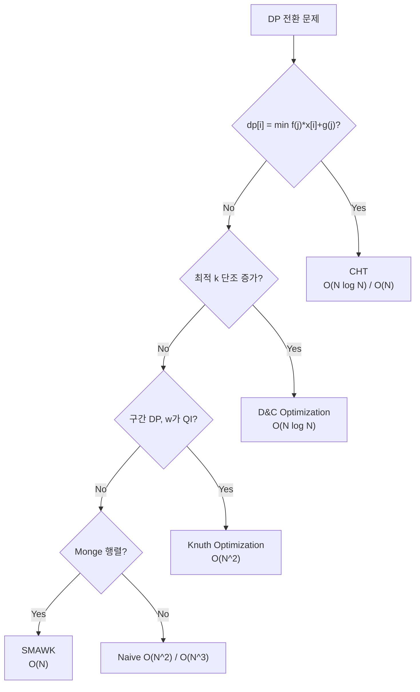

## 정의

일반 DP 를 O(N²) 또는 O(N³) 에서 **O(N log N)** 또는 **O(N)** 으로 낮추는 여러 최적화 기법의 총칭입니다. 모두 특정 **조건 (monotone, concave, quadrangle inequality)** 이 성립할 때만 적용 가능합니다.

| 기법 | 원래 복잡도 | 최적화 후 | 적용 조건 |
|:---|:---:|:---:|:---|
| Convex Hull Trick | O(N²) | O(N log N) / O(N) | 선형 함수 min/max, 기울기 단조 |
| Divide and Conquer | O(N²) | O(N log N) | 최적 k 단조 증가 |
| Knuth Optimization | O(N³) | O(N²) | Quadrangle Inequality + 단조 |
| SMAWK / Monge | O(N²) | O(N) | Monge 행렬 |

## 문제 상황

전형적인 DP 전환 문제를 만났을 때, 아래 형태인지 먼저 확인합니다.

```text
// 형태 A: CHT / SMAWK
dp[i] = min over j<i of { f(j) * x[i] + g(j) }
// f(j) = 기울기, x[i] = 현재 값, g(j) = 절편

// 형태 B: D&C Optimization
dp[i][j] = min over k < j of { dp[i-1][k] + cost(k, j) }
// 최적 k 가 j 에 대해 단조 증가

// 형태 C: Knuth
dp[i][j] = min over i <= k <= j of { dp[i][k] + dp[k][j] + w(i, j) }
// w 가 QI + 단조 만족
```

## 시각화

4 가지 기법의 적용 시나리오와 복잡도.



## 핵심 아이디어

### 1. Convex Hull Trick (CHT)

`dp[i] = min_{j<i}(a[j] * x[i] + b[j])` 형태. 선형 함수 집합의 최솟값 = **하부 볼록 껍질 (lower envelope)**.

- **Li-Chao Tree**: 임의 삽입 순서, O(log N) per query/update
- **단조 CHT (Monotone Stack)**: 기울기 `a[j]` 단조 증가이면 O(1) push, O(1)/O(log N) query
- **Kinetic Heaps**: 온라인, 자동 최솟값 추적

전용 [[li-chao-tree|Li-Chao Tree]] 참조.

### 2. Divide and Conquer Optimization

`dp[i][j] = min_{k}(dp[i-1][k] + cost(k, j))` 에서 **최적 k 가 j 에 대해 단조 증가** 하면 O(N²) → O(N log N).

핵심: 구간 [lo, hi] 의 중간 mid 를 계산하고, 가능한 k 범위를 재귀적으로 좁힘.

### 3. Knuth Optimization

`dp[i][j] = min_{i<=k<=j}(dp[i][k] + dp[k][j]) + w(i,j)` 에서 **Quadrangle Inequality (QI)** 와 **단조성** 이 성립하면 O(N³) → O(N²).

QI: `w(a,c) + w(b,d) <= w(a,d) + w(b,c)` (a<=b<=c<=d).

### 4. SMAWK / Monge

**Monge 행렬**: 모든 2×2 부분행렬이 QI 를 만족하는 행렬. SMAWK 알고리즘으로 각 행의 최솟값을 O(N) 에 계산.

## 알고리즘

### CHT (단조 스택, 오프라인)

```text
라인 관리 스택 stk:
  add(a, b):  // y = a*x + b 삽입
      새 직선 L
      while stk.size() >= 2:
          if stk[-2] 와 stk[-1] 의 교점 >= stk[-1] 와 L 의 교점:
              stk.pop()
          else: break
      stk.push(L)

  query(x):   // 최솟값 직선의 y값
      while stk.size() >= 2:
          if stk[0].eval(x) >= stk[1].eval(x):
              stk.pop_front()
          else: break
      return stk[0].eval(x)
```

### D&C Optimization

```text
solve(lo, hi, optL, optR):
    if lo > hi: return
    mid = (lo + hi) / 2
    best_k = optL
    dp[i][mid] = INF
    for k in [optL .. min(mid, optR)]:
        cand = dp[i-1][k] + cost(k, mid)
        if cand < dp[i][mid]:
            dp[i][mid] = cand
            best_k = k
    solve(lo, mid-1, optL, best_k)
    solve(mid+1, hi, best_k, optR)
```

### Knuth Optimization

```text
// opt[i][j] = dp[i][j] 의 최적 k
for gap in 1..n:
    for i in 0..n-gap:
        j = i + gap
        dp[i][j] = INF
        for k in opt[i][j-1]..opt[i+1][j]:
            if dp[i][k] + dp[k][j] + w(i,j) < dp[i][j]:
                dp[i][j] = dp[i][k] + dp[k][j] + w(i,j)
                opt[i][j] = k
```

## 구현

### D&C Optimization

<CodeWithOutput
  language="cpp"
  label="C++ (D&C Optimization)"
  outputLanguage="text"
  outputLabel="결과"
  title="1D1D DP D&C 최적화 (스캐폴딩)"
  code={`#include <bits/stdc++.h>
using namespace std;

const long long INF = 1e18;
int n, m;
vector<long long> prev_dp, cur_dp;

// cost(k, j): 구체적인 문제마다 다름
long long cost(int k, int j) {
    // 예: prefix sum 기반 비용
    return (long long)(j - k) * (j - k);
}

void solve(int lo, int hi, int optL, int optR) {
    if (lo > hi) return;
    int mid = (lo + hi) / 2;
    int best_k = optL;
    cur_dp[mid] = INF;
    for (int k = optL; k <= min(mid - 1, optR); k++) {
        if (prev_dp[k] == INF) continue;
        long long cand = prev_dp[k] + cost(k, mid);
        if (cand < cur_dp[mid]) {
            cur_dp[mid] = cand;
            best_k = k;
        }
    }
    solve(lo, mid - 1, optL, best_k);
    solve(mid + 1, hi, best_k, optR);
}

int main() {
    ios::sync_with_stdio(false);
    cin.tie(nullptr);
    cin >> n >> m;
    prev_dp.resize(n + 1, INF);
    cur_dp.resize(n + 1, INF);
    prev_dp[0] = 0;
    // i번째 분할
    for (int i = 1; i <= m; i++) {
        fill(cur_dp.begin(), cur_dp.end(), INF);
        solve(1, n, 0, n - 1);
        swap(prev_dp, cur_dp);
    }
    cout << prev_dp[n] << "\\n";
    return 0;
}`}
  output={`// n=5, m=2 (2그룹으로 분할)
// 예시 cost = (j-k)^2
// dp[5] = 최소 분할 비용
8`}
/>

### Knuth Optimization

```cpp
// Knuth: 구간 DP O(N^2)
// 전제: w(i,j) 가 QI + 단조 만족
vector<vector<long long>> dp(n+1, vector<long long>(n+1, INF));
vector<vector<int>> opt(n+1, vector<int>(n+1, 0));

for (int i = 0; i <= n; i++) { dp[i][i] = 0; opt[i][i] = i; }

for (int gap = 1; gap <= n; gap++) {
    for (int i = 0; i + gap <= n; i++) {
        int j = i + gap;
        dp[i][j] = INF;
        for (int k = opt[i][j-1]; k <= opt[i+1][j]; k++) {
            long long cand = dp[i][k] + dp[k][j] + w(i, j);
            if (cand < dp[i][j]) {
                dp[i][j] = cand;
                opt[i][j] = k;
            }
        }
    }
}
```

## 복잡도

| 기법 | 시간 | 메모리 | 제약 조건 |
|:---|:---:|:---:|:---|
| CHT (단조 스택) | O(N) | O(N) | 기울기/쿼리 모두 단조 |
| CHT (Li-Chao Tree) | O(N log N) | O(N) | 임의 순서 |
| D&C Optimization | O(N log N) | O(N) | 최적 k 단조 |
| Knuth Optimization | O(N²) | O(N²) | QI + 단조 |
| SMAWK | O(N) | O(N) | Monge 행렬 |

## 함정

> [!WARNING]
> **CHT 에서 기울기 정렬 미확인**: 단조 스택 CHT 는 기울기가 단조일 때만 O(1) push. 임의 순서이면 `deque` 대신 Li-Chao Tree 를 써야 함.

> [!WARNING]
> **D&C Optimization 의 optL/optR 범위**: `solve(lo, mid-1, optL, best_k)` 에서 best_k 가 optR 보다 커지지 않도록 주의. `min(mid-1, optR)` 처리 필요.

> [!CAUTION]
> **Knuth 에서 QI 검증 생략**: 반례가 있어도 AC 가 나오는 경우가 있어 QI 를 검증하지 않고 제출하는 실수. 반드시 `w(a,c) + w(b,d) <= w(a,d) + w(b,c)` 를 수식으로 확인.

- 적용 가능한 기법이 여러 가지라면 CHT > D&C > Knuth 순으로 빠름.
- SMAWK 는 구현이 까다로워 실전에서는 LARSSON 또는 Divide Conquer 로 대체하는 경우가 많음.

## BOJ

| 문제 | 분류 |
|:---|:---|
| [BOJ 4008 특공대](https://www.acmicpc.net/problem/4008) | CHT 기본 |
| [BOJ 13261 탈옥](https://www.acmicpc.net/problem/13261) | D&C Optimization |
| [BOJ 11001 김치](https://www.acmicpc.net/problem/11001) | CHT (단조) |
| [BOJ 10067 수열 나누기](https://www.acmicpc.net/problem/10067) | D&C Optimization |
| [BOJ 1648 격자 행렬의 비용](https://www.acmicpc.net/problem/1648) | Knuth Optimization |

## 관련 위키

- [[li-chao-tree|Li-Chao Tree]] (CHT 자료구조)
- [[dp|DP 기초]]
- [[dp-bitfield|DP Bitfield]] (비트마스크 DP)
- [[knapsack|Knapsack DP]] (배낭 DP)
- [[knuth|Knuth Optimization]] (전용 문서)
- [[divide-and-conquer-optimization|D&C Optimization]] (전용 문서)
- [[cht|Convex Hull Trick]] (전용 문서)
