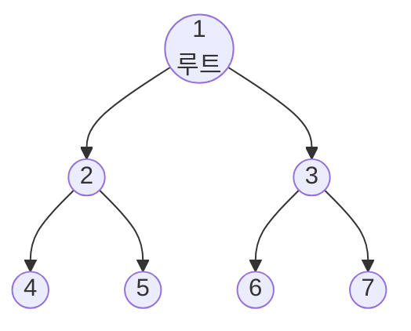
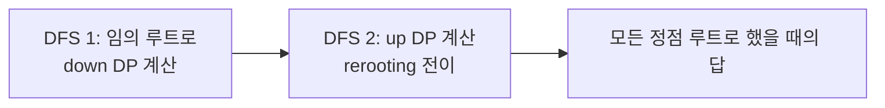

## 정의

**Graph DP** 는 그래프 구조를 이용한 DP. 사이클 없는 그래프 (트리, DAG) 에서 특히 자연스럽다.

- **Tree DP**: 루트 트리에서 자식 서브트리 결과를 조합
- **DAG DP**: 위상 정렬 후 순서대로 전이 계산
- **Rerooting**: Tree DP 를 모든 정점이 루트일 때의 답으로 확장

## 문제 상황

배열 DP (1D, 2D) 는 인덱스 순서로 전이. 그래프에서는 인덱스 대신 **노드 관계** 가 DP 전이를 결정.

**트리 문제 예시**:
- 서브트리 크기, 트리 지름, 최대 독립 집합
- 각 노드를 루트로 했을 때의 트리 전체 답

**DAG 문제 예시**:
- 가장 긴 경로 (Longest Path in DAG)
- 경로 수 세기, 최소/최대 비용 경로

## 시각화



DFS 순서: 1 -> 2 -> 4, 5 -> 3 -> 6, 7.

리프 노드부터 계산해 부모에게 전달.

## 핵심 아이디어

### Tree DP: 기본 구조

```text
dfs(u, parent):
    dp[u] = base_value(u)
    for v in adj[u]:
        if v == parent: continue  // 부모 방향 스킵
        dfs(v, u)
        dp[u] = combine(dp[u], dp[v])
```

`combine` 은 문제마다 다름:
- 서브트리 크기: `dp[u] += dp[v]`
- 서브트리 최대 독립 집합: 더 복잡 (선택/불선택 두 상태)

### Rerooting: 두 번의 DFS

특정 루트 기준 Tree DP 는 O(N). 모든 정점을 루트로 하는 답이 필요하면 **rerooting** 으로 O(N) 에 해결.



### DAG DP

[[topological-sorting|위상 정렬]] 후, in-degree 0 부터 순서대로 계산.

```text
topo_sort(graph) -> order
for u in order:
    for v in adj[u]:
        dp[v] = update(dp[v], dp[u])
```

## 알고리즘

### Tree DP: 서브트리 크기

```cpp
int sz[MAXN];
void dfs_sz(int u, int p) {
    sz[u] = 1;
    for (int v : adj[u]) if (v != p) {
        dfs_sz(v, u);
        sz[u] += sz[v];
    }
}
```

### Tree DP: 최대 독립 집합

각 정점에서 "선택" / "불선택" 두 상태:
- `dp[u][1]` = u 를 선택했을 때 최대 크기
- `dp[u][0]` = u 를 선택 안 했을 때 최대 크기

```cpp
int dp[MAXN][2];
void dfs_mis(int u, int p) {
    dp[u][1] = 1;   // 자신 선택
    dp[u][0] = 0;   // 자신 불선택
    for (int v : adj[u]) if (v != p) {
        dfs_mis(v, u);
        dp[u][1] += dp[v][0];         // 자신 선택하면 자식 불선택
        dp[u][0] += max(dp[v][0], dp[v][1]); // 자신 불선택하면 자식 중 최적
    }
}
// 답: max(dp[root][0], dp[root][1])
```

### Rerooting: 트리의 모든 정점에서의 거리 합

전형적인 rerooting 예제.

```cpp
long long dist_sum[MAXN];  // u 를 루트로 했을 때 모든 노드까지 거리 합
long long sub_sum[MAXN];   // u 서브트리 노드까지 거리 합 (루트 기준)
long long sub_cnt[MAXN];   // u 서브트리 크기

// DFS 1: 루트 r=0 기준 down DP
void dfs1(int u, int p) {
    sub_cnt[u] = 1;
    sub_sum[u] = 0;
    for (int v : adj[u]) if (v != p) {
        dfs1(v, u);
        sub_cnt[u] += sub_cnt[v];
        sub_sum[u] += sub_sum[v] + sub_cnt[v];  // v 서브트리의 모든 노드가 +1 거리
    }
}

// DFS 2: rerooting (위로 정보 전달)
void dfs2(int u, int p, int N) {
    for (int v : adj[u]) if (v != p) {
        // u 에서 v 로 루트 변경 시:
        // v 서브트리 외 노드 수 = N - sub_cnt[v]
        // 그 노드들의 v 에서의 거리 = dist_sum[u] - (sub_sum[v] + sub_cnt[v]) + (N - sub_cnt[v])
        dist_sum[v] = dist_sum[u]
                    - (sub_sum[v] + sub_cnt[v])   // 제거: v 방향 기여
                    + (N - sub_cnt[v]);            // 추가: 나머지 노드들 +1
        dfs2(v, u, N);
    }
}
```

### DAG DP: 최장 경로

```cpp
vector<int> order;  // 위상 정렬 순서
long long dp[MAXN]; // dp[u] = u 에서 시작하는 최장 경로

// 위상 정렬 후
for (int u : order) {
    for (auto [v, w] : adj[u]) {
        dp[u] = max(dp[u], dp[v] + w);  // v 로 가는 에지
    }
}
// 답: max(dp[u]) for all u
```

## 구현

<CodeWithOutput
  variants={[
    {
      language: "cpp",
      label: "C++: Tree DP, 서브트리 크기",
      code: `#include <bits/stdc++.h>
using namespace std;

const int MAXN = 100005;
vector<int> adj[MAXN];
int sz[MAXN], dp0[MAXN], dp1[MAXN];

void dfs(int u, int p) {
    sz[u] = 1;
    dp0[u] = 0; dp1[u] = 1;
    for (int v : adj[u]) {
        if (v == p) continue;
        dfs(v, u);
        sz[u] += sz[v];
        dp1[u] += dp0[v];
        dp0[u] += max(dp0[v], dp1[v]);
    }
}

int main() {
    int n; cin >> n;
    for (int i = 0; i < n - 1; i++) {
        int u, v; cin >> u >> v;
        adj[u].push_back(v);
        adj[v].push_back(u);
    }
    dfs(1, 0);
    int root = 1;
    cout << "서브트리 크기: " << sz[root] << "\\n";
    cout << "최대 독립 집합: " << max(dp0[root], dp1[root]) << "\\n";
    return 0;
}`,
    },
    {
      language: "python",
      label: "Python: Tree DP",
      code: `import sys
sys.setrecursionlimit(200000)

def solve():
    n = int(input())
    adj = [[] for _ in range(n + 1)]
    for _ in range(n - 1):
        u, v = map(int, input().split())
        adj[u].append(v)
        adj[v].append(u)

    sz = [1] * (n + 1)
    dp0 = [0] * (n + 1)  # 자신 불선택
    dp1 = [1] * (n + 1)  # 자신 선택

    def dfs(u, p):
        for v in adj[u]:
            if v == p:
                continue
            dfs(v, u)
            sz[u] += sz[v]
            dp1[u] += dp0[v]
            dp0[u] += max(dp0[v], dp1[v])

    dfs(1, 0)
    print("서브트리 크기:", sz[1])
    print("최대 독립 집합:", max(dp0[1], dp1[1]))

solve()`,
    },
  ]}
  cases={[
    {
      label: "기본 (n=7, path graph)",
      input: `7
1 2
1 3
2 4
2 5
3 6
3 7`,
      output: `서브트리 크기: 7
최대 독립 집합: 4`,
    },
  ]}
/>

## 복잡도

| 알고리즘 | 시간 | 공간 | 비고 |
|:---|:---:|:---:|:---|
| Tree DP (기본) | $O(N)$ | $O(N)$ | 각 노드 1번 방문 |
| Tree DP (2상태, k상태) | $O(N \cdot k)$ | $O(N \cdot k)$ | 상태 수 k |
| Rerooting | $O(N)$ | $O(N)$ | DFS 2번 |
| DAG DP | $O(V + E)$ | $O(V)$ | 위상 정렬 + DP |

Tree DP 에서 자식 결합이 O(1) 이면 전체 O(N).
서브트리 결합이 O(k) 이면 전체 O(N * k).

## 함정

> [!WARNING]
> **재귀 깊이**: n = 10^5 인 bamboo tree (경로 그래프) 에서 재귀 DFS 는 스택 오버플로우. 반복 DFS 또는 재귀 제한 증가 필요.

> [!WARNING]
> **Rerooting 전이 오류**: `dist_sum[v]` 를 계산할 때 v 서브트리의 기여를 빼고 나머지를 더하는 전이식 방향을 헷갈리기 쉬움. 작은 예시로 손 검증 필수.

> [!CAUTION]
> **간선 방향**: DAG DP 에서 에지 방향이 반대이면 위상 정렬 순서와 전이 방향도 반대. 문제 조건 꼼꼼히 확인.

### 흔한 실수

1. 부모 노드 체크 없이 DFS: 무한 루프 (`if v != parent continue`)
2. 리프 노드의 `dp` 초기화를 잊음
3. Rerooting 에서 두 번째 DFS 에 `dist_sum[root]` 를 `sub_sum[root]` 로 초기화 안 함
4. DAG 의 위상 정렬 전 DP 전이: 방문 안 된 노드의 값 사용

## BOJ 연습 문제

| 번호 | 제목 | 키워드 |
|:---|:---|:---|
| BOJ 1167 | 트리의 지름 | Tree DP, DFS 2회 |
| BOJ 2533 | 사회망 서비스 | Tree DP, 최대 독립 집합 |
| BOJ 2213 | 트리의 독립 집합 | Tree DP, 2상태 |
| BOJ 1149 | RGB 거리 | 선형 DP (Tree DP 기초) |
| BOJ 14267 | 회사 문화 1 | Tree DP + 위로 전달 |
| BOJ 1516 | 게임 개발 | DAG DP |

## 참고

- [[topological-sorting|위상 정렬]]
- [[tree-diameter|Tree Diameter]]
- [[dp-bitfield|DP Bitfield]]
- [[dp|다이나믹 프로그래밍]]
- [[dp-tree|Tree DP 심화]]
- [[dfs|DFS]]
