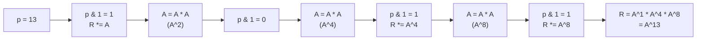

## 정의

선형 점화식을 행렬 곱으로 표현한 뒤, **행렬 거듭제곱을 log 시간에** 계산하여 N 번째 항을 O(K³ log N) 에 얻는 기법. K = 상태 차원.

- **시간**: O(K³ log N). K 작을 때 효율적
- **핵심**: 반복 제곱법 (binary exponentiation)

## 문제 상황

점화식의 N 번째 항을 아주 큰 N (≥ 10^18) 에 대해 구해야 할 때.

| 방법 | 시간 | N 범위 |
|:---|:---:|:---|
| 직접 반복 | O(K²·N) | N ≤ 10^7 |
| **Matrix Exponentiation** | O(K³ log N) | N ≤ 10^18 |
| Berlekamp-Massey + Kitamasa | O(K² log N) | N ≤ 10^18, K 클 때 |

K = 상태 차원 (피보나치 → K=2, k차 선형 점화식 → K=k).

## 시각화

이진 거듭제곱: A^13 = A^8 × A^4 × A^1 (13 = 1101₂).



각 비트마다 A 를 제곱, 비트가 1 이면 결과에 곱함. 행렬도 동일하게 적용.

## 핵심 아이디어

K 차 선형 점화식을 행렬 형태로:

$$
\begin{pmatrix} a_{n+1} \\ a_n \\ \vdots \\ a_{n-k+2} \end{pmatrix}
= M^n
\begin{pmatrix} a_k \\ a_{k-1} \\ \vdots \\ a_1 \end{pmatrix}
$$

전이 행렬 M 의 n 제곱을 binary exponentiation 으로 계산 → O(K³ log N).

**모듈러 산술**: 결과가 MOD 로 나눈 나머지인 경우, 각 곱셈 후 `% MOD` 적용.

## Fibonacci 예

$$
\begin{pmatrix} F_{n+1} \\ F_n \end{pmatrix}
= \begin{pmatrix} 1 & 1 \\ 1 & 0 \end{pmatrix}^n
\begin{pmatrix} F_1 \\ F_0 \end{pmatrix}
$$

K = 2, 전이 행렬 = 2×2. N = 10^18 도 O(8 log N) = O(240) 번 곱셈.

## 알고리즘

### 행렬 곱

```text
mul(A, B):  // K×K 행렬 곱
    C = K×K 영행렬
    for i in 0..K:
        for k in 0..K:
            if A[i][k] == 0: continue  // 스킵 최적화
            for j in 0..K:
                C[i][j] += A[i][k] * B[k][j]
                C[i][j] %= MOD
    return C
```

### 반복 제곱법

```text
pow(A, p):  // A^p 계산
    R = K×K 단위 행렬
    while p > 0:
        if p & 1: R = mul(R, A)
        A = mul(A, A)
        p >>= 1
    return R
```

### 일반 K차 선형 점화식

점화식 `a[n] = c1*a[n-1] + c2*a[n-2] + ... + ck*a[n-k]` 의 전이 행렬:

```
M = [c1  c2  ...  c_{k-1}  ck ]
    [1   0   ...  0        0  ]
    [0   1   ...  0        0  ]
    [         ...             ]
    [0   0   ...  1        0  ]
```

상태 벡터 `[a[n], a[n-1], ..., a[n-k+1]]` 에 M 을 곱하면 `[a[n+1], ..., a[n-k+2]]`.

## 구현

<CodeWithOutput
  language="cpp"
  label="C++ (행렬 거듭제곱)"
  outputLanguage="text"
  outputLabel="결과"
  title="N번째 피보나치 수 (mod 1e9+7)"
  code={`#include <bits/stdc++.h>
using namespace std;

const long long MOD = 1e9 + 7;
const int K = 2;
using Mat = array<array<long long, K>, K>;

Mat mul(const Mat& A, const Mat& B) {
    Mat C{};
    for (int i = 0; i < K; i++)
        for (int k = 0; k < K; k++) {
            if (!A[i][k]) continue;
            for (int j = 0; j < K; j++)
                C[i][j] = (C[i][j] + A[i][k] * B[k][j]) % MOD;
        }
    return C;
}

Mat matpow(Mat A, long long p) {
    Mat R{};
    for (int i = 0; i < K; i++) R[i][i] = 1; // 단위 행렬
    while (p > 0) {
        if (p & 1) R = mul(R, A);
        A = mul(A, A);
        p >>= 1;
    }
    return R;
}

long long fib(long long n) {
    if (n <= 0) return 0;
    if (n == 1) return 1;
    // [ F(n+1) ]   [ 1 1 ]^n   [ 1 ]
    // [ F(n)   ] = [ 1 0 ]   * [ 0 ]
    Mat M = {{{1, 1}, {1, 0}}};
    Mat R = matpow(M, n - 1);
    // R * [F(1), F(0)] = R * [1, 0]
    return R[0][0]; // F(n)
}

int main() {
    ios::sync_with_stdio(false);
    cin.tie(nullptr);
    long long n;
    cin >> n;
    cout << fib(n) << "\\n";
    // 검증: fib(10) = 55
    for (int i = 1; i <= 10; i++)
        cout << "F(" << i << ") = " << fib(i) << "\\n";
    return 0;
}`}
  output={`// 입력: 10
55
F(1) = 1
F(2) = 1
F(3) = 2
F(4) = 3
F(5) = 5
F(6) = 8
F(7) = 13
F(8) = 21
F(9) = 34
F(10) = 55`}
/>

## 응용

### 그래프 경로 수

인접 행렬 A 에서 `A^k[u][v]` = 정점 u 에서 v 까지 길이 정확히 k 인 경로의 수.

```cpp
// 길이 k 경로 수
Mat A = /* 인접 행렬 */;
Mat Ak = matpow(A, k);
cout << Ak[u][v] % MOD << "\n";
```

### DFA 상태 전이

문자열 자동자에서 상태 전이 행렬 = 알파벳 크기 × 상태 수. 길이 N 의 수락 문자열 개수를 O(|states|³ log N) 에 계산.

### Tribonacci 등 고차 점화식

```cpp
// a[n] = a[n-1] + a[n-2] + a[n-3]
// 전이 행렬 3x3
Mat M = {{{1,1,1},{1,0,0},{0,1,0}}};
```

## 복잡도

| 연산 | 시간 | 메모리 |
|:---|:---:|:---:|
| 행렬 곱 1회 | O(K³) | O(K²) |
| 행렬 거듭제곱 | O(K³ log N) | O(K²) |
| Kitamasa 기법 | O(K² log N) | O(K) |

K 가 작을수록 실용적. K ≥ 100 이면 Kitamasa 또는 Berlekamp-Massey 고려.

## 함정

> [!WARNING]
> **K 에 따른 시간 복잡도 과소 평가**: K = 10 이면 1회 곱셈이 O(1000). N = 10^9, K = 50 이면 O(50³ × 30) = O(375만) 으로 충분하지만, K = 200 이면 O(200³ × 30) = O(240만×1000) → TLE.

> [!WARNING]
> **단위 행렬 초기화 누락**: `matpow` 에서 R 을 단위 행렬로 초기화하지 않으면 A^0 = 영행렬 → 모든 결과 0.

> [!CAUTION]
> **MOD 없이 long long 오버플로**: K×K 행렬 원소가 최대 MOD-1 ≈ 10^9, 두 원소 곱이 10^18 → long long 최대값 내. 하지만 K 번 누적하면 K × (MOD-1)² → K = 1000 이상이면 __int128 또는 중간 MOD 필요.

- N = 0 처리: 관례상 F(0) = 0, F(1) = 1. 문제마다 정의 확인.
- 비선형 점화식 (예: `a[n] = a[n-1]^2`) 은 행렬 방법 미적용.

## BOJ

| 문제 | 설명 |
|:---|:---|
| [BOJ 11444 피보나치 수 6](https://www.acmicpc.net/problem/11444) | 행렬 거듭제곱 기본, N ≤ 10^18 |
| [BOJ 12850 본대 산책 2](https://www.acmicpc.net/problem/12850) | 인접 행렬 D^(K), 경로 수 |
| [BOJ 13430 합 구하기](https://www.acmicpc.net/problem/13430) | 상태 확장 |
| [BOJ 2749 피보나치 수 3](https://www.acmicpc.net/problem/2749) | Pisano period 대안 vs 행렬 |
| [BOJ 15991 링클링크](https://www.acmicpc.net/problem/15991) | DFA 행렬 거듭제곱 |

## 관련 위키

- [[polynomial-division-kitamasa|Kitamasa]] (K차 점화식 O(K² log N))
- [[linear-algebra|Linear Algebra]] (행렬 기초)
- [[dp|DP 기초]]
- [[modular-arithmetic|모듈러 산술]] (MOD 연산)
- [[berlekamp-massey|Berlekamp-Massey]] (점화식 자동 탐지)
