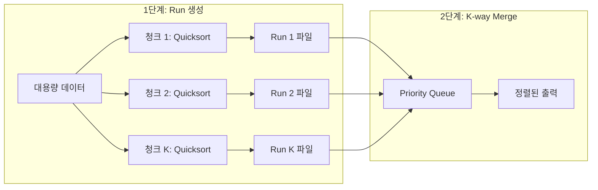

## 정의

**External Merge Sort (외부 머지 정렬)** 는 데이터가 메모리에 들어가지 않을 때 사용하는 [[Merge Sort]] 변형. 두 단계로 동작한다.

1. **Run 생성**: 메모리 크기만큼 청크를 잘라 메모리 내에서 정렬한 뒤 디스크에 "Run" 파일로 저장
2. **K-way Merge**: 모든 Run 의 head 버퍼만 메모리에 두고 한 번에 합쳐 정렬된 출력 생성

RDBMS 가 `ORDER BY`, `GROUP BY`, `DISTINCT`, `UNION` 을 처리할 때의 주력 알고리즘. 자세한 메커니즘과 Oracle/PostgreSQL/SQL Server 의 구현 차이는 [[정렬·해시는 메모리가 부족하면 어디로 새는가, PGA, work_mem, Workspace Memory]] 글 참고.

## 문제 상황

**언제 필요한가**: 데이터가 가용 메모리를 초과하는 정렬 작업.

- 로그 파일 100 GB 를 8 GB RAM 으로 정렬
- RDBMS 쿼리에서 `ORDER BY` 대상 데이터가 `work_mem` (PostgreSQL) / Sort Area (Oracle) 를 초과
- Hadoop / Spark 의 Shuffle 단계, 분산 정렬

**핵심 통찰**: 데이터 전체를 메모리에 올리지 않아도, 각 Run 의 head 버퍼만 있으면 전체를 정렬된 순서로 출력할 수 있다.

## 시각화

```anim:external-merge-sort
{}
```

## 알고리즘

```text
externalMergeSort(input, M):  // M = 가용 메모리
  // 1단계: Run 생성
  runs = []
  while input has data:
    chunk = read M bytes from input
    sort chunk in memory (예: Quicksort)
    write chunk to disk as a new Run
    runs.append(Run path)

  // 2단계: K-way Merge
  open all runs as input streams
  initialize priority queue with first element of each run
  while priority queue not empty:
    min = pop smallest from priority queue
    write min to output
    if min's run has more data:
      push next element from that run

  return output
```

### 1단계: Run 생성 (Run Generation)

각 청크를 메모리에서 정렬 후 디스크에 저장. 메모리는 다음 청크를 위해 재사용.

```text
[데이터 1GB] / [메모리 256MB]
→ 4 개 청크
→ 4 개 정렬된 Run 파일 생성
→ 각 Run 은 메모리 크기 (256MB)
```

청크 내부 정렬에는 보통 **Quicksort** 를 쓴다 (in-memory 에서 가장 빠름).

### 2단계: K-way Merge

K 개의 정렬된 Run 을 동시에 머지. **각 Run 의 head 버퍼만** 메모리에 둔다, 데이터 전체가 아니라.

```text
Run 1: [1, 4, 9, 11, ...]     head = 1
Run 2: [2, 5, 7, 13, ...]     head = 2
Run 3: [3, 6, 8, 10, ...]     head = 3
Run 4: [0, 12, 14, 15, ...]   head = 0

다음 출력 = 가장 작은 head = 0 (Run 4 에서)
→ Run 4 의 다음 값 가져옴
→ 다시 가장 작은 head 선택 → ...
```

priority queue (min-heap) 로 K 개 중 최솟값을 O(log K) 에 찾는다.

### 2단계 External Merge Sort 개요



## 복잡도

| 항목 | 값 | 설명 |
|:---|:---|:---|
| **CPU 시간** | O(n log n) | Run 정렬 + Merge |
| **디스크 I/O** | **2 × n** (1-pass) | Run 쓰기 1번 + 머지 읽기 1번 |
| **메모리** | √(D × P) | D = 데이터 크기, P = 페이지 크기 |
| **안정성** | ✓ (구현에 따라) | Merge 단계가 안정적이라면 |

### 메모리 요구량의 우아한 성질

가용 메모리 M, 데이터 D, 페이지 크기 P 일 때 K-way merge 의 메모리:

```text
K = D / M  (Run 수)
머지 메모리 = (K + 1) × P
           = (D / M) × P
           = D × P / M

One-pass 조건: D × P / M ≤ M
            → M ≥ √(D × P)
```

> [!IMPORTANT]
> **K-way Merge 의 메모리는 데이터 크기에 비례하지 않는다.** 데이터 크기 D, 페이지 크기 P 일 때 √(D × P) 에 비례한다. 그래서 한 자릿수 GB 의 정렬도 수십 MB 로 충분히 처리된다. **외부 머지 정렬의 가장 우아한 성질.**

예시 (Oracle 공식 문서):
- 1 GB 정렬 + 8 KB 페이지 → 최소 √(1 GB × 8 KB) ≈ 2.8 MB
- 보수적으로 22 MB 로 1-pass 가능 (overhead 포함)

## 3 단계 모드

데이터 크기와 메모리 비율에 따라.

| 모드 | 조건 | 디스크 I/O | 응답 시간 |
|:---|:---|:---|:---|
| **Optimal** | M ≥ D | 0 | 빠름 (in-memory Quicksort) |
| **One-pass** | √(D × P) ≤ M < D | 2 × D | 보통 |
| **Multi-pass** | M < √(D × P) | K × 2 × D | **K 배 느려짐 (지수적)** |

> [!CAUTION]
> Multi-pass 진입 시 K=2 만 돼도 디스크 I/O 가 4 배, K=3 이면 6 배. **응답 시간이 메모리 부족량에 대해 거의 지수적으로 증가**.

## RDBMS 구현 비교

| DBMS | 메모리 영역 | 디스크 위치 | 조절 |
|:---|:---|:---|:---|
| Oracle | PGA → Sort Area (work area) | TEMP tablespace (sort segment 자동) | `PGA_AGGREGATE_TARGET` |
| PostgreSQL | `work_mem` | `base/pgsql_tmp/` | `SET work_mem` (세션별) |
| SQL Server | Workspace Memory / Memory Grant | tempdb (Worktable / Workfile) | Resource Governor + Memory Grant Feedback |

자세한 구현 디테일은 [[정렬·해시는 메모리가 부족하면 어디로 새는가, PGA, work_mem, Workspace Memory]] 참고.

## 모니터링 지표

### Oracle

```sql
SELECT operation_type, work_area_size, expected_size,
       last_memory_used, last_execution
FROM v$workarea_active;
-- last_execution: OPTIMAL / ONE PASS / MULTI-PASSES
```

### PostgreSQL

```sql
EXPLAIN ANALYZE SELECT * FROM big_table ORDER BY col;
-- "Sort Method: quicksort  Memory: 25kB"        ← Optimal
-- "Sort Method: external merge  Disk: 17904kB"  ← Spill 발생
```

### SQL Server

```sql
SELECT requested_memory_kb, granted_memory_kb, used_memory_kb,
       ideal_memory_kb, dop
FROM sys.dm_exec_query_memory_grants;
-- granted < ideal: Memory Grant 부족 = Spill 위험
```

## 함정

### 1. work_mem 을 크게 잡으면 안전한가?

```sql
SET work_mem = '256MB';  -- 위험
```

PostgreSQL 의 `work_mem` 은 **세션당, 연산자당** 적용. 동시 접속 100 × 노드 4 × parallel 4 = **400 GB** 까지 갈 수 있다. OOM 직행.

### 2. Run 수가 너무 많으면

K 가 커지면 priority queue 의 O(log K) 가 무시 못할 비용. K=1000 이면 비교당 10 회 비교. 보통 DBMS 가 자동으로 다중 패스로 전환.

### 3. 입력이 이미 정렬됨

PostgreSQL 은 sort 노드가 이미 정렬된 입력을 감지하면 skip. Oracle 은 인덱스 기반 ORDER BY 가 정렬을 회피.

## 구현 예시

K-way merge 의 동작을 Python 으로 시뮬레이션. 실제 DBMS 에서는 디스크 I/O 가 있지만, 알고리즘 구조는 동일하다.

<CodeWithOutput
  variants={[
    {
      language: "python",
      label: "Python",
      code: `import heapq

def external_merge_sort(data, chunk_size):
    """External merge sort simulation.
    chunk_size = 가용 메모리 (원소 수 기준)
    """
    # 1단계: Run 생성 (청크별 in-memory 정렬)
    runs = []
    for i in range(0, len(data), chunk_size):
        runs.append(sorted(data[i:i + chunk_size]))

    # 2단계: K-way merge (min-heap)
    # heap: (value, run_index)
    heap = []
    pos = [0] * len(runs)
    for i, run in enumerate(runs):
        if run:
            heapq.heappush(heap, (run[0], i))

    result = []
    while heap:
        val, ri = heapq.heappop(heap)
        result.append(val)
        pos[ri] += 1
        if pos[ri] < len(runs[ri]):
            heapq.heappush(heap, (runs[ri][pos[ri]], ri))
    return result

n, k = map(int, input().split())
data = list(map(int, input().split()))
print(*external_merge_sort(data, k))`,
    },
  ]}
  cases={[
    {
      label: "10개 원소, chunk=3",
      input: `10 3
5 2 8 1 9 3 7 4 6 0`,
      output: `0 1 2 3 4 5 6 7 8 9`,
    },
    {
      label: "이미 정렬됨",
      input: `5 2
1 2 3 4 5`,
      output: `1 2 3 4 5`,
    },
  ]}
/>

## 역사

- **1945**: John von Neumann 이 Merge Sort 발명
- **1950s-60s**: 자기 테이프 시대에 외부 머지 정렬이 사실상 유일한 정렬 방법
- **1970s**: 디스크 시대, K-way merge 의 메모리 최적화 활발
- **현재**: 클라우드 DW (BigQuery, Snowflake, Spark) 도 같은 패턴. 다만 디스크 대신 분산 노드로 확장

## BOJ 연습 문제

External Merge Sort 자체를 PS 에서 직접 구현하는 경우는 드물지만, K-way merge 응용은 자주 등장한다.

| 번호 | 제목 | 핵심 |
|:---|:---|:---|
| BOJ 2250 | 트리의 높이와 너비 | 정렬 응용 |
| BOJ 1167 | 트리의 지름 | 우선순위 큐 + 병합 패턴 |
| BOJ 23843 | 콘센트 | K-way merge 유사 패턴 |

## 참고

- [[Merge Sort]]
- [[Quick Sort]]
- [[정렬 알고리즘]]
- [[정렬·해시는 메모리가 부족하면 어디로 새는가, PGA, work_mem, Workspace Memory]]
- Knuth, *TAOCP Vol. 3 §5.4*
