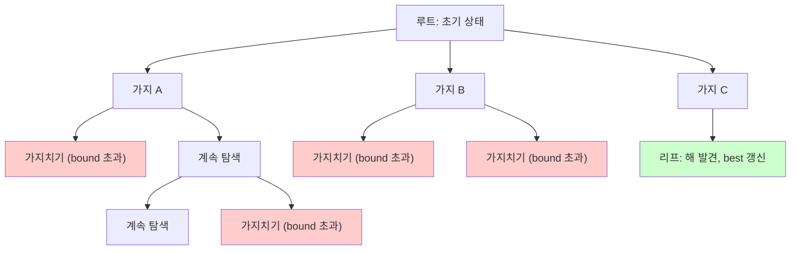
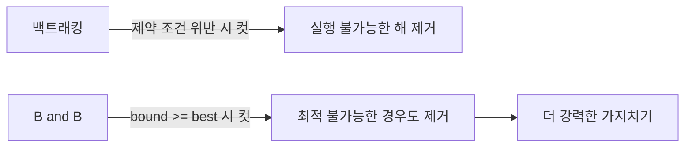

## 정의

**Branch and Bound (B&B)** 는 완전 탐색을 하되, **상한/하한을 계산해 유망하지 않은 서브트리를 가지치기** 하는 기법. 최적화 문제에 적용.

백트래킹이 "실행 불가능한 해를 가지치기" 한다면, B&B 는 **최적 해를 넘지 못하는 경우도 추가 제거**.

## 문제 상황과 동기

### 왜 필요한가

N 도시를 방문하는 최단 경로 ([[tsp|TSP]]) 는 완전 탐색 시 O(N!) 가지. N=20 이면 2.4 × 10^18 가지로 현실적으로 불가능.

- **Naive**: 모든 경우 탐색, TLE
- **Backtracking**: 불가능한 해만 제거, 여전히 느림
- **B&B**: 현재 best 보다 나쁠 수밖에 없는 경로도 즉시 제거, 실용적

핵심 통찰: *bound 함수가 낙관적 추정을 잘할수록 가지치기 효과 극대화*.

## 구성 요소

1. **Branching**: 해 공간을 서브문제로 나누기
2. **Bounding**: 각 서브문제에서 달성 가능한 최선 추정 (낙관적)
3. **Pruning**: 현재 best 보다 bound 가 나쁘면 해당 가지 제거

## 시각화

### 탐색 트리 구조



빨간 노드는 가지치기(pruning). 초록 노드가 최적 해.

### 백트래킹 vs B&B



## 핵심 아이디어

```text
best = 초기 상한 (greedy 등으로 구함)
우선순위 큐 Q (bound 기준 best-first)
Q.push(초기 노드)

while Q 가 비지 않을 때:
    node = Q.pop()
    if node.bound >= best:
        continue      # pruning
    if node 가 완성된 해:
        best = min(best, node.cost)
        continue
    for child in branch(node):
        child.bound = compute_bound(child)
        if child.bound < best:
            Q.push(child)

return best
```

**Key invariant**: bound 는 *실제 최적 해보다 항상 낙관적(optimistic)* 이어야 함. 너무 보수적이면 올바른 해를 가지치기.

## 알고리즘

### TSP 의 Bound 계산

현재까지 이동 비용 + 남은 도시로 가는 하한 추정:

- 남은 도시와 현재/시작 도시를 잇는 MST 가중치
- 각 도시의 최소 진출 간선 합

```text
bound = current_cost
      + sum(min outgoing edge of remaining cities)
      + MST(remaining cities)
```

### 0/1 Knapsack 의 Bound 계산

남은 아이템을 무게 대비 가치 순으로 정렬, fractional 로 채운 최대 가치:

```text
bound = current_value
      + fractional_knapsack(remaining_capacity, remaining_items)
```

Fractional 이므로 정수 해의 상한을 낙관적으로 추정.

## 구현

<CodeWithOutput
  variants={[
    {
      language: "cpp",
      label: "C++",
      code: `// 0/1 Knapsack Branch and Bound
#include <bits/stdc++.h>
using namespace std;

struct Item { int w, v; };
struct Node {
    int level, value, weight;
    double bound;
    bool operator<(const Node& o) const { return bound < o.bound; }
};

int n, W;
vector<Item> items;

double compute_bound(const Node& node) {
    if (node.weight >= W) return 0;
    double bound = node.value;
    int j = node.level + 1;
    int totw = node.weight;
    while (j < n && totw + items[j].w <= W) {
        totw += items[j].w;
        bound += items[j].v;
        j++;
    }
    if (j < n)
        bound += (double)(W - totw) / items[j].w * items[j].v;
    return bound;
}

int knapsack_bnb() {
    sort(items.begin(), items.end(),
         [](const Item& a, const Item& b) {
             return (double)a.v / a.w > (double)b.v / b.w;
         });

    priority_queue<Node> pq;
    Node root{-1, 0, 0, 0};
    root.bound = compute_bound(root);
    pq.push(root);

    int best = 0;
    while (!pq.empty()) {
        Node cur = pq.top(); pq.pop();
        if (cur.bound <= best) continue;

        Node next;
        next.level = cur.level + 1;
        if (next.level >= n) continue;

        // 현재 아이템 포함
        next.weight = cur.weight + items[next.level].w;
        next.value  = cur.value  + items[next.level].v;
        if (next.weight <= W && next.value > best)
            best = next.value;
        next.bound = compute_bound(next);
        if (next.bound > best) pq.push(next);

        // 현재 아이템 미포함
        next.weight = cur.weight;
        next.value  = cur.value;
        next.bound  = compute_bound(next);
        if (next.bound > best) pq.push(next);
    }
    return best;
}

int main() {
    n = 4; W = 15;
    items = {{2, 10}, {4, 10}, {6, 12}, {9, 18}};
    cout << knapsack_bnb() << "\\n";  // 38
}`,
    },
    {
      language: "python",
      label: "Python",
      code: `# 0/1 Knapsack Branch and Bound
import heapq

def knapsack_bnb(n, W, weights, values):
    items = sorted(zip(weights, values),
                   key=lambda x: -x[1] / x[0])

    def compute_bound(level, val, wt):
        if wt >= W:
            return 0
        bound = val
        j = level + 1
        totw = wt
        while j < n and totw + items[j][0] <= W:
            totw += items[j][0]
            bound += items[j][1]
            j += 1
        if j < n:
            bound += (W - totw) / items[j][0] * items[j][1]
        return bound

    best = 0
    # (-bound, level, value, weight)
    heap = [(-compute_bound(-1, 0, 0), -1, 0, 0)]

    while heap:
        neg_bd, level, val, wt = heapq.heappop(heap)
        bd = -neg_bd
        if bd <= best:
            continue

        nlevel = level + 1
        if nlevel >= n:
            continue

        w, v = items[nlevel]

        # 포함
        nwt, nval = wt + w, val + v
        if nwt <= W:
            best = max(best, nval)
        nb = compute_bound(nlevel, nval, nwt)
        if nb > best:
            heapq.heappush(heap, (-nb, nlevel, nval, nwt))

        # 미포함
        nb = compute_bound(nlevel, val, wt)
        if nb > best:
            heapq.heappush(heap, (-nb, nlevel, val, wt))

    return best

n, W = 4, 15
weights = [2, 4, 6, 9]
values  = [10, 10, 12, 18]
print(knapsack_bnb(n, W, weights, values))  # 38`,
    },
  ]}
  cases={[
    {
      label: "기본 배낭 문제",
      input: "n=4, W=15, items={(w=2,v=10),(w=4,v=10),(w=6,v=12),(w=9,v=18)}",
      output: "38",
    },
    {
      label: "모든 아이템 수용 가능",
      input: "n=2, W=100, items={(w=2,v=10),(w=4,v=10)}",
      output: "20",
    },
  ]}
/>

## 복잡도

| 항목 | 값 |
|:---|:---|
| **최악 시간** | O(2^N) |
| **실전 시간** | 가지치기 효과로 훨씬 빠름 |
| **공간 (DFS)** | O(N) 스택 |
| **공간 (Best-first)** | O(2^N) 최악 큐 |

가지치기 효과는 bound 품질에 의존. 좋은 초기 해를 greedy 로 구하면 효과 배가.

## DFS vs Best-first

| 방식 | 탐색 순서 | 메모리 | 빠른 해 발견 |
|:---|:---|:---|:---|
| DFS B&B | 재귀 | O(N) | 느림 |
| Best-first | 우선순위 큐 | O(2^N) 최악 | 빠름 |

메모리 제약 있으면 DFS, 해 품질이 중요하면 best-first.

### A* 와의 관계

[[a-star|A*]] 는 best-first B&B 에서 각 노드의 비용이 `g(n) + h(n)` 인 특수 경우. B&B 는 더 일반적인 개념.

## 함정

### 1. Bound 가 낙관적이지 않으면 최적 해 놓침

bound 함수는 반드시 실제 최적의 하한(최소화) 또는 상한(최대화) 이어야 함. bound 가 실제보다 보수적이면 정답을 가지치기해 WA.

### 2. 초기 해가 없으면 가지치기 불가

처음에 greedy 로 좋은 초기 해를 구해야 효율적 pruning 가능. 초기 best = 0 이면 모든 가지 탐색.

### 3. Best-first 는 메모리 폭발 위험

큐에 노드가 지수적으로 쌓일 수 있음. 반복 심화 B&B (ID-BnB) 도 대안.

### 4. Bound 계산 비용이 과도하면 역효과

TSP bound 로 MST 계산이 O(N^2) 이면, 노드마다 계산하는 오버헤드가 큼. 간단한 greedy bound 와 trade-off.

### 5. 정수 vs 실수 비교

bound 가 실수(double) 인 경우 `bound > best` 비교에 부동소수점 오차 주의.

## BOJ 연습 문제

| 번호 | 제목 | 정답률 | 링크 |
|:---|:---|---:|:---|
| BOJ 2098 | 외판원 순회 | 41.3% | [kokoa-lab](https://github.com/kokoa-lab/boj-problems/tree/main/organize_problems/2000-2099/2098) |
| BOJ 9663 | N-Queens | 62.3% | [kokoa-lab](https://github.com/kokoa-lab/boj-problems/tree/main/organize_problems/9600-9699/9663) |
| BOJ 15649 | N과 M (1) | 63.1% | [kokoa-lab](https://github.com/kokoa-lab/boj-problems/tree/main/organize_problems/15600-15699/15649) |
| BOJ 1987 | 알파벳 | 41.2% | [kokoa-lab](https://github.com/kokoa-lab/boj-problems/tree/main/organize_problems/1900-1999/1987) |

## 참고

- [[brute-force|Brute Force]]
- [[dp-bitfield|DP Bitfield]]
- [[a-star|A*]]
- [[knapsack|Knapsack]]
- [[tsp|TSP]]
