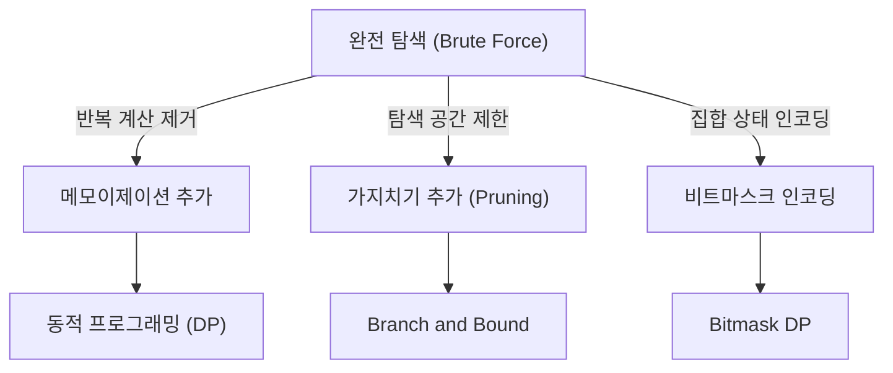

## 정의

**Brute Force (완전 탐색)** 는 문제의 모든 후보 해를 하나씩 검증하는 접근. 최적은 아니지만 **정확**하고 **명확**하며, 큰 문제에도 부분 검증 도구로 사용.

핵심 원칙: *모든 가능성을 빠짐없이 탐색하되, 불필요한 탐색은 가지치기로 제거.*

## 문제 상황

완전 탐색이 유효한 상황:

- **N ≤ 20**: 부분집합 열거 (2^N ≤ 10^6)
- **N ≤ 10**: 순열 열거 (10! ≈ 3.6×10^6)
- **N ≤ 8**: 순열 열거 (8! = 40,320, 매우 빠름)
- **N ≤ 1000**: 이중 루프 (10^6)
- **N ≤ 500**: 삼중 루프 (1.25×10^8, 타이트)

완전 탐색으로 정답을 구한 뒤, 최적화 알고리즘의 **정답 검증 도구**로도 활용.

## 시각화

완전 탐색에서 최적화로의 발전 경로:



## 핵심 아이디어

### 패턴 1: 부분집합 열거 (2^N)

```text
for mask = 0 to (1<<N)-1:
    subset = {i : mask & (1<<i) != 0}
    check(subset)
```

### 패턴 2: 순열 열거 (N!)

```text
arr = [0, 1, ..., N-1]
do:
    check(arr)
while next_permutation(arr)
```

### 패턴 3: 재귀 백트래킹

```text
function backtrack(state, depth):
    if depth == N:
        check(state)
        return
    for choice in choices:
        if is_valid(state, choice):
            state.add(choice)
            backtrack(state, depth + 1)
            state.remove(choice)
```

### 패턴 4: 중첩 루프

```text
for i = 0 to N-1:
    for j = i+1 to N-1:
        check(i, j)
```

## 알고리즘

### 가지치기 (Pruning)

현재 부분 해가 최적 해보다 나쁠 수 없을 때 탐색 중단:

```text
function backtrack(state, depth, current_cost):
    if current_cost >= best_cost: return  # 가지치기
    if depth == N:
        best_cost = min(best_cost, current_cost)
        return
    for choice in choices:
        backtrack(state + choice, depth + 1, current_cost + cost(choice))
```

### Meet in the Middle

N이 40 정도일 때: 절반씩 나눠 2^20 × 2 = 2×10^6 으로 해결.

```text
left_results = enumerate_all(first_half)
right_results = enumerate_all(second_half)
sort(right_results)
for each l in left_results:
    binary_search(right_results, target - l)
```

## 구현

<CodeWithOutput
  variants={[
    {
      language: "cpp",
      label: "C++",
      code: `#include <bits/stdc++.h>
using namespace std;

int n;
vector<int> arr;

// 패턴 1: 부분집합 열거
void subset_enumeration() {
    for (int mask = 0; mask < (1 << n); mask++) {
        cout << "{ ";
        for (int i = 0; i < n; i++)
            if (mask & (1 << i))
                cout << arr[i] << " ";
        cout << "}\\n";
    }
}

// 패턴 2: 순열 열거
void permutation_enumeration() {
    sort(arr.begin(), arr.end());
    do {
        for (int x : arr) cout << x << " ";
        cout << "\\n";
    } while (next_permutation(arr.begin(), arr.end()));
}

int main() {
    ios::sync_with_stdio(false);
    cin.tie(nullptr);

    cin >> n;
    arr.resize(n);
    for (int i = 0; i < n; i++) cin >> arr[i];

    int mode;
    cin >> mode;

    if (mode == 1) subset_enumeration();
    else permutation_enumeration();

    return 0;
}`,
    },
    {
      language: "python",
      label: "Python",
      code: `from itertools import permutations

def subset_enumeration(arr):
    n = len(arr)
    for mask in range(1 << n):
        subset = [arr[i] for i in range(n) if mask >> i & 1]
        print('{', *subset, '}')

def permutation_enumeration(arr):
    for perm in sorted(permutations(arr)):
        print(*perm)

def main():
    n = int(input())
    arr = list(map(int, input().split()))
    mode = int(input())

    if mode == 1:
        subset_enumeration(arr)
    else:
        permutation_enumeration(arr)

main()`,
    },
    {
      language: "java",
      label: "Java",
      code: `import java.util.*;

public class Main {
    static int n;
    static int[] arr;

    // 부분집합 열거
    static void subsetEnumeration() {
        for (int mask = 0; mask < (1 << n); mask++) {
            System.out.print("{ ");
            for (int i = 0; i < n; i++)
                if ((mask & (1 << i)) != 0)
                    System.out.print(arr[i] + " ");
            System.out.println("}");
        }
    }

    // 순열 열거 (재귀)
    static void permute(int[] a, int k) {
        if (k == n) {
            for (int x : a) System.out.print(x + " ");
            System.out.println();
            return;
        }
        for (int i = k; i < n; i++) {
            int tmp = a[k]; a[k] = a[i]; a[i] = tmp;
            permute(a, k + 1);
            tmp = a[k]; a[k] = a[i]; a[i] = tmp;
        }
    }

    public static void main(String[] args) {
        Scanner sc = new Scanner(System.in);
        n = sc.nextInt();
        arr = new int[n];
        for (int i = 0; i < n; i++) arr[i] = sc.nextInt();
        int mode = sc.nextInt();

        if (mode == 1) subsetEnumeration();
        else permute(arr, 0);
    }
}`,
    },
  ]}
  cases={[
    {
      label: "N=3 부분집합 열거",
      input: `3
1 2 3
1`,
      output: `{ }
{ 1 }
{ 2 }
{ 1 2 }
{ 3 }
{ 1 3 }
{ 2 3 }
{ 1 2 3 }`,
    },
    {
      label: "N=3 순열 열거",
      input: `3
1 2 3
2`,
      output: `1 2 3
1 3 2
2 1 3
2 3 1
3 1 2
3 2 1`,
    },
  ]}
/>

## 복잡도

| 탐색 유형 | 복잡도 | N 한계 (10^8 기준) |
|:---|:---|:---|
| 부분집합 | O(2^N) | N ≤ 26 |
| 순열 | O(N!) | N ≤ 12 |
| 조합 C(N,K) | O(C(N,K)) | 상황별 |
| 이중 루프 | O(N²) | N ≤ 10^4 |
| 삼중 루프 | O(N³) | N ≤ 500 |
| Meet in Middle | O(2^(N/2)) | N ≤ 40 |

## 최적화로 발전

### 1. 가지치기 → [[branch-and-bound|Branch and Bound]]

현재 부분 해가 최적 해보다 나쁠 수 없을 때 탐색 중단. 최악 복잡도는 동일하지만 실제로 훨씬 빠름.

### 2. 메모이제이션 → DP

같은 부분 문제를 반복 계산하면 메모이제이션으로 DP 변환. 지수 → 다항식 복잡도.

### 3. 비트마스크 → [[dp-bitfield|Bitmask DP]]

집합 상태를 비트마스크로 인코딩하면 O(N!) → O(2^N · N²) (TSP 예시).

### 4. [[BFS|너비 우선 탐색]] 결합

상태 공간 탐색에서 BFS로 최단 경로 탐색.

## 함정

### 1. 시간 초과 (TLE)

N=20 순열 (20! ≈ 2.4×10^18)은 절대 불가. N 제약 확인 필수.

> [!WARNING]
> 완전 탐색 전 반드시 복잡도 계산. N=15 순열 (15! ≈ 1.3×10^12)도 TLE.

### 2. 중복 탐색

순열에서 같은 원소가 있으면 중복 제거 필요. `next_permutation`은 정렬된 배열에서 시작해야 모든 순열을 정확히 한 번씩 생성.

### 3. 가지치기 조건 오류

가지치기 조건이 너무 강하면 정답을 놓침. 너무 약하면 효과 없음.

### 4. 재귀 깊이 초과

Python에서 재귀 깊이 기본 1000. `sys.setrecursionlimit(10**6)` 설정 필요.

### 5. 인덱스 범위 오류

부분집합 열거에서 `1 << N`이 int 범위를 초과할 수 있음. N=31 이상이면 `1LL << N` 사용.

## BOJ 연습 문제

| 번호 | 제목 | 유형 |
|:---|:---|:---|
| BOJ 1182 | 부분수열의 합 | 부분집합 열거 |
| BOJ 9663 | N-Queen | 백트래킹 |
| BOJ 15649 | N과 M (1) | 순열 |
| BOJ 2309 | 일곱 난쟁이 | 부분집합 |
| BOJ 1759 | 암호 만들기 | 조합 |
| BOJ 1208 | 부분수열의 합 2 | Meet in Middle |

## 관련 위키

- [[branch-and-bound|Branch and Bound]]
- [[dp-bitfield|Bitmask DP]]
- [[BFS|너비 우선 탐색]]
