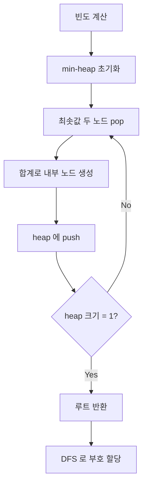
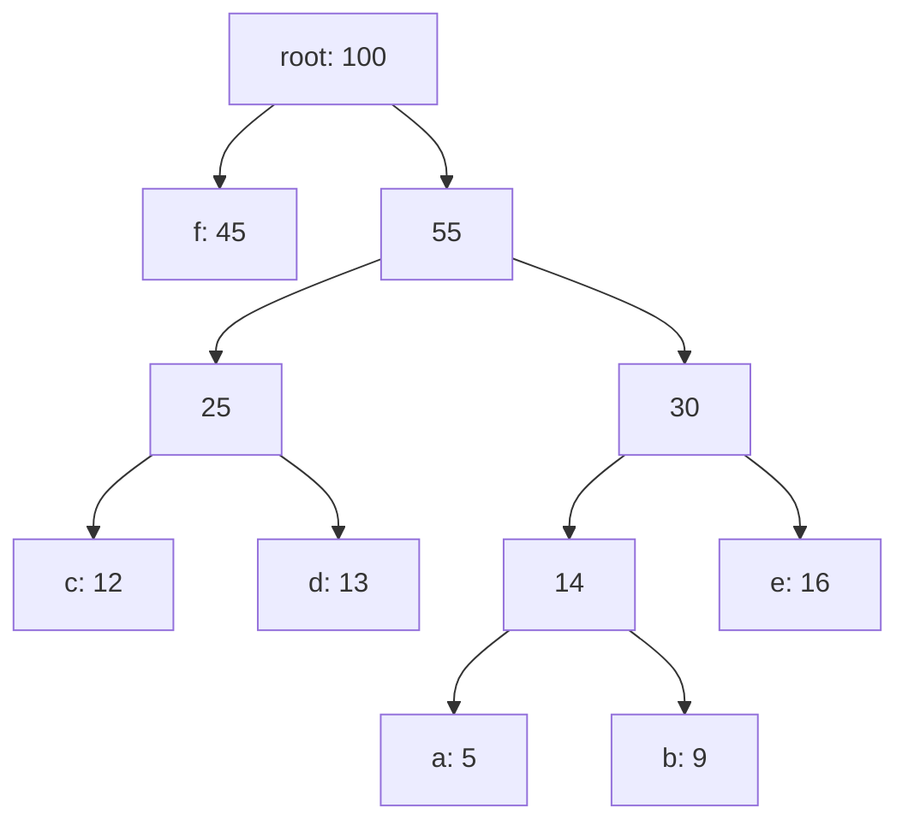

## 정의

**Huffman Coding** 은 문자의 빈도가 주어졌을 때 **평균 부호 길이를 최소화** 하는 **접두 부호 (prefix code)** 를 만드는 그리디 알고리즘. David Huffman (1952) 이 MIT 학생 시절 발표.

**접두 부호**: 어떤 부호도 다른 부호의 접두어가 아님. 구분자 없이 디코딩 가능.

## 문제 상황

N 개의 심볼과 각 빈도(혹은 확률)가 주어졌을 때, 각 심볼을 이진 부호로 표현해 전체 메시지의 **평균 비트 수를 최소화** 하라.

예: `a=5, b=9, c=12, d=13, e=16, f=45` (총 100회 등장)

| 방식 | 설명 | 평균 비트/심볼 |
|:---|:---|:---:|
| 고정 길이 | 6개 심볼 -> 최소 3비트 필요 | 3.00 bit |
| Huffman | 빈도에 따라 가변 길이 | 2.24 bit |
| Shannon entropy | 이론적 하한 | ~2.20 bit |

고정 길이보다 약 25% 절약. 핵심 통찰: *빈도 높은 심볼에 짧은 부호, 드문 심볼에 긴 부호.*

## 핵심 아이디어

가장 빈도가 낮은 두 심볼을 **반복적으로 합쳐** 이진 트리를 만든다. 트리 루트에서 각 리프까지의 경로 (왼쪽=0, 오른쪽=1) 가 최적 부호가 된다.

## 알고리즘

1. 각 문자를 리프 노드로 하고 빈도를 우선순위로 하는 **min-heap** 준비.
2. Heap 에서 최소 두 노드를 pop, 두 빈도의 합을 값으로 하는 새 내부 노드 생성 (두 노드를 자식으로).
3. 새 노드를 heap 에 push.
4. Heap 크기가 1 이 될 때까지 반복.
5. 완성된 트리의 루트에서 각 리프까지의 경로가 부호 (왼쪽=0, 오른쪽=1).

O(N log N) - N 은 문자 종류 수.

## 예시

빈도: `a=5, b=9, c=12, d=13, e=16, f=45`

병합 과정:

| 단계 | 조작 | heap 최솟값 순 |
|:---|:---|:---|
| 초기 | - | a:5, b:9, c:12, d:13, e:16, f:45 |
| 1 | a(5)+b(9) = 14 | c:12, d:13, ab:14, e:16, f:45 |
| 2 | c(12)+d(13) = 25 | ab:14, e:16, cd:25, f:45 |
| 3 | ab(14)+e(16) = 30 | cd:25, abe:30, f:45 |
| 4 | cd(25)+abe(30) = 55 | f:45, inner:55 |
| 5 | f(45)+inner(55) = 100 | root:100 |

완성된 트리 (왼쪽=0, 오른쪽=1):

결과 부호 (평균 2.24 bit/symbol):

| 심볼 | 빈도 | 부호 | 비트 수 |
|:---:|:---:|:---|:---:|
| f | 45 | 0 | 1 |
| c | 12 | 100 | 3 |
| d | 13 | 101 | 3 |
| e | 16 | 111 | 3 |
| b | 9 | 1101 | 4 |
| a | 5 | 1100 | 4 |

평균 비트 = (45*1 + 12*3 + 13*3 + 16*3 + 9*4 + 5*4) / 100 = 224/100 = **2.24 bit**

## 구현

<CodeWithOutput
  variants={[
    {
      language: "cpp",
      label: "C++",
      code: `#include <bits/stdc++.h>
using namespace std;

struct Node {
    char ch; int freq;
    Node *l = nullptr, *r = nullptr;
};
struct Cmp { bool operator()(Node* a, Node* b) { return a->freq > b->freq; } };

void encode(Node* nd, string code, map<char,string>& codes) {
    if (!nd->l && !nd->r) { codes[nd->ch] = code; return; }
    encode(nd->l, code+"0", codes);
    encode(nd->r, code+"1", codes);
}

int main() {
    map<char,int> freq = {{'a',5},{'b',9},{'c',12},{'d',13},{'e',16},{'f',45}};
    priority_queue<Node*, vector<Node*>, Cmp> pq;
    for (auto [c,f] : freq) pq.push(new Node{c,f});
    while (pq.size() > 1) {
        auto a = pq.top(); pq.pop();
        auto b = pq.top(); pq.pop();
        auto m = new Node{'\\0', a->freq + b->freq};
        m->l = a; m->r = b;
        pq.push(m);
    }
    map<char,string> codes;
    encode(pq.top(), "", codes);
    int bits = 0, total = 0;
    for (auto [c,f] : freq) {
        cout << c << ": " << codes[c] << "\\n";
        bits += f * (int)codes[c].size();
        total += f;
    }
    cout << "avg = " << fixed << setprecision(4)
         << (double)bits/total << " bit/symbol\\n";
}`,
    },
    {
      language: "python",
      label: "Python",
      code: `import heapq

class Node:
    def __init__(self, ch, freq):
        self.ch = ch; self.freq = freq
        self.left = self.right = None
    def __lt__(self, other): return self.freq < other.freq

def huffman(freq: dict) -> dict:
    heap = [Node(ch, f) for ch, f in freq.items()]
    heapq.heapify(heap)
    while len(heap) > 1:
        a = heapq.heappop(heap)
        b = heapq.heappop(heap)
        m = Node(None, a.freq + b.freq)
        m.left, m.right = a, b
        heapq.heappush(heap, m)
    codes = {}
    def dfs(node, code):
        if node.ch is not None:
            codes[node.ch] = code; return
        dfs(node.left, code + "0")
        dfs(node.right, code + "1")
    dfs(heap[0], "")
    return codes

freq = {"a":5,"b":9,"c":12,"d":13,"e":16,"f":45}
codes = huffman(freq)
total = sum(freq.values())
avg = sum(freq[c]*len(v) for c,v in codes.items()) / total
for ch, code in sorted(codes.items(), key=lambda x: (len(x[1]), x[0])):
    print(f"{ch}: {code}")
print(f"avg = {avg:.4f} bit/symbol")`,
    },
  ]}
  cases={[
    {
      label: "기본 실행",
      input: "",
      output: `a: 1100
b: 1101
c: 100
d: 101
e: 111
f: 0
avg = 2.2400 bit/symbol`,
    },
  ]}
/>

## 복잡도

| 항목 | 값 | 설명 |
|:---|:---|:---|
| **트리 빌드** | O(N log N) | min-heap 연산 N-1 회 |
| **공간** | O(N) | 트리 노드 수 = 2N-1 |
| **인코딩** | O(M) | M = 메시지 심볼 수 |
| **디코딩** | O(M * depth)  | depth <= N, 평균 O(log N) |

## 최적성 증명

**Sibling property**: 같은 부모의 두 자식은 항상 heap 에서 가장 낮은 두 원소. 이 성질이 최적 부호를 그리디하게 유도.

귀납 스케치: N=2 는 자명. N>2 일 때, 가장 낮은 두 원소를 합치는 것이 **최적 트리에서도 같은 깊이의 형제**임을 Sibling lemma 로 보임. 합친 노드를 단일 원소로 바꾸면 N-1 인스턴스가 되어 귀납 적용.

## 응용

- **DEFLATE (gzip, PNG)**: LZ77 + Huffman 결합. 가장 널리 사용되는 압축 조합
- **JPEG**: DCT 계수를 Huffman 으로 부호화
- **HTTP/2 [[hpack|HPACK]]**: 헤더 압축에 정적 Huffman 테이블 사용
- **MP3**: 오디오 스펙트럼 계수 부호화

## 함정

### 1. 단일 심볼 입력

심볼이 1개면 트리가 루트만 있어 부호가 빈 문자열. 별도 처리(길이 1 부호 강제) 필요.

### 2. 정적 빈도 가정

표준 Huffman 은 빈도를 **미리** 알아야 함. 파일 전체를 두 번 읽는다 (1회: 빈도 계산, 2회: 부호화). 스트리밍 환경에는 **Adaptive Huffman (FGK, Vitter 알고리즘)** 사용.

### 3. 확률이 극단적일 때 비효율

한 심볼 확률이 0.99 이면 Huffman 은 1비트를 할당하지만, Shannon entropy H ≈ 0.08 bit. **Arithmetic Coding** 이 entropy 에 더 근접한 압축을 달성.

### 4. 코드테이블 저장 비용

압축 파일에 Huffman 코드테이블도 같이 저장해야 함. 심볼 종류가 많거나 메시지가 짧으면 오히려 용량이 늘 수 있음.

### 5. 부동소수점 빈도 주의

Python `heapq` 나 C++ `priority_queue` 에서 부동소수점 빈도를 쓰면 동률 처리가 불안정해져 같은 입력에 다른 트리가 나올 수 있음. 정수로 변환하거나 타이브레이킹 기준을 명시하는 것이 안전.

## BOJ 연습 문제

| 번호 | 제목 | 핵심 |
|:---|:---|:---|
| BOJ 1715 | 카드 정렬하기 | Huffman coding 직접 응용, 합병 비용 최소화 |
| BOJ 13904 | 과제 | 그리디 + 우선순위 큐 |
| BOJ 19598 | 최소 회의실 개수 | min-heap 활용 |

## 참고

- 관련 [[priority-queue-heap|Priority Queue]]
- 관련 [[hpack|HPACK]] (HTTP/2 헤더 압축)
- 관련 [[greedy|Greedy]]
- Huffman, "A Method for the Construction of Minimum-Redundancy Codes" (1952)
- Shannon, "A Mathematical Theory of Communication" (1948)
