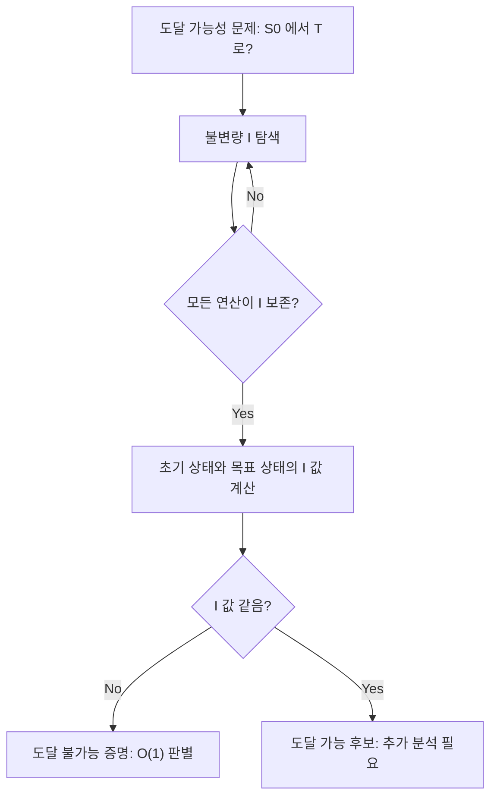

## 정의

**불변량 (Invariant)** 은 어떤 변환(operation)이 적용되어도 변하지 않는 양이나 성질. 불가능성 증명, 알고리즘의 정당성(correctness) 증명, 종료 조건 분석에 사용. 대표적으로 parity, coloring, sum/mod, algebraic invariant 가 있다.

## 문제 상황과 동기

"이 상태에서 저 상태로 도달할 수 있는가?" 를 판별할 때, 가능한 모든 연산을 시뮬레이션할 수는 없다.

- **naive**: BFS/DFS로 모든 상태 탐색. 상태 공간이 지수적으로 커짐.
- **invariant**: 항상 보존되는 양 Q를 찾아, Q(initial) != Q(target) 임을 보이면 불가능 증명. O(1) 판별.

핵심 통찰: *변환은 특정 양을 보존한다. 보존되는 양이 다르면 절대 도달할 수 없다.*

## 시각화

```anim:invariant
{}
```

## 핵심 아이디어



```
초기 상태 S0 = (변수, 구조, ...)
불변량 I(S) 가 모든 가능한 변환 T 에 대해 I(S) = I(T(S)) 를 만족
I(S0) != I(목표) => 목표 도달 불가능
```

대표적인 불변량:

| 불변량 | 적용 | 예시 |
|:---|:---|:---|
| **Parity (홀짝)** | inversion count, bit flip, swap | 15-puzzle, permutation sortability |
| **Coloring** | checkerboard 2-coloring | domino tiling, chessboard covering |
| **Sum/Mod** | 합 또는 mod M 보존 | 물병 문제, number theory |
| **Algebraic** | invariant polynomial | graph isomorphism, knot theory |

### 불변량 찾기 전략

1. **Parity**: 연산이 홀수/짝수 개의 무언가를 바꾸는지 확인.
2. **Sum**: 연산 전후 합이 변하지 않는지 확인.
3. **Coloring**: 그래프를 2-색칠하고 연산이 색을 보존하는지 확인.
4. **Mod M**: 값의 나머지가 고정되는지 확인.

## 알고리즘

```text
invariant_check(sequence, operation):
    I = compute_invariant(sequence)
    # operation 이 I 를 보존하는지 확인
    for each possible operation:
        assert I == compute_invariant(apply(sequence, operation))
    # 목표 상태의 I 와 비교
    return I == compute_invariant(target)
```

## 구현

<CodeWithOutput
  variants={[
    {
      language: "cpp",
      label: "C++",
      code: `// 순열의 inversion parity 계산
// 불변량: 인접 swap 은 inversion parity 를 바꾸지 않는다
#include <bits/stdc++.h>
using namespace std;
int main() {
    int n; cin >> n;
    vector<int> a(n);
    for (auto& v : a) cin >> v;
    int inv = 0;
    for (int i = 0; i < n; i++)
        for (int j = i + 1; j < n; j++)
            if (a[i] > a[j]) inv++;
    cout << (inv % 2 == 0 ? "even" : "odd") << "\\n";
    // 15-puzzle: inversions % 2 == 0 이면 solvable (empty row 보정)
    return 0;
}`,
    },
    {
      language: "python",
      label: "Python",
      code: `# 도미노 체스판: checkerboard coloring invariant
# 두 칸을 제거했을 때 도미노로 전부 덮을 수 있는가?
def can_cover(r1, c1, r2, c2):
    # 각 도미노는 검+흰 1개씩 덮음
    # 제거된 두 칸이 다른 색이어야 가능
    color = lambda r, c: (r + c) % 2
    return color(r1, c1) != color(r2, c2)

a, b, c, d = map(int, input().split())
print(1 if can_cover(a, b, c, d) else 0)
# BOJ 7538: 서로 다른 색 두 칸만 제거 가능`,
    },
    {
      language: "java",
      label: "Java",
      code: `// Parity invariant for permutation
import java.util.*;
public class Main {
    public static void main(String[] args) {
        Scanner sc = new Scanner(System.in);
        int n = sc.nextInt();
        int[] a = new int[n];
        for (int i = 0; i < n; i++) a[i] = sc.nextInt();
        int inv = 0;
        for (int i = 0; i < n; i++)
            for (int j = i + 1; j < n; j++)
                if (a[i] > a[j]) inv++;
        System.out.println(inv % 2 == 0 ? "even" : "odd");
    }
}`,
    },
  ]}
  cases={[
    {
      label: "순열 parity",
      input: `4
3 1 4 2`,
      output: `even`,
    },
  ]}
/>

## 복잡도

| 항목 | 값 |
|:---|:---|
| **불변량 계산** | O(N) 또는 O(N log N) |
| **판별** | O(1) (initial vs target 비교) |
| **invariant 찾기** | 문제마다 다름 (경험 + 통찰) |
| **안정성** | 항상 정확 (necessary condition) |

## 변형 / 활용

| 변형 | 설명 | 활용 |
|:---|:---|:---|
| **Parity invariant** | inversion count, XOR parity | 15-puzzle, Sorting network |
| **Coloring invariant** | 그래프 2-coloring, bipartiteness | 체스판 tiling, domino covering |
| **Monovariant** | 단조 변화량 (항상 증가/감소) | 종료 증명, potential function |
| **Algebraic invariant** | 차수, rank, determinant | 선형대수, 매트로이드 |

### Monovariant (단조 불변량)

불변량의 변형으로, *항상 증가하거나 항상 감소하는* 양. 알고리즘 **종료 증명**에 사용.

```text
예시: Bubble Sort 종료 증명
  - Monovariant: 배열의 inversion count
  - 매 단계에서 인접 원소를 swap 하면 inversion count 가 정확히 1 감소
  - inversion count >= 0 이므로 최대 n(n-1)/2 번 후 종료
```

```python
# Monovariant 예시: 게임 종료 증명
# 매 round 에서 점수 합이 줄어드는가?
def simulate(state):
    scores = list(state)
    rounds = 0
    while sum(scores) > 0:
        # 각 플레이어가 최소 점수를 가진 플레이어에게 1 넘김
        min_val = min(scores)
        new_scores = [s - 1 if s == min_val else s for s in scores]
        # Monovariant: sum 이 줄어드는지 확인
        assert sum(new_scores) <= sum(scores)
        scores = new_scores
        rounds += 1
        if rounds > 10000:  # 안전망
            break
    return rounds
```

**Monovariant vs Invariant**:
- Invariant: 값이 *변하지 않음*. 도달 불가능 증명.
- Monovariant: 값이 *단조 변화*. 종료 보장.

### 불변량 조합 기법

단일 불변량이 충분하지 않을 때, 여러 불변량을 결합해 더 강한 조건을 만들 수 있다.

**15-puzzle 예시** (4×4 그리드, 1~15 타일을 빈 칸으로 이동):
- 불변량 A: 타일 순열의 inversion count parity (홀/짝)
- 불변량 B: 빈 칸 행 번호 (0-indexed) 의 parity

풀이 가능 조건: `parity(inversions) XOR parity(blank_row) == 0`

단일 inversion parity 만으로는 필요조건만 제공하지만, blank row 와 조합하면 필요충분조건이 된다. 이처럼 하나의 불변량으로 부족하면 여러 불변량을 동시에 적용한다.

## 함정

### 1. 불변량이 충분 조건이 아닐 때

같은 불변량 값을 가져도 실제로 도달 가능하지 않을 수 있음. parity 만으로 15-puzzle 이 완전히 결정되지는 않음 (empty tile row 도 고려).

### 2. invariant vs monovariant 혼동

불변량은 *변하지 않는* 양. Monovariant는 *단조 변하는* 양 (항상 증가/감소). 후자는 알고리즘 종료 증명에 사용.

### 3. 불변량을 잘못 선택

너무 강한 불변량은 깨지기 쉽고, 너무 약한 불변량은 useless. 경험적으로 `mod 2`, `sum`, `XOR` 이 자주 통함.

### 4. necessary vs sufficient 혼동

`I(S0) != I(T)` 는 불가능의 **충분 조건**. `I(S0) == I(T)` 는 가능의 **필요 조건**만 줌 (= 불가능이 아닐 수도 있다는 뜻). 두 방향을 혼동하지 말 것.

## BOJ 연습 문제

| 번호 | 제목 | 정답률 | 링크 |
|:---|:---|---:|:---|
| BOJ 2136 | 개미 | 33.7% | [kokoa-lab](https://github.com/kokoa-lab/boj-problems/tree/main/organize_problems/2100-2199/2136) |
| BOJ 7538 | Incomplete chess boards | 69.7% | [kokoa-lab](https://github.com/kokoa-lab/boj-problems/tree/main/organize_problems/7500-7599/7538) |
| BOJ 10424 | 알고리즘 기말고사 | 31.8% | [kokoa-lab](https://github.com/kokoa-lab/boj-problems/tree/main/organize_problems/10400-10499/10424) |
| BOJ 32034 | 동전 쌍 뒤집기 | 35.0% | [kokoa-lab](https://github.com/kokoa-lab/boj-problems/tree/main/organize_problems/32000-32099/32034) |
| BOJ 1063 | 킹 | - | [kokoa-lab](https://github.com/kokoa-lab/boj-problems/tree/main/organize_problems/1000-1099/1063) |
| BOJ 14499 | 주사위 굴리기 | - | [kokoa-lab](https://github.com/kokoa-lab/boj-problems/tree/main/organize_problems/14400-14499/14499) |

## 참고

- [[Permutation Cycle Decomposition|순열 사이클 분해]]
- [[Parity|홀짝성]]
- [[Graph Traversal|그래프 탐색]]
- [[Game Theory|게임 이론]] (Sprague-Grundy 의 mex invariant)
- Wikipedia: [Invariant (mathematics)](https://en.wikipedia.org/wiki/Invariant_(mathematics))
- Wikipedia: [Monovariant](https://en.wikipedia.org/wiki/Monovariant)
