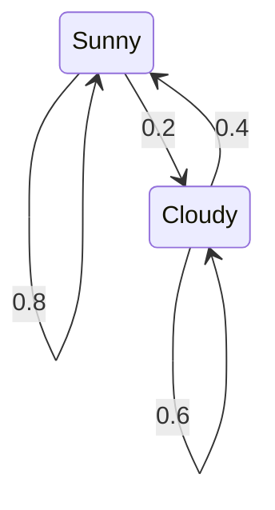

## 정의

**Markov Chain** 은 *다음 상태가 오직 현재 상태에만 의존*하는 확률 과정. **Memoryless property (Markov property)**.

$$
P(X_{t+1} = j \mid X_0, X_1, \ldots, X_t) = P(X_{t+1} = j \mid X_t)
$$

**전이 행렬 (Transition Matrix)** $P$: $P_{ij} = P(\text{다음} = j \mid \text{현재} = i)$.
각 행의 합 = 1 (확률 보존).

## 문제 상황과 동기

전형적인 PS 문제 패턴:

- "N 번 이동 후 위치 j 에 있을 확률" → 전이 행렬 거듭제곱
- "장기적으로 각 상태에 있는 비율" → 정류 분포
- "이 게임에서 파산할 확률" → Gambler's ruin

## 시각화

### 날씨 예측 마르코프 체인



Sunny = 맑음, Cloudy = 흐림. 전이 행렬:

$$
P = \begin{pmatrix} 0.8 & 0.2 \\ 0.4 & 0.6 \end{pmatrix}
$$

### N-step 전이 흐름


$v_0 \cdot P^n$ 의 j 번째 원소 = 초기 분포 $v_0$ 에서 출발해 n 스텝 후 상태 j 에 있을 확률.

## 핵심 아이디어

### 행렬 거듭제곱 (N-step 전이)

$P^n_{ij}$ = i 에서 j 로 n 스텝에 도달할 확률.

[[matrix-exponentiation|Matrix Exponentiation]] 으로 O(K^3 log N) 에 계산. K = 상태 수.

### Stationary Distribution

$\pi P = \pi$ 를 만족하는 확률벡터 $\pi$ (원소 합 = 1).

**Ergodic** 마르코프 체인 (irreducible + aperiodic) 이면 유일한 정류 분포 존재, 어떤 초기 분포에서도 수렴.

풀이: $\pi (P - I) = 0$ 에서 마지막 방정식을 $\sum \pi_i = 1$ 로 교체 후 선형계 풀기.

### Gambler's Ruin

가진 돈 i, 목표 N, 매 라운드 이길 확률 p:

$$
q_i = p \cdot q_{i+1} + (1-p) \cdot q_{i-1}, \quad q_0 = 1,\, q_N = 0
$$

해 ($p \neq 0.5$):

$$
q_i = \frac{(q/p)^N - (q/p)^i}{(q/p)^N - 1}
$$

카지노에서 p = 49% 이더라도 목표가 크면 파산 확률이 압도적으로 높은 이유.

## 알고리즘

### N-step 전이

```text
P = K x K 전이 행렬
Pn = matrix_power(P, n)
answer = Pn[start][end]
```

### 정류 분포 (Power Iteration)

```text
pi = [1/K, 1/K, ..., 1/K]  # 균등 초기
for t in 1..T:
    pi = pi * P             # 행벡터 x 행렬
# 수렴 후 pi = 정류 분포
```

수렴 속도 = 두 번째로 큰 고유값의 절댓값 (spectral gap).

### PageRank

- 각 웹 페이지 = 상태, 하이퍼링크 = 전이
- 댐핑 인수 d = 0.85: $P' = d \cdot P_{link} + (1-d) \cdot \mathbf{1}/K$
- Stationary distribution of P' = PageRank score

## 구현

<CodeWithOutput
  variants={[
    {
      language: "cpp",
      label: "C++",
      code: `// Markov Chain: 행렬 거듭제곱 + 정류 분포
#include <bits/stdc++.h>
using namespace std;
using Matrix = vector<vector<double>>;

int K;

Matrix mat_mul(const Matrix& A, const Matrix& B) {
    Matrix C(K, vector<double>(K, 0));
    for (int i = 0; i < K; i++)
        for (int k = 0; k < K; k++)
            for (int j = 0; j < K; j++)
                C[i][j] += A[i][k] * B[k][j];
    return C;
}

Matrix mat_pow(Matrix M, long long n) {
    Matrix R(K, vector<double>(K, 0));
    for (int i = 0; i < K; i++) R[i][i] = 1.0;  // 단위 행렬
    while (n > 0) {
        if (n & 1) R = mat_mul(R, M);
        M = mat_mul(M, M);
        n >>= 1;
    }
    return R;
}

int main() {
    // 날씨: 0=맑음, 1=흐림
    K = 2;
    Matrix P = {{0.8, 0.2}, {0.4, 0.6}};

    // N-step 전이
    long long n = 10;
    Matrix Pn = mat_pow(P, n);
    cout << "맑음 시작, " << n << "일 후:\\n";
    printf("  맑음 확률: %.4f\\n", Pn[0][0]);
    printf("  흐림 확률: %.4f\\n", Pn[0][1]);

    // 정류 분포 (Power iteration)
    vector<double> pi(K, 1.0 / K);
    for (int t = 0; t < 1000; t++) {
        vector<double> npi(K, 0);
        for (int i = 0; i < K; i++)
            for (int j = 0; j < K; j++)
                npi[j] += pi[i] * P[i][j];
        pi = npi;
    }
    printf("정류 분포: 맑음=%.4f, 흐림=%.4f\\n", pi[0], pi[1]);
    // 정류 분포: 맑음=0.6667, 흐림=0.3333
    // 이론값: pi0 = 0.4/(0.2+0.4) = 2/3
}`,
    },
    {
      language: "python",
      label: "Python",
      code: `# Markov Chain: 전이 행렬 + 정류 분포
import numpy as np

# 날씨 예측: 0=맑음, 1=흐림
P = np.array([[0.8, 0.2],
              [0.4, 0.6]])

# N-step 전이 (행렬 거듭제곱)
n = 10
Pn = np.linalg.matrix_power(P, n)
print(f"맑음 시작, {n}일 후:")
print(f"  맑음 확률: {Pn[0][0]:.4f}")
print(f"  흐림 확률: {Pn[0][1]:.4f}")

# 정류 분포 (반복법)
pi = np.array([0.5, 0.5])
for _ in range(1000):
    pi = pi @ P
print(f"정류 분포 (반복): 맑음={pi[0]:.4f}, 흐림={pi[1]:.4f}")

# 정류 분포 (고유벡터법)
eigenvalues, eigenvectors = np.linalg.eig(P.T)
idx = np.argmin(abs(eigenvalues - 1))
pi_exact = eigenvectors[:, idx].real
pi_exact /= pi_exact.sum()
print(f"정류 분포 (고유벡터): 맑음={pi_exact[0]:.4f}, 흐림={pi_exact[1]:.4f}")

# Gambler's Ruin: p=0.49, 초기 자금=50, 목표=100
def gambler_ruin(i, N, p):
    if p == 0.5:
        return 1 - i / N
    r = (1 - p) / p
    return (r**N - r**i) / (r**N - 1)

print(f"카지노 p=0.49, i=50, N=100: 파산 확률 = {gambler_ruin(50,100,0.49):.4f}")`,
    },
  ]}
  cases={[
    {
      label: "10일 후 날씨 예측",
      input: "P=[[0.8,0.2],[0.4,0.6]], start=맑음, n=10",
      output: "맑음 확률: 0.6667, 흐림 확률: 0.3333",
    },
    {
      label: "정류 분포",
      input: "P=[[0.8,0.2],[0.4,0.6]]",
      output: "맑음=0.6667, 흐림=0.3333",
    },
    {
      label: "Gambler's ruin",
      input: "p=0.49, i=50, N=100",
      output: "파산 확률 = 0.8824",
    },
  ]}
/>

## 복잡도

| 항목 | 값 |
|:---|:---|
| **N-step 계산** | O(K^3 log N) |
| **Power Iteration 수렴** | O(K^2 x T) |
| **고유벡터법** | O(K^3) |
| **공간** | O(K^2) |

K = 상태 수. K 가 크면 희소 행렬 표현 + Power Iteration.

## 응용

### MCMC (Markov Chain Monte Carlo)

복잡한 분포에서 직접 샘플링 불가능할 때, 해당 분포를 정류 분포로 갖는 마르코프 체인 구성 후 충분히 진행해 샘플 획득.

- **Metropolis-Hastings**: 제안 분포 q, 수용 확률 $\min(1, p(x')/p(x))$
- **Gibbs Sampling**: 각 변수를 조건부 분포에서 순서대로 샘플링

### 랜덤 워크

무방향 그래프에서 각 정점의 방문 비율 = degree / (2E). 정류 분포로 분석.

## 함정

### 1. 전이 행렬 방향

행 합 = 1 (행이 현재 상태). 열 합 = 1 로 착각하면 전치 행렬 사용 오류.

### 2. Reducible vs Irreducible

일부 상태 간 도달 불가능하면 reducible. 정류 분포가 유일하지 않을 수 있음.

### 3. Periodic 체인

주기 d > 1 이면 수렴 안 하고 진동. 자가 루프 추가로 aperiodic 만들기 가능.

### 4. 부동소수점 누적 오차

행렬 거듭제곱 반복 시 확률 합이 1 에서 벗어남. 주기적으로 정규화하거나 분수 표현 사용.

### 5. PS 에서 정수형 행렬

확률 문제를 분수/유리수로 처리하면 정밀도 보장. 모듈러 산술과 결합 가능.

## BOJ 연습 문제

| 번호 | 제목 | 정답률 | 링크 |
|:---|:---|---:|:---|
| BOJ 10830 | 행렬 제곱 | 47.3% | [kokoa-lab](https://github.com/kokoa-lab/boj-problems/tree/main/organize_problems/10800-10899/10830) |
| BOJ 11444 | 피보나치 수 6 | 51.2% | [kokoa-lab](https://github.com/kokoa-lab/boj-problems/tree/main/organize_problems/11400-11499/11444) |
| BOJ 2749 | 피보나치 수 3 | 50.0% | [kokoa-lab](https://github.com/kokoa-lab/boj-problems/tree/main/organize_problems/2700-2799/2749) |
| BOJ 13252 | 인터넷 | 32.1% | [kokoa-lab](https://github.com/kokoa-lab/boj-problems/tree/main/organize_problems/13200-13299/13252) |

## 참고

- [[matrix-exponentiation|Matrix Exponentiation]]
- [[expected-value|Expected Value]]
