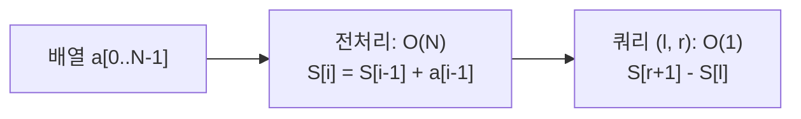
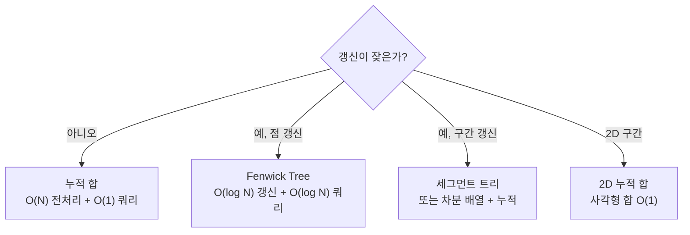

## 정의

**누적 합 (Prefix Sum)** 은 배열 `a[0..N-1]` 에 대해 `S[i] = a[0] + a[1] + ... + a[i-1]` (또는 1-indexed `S[i] = a[1] + ... + a[i]`) 을 미리 계산해 두고, **임의 구간 합 `a[l..r]` 을 O(1)** 에 구하는 정형.

```
sum(l, r) = S[r + 1] - S[l]
```

문제 풀이에서 **"구간 N 개 × Q 개 쿼리"** 가 O(N + Q) 로 떨어지는 가장 기본 패턴.

## 문제 상황과 동기

`Σ a[l..r]` 을 Q 번 묻는다.

- **naive**: 매 쿼리마다 l..r 순회. O(N · Q). N=Q=10^5 면 10^10, 절대 안 됨.
- **prefix sum**: O(N) 전처리 + O(1) 쿼리. 총 O(N + Q).

핵심 통찰: *합 함수 S(x)* 를 한 번만 계산하면, *임의 구간은 두 점의 차*. 누적은 도함수 / 미분이 가능한 모든 연산에 일반화 (XOR, AND/OR, min/max 같은 단조 연산은 누적 가능 / 불가능).

## 시각화

```anim:prefix-sum
{}
```

## 핵심 아이디어

invariant: *`S[i]` = 처음 i 개 원소의 합*. 두 누적 합의 *차* 가 구간 합.

```text
S[0] = 0
S[i] = S[i-1] + a[i-1]   for i = 1..N

sum(l, r) (0-indexed, inclusive)
  = a[l] + a[l+1] + ... + a[r]
  = S[r+1] - S[l]
```

확장:

- **2D prefix sum**: `S[i][j] = Σ_{i' ≤ i, j' ≤ j} a[i'][j']`. 구간 사각형 합 O(1).
- **차분 배열 (difference array)**: prefix sum 의 역. 구간 갱신 O(1) + 끝에 한번 누적.
- **mod prefix**: mod 가 있을 때 음수 조심.
- **XOR prefix**: 덧셈 대신 XOR. 구간 XOR 도 O(1).

## 알고리즘

```text
build_prefix(a):
    S[0] = 0
    for i = 1..N:
        S[i] = S[i-1] + a[i-1]

range_sum(l, r):    # 0-indexed inclusive
    return S[r+1] - S[l]
```

## 구현

<CodeWithOutput
  variants={[
    {
      language: "cpp",
      label: "C++",
      code: `// 1D prefix sum, O(N) 전처리 + O(1) 쿼리
#include <bits/stdc++.h>
using namespace std;
int main() {
    int n, q; cin >> n >> q;
    vector<long long> a(n), S(n + 1, 0);
    for (auto& v : a) cin >> v;
    for (int i = 1; i <= n; i++) S[i] = S[i-1] + a[i-1];
    while (q--) {
        int l, r; cin >> l >> r;          // 1-indexed [l, r]
        cout << S[r] - S[l-1] << "\\n";
    }
}`,
    },
    {
      language: "python",
      label: "Python",
      code: `# itertools.accumulate 로 O(N) 한 줄 prefix sum
from itertools import accumulate
import sys
input = sys.stdin.readline

n, q = map(int, input().split())
a = list(map(int, input().split()))
S = [0] + list(accumulate(a))
out = []
for _ in range(q):
    l, r = map(int, input().split())     # 1-indexed [l, r]
    out.append(str(S[r] - S[l-1]))
print("\\n".join(out))`,
    },
    {
      language: "java",
      label: "Java",
      code: `// long 으로 합. 큰 N 의 합 오버플로우 방지
import java.util.*;
import java.io.*;
public class Main {
    public static void main(String[] args) throws IOException {
        BufferedReader br = new BufferedReader(new InputStreamReader(System.in));
        StringTokenizer st = new StringTokenizer(br.readLine());
        int n = Integer.parseInt(st.nextToken());
        int q = Integer.parseInt(st.nextToken());
        long[] S = new long[n + 1];
        st = new StringTokenizer(br.readLine());
        for (int i = 1; i <= n; i++)
            S[i] = S[i-1] + Long.parseLong(st.nextToken());
        StringBuilder sb = new StringBuilder();
        while (q-- > 0) {
            st = new StringTokenizer(br.readLine());
            int l = Integer.parseInt(st.nextToken());
            int r = Integer.parseInt(st.nextToken());
            sb.append(S[r] - S[l-1]).append('\\n');
        }
        System.out.print(sb);
    }
}`,
    },
  ]}
  cases={[
    {
      label: "기본",
      input: `5 3
1 2 3 4 5
1 3
2 4
1 5`,
      output: `6
9
15`,
    },
  ]}
/>

## 복잡도

| 항목 | 값 |
|:---|:---|
| **전처리** | O(N) 시간, O(N) 공간 |
| **쿼리** | O(1) 시간 |
| **전체** | O(N + Q) |
| **갱신 (한 점 변경)** | O(N) - prefix 재계산 필요 → [[Segtree|세그먼트 트리]] 로 |

## 2D 누적 합

```text
S[i][j] = a[i][j] + S[i-1][j] + S[i][j-1] - S[i-1][j-1]

rect_sum(r1, c1, r2, c2)
  = S[r2][c2] - S[r1-1][c2] - S[r2][c1-1] + S[r1-1][c1-1]
```

inclusion-exclusion 한 단계.

## 변형

| 연산 | prefix 가능? | 비고 |
|:---|:---:|:---|
| +, XOR | ✓ | 가환 + inverse 존재 |
| min, max | ✗ | inverse 없음 → [[Sparse Table|희소 배열]] / [[Segtree|세그트리]] |
| 곱셈 (mod) | ✓ if mod inverse | 0 곱 주의 |
| AND, OR | ✗ | inverse 없음 |
| **차분 배열 (역)** | - | 구간 +k 갱신 O(1), 끝에 prefix |

## 함정

### 1. 1-indexed vs 0-indexed

`sum(l, r)` 에서 `S[r] - S[l-1]` (1-indexed) 와 `S[r+1] - S[l]` (0-indexed) 둘 다 자주 헷갈림. 한 표기 일관성 있게.

### 2. 합 오버플로우

C++ 에서 N=10^5 이상이면 합이 long long 범위 필요. `int` 누적은 위험.

### 3. 음수 mod

`(S[r] - S[l-1]) % MOD` 가 음수가 될 수 있다. `+ MOD` 후 다시 mod.

### 4. 갱신 빈도

원소 갱신이 잦으면 prefix sum 은 매번 재계산 (O(N)) 비용. 그 경우 [[Segtree|세그먼트 트리]] 또는 Fenwick.

## 알고리즘 흐름 시각화





## 차분 배열 (역 연산)

누적 합의 *역*. 구간 갱신을 O(1) 에, 최종 조회 시 한 번 누적.

```text
diff[l]   += v
diff[r+1] -= v
// 끝에 prefix 한번 돌리면 실제 배열
```

**사용 상황**: 구간 `[l, r]` 에 `+k` 연산이 Q 번, 최종 결과 배열 한 번 조회.

```cpp
// 차분 배열 구간 갱신 + 누적
vector<long long> diff(n + 1, 0);

for (auto& [l, r, v] : updates) {
    diff[l] += v;
    if (r + 1 <= n) diff[r + 1] -= v;
}

// 누적 복원
vector<long long> a(n + 1, 0);
for (int i = 1; i <= n; i++) a[i] = a[i-1] + diff[i];
```

## 문자 배열 prefix - 문자 개수 쿼리

2차원 prefix 의 응용. `cnt[i][c]` = `s[0..i-1]` 에서 문자 `c` 의 등장 횟수.

```cpp
// 문자 26개 (a~z)
vector<array<int, 26>> cnt(n + 1);
cnt[0].fill(0);
for (int i = 1; i <= n; i++) {
    cnt[i] = cnt[i-1];
    cnt[i][s[i-1] - 'a']++;
}

// [l, r] (1-indexed) 에서 'a' 개수
int count_a = cnt[r]['a' - 'a'] - cnt[l-1]['a' - 'a'];
```

BOJ 16139 유형. 구간 내 특정 문자 빈도 O(1).

## XOR Prefix

XOR 는 자기 자신이 역원 (`a ^ a = 0`). 누적 XOR 도 구간 쿼리 O(1).

```cpp
vector<int> xorPre(n + 1, 0);
for (int i = 1; i <= n; i++) xorPre[i] = xorPre[i-1] ^ a[i-1];

// [l, r] XOR (1-indexed)
int result = xorPre[r] ^ xorPre[l-1];
```

응용: 짝수/홀수 개수 쿼리, XOR 부분배열 최대 등.

## 구간 갱신 + 구간 합 (이중 차분)

**BIT (Fenwick) 2개** 를 이용하면 구간 갱신 + 구간 합을 각 O(log N).

그러나 누적 합만으로도 *읽기 전용* 구간 합은 이미 O(1) 이 된다. 이 기법은 갱신이 있을 때의 확장.

## 모노톤 Prefix 응용

- `prefix_max[i]` = `a[0..i]` 의 최댓값 → 특정 구간의 max 는 Sparse Table 필요 (단방향 max 는 prefix 가능)
- `prefix_sum` + 이분 탐색 → 구간 합이 X 이상인 첫 위치를 O(log N) 에 탐색

```cpp
// "prefix_sum[i] >= target 인 가장 왼쪽 i" - lower_bound
auto it = lower_bound(S.begin(), S.end(), target);
int pos = it - S.begin();
```

## BOJ 연습 문제

| 번호 | 제목 | 정답률 | 링크 |
|:---|:---|---:|:---|
| BOJ 11659 | 구간 합 구하기 4 | - | [kokoa-lab](https://github.com/kokoa-lab/boj-problems/tree/main/organize_problems/11600-11699/11659) |
| BOJ 11660 | 구간 합 구하기 5 (2D) | - | [kokoa-lab](https://github.com/kokoa-lab/boj-problems/tree/main/organize_problems/11600-11699/11660) |
| BOJ 2018 | 수들의 합 5 | - | [kokoa-lab](https://github.com/kokoa-lab/boj-problems/tree/main/organize_problems/2000-2099/2018) |
| BOJ 16139 | 인간-컴퓨터 상호작용 | - | [kokoa-lab](https://github.com/kokoa-lab/boj-problems/tree/main/organize_problems/16100-16199/16139) |

## 참고

- [[Difference Array|차분 배열]]
- [[Two Pointer|두 포인터]]
- [[Sliding Window|슬라이딩 윈도우]]
- [[Segtree|세그먼트 트리]] (갱신 잦을 때)
