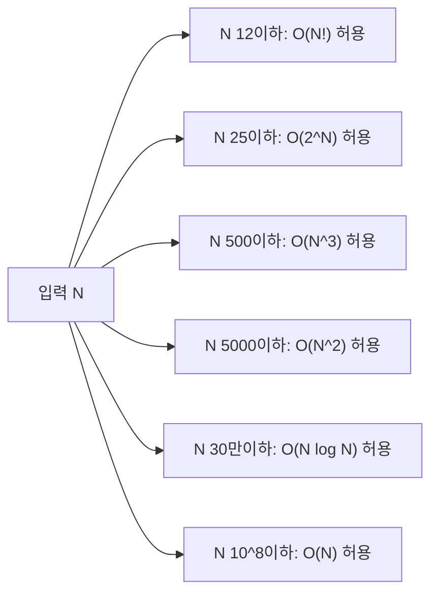

## 정의

**시간 복잡도 (Time Complexity)** 는 입력 크기 N 이 증가할 때 알고리즘의 **연산 횟수 증가율** 을 나타낸다. PS 에서는 주로 **최악 케이스 Big-O 표기법** 을 사용.

한 줄 요약: *"N 이 충분히 클 때 실행 시간이 얼마나 빠르게 늘어나는가"*.

## 점근적 표기법

세 가지 표기법이 있으며, 각각 **상한, 양면 한계, 하한** 을 나타낸다.

### Big-O (상한, Upper Bound)

$$f(n) = O(g(n)) \iff \exists\, c > 0,\ n_0 \text{ s.t. } f(n) \leq c \cdot g(n) \text{ for all } n > n_0$$

"충분히 큰 n 에서 f(n) 이 c·g(n) 보다 크지 않다". **PS 에서 가장 많이 쓰는 표기법**.

### Big-Omega (하한, Lower Bound)

$$f(n) = \Omega(g(n)) \iff \exists\, c > 0,\ n_0 \text{ s.t. } f(n) \geq c \cdot g(n) \text{ for all } n > n_0$$

"f(n) 이 c·g(n) 보다 항상 크다". 알고리즘의 **최선 케이스** 또는 **문제의 최적 하한** 표현.

### Big-Theta (양면 한계, Tight Bound)

$$f(n) = \Theta(g(n)) \iff f(n) = O(g(n)) \text{ and } f(n) = \Omega(g(n))$$

"f(n) 이 g(n) 과 동일한 성장률". [[recurrence-master-theorem|마스터 정리]] 에서 Θ 를 사용.

> [!IMPORTANT]
> PS 에서 "O(N log N) 알고리즘"이라고 할 때 엄밀히는 Θ(N log N) 을 의미하는 경우가 많다. 상한만 말하는 게 아님.

## 시각화

### 복잡도 성장 비교


오른쪽으로 갈수록 빠르게 증가. N=20 기준으로 `O(2^20) = 1,048,576`, `O(20!) = 2.4×10^18`.

### 대회 제한별 허용 복잡도



## 대표 복잡도별 예시

| 복잡도 | N=10 | N=100 | N=10^4 | N=10^6 | 대표 알고리즘 |
|:---|---:|---:|---:|---:|:---|
| O(1) | 1 | 1 | 1 | 1 | 배열 접근, 해시 조회 |
| O(log N) | 3 | 7 | 13 | 20 | 이분 탐색, 균형 트리 |
| O(N) | 10 | 100 | 10^4 | 10^6 | 선형 탐색, 누적 합 |
| O(N log N) | 33 | 664 | 1.3×10^5 | 2×10^7 | 병합 정렬, 힙 정렬 |
| O(N^2) | 100 | 10^4 | 10^8 | 10^12 | 버블 정렬, 삽입 정렬 |
| O(N^3) | 1,000 | 10^6 | 10^12 | - | 플로이드-워셜, 나이브 행렬곱 |
| O(2^N) | 1,024 | 10^30 | - | - | 부분집합, 백트래킹 |
| O(N!) | 3.6×10^6 | 10^157 | - | - | 순열 완전 탐색 |

PS 에서는 "1초 = 약 10^8 ~ 10^9 연산" 을 기준으로 사용.

## 대회 제한과 실처리량

10^8 연산/초 를 기준으로 한 허용 N 크기:

| 제한 시간 | O(N!) | O(2^N) | O(N^3) | O(N^2) | O(N log N) | O(N) | O(log N) |
|:---:|---:|---:|---:|---:|---:|---:|---:|
| **1초** | N<=12 | N<=25 | N<=500 | N<=5,000 | N<=3×10^5 | N<=10^8 | N<=10^30 |
| **2초** | N<=12 | N<=26 | N<=630 | N<=7,000 | N<=6×10^5 | N<=2×10^8 | N<=10^30 |

> [!IMPORTANT]
> 이 수치는 **개략 가이드**. 연산 종류 (나눗셈 vs 덧셈), 캐시 효율, 상수 인자, 언어 차이 (C++ vs Python vs Java) 에 따라 실제 처리량이 크게 다르다. Python 은 C++ 대비 50~100배 느리다고 가정해야 한다.

C++ 에서 단순 덧셈 루프는 10^9 연산/초도 가능하지만, 해시 테이블 조회나 포인터 추적은 10^7 ~ 10^8 수준. 메모리 접근 패턴이 성능에 큰 영향.

## Amortized 복잡도

**분할 상환 분석 (Amortized Analysis)** 은 개별 연산이 아닌 **N번 연산의 총 비용 / N** 으로 평균 복잡도를 구한다.

### 대표 예: 동적 배열 push_back

- capacity 1에서 시작, push_back N번:
  - 재할당 시점: 1, 2, 4, 8, ..., N
  - 복사 비용 합계: 1 + 2 + 4 + ... + N = 2N - 1 = O(N)
  - 일반 삽입 비용: N번 × O(1) = O(N)
  - 총합: O(N) → **1회 평균 O(1)**

- 개별 push_back 은 재할당 시 O(N) 일 수 있지만, N번 실행 시 평균 O(1).

다른 예: [[merge-sort|병합 정렬]] 은 모든 단계에서 O(N) 비용이 log N 번 → O(N log N).

## 복잡도 분석 절차

실전에서 알고리즘 복잡도를 빠르게 분석하는 절차:

```text
1. 루프 구조 파악
   - 단일 루프 O(1~N): 대부분 O(N)
   - 이중 루프: O(N^2) (단, 내부가 분기로 O(1) 이면 O(N))
   - log 분할 (이분 탐색 패턴): O(log N)

2. 재귀 점화식 파악
   - T(n) = 2T(n/2) + O(n): 마스터 정리 -> O(N log N)
   - T(n) = T(n-1) + O(1): O(N)
   - T(n) = 2T(n-1) + O(1): O(2^N)

3. 자료구조 연산 비용 더하기
   - Q번 세그트리 쿼리: O(Q log N)
   - N번 정렬 후 Q번 이분 탐색: O(N log N + Q log N)
```

## 구현

복잡도별 연산 횟수를 직접 계산해 비교한다.

<CodeWithOutput
  variants={[
    {
      language: "cpp",
      label: "C++",
      code: `// 복잡도별 연산 횟수 비교
#include <bits/stdc++.h>
using namespace std;
int main() {
    long long n;
    cin >> n;

    // floor(log2(n)) 계산
    long long logN = 0, tmp = n;
    while (tmp > 1) { tmp /= 2; logN++; }

    cout << "N = " << n << "\\n";
    cout << "O(1):       " << 1LL << " ops\\n";
    cout << "O(log N):   " << logN << " ops\\n";
    cout << "O(N):       " << n << " ops\\n";
    cout << "O(N log N): " << n * logN << " ops\\n";
    cout << "O(N^2):     " << n * n << " ops\\n";

    return 0;
}`,
    },
    {
      language: "python",
      label: "Python",
      code: `import math

n = int(input())
log_n = int(math.log2(n))

print(f"N = {n}")
print(f"O(1):       1 ops")
print(f"O(log N):   {log_n} ops")
print(f"O(N):       {n} ops")
print(f"O(N log N): {n * log_n} ops")
print(f"O(N^2):     {n * n} ops")`,
    },
    {
      language: "java",
      label: "Java",
      code: `import java.util.*;
import java.io.*;
public class Main {
    public static void main(String[] args) throws IOException {
        BufferedReader br = new BufferedReader(new InputStreamReader(System.in));
        long n = Long.parseLong(br.readLine().trim());

        // floor(log2(n)) 계산
        long logN = 0, tmp = n;
        while (tmp > 1) { tmp /= 2; logN++; }

        System.out.println("N = " + n);
        System.out.println("O(1):       1 ops");
        System.out.println("O(log N):   " + logN + " ops");
        System.out.println("O(N):       " + n + " ops");
        System.out.println("O(N log N): " + (n * logN) + " ops");
        System.out.println("O(N^2):     " + (n * n) + " ops");
    }
}`,
    },
  ]}
  cases={[
    {
      label: "N=1000",
      input: `1000`,
      output: `N = 1000
O(1):       1 ops
O(log N):   9 ops
O(N):       1000 ops
O(N log N): 9000 ops
O(N^2):     1000000 ops`,
    },
    {
      label: "N=10000",
      input: `10000`,
      output: `N = 10000
O(1):       1 ops
O(log N):   13 ops
O(N):       10000 ops
O(N log N): 130000 ops
O(N^2):     100000000 ops`,
    },
  ]}
/>

## 함정

> [!WARNING]
> **상수 인자 무시**: O(N) 이라도 상수가 크면 O(N log N) 보다 느릴 수 있다. 예: 캐시 miss 가 잦은 O(N) vs 캐시 친화적인 O(N log N). 이론 복잡도만으로 판단하지 말 것.

> [!WARNING]
> **최악 vs 평균 케이스 혼동**: 퀵 정렬은 평균 O(N log N) 이지만 최악 O(N^2). 대회에서 최악 케이스 입력이 들어오면 TLE. 최악 케이스 보장이 필요하면 [[merge-sort|병합 정렬]] 또는 힙 정렬.

> [!CAUTION]
> **Python 의 실제 속도**: Python 은 C++ 대비 50~100배 느리다. O(N^2) 알고리즘이 C++ 에서 1초면 Python 에서 50~100초. 대회에서 Python 사용 시 복잡도를 한 단계 낮춰야 한다.

> [!WARNING]
> **해시 테이블 최악 케이스**: `unordered_map` 은 평균 O(1) 이지만 최악 O(N). 해킹 테스트 케이스에서 TLE 발생 가능. `reserve()` + custom hash 또는 `map` (O(log N)) 으로 대체.

> [!IMPORTANT]
> **Amortized 와 Worst-case 구분**: `vector::push_back` 은 amortized O(1) 이지만 개별 호출은 O(N) 일 수 있다. 실시간 응답이 필요한 시스템에서는 amortized 복잡도가 충분하지 않을 수 있다.

> [!WARNING]
> **재귀 깊이 O(N)**: 재귀 함수가 O(N) 깊이로 호출되면 스택 오버플로우 위험. C++ 기본 스택은 약 1~8 MB. N=10^5 수준의 재귀는 반복문으로 변환하거나 스택 크기를 늘려야 한다.

## BOJ 연습 문제

| 번호 | 제목 | 설명 |
|:---|:---|:---|
| BOJ 2750 | 수 정렬하기 | O(N^2) vs O(N log N) 비교 |
| BOJ 1920 | 수 찾기 | O(N) 선형 탐색 vs O(log N) 이분 탐색 |
| BOJ 11650 | 좌표 정렬하기 | O(N log N) 정렬 |
| BOJ 10815 | 숫자 카드 | 이분 탐색 O(log N) |

## 관련 위키

- [[recurrence-master-theorem|마스터 정리]] - 분할 정복 점화식의 복잡도 판정
- [[divide-and-conquer|분할 정복]] - O(N log N) 알고리즘의 핵심 패턴
- [[merge-sort|병합 정렬]] - Θ(N log N) 정렬 알고리즘
- [[binary-search|이분 탐색]] - O(log N) 탐색
- [[sorting-algorithm|정렬 알고리즘]] - 복잡도별 정렬 비교
- [[data-structures|자료구조 개요]] - 자료구조별 연산 복잡도
- [[segtree|세그먼트 트리]] - O(log N) 구간 쿼리/갱신
