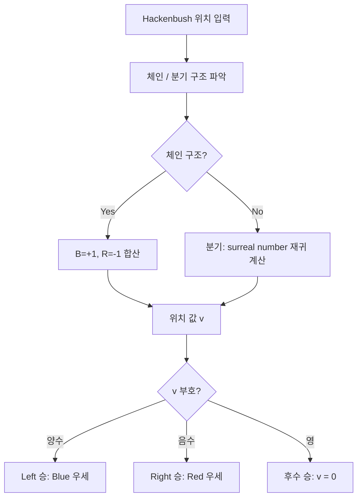

## 정의

**Hackenbush** 는 John H. Conway 가 "On Numbers and Games" (1976) 에서 고안한 combinatorial game. 바닥에 연결된 여러 개의 색깔 가지 (빨강/파랑) 가 있고, Left (파랑) 는 파란 가지를, Right (빨강) 는 빨간 가지를 자른다. 바닥과 연결이 끊긴 부분은 사라진다. 마지막으로 자를 수 있는 플레이어가 이긴다. 각 위치는 **surreal number** 로 값이 매겨진다.

## 문제 상황과 동기

combinatorial game theory 에서 위치의 "값"을 어떻게 정의할 것인가? Conway 는 Hackenbush 를 통해 surreal number 를 직관적으로 설명했다.

- **naive 접근**: minimax tree search. 위치 수가 기하급수적으로 증가.
- **핵심 통찰**: Blue-Red Hackenbush 의 각 위치는 surreal number 하나와 대응. 파란 가지 = Left 에게 유리 (+), 빨간 가지 = Right 에게 유리 (-). 가지가 갈라지는 구조는 {L|R} 꼴 surreal number.
- **의의**: 모든 partizan game 의 값을 측정하는 기준을 제공.

## 시각화

```anim:hackenbush
{}
```

## 핵심 아이디어

Blue-Red Hackenbush 의 값은 각 edge 의 색과 구조로 결정:

- 파란 가지 하나: +1 (Left 에게 유리)
- 빨간 가지 하나: -1 (Right 에게 유리)
- chain 구조: 각 edge 의 값을 단순 합산. B-B-R = (+1) + (+1) + (-1) = +1.
- branching 구조: {L|R} 형식의 surreal number. L = Left 가 자를 수 있는 위치들의 최대값, R = Right 가 자를 수 있는 위치들의 최소값.

surreal number 의 정의: {L|R} 에서 L < R 일 때 이는 유리수에 대응. 예: {0|} = 1, {|0} = -1, {0|1} = 1/2.

### 위치 값 계산 흐름



## Surreal Number 기초

Hackenbush 와 surreal number 는 1:1 대응한다. 주요 값:

| surreal number | 표기 | 의미 |
|:---|:---|:---|
| 0 | `{|}` | 후수 승, 균형 |
| 1 | `{0|}` | Left 1수 우위 |
| -1 | `{|0}` | Right 1수 우위 |
| 1/2 | `{0|1}` | Left 약간 유리 |
| -1/2 | `{-1|0}` | Right 약간 유리 |
| 2 | `{1|}` | Left 2수 우위 |
| `*` (star) | `{0|0}` | impartial game, 선수 승 |

**chain 과 surreal number 매핑:**
- 파란 가지 n 개: +n
- 빨간 가지 n 개: -n
- B...B R (파란 n-1 개, 빨간 1 개): n-1 에서 -1 을 뺀 분수로 수렴

예: B R 은 {|} = 0 이 아니라 각 edge 를 독립적으로 합산: (+1) + (-1) = 0. 후수 승.

## 알고리즘

```text
evaluate_chain(s):
    val = 0
    for each char c in s:
        if c == 'B': val += 1
        else: val -= 1
    return val

winner(val):
    if val > 0: "Left (Blue)"
    if val < 0: "Right (Red)"
    if val == 0: "Second player"

branching_value(left_options, right_options):
    # left_options = {L1, L2, ...}, right_options = {R1, R2, ...}
    # simplest surreal number between max(L) and min(R)
    return simplest_surreal(max(left_options), min(right_options))
```

## 구현

<CodeWithOutput
  variants={[
    {
      language: "cpp",
      label: "C++",
      code: `// Hackenbush chain value evaluation
#include <bits/stdc++.h>
using namespace std;
using ll = long long;

struct Frac {
    ll num, den;
    Frac(ll n = 0, ll d = 1) : num(n), den(d) {
        if (den < 0) { num = -num; den = -den; }
        ll g = gcd(abs(num), abs(den));
        num /= g; den /= g;
    }
    Frac operator+(const Frac& o) const {
        return Frac(num * o.den + o.num * den, den * o.den);
    }
    bool operator>(const Frac& o) const { return num * o.den > o.num * den; }
    bool operator<(const Frac& o) const { return num * o.den < o.num * den; }
    bool operator==(const Frac& o) const { return num == o.num && den == o.den; }
};

int main() {
    string s; cin >> s;
    Frac val;
    for (char c : s) {
        if (c == 'B') val = val + Frac(1);
        else if (c == 'R') val = val + Frac(-1);
    }
    cout << "Position value: " << val.num << "/" << val.den << "\\n";
    if (val > Frac(0)) cout << "Winner: Left (Blue)\\n";
    else if (val < Frac(0)) cout << "Winner: Right (Red)\\n";
    else cout << "Winner: Second player\\n";
    return 0;
}`,
    },
    {
      language: "python",
      label: "Python",
      code: `from fractions import Fraction
import sys
s = sys.stdin.readline().strip()
val = Fraction(0, 1)
for c in s:
    if c == 'B':
        val += Fraction(1, 1)
    elif c == 'R':
        val -= Fraction(1, 1)
print(f"Position value: {val}")
if val > 0:
    print("Winner: Left (Blue)")
elif val < 0:
    print("Winner: Right (Red)")
else:
    print("Winner: Second player")`,
    },
  ]}
  cases={[
    {
      label: "Blue 3개 chain",
      input: "BBB",
      output: "Position value: 3/1\nWinner: Left (Blue)",
    },
    {
      label: "혼합 chain",
      input: "BBR",
      output: "Position value: 1/1\nWinner: Left (Blue)",
    },
    {
      label: "Red 우세",
      input: "RRRB",
      output: "Position value: -2/1\nWinner: Right (Red)",
    },
    {
      label: "Zero game",
      input: "BR",
      output: "Position value: 0/1\nWinner: Second player",
    },
  ]}
/>

## 복잡도

| 항목 | 값 |
|:---|:---|
| **시간 (chain 평가)** | O(N) |
| **공간** | O(1) |
| **가지 평가 (일반)** | PSPACE-hard |
| **Green Hackenbush (tree)** | O(N) (XOR of edge counts) |

## 변형 / 활용

### Green Hackenbush

**impartial variant**: 모든 edge 가 초록색 = 누구나 자를 수 있음. Grundy number 로 평가.

- **Tree 위의 Green Hackenbush**: 각 나무의 Grundy 값은 ground 에서 각 leaf 까지의 경로 길이를 XOR 한 값. Nim 과 동치.
- **일반 그래프 위의 Green Hackenbush**: 간선의 수를 XOR 하는 방식 (홀수 개 = 1, 짝수 개 = 0 기여).

```python
# Green Hackenbush on a path (bamboo stalk)
# Grundy value = path length mod 2 (홀수면 1, 짝수면 0)
def green_chain_grundy(length):
    return length % 2  # 1 = 선수 승, 0 = 후수 승

# 여러 독립 게임의 XOR (Sprague-Grundy theorem)
components = [3, 5, 2]  # 각 chain 의 길이
xor_sum = 0
for c in components:
    xor_sum ^= green_chain_grundy(c)
print("First player wins" if xor_sum != 0 else "Second player wins")
```

### Hackenbush Hotchpotch

빨강, 파랑, 초록 세 가지 색 혼합. partizan + impartial 요소가 섞임.

### Surreal Number 모델

Hackenbush 위치는 surreal number 체계의 직관적 모델. Conway 의 "On Numbers and Games" 에서 이 게임으로 surreal number 를 설명.

### Game theory 교육

partizan game 의 기본 개념을 시각적으로 학습. 게임 값 (+, -, 0, *) 을 직관적으로 이해할 수 있음.

## 함정

### 1. Branching 구조의 값

단순 chain 의 값이 +1/-1 의 합인 반면, 가지가 갈라지면 {L|R} 형식의 surreal number 가 필요. 예: 파란 가지와 빨간 가지가 같은 높이에서 갈라지면 값은 {1|-1} = 0.

### 2. Zero game 의 의미

값이 0인 위치는 후수 승. 즉 먼저 자르는 쪽이 진다. "모서리" 위치는 항상 후수 승.

### 3. Blue-Red vs Green 혼동

Blue-Red Hackenbush 는 partizan game (각 플레이어가 다른 수를 씀), Green 은 impartial game (같은 수를 씀). 평가 방법이 다름: partizan → surreal number, impartial → Grundy number.

### 4. chain 합산의 함정

B-R 체인은 (+1) + (-1) = 0 이지만, 이것은 파란 가지가 위에 있고 빨간 가지가 아래에 있는 구조와 다를 수 있다. 연결 구조를 정확히 파악해야 함.

## BOJ 연습 문제

| 번호 | 제목 | 정답률 | 링크 |
|:---|:---|---:|:---|
| BOJ 11868 | 님 게임 2 | (수집 안 됨) | [kokoa-lab](https://github.com/kokoa-lab/boj-problems/tree/main/organize_problems/11800-11899/11868) |
| BOJ 13034 | 다각형 게임 | (수집 안 됨) | [kokoa-lab](https://github.com/kokoa-lab/boj-problems/tree/main/organize_problems/13000-13099/13034) |
| BOJ 16888 | 루트 님 게임 | (수집 안 됨) | [kokoa-lab](https://github.com/kokoa-lab/boj-problems/tree/main/organize_problems/16800-16899/16888) |
| BOJ 10714 | 실제 게임 | (수집 안 됨) | [kokoa-lab](https://github.com/kokoa-lab/boj-problems/tree/main/organize_problems/10700-10799/10714) |

## 참고

- [[Grundy Number]]
- [[Nim Game]]
