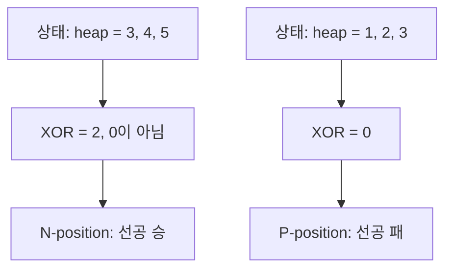
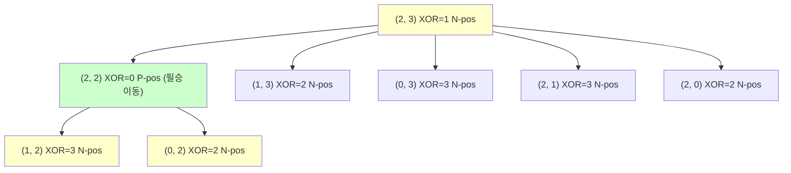

## 정의

**Nim** 은 여러 돌무더기에서 두 플레이어가 번갈아 한 무더기에서 돌을 임의 개수 가져가는 게임. 마지막 돌을 가져가는 쪽이 승 (normal play convention).

## 문제 상황과 동기

"N 개의 돌무더기, 두 플레이어, 최적 플레이 시 누가 이기나?" 형태의 게임 이론 문제.

핵심 질문: 주어진 상태가 **필승(N-position)** 인가 **필패(P-position)** 인가?

- **P-position (Previous player wins)**: 이전 플레이어가 이기는 자리. 현재 플레이어(선공) 입장에서 필패.
- **N-position (Next player wins)**: 현재 플레이어(선공)가 이기는 자리. 필승.

## 시각화

### Bouton's Theorem: XOR 으로 판별



### 게임 트리 소규모 예시

돌무더기 2개, 상태 (a, b) 에서 XOR = a XOR b:



(2, 3) 에서 (2, 2) 로 이동하면 XOR = 0 (P-pos). 이후 상대방의 모든 이동은 XOR != 0 으로 만들며, 선공은 항상 XOR = 0 으로 되돌릴 수 있음.

## 핵심 아이디어

### Bouton's Theorem

**P-position (필패) $\Leftrightarrow$ 모든 무더기의 XOR = 0**

$$
\text{heap}_1 \oplus \text{heap}_2 \oplus \cdots \oplus \text{heap}_n = 0 \Leftrightarrow \text{P-position}
$$

### 증명 스케치

**기저**: 모든 무더기 = 0 은 P-position. XOR = 0. (성립)

**P에서 N으로**: XOR = 0 인 상태에서 한 무더기 $h_i$ 를 $h_i'$ 으로 줄이면 $h_i' < h_i$, 전체 XOR = $h_i \oplus h_i' \neq 0$. 즉 P에서의 모든 이동은 N으로. (성립)

**N에서 P로**: XOR = $x \neq 0$ 이면 $x$ 의 최상위 비트를 1 로 갖는 무더기 $h_i$ 가 반드시 존재. $h_i' = h_i \oplus x$ 로 설정하면 $h_i' < h_i$ (크기 감소), 전체 XOR = 0. N에서 P로 가는 이동이 항상 존재. (성립)

### 최적 이동 계산

N-position 에서 XOR = 0 으로 만드는 이동:

```text
x = xor_sum
for i in 0..n-1:
    new_size = heap[i] XOR x
    if new_size < heap[i]:
        heap[i] = new_size  # 이 무더기를 new_size로 줄임
        break
```

### Misere Nim

마지막 돌을 가져가는 쪽이 **패** (normal play 반대):

- 모든 무더기가 크기 1 이하이면: 1 인 무더기 수가 홀수 = P-position
- 그 외: 일반 Nim 과 동일 (XOR = 0 이면 P-position)

## 알고리즘

```text
# Normal Nim 승패 판별
xor_sum = heap[0] XOR heap[1] XOR ... XOR heap[n-1]
if xor_sum == 0:
    P-position (선공 패)
else:
    N-position (선공 승)

# Misere Nim
all_small = all(h <= 1 for h in heaps)
if all_small:
    P-position iff count(h == 1) % 2 == 1
else:
    P-position iff xor_sum == 0
```

## 구현

<CodeWithOutput
  variants={[
    {
      language: "cpp",
      label: "C++",
      code: `// Nim Game: 승패 판별 + 최적 이동
#include <bits/stdc++.h>
using namespace std;

bool nim_winner(vector<int>& heaps) {
    int x = 0;
    for (int h : heaps) x ^= h;
    return x != 0;
}

// 최적 이동: (무더기 인덱스, 줄일 개수). N-position 에서만 유효.
pair<int,int> nim_optimal(vector<int> heaps) {
    int x = 0;
    for (int h : heaps) x ^= h;
    for (int i = 0; i < (int)heaps.size(); i++) {
        int ns = heaps[i] ^ x;
        if (ns < heaps[i]) return {i, heaps[i] - ns};
    }
    return {-1, -1};
}

bool misere_winner(vector<int>& heaps) {
    bool all_small = true;
    for (int h : heaps) if (h > 1) { all_small = false; break; }
    if (all_small) {
        int ones = 0;
        for (int h : heaps) ones += h;
        return ones % 2 == 0;  // 홀수 개 1 = P-position = 선공 패
    }
    int x = 0;
    for (int h : heaps) x ^= h;
    return x != 0;
}

int main() {
    vector<int> h1 = {3, 4, 5};
    cout << "XOR: " << (3^4^5) << "\\n";
    cout << (nim_winner(h1) ? "선공 승" : "선공 패") << "\\n";

    auto [idx, rem] = nim_optimal(h1);
    cout << "최적: 무더기 " << idx << " 에서 " << rem << "개 제거\\n";

    vector<int> h2 = {1, 2, 3};
    cout << "XOR: " << (1^2^3) << "\\n";
    cout << (nim_winner(h2) ? "선공 승" : "선공 패") << "\\n";

    // Misere Nim
    vector<int> h3 = {1, 1, 1};
    cout << "Misere (1,1,1): " << (misere_winner(h3) ? "선공 승" : "선공 패") << "\\n";
}`,
    },
    {
      language: "python",
      label: "Python",
      code: `# Nim Game
from functools import reduce
from operator import xor

def nim_winner(heaps):
    """True = N-position (선공 승)"""
    return reduce(xor, heaps, 0) != 0

def nim_optimal(heaps):
    """XOR=0 으로 만드는 최적 이동 (인덱스, 줄일 개수)"""
    xsum = reduce(xor, heaps, 0)
    for i, h in enumerate(heaps):
        ns = h ^ xsum
        if ns < h:
            return i, h - ns
    return -1, -1

def misere_winner(heaps):
    """Misere Nim 승패"""
    all_small = all(h <= 1 for h in heaps)
    if all_small:
        return sum(heaps) % 2 == 0  # 홀수 개 1 = P-position = 선공 패
    return reduce(xor, heaps, 0) != 0

# N-position 예시
heaps = [3, 4, 5]
print(f"XOR: {reduce(xor, heaps)}")  # 2
print("선공 승" if nim_winner(heaps) else "선공 패")
idx, rem = nim_optimal(heaps)
print(f"최적: 무더기 {idx} 에서 {rem}개 제거")

# P-position 예시
heaps2 = [1, 2, 3]
print(f"XOR: {reduce(xor, heaps2)}")  # 0
print("선공 승" if nim_winner(heaps2) else "선공 패")

# Misere Nim
print("Misere (1,1,1):", "선공 승" if misere_winner([1,1,1]) else "선공 패")`,
    },
    {
      language: "java",
      label: "Java",
      code: `// Nim Game
import java.util.*;
public class Main {
    static boolean nimWinner(int[] heaps) {
        int x = 0;
        for (int h : heaps) x ^= h;
        return x != 0;
    }
    static int[] nimOptimal(int[] heaps) {
        int x = 0;
        for (int h : heaps) x ^= h;
        for (int i = 0; i < heaps.length; i++) {
            int ns = heaps[i] ^ x;
            if (ns < heaps[i]) return new int[]{i, heaps[i] - ns};
        }
        return new int[]{-1, -1};
    }
    public static void main(String[] args) {
        int[] h1 = {3, 4, 5};
        System.out.println("선공 " + (nimWinner(h1) ? "승" : "패"));
        int[] move = nimOptimal(h1);
        System.out.println("최적: 무더기 " + move[0] + " 에서 " + move[1] + "개 제거");
        int[] h2 = {1, 2, 3};
        System.out.println("선공 " + (nimWinner(h2) ? "승" : "패"));
    }
}`,
    },
  ]}
  cases={[
    {
      label: "N-position (선공 승)",
      input: "heaps = [3, 4, 5]",
      output: "XOR: 2\n선공 승\n최적: 무더기 2 에서 4개 제거",
    },
    {
      label: "P-position (선공 패)",
      input: "heaps = [1, 2, 3]",
      output: "XOR: 0\n선공 패",
    },
    {
      label: "Misere Nim (1,1,1)",
      input: "heaps = [1, 1, 1]",
      output: "Misere (1,1,1): 선공 패",
    },
  ]}
/>

## 복잡도

| 항목 | 값 |
|:---|:---|
| **승패 판별** | O(N) |
| **최적 이동** | O(N) |
| **공간** | O(N) |

N = 무더기 수. 무더기 크기와 무관하게 O(N).

## Sprague-Grundy 확장

Nim 은 Sprague-Grundy 정리의 원형.

**Grundy value (Nim-value)**:

$$
G(\text{pos}) = \text{mex}(\{G(\text{move}) \mid \text{move} \in \text{reachable}\})
$$

mex = Minimum EXcludant (0, 1, 2, ... 중 없는 가장 작은 수).

- Nim 에서 크기 k 인 무더기: G = k (자명)
- 복합 게임에서 XOR 합: $G(\text{sum}) = G_1 \oplus G_2 \oplus \cdots$

임의의 impartial game (완전 정보, 두 플레이어, 이동 집합 동일) 은 Nim 무더기로 등가 변환 가능.

## 조합 게임 이론 용어

| 개념 | 설명 |
|:---|:---|
| Normal play | 마지막 이동하면 승 |
| Misere play | 마지막 이동하면 패 |
| Impartial game | 두 플레이어 이동 집합 동일 |
| Partizan game | 이동 집합 플레이어마다 다름 (바둑 등) |
| Sprague-Grundy | Impartial game = Nim 등가 |

## 함정

### 1. 무더기 크기 0 처리

XOR 에서 0 은 영향 없음. 모두 0 이면 P-position (게임 종료).

### 2. Misere 와 Normal play 혼동

대부분 PS 문제는 normal play. Misere 조건은 반드시 명시.

### 3. 무더기 개수 1 인 경우

heap = [k] 이면 XOR = k. k != 0 이면 N-position. 선공이 전부 가져가면 승.

### 4. "정확히 k 개" 제한 Nim

매 턴 최대 k 개만 가져갈 수 있으면 일반 Nim 과 다름. Grundy 값 = heap mod (k+1).

### 5. 병렬 게임 (sum of games)

여러 Nim 이 독립적으로 진행되면 XOR 합 사용 가능. 독립적이지 않으면 Sprague-Grundy 수동 계산.

## BOJ 연습 문제

| 번호 | 제목 | 정답률 | 링크 |
|:---|:---|---:|:---|
| BOJ 11694 | 님 게임 | 68.2% | [kokoa-lab](https://github.com/kokoa-lab/boj-problems/tree/main/organize_problems/11600-11699/11694) |
| BOJ 9655 | 돌 게임 | 75.1% | [kokoa-lab](https://github.com/kokoa-lab/boj-problems/tree/main/organize_problems/9600-9699/9655) |
| BOJ 9656 | 돌 게임 2 | 73.5% | [kokoa-lab](https://github.com/kokoa-lab/boj-problems/tree/main/organize_problems/9600-9699/9656) |
| BOJ 9657 | 돌 게임 3 | 63.4% | [kokoa-lab](https://github.com/kokoa-lab/boj-problems/tree/main/organize_problems/9600-9699/9657) |
| BOJ 11062 | 카드 게임 | 47.5% | [kokoa-lab](https://github.com/kokoa-lab/boj-problems/tree/main/organize_problems/11000-11099/11062) |

## 참고

- [[sprague-grundy-theorem|Sprague-Grundy]]
- [[game-theory|Game Theory]]
