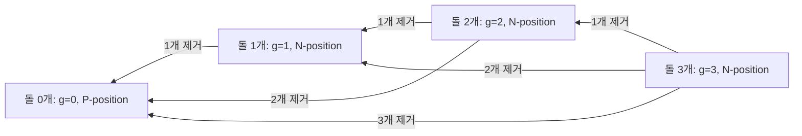
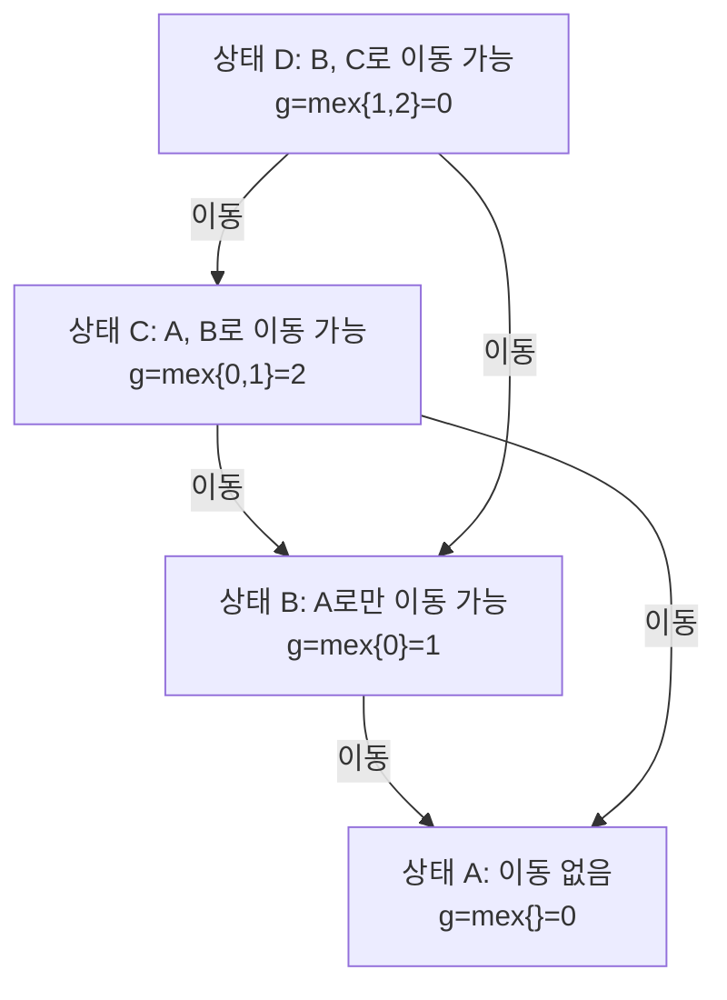

## 정의

**Sprague-Grundy Theorem**: 모든 impartial game (플레이어 무관, deterministic, no draw) 은 하나의 Nim 무더기와 등가.

각 상태 v 의 **Grundy number** g(v):

$$
g(v) = \text{mex}\{ g(u) : v \to u \}
$$

**mex** = Minimum EXcluded non-negative integer. `mex{0, 1, 3} = 2`, `mex{1, 2} = 0`.

**impartial game 조건**:
- 두 플레이어가 같은 이동 집합을 가짐 (chess는 해당 안 됨)
- 정보 완전 공개, 무작위 없음
- 무승부 없음, 이동 불가 상태에서 패배

## 문제 상황

여러 개의 독립 게임을 동시에 진행하는 **합 게임(game sum)** 에서 선공이 이길 수 있는가?

**단순 접근**: 각 게임의 상태 공간을 직접 탐색. 상태 수가 지수로 폭발.

**핵심 통찰**: 각 독립 게임의 Grundy 수를 계산하고, 이를 XOR하면 합 게임의 Grundy 수가 됨. g = 0이면 현재 플레이어 패배(P-position).

## 시각화

### Nim 게임의 Grundy 수 (돌 무더기)



P-position (g=0): 현재 이동하는 플레이어가 패배.
N-position (g!=0): 현재 이동하는 플레이어가 승리 가능.

### mex 계산 예시



## 게임 합 (game sum)

여러 게임을 병렬로 진행하는 합 게임의 Grundy = 개별 Grundy 의 **XOR**.

$$
g(G_1 + G_2 + \dots + G_k) = g(G_1) \oplus g(G_2) \oplus \dots \oplus g(G_k)
$$

**필패 판정**: g(state) = 0 이면 P-position (다음 이동하는 플레이어 패배).

### 예시: Nim 3무더기 (3, 5, 7)

```text
g(3) = 3, g(5) = 5, g(7) = 7
XOR = 3 XOR 5 XOR 7 = 011 XOR 101 XOR 111 = 001 = 1 != 0
=> 선공 필승
```

## 핵심 아이디어

### mex 계산

```text
mex(S) = 가장 작은 S에 속하지 않는 비음수 정수
mex{}  = 0
mex{0} = 1
mex{0,1,2} = 3
mex{0,2} = 1   (1이 없으므로)
```

### Grundy 수 재귀 계산

DAG(Directed Acyclic Graph) 위에서 역방향으로 계산:

```text
# 위상 역순으로 처리
g[terminal_state] = 0     # 이동 불가 = mex{} = 0

for v in topological order (역방향):
    reachable = {g[u] for u in adj[v]}
    g[v] = mex(reachable)
```

### 합 게임 XOR

복수의 독립 게임 G1, G2, ..., Gk가 있을 때:
- 각 Gi의 Grundy 수 gi를 계산
- g1 XOR g2 XOR ... XOR gk = 0이면 P-position (선공 패배)
- 0이 아니면 N-position (선공 승리)

## 알고리즘

```text
# 단일 게임 Grundy 수 DFS 계산
def grundy(v, memo):
    if v in memo: return memo[v]
    reachable = set()
    for u in adj[v]:
        reachable.add(grundy(u, memo))
    g = 0
    while g in reachable:
        g += 1
    memo[v] = g
    return g

# 합 게임 판정
g_total = grundy(state1) XOR grundy(state2) XOR ...
if g_total == 0: print("Second player wins")
else: print("First player wins")
```

## 구현

<CodeWithOutput
  variants={[
    {
      language: "cpp",
      label: "C++ (Nim 합 게임)",
      code: `#include <bits/stdc++.h>
using namespace std;

// Nim: 돌 무더기 여러 개, 무더기에서 임의 개수 제거 가능
// Grundy(pile of n) = n (Nim 의 핵심 성질)

int main() {
    ios::sync_with_stdio(false);
    cin.tie(nullptr);

    int k;
    cin >> k;

    int xorSum = 0;
    for (int i = 0; i < k; i++) {
        int pile;
        cin >> pile;
        xorSum ^= pile;  // Nim: g(pile) = pile
    }

    if (xorSum != 0) cout << "First player wins\\n";
    else             cout << "Second player wins\\n";
    return 0;
}`,
    },
    {
      language: "python",
      label: "Python (Grundy 수 메모이제이션)",
      code: `import sys
from functools import lru_cache
input = sys.stdin.readline

def solve():
    # 예시: 1 또는 2개 제거 가능한 돌 게임 (Grundy 계산)
    # adj[n] = {n-1, n-2} (n >= 2), {n-1} (n == 1), {} (n == 0)

    @lru_cache(maxsize=None)
    def grundy(n):
        if n == 0:
            return 0  # 이동 불가, mex{} = 0
        reachable = set()
        for take in range(1, 3):  # 1 또는 2개 제거
            if n - take >= 0:
                reachable.add(grundy(n - take))
        g = 0
        while g in reachable:
            g += 1
        return g

    k = int(input())
    piles = list(map(int, input().split()))

    xor_sum = 0
    for p in piles:
        xor_sum ^= grundy(p)

    if xor_sum != 0:
        print("First player wins")
    else:
        print("Second player wins")

solve()`,
    },
  ]}
  cases={[
    {
      label: "Nim 선공 승리",
      input: `3
3 5 7`,
      output: `First player wins`,
    },
    {
      label: "Nim 선공 패배",
      input: `3
1 2 3`,
      output: `Second player wins`,
    },
    {
      label: "단일 무더기",
      input: `1
0`,
      output: `Second player wins`,
    },
  ]}
/>

## 복잡도

| 항목 | 값 |
|:---|:---|
| **Grundy 수 계산 (DAG)** | O(V + E) (memoization + DFS) |
| **mex 계산 (집합)** | O(d) where d = 최대 outdegree |
| **합 게임 판정** | O(k) (k개 게임) |
| **Nim 직접** | O(k) (XOR만) |

## 응용 사례

| 게임 | Grundy 수 |
|:---|:---|
| **Nim** (돌 제거) | g(pile n) = n |
| **Kayles** (볼링 핀 게임) | 주기적 패턴 (주기 12) |
| **Green Hackenbush** | 트리 간선 수 XOR |
| **Wythoff's game** | 황금비 기반 P-position |
| **Moore's Nim** (k개까지 가져감) | XOR 변형 |

## 함정

### 1. impartial game 아닌 경우 적용 오류

체스, 바둑처럼 두 플레이어의 이동 집합이 다른 게임에는 Sprague-Grundy 정리 적용 불가. **partisan game**은 Combinatorial Game Theory의 다른 프레임워크 필요.

### 2. mex 계산 실수

`mex{1, 2} = 0` (0이 없으므로), `mex{0, 1, 2} = 3`. 0부터 순서대로 없는 것을 찾아야 함.

### 3. 무한 게임

DAG가 아닌 순환 게임(이동이 무한히 가능)에는 Grundy 수 정의 불가. Misere 버전도 별도 처리 필요.

### 4. 합 게임 XOR 적용 조건

XOR은 **독립적인** 게임에만 적용 가능. 게임들이 서로 영향을 주면 단순 XOR 불가.

### 5. Misere 게임 (마지막 이동한 플레이어 패배)

기본 Sprague-Grundy와 다름. Nim에서는 "모든 무더기가 1 이하"일 때 조건 반전.

## BOJ 연습 문제

| 번호 | 제목 | 난이도 | 알고리즘 |
|:---|:---|:---|:---|
| BOJ 9655 | 돌 게임 | Silver 5 | Nim / 규칙 발견 |
| BOJ 9657 | 돌 게임 3 | Silver 5 | Grundy 수 |
| BOJ 11690 | Nim | Silver 2 | XOR |
| BOJ 16877 | 파티 게임 | Gold 4 | Sprague-Grundy |
| BOJ 1497 | 기타 콘서트 | Gold 2 | 게임 합 |

## 참고

- [[nim-game|Nim Game]]
- [[game-theory|Game Theory]]
- [[hackenbush|Hackenbush]]
