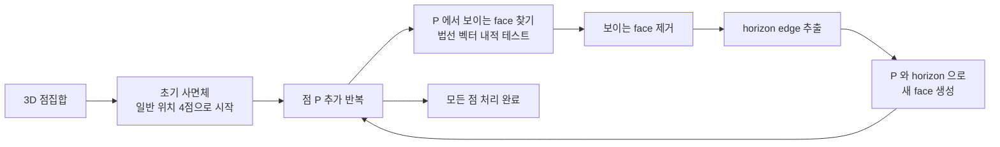

## 정의

3D 점집합의 **볼록 껍질 (Convex Hull)**: 모든 점을 포함하는 최소 볼록 다면체.

- 면 (face) 들이 삼각형으로 구성된 다면체
- 각 면의 법선 벡터 (outward normal) 가 외부를 향함
- 다면체 내부의 어느 두 점을 이어도 선분이 다면체 안에 존재

2D 볼록 껍질의 3D 확장. 2D 에서 "볼록 다각형"이면, 3D 에서 "볼록 다면체".

## 문제 상황

3D 점집합이 주어질 때 볼록 껍질을 구해야 하는 상황:

- 3D 물체의 최소 감싸는 다면체 구하기
- 두 점집합 사이 최소 거리 (GJK 알고리즘의 기반)
- Delaunay Triangulation, Voronoi Diagram 계산

**2D 와의 차이**:
- 2D: 볼록 껍질 = 일련의 선분 (edges)
- 3D: 볼록 껍질 = 삼각형 면들의 집합 (triangulated surface)
- 면의 방향 (orientation) 을 올바르게 유지해야 함

## 시각화



## 핵심 아이디어

### 핵심 연산: 외적 (Cross Product)

두 벡터 $\mathbf{a} = (a_x, a_y, a_z)$, $\mathbf{b} = (b_x, b_y, b_z)$ 의 외적:

$$
\mathbf{a} \times \mathbf{b} = (a_y b_z - a_z b_y, \; a_z b_x - a_x b_z, \; a_x b_y - a_y b_x)
$$

삼각형 면 ABC 의 outward normal $\mathbf{n} = \overrightarrow{AB} \times \overrightarrow{AC}$.

### 점 P 의 face 가시성 판단

점 P 에서 면 F (정점 A, B, C, outward normal $\mathbf{n}$) 가 보이는가?

$$
(\mathbf{P} - \mathbf{A}) \cdot \mathbf{n} > 0 \implies \text{보임 (visible)}
$$

보이는 면은 새 점을 추가할 때 제거 대상.

### Horizon Edge

가시 면과 불가시 면 사이의 경계 에지. 새 점 P 에서 이 에지들을 이어 새 삼각형 팬 (fan) 을 형성.

### 일반 위치 (General Position)

- 4점 이상이 같은 평면에 없을 것
- 3점 이상이 같은 직선에 없을 것

일반 위치 가정이 없으면 퇴화 케이스 (degenerate case) 처리가 복잡해짐.

## 알고리즘

### Incremental Construction

한 번에 한 점씩 추가:

```text
convex_hull_3d(points):
    shuffle(points)  // 무작위 셔플로 O(N log N) 기대 시간
    CH = tetrahedron(points[0..3])  // 초기 사면체
    for P in points[4:]:
        visible_faces = [f for f in CH.faces if is_visible(P, f)]
        if not visible_faces:
            continue  // P 가 이미 CH 내부
        horizon = get_horizon_edges(visible_faces)
        remove visible_faces from CH
        for edge (A, B) in horizon:
            CH.add_face(A, B, P)  // 새 삼각형
    return CH
```

- O(N^2) worst case
- O(N log N) expected (무작위 셔플 후)

### Gift Wrapping (3D)

2D gift wrapping 의 3D 확장. 각 에지에서 다음 면을 "감싸서" 찾음.

```text
gift_wrapping_3d(points):
    start_edge = find_initial_edge()
    queue = [start_edge]
    visited_edges = set()
    while queue:
        e = queue.pop()
        if e in visited_edges: continue
        P = find_visible_point(e, points)  // e 왼쪽에서 가장 왼쪽 점
        new_face = (e.A, e.B, P)
        add new_face
        queue += [e.B, P], [P, e.A]  // 새 에지
        visited_edges.add(e)
```

O(N * F), F = 최종 면 개수. H = O(N) 최악 케이스.

### Chan's Algorithm

O(N log H), H = 볼록 껍질 면 수. 이론적 최적.

## 구현

<CodeWithOutput
  variants={[
    {
      language: "cpp",
      label: "C++: 핵심 연산",
      code: `#include <bits/stdc++.h>
using namespace std;
typedef long long ll;
struct P3 { ll x, y, z; };

P3 sub(P3 a, P3 b) { return {a.x-b.x, a.y-b.y, a.z-b.z}; }
P3 cross(P3 a, P3 b) {
    return {a.y*b.z-a.z*b.y, a.z*b.x-a.x*b.z, a.x*b.y-a.y*b.x};
}
ll dot(P3 a, P3 b) { return a.x*b.x + a.y*b.y + a.z*b.z; }

// 삼각형 face ABC 에서 점 P 가 보이는지 (outward normal 기준)
// normal = (B-A) x (C-A)
bool visible(P3 A, P3 B, P3 C, P3 P) {
    P3 n = cross(sub(B, A), sub(C, A));
    return dot(n, sub(P, A)) > 0;
}

int main() {
    int n; cin >> n;
    vector<P3> pts(n);
    for (auto& p : pts) cin >> p.x >> p.y >> p.z;

    // 가시성 테스트 예시
    P3 A={0,0,0}, B={1,0,0}, C={0,1,0}, Q={0,0,1};
    cout << "Q visible from ABC: " << visible(A,B,C,Q) << "\\n";
    // 외적 예시
    P3 ab = sub(B, A), ac = sub(C, A);
    P3 n = cross(ab, ac);
    cout << "Normal: " << n.x << " " << n.y << " " << n.z << "\\n";
    return 0;
}`,
    },
    {
      language: "python",
      label: "Python: 핵심 연산",
      code: `def sub(a, b): return (a[0]-b[0], a[1]-b[1], a[2]-b[2])
def cross(a, b):
    return (a[1]*b[2]-a[2]*b[1], a[2]*b[0]-a[0]*b[2], a[0]*b[1]-a[1]*b[0])
def dot(a, b): return a[0]*b[0] + a[1]*b[1] + a[2]*b[2]

def visible(A, B, C, P):
    """삼각형 ABC 에서 점 P 가 보이는지 (outward normal 기준)"""
    ab = sub(B, A)
    ac = sub(C, A)
    n = cross(ab, ac)
    return dot(n, sub(P, A)) > 0

A = (0,0,0); B = (1,0,0); C = (0,1,0); Q = (0,0,1)
print("Q visible from ABC:", visible(A, B, C, Q))  # True

ab = sub(B, A); ac = sub(C, A)
n = cross(ab, ac)
print("Normal:", n)  # (0, 0, 1)`,
    },
  ]}
  cases={[
    {
      label: "기본",
      input: `3
0 0 0
1 0 0
0 1 0`,
      output: `Q visible from ABC: 1
Normal: 0 0 1`,
    },
  ]}
/>

## 복잡도

| 알고리즘 | 시간 | 공간 | 비고 |
|:---|:---:|:---:|:---|
| Incremental | $O(N^2)$ worst | $O(N)$ | 구현 쉬움 |
| Incremental + 셔플 | $O(N \log N)$ expected | $O(N)$ | 실전 추천 |
| Gift Wrapping | $O(N \cdot F)$ | $O(F)$ | F: 면 수 |
| Chan's Algorithm | $O(N \log H)$ | $O(N)$ | 이론적 최적 |
| Divide & Conquer | $O(N \log N)$ | $O(N)$ | 구현 복잡 |

볼록 껍질 면 수 F = O(N) (Euler's formula 에 의해 V - E + F = 2, V+E+F = O(N)).

## 함정

> [!WARNING]
> **일반 위치 가정**: 4점이 같은 평면 (coplanar) 이면 초기 사면체 형성 불가. 랜덤 섭동 (perturbation) 으로 해결.

> [!WARNING]
> **수치 오차**: 부동소수점 사용 시 `visible()` 판단이 틀릴 수 있음. 정수 좌표라면 long long 외적으로 정확하게 처리.

> [!CAUTION]
> **법선 방향**: face 의 outward/inward normal 일관성 유지 필수. 방향 혼동 시 내부/외부 판단이 뒤집힘.

### 흔한 실수

1. 초기 사면체의 4점이 한 평면에 있는 경우 처리 안 함
2. horizon edges 추출 시 방향 (winding order) 을 잘못 잡음
3. 무작위 셔플 없이 incremental 하면 O(N^2) worst case 에 걸림
4. 2D CH 와 달리 3D 에서는 단순 스택 기반 알고리즘 없음

## BOJ 연습 문제

| 번호 | 제목 | 키워드 |
|:---|:---|:---|
| BOJ 1168 | 요세푸스 문제 2 | 선형 자료구조 응용 |
| BOJ 9240 | 로버트 후드 | 2D CH, 3D CH 기초 |
| BOJ 4181 | Convex Hull | 2D CH 구현 |

> [!NOTE]
> BOJ 에서 3D CH 자체를 요구하는 문제는 드물고, 3D CH 의 핵심 서브루틴 (외적, 가시성 판단) 이 더 자주 등장.

## 참고

- [[convex-hull|2D Convex Hull]]
- [[geometry-3d|3D Geometry]]
- [[geometry|기하 알고리즘 기초]]
- [[angle-sorting|Angle Sorting]]
