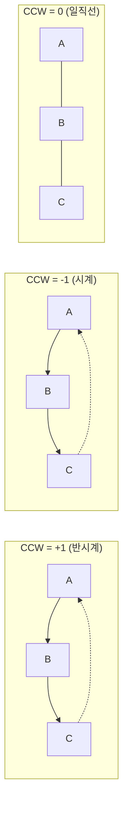

## 정의

기하 알고리즘의 밑바탕. 대부분의 2D/3D 기하 문제는 **벡터 연산**, **내적/외적**, **CCW 판정** 세 가지의 조합으로 풀립니다.

## 벡터

2D 벡터: 두 점 $A = (a_x, a_y)$ 와 $B = (b_x, b_y)$ 사이의 방향/거리 표현.

$$
\vec{AB} = B - A = (b_x - a_x, b_y - a_y)
$$

```cpp
struct Vec { long long x, y; };

Vec sub(Vec a, Vec b) { return {a.x - b.x, a.y - b.y}; }
Vec add(Vec a, Vec b) { return {a.x + b.x, a.y + b.y}; }

long long dot(Vec a, Vec b)   { return a.x*b.x + a.y*b.y; }
long long cross(Vec a, Vec b) { return a.x*b.y - a.y*b.x; }
```

> [!TIP]
> **정수 좌표라면 반드시 `long long`** 을 씁니다. 외적은 곱셈 두 개의 뺄셈이라 오버플로 위험이 큽니다.

## 내적 (Dot Product)

$$
\vec{a} \cdot \vec{b} = a_x b_x + a_y b_y = |\vec{a}||\vec{b}| \cos\theta
$$

**용도**:

- **각도**: $\cos\theta = \frac{\vec{a} \cdot \vec{b}}{|\vec{a}||\vec{b}|}$
- **직교 판정**: $\vec{a} \cdot \vec{b} = 0$ ⟺ 수직
- **투영**: $\vec{a}$ 를 $\vec{b}$ 방향으로 투영한 길이 = $\frac{\vec{a} \cdot \vec{b}}{|\vec{b}|}$

## 외적 (Cross Product), 핵심 도구

2D 에서 외적은 스칼라 (z 성분만):

$$
\vec{a} \times \vec{b} = a_x b_y - a_y b_x = |\vec{a}||\vec{b}| \sin\theta
$$

**부호 의미**:

| 값 | 의미 |
|:---|:---|
| $> 0$ | $\vec{b}$ 가 $\vec{a}$ 의 **반시계 (counterclockwise, CCW)** 방향 |
| $< 0$ | $\vec{b}$ 가 $\vec{a}$ 의 **시계 (clockwise, CW)** 방향 |
| $= 0$ | 두 벡터 **평행** |

**절댓값 의미**: $\vec{a}$, $\vec{b}$ 가 이루는 평행사변형의 넓이. 삼각형이면 이의 절반.

## CCW (Counterclockwise Test)

세 점 $A, B, C$ 의 방향 관계 판정. 알고리즘 기하의 만능 도구입니다.

$$
\text{CCW}(A, B, C) = \text{sign}\left( (B - A) \times (C - A) \right)
$$

```cpp
int ccw(Vec a, Vec b, Vec c) {
    long long v = cross(sub(b, a), sub(c, a));
    return (v > 0) - (v < 0);  // 1, -1, 0
}
```

**해석**:

| 반환 | 배치 |
|:---:|:---|
| **+1** | A → B → C 가 **반시계** (좌회전) |
| **-1** | A → B → C 가 **시계** (우회전) |
| **0** | 세 점이 **일직선** |

**응용은 광범위**: convex hull, 선분 교차, 다각형 내부 판정, 회전 캘리퍼스 등 거의 모든 기하 알고리즘의 기본 연산.

### CCW 시각화



## 선분 교차

두 선분 $AB$ 와 $CD$ 가 교차하는지 판정:

```cpp
bool segments_intersect(Vec a, Vec b, Vec c, Vec d) {
    int d1 = ccw(a, b, c);
    int d2 = ccw(a, b, d);
    int d3 = ccw(c, d, a);
    int d4 = ccw(c, d, b);

    if (d1 != d2 && d3 != d4) return true;  // 일반 교차

    // 특수: 한 선분이 다른 선분의 끝점을 지나는 경우
    if (d1 == 0 && on_segment(a, b, c)) return true;
    if (d2 == 0 && on_segment(a, b, d)) return true;
    if (d3 == 0 && on_segment(c, d, a)) return true;
    if (d4 == 0 && on_segment(c, d, b)) return true;
    return false;
}

bool on_segment(Vec a, Vec b, Vec c) {
    return min(a.x, b.x) <= c.x && c.x <= max(a.x, b.x)
        && min(a.y, b.y) <= c.y && c.y <= max(a.y, b.y);
}
```

## 삼각형/다각형 넓이

**삼각형** $A, B, C$ 의 넓이:

$$
\text{Area} = \frac{1}{2} \left| (B - A) \times (C - A) \right|
$$

**다각형** ([[polygon-area|Shoelace formula]]): 정점 $P_0, P_1, ..., P_{n-1}$ 에 대해

$$
\text{Area} = \frac{1}{2} \left| \sum_{i=0}^{n-1} (x_i y_{i+1} - x_{i+1} y_i) \right|
$$

## 다각형 내부 점 판정

**Ray casting**: 점에서 임의 방향으로 반직선을 그어 다각형 변과 몇 번 교차하는지 세기.

- 홀수 → 내부
- 짝수 → 외부

또는 **winding number**: 모든 변에서 CCW 부호를 세어 총합을 봄. 이쪽이 볼록 다각형에서 더 간단.

## 함정

- **정밀도**: double 로 외적 계산은 위험. **정수 좌표 → long long** 이 원칙.
- **오버플로**: 좌표가 $10^9$ 이상이면 곱셈 후 $10^{18}$ 넘을 수 있음. `__int128` 또는 좌표 축소.
- **일직선 케이스**: CCW=0 일 때 하위 로직 (on-segment 등) 을 반드시 처리해야 함. 잊으면 교차 판정 등이 오동작.
- **각도 비교**: `atan2` 는 double, 정밀도 문제 있음. 정수 좌표에서 각도 정렬은 사분면 + 외적으로 처리.

## 참고

- 관련 [[polygon-area|Shoelace, 다각형 넓이]]
- 관련 [[convex-hull|Convex Hull]] (CCW 로 구현)
- 관련 [[rotating-calipers|Rotating Calipers]]
- cp-algorithms: [Basic Geometry](https://cp-algorithms.com/geometry/basic-geometry.html)
